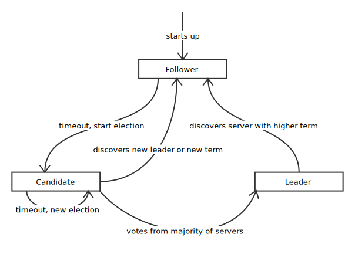

# Raft

## Replicated State Machine

- [1] Client 发送访问 State Machine 的指令，如查询、新增、修改、删除操作；
- [2] 一致性模块记录并保证集群内其他 Server 日志内容一致；
- [3] 每个 Server 采用一致的操作修改 State Machine；
- [4] 结果返回给 Client。

## 简介

### 设计目的

Paxos 一致性算法不易理解，不易实现。Raft 目的是设计一个容易实现且不违反直觉的一致性算法。Raft 算法主要特征有：

- 更强的 Leader: 日志分发只能从 Leader 到其他 Servers
- Leader Election: 使用随机时长的定时器选举 Leader
- 成员变更(Membership changes): 集群成员变更时（新增节点或移除节点）时，采用 new joint consensus 方法，保证原集群正常服务

下图为 Raft 节点状态转换图：

Term 示例图：

### Raft 基本步骤

- 选择一个 Leader
- Leader 接收从 Client 发出的 Log Entry，并分发给其他 Server，并通知其他 Server 合适可将 Log Entries 应用的状态
- 当 Leader 崩溃或不可达时，重新选举

## 算法结构

### 基础规则

#### State

全部服务器需要持久化的状态（需要在响应 RPC 前，记录在可靠的存储上）：

- **currentTerm**: Server 看到的最近的 Term（首次启动时为 0，单调递增）
- **voteFor**: 当前 Term 的 candidateId，如果没有，为 null
- **log[]**: Log Entries。包括访问、修改状态机的指令；及服务器收到 Entry 时的 Term。

全部服务器的非持久状态：

- **commitIndex**: 服务器已知的已提交的 Log Entries 的最大编号（初始为 0，单调递增）
- **lastApplied**: 服务器应用到 State Machine 的 Log Entries 的最大编号（初始为 0，单调递增）

Leader 非持久状态（每次选举后，重新初始化）：

- **nextIndex[]**: 记录每一个 Server 发送至 Leader 的下一个 Log Entry 的编号（初始化为 Leader 的最后一个 Log Entry 编号加 1）
- **matchIndex**: 记录每一个 Server 已备份的 Log Entry 最大编号（初始为 0，单调递增）

#### Append Entries RPC

本方法应由 Leader 调用以分发 Log Entries，也可用做心跳

参数：

- **term**: Leader 的 Term
- **leaderId**: 非 Leader 服务器可重定向 Client 请求
- **prevLogIndex**: 新 Log Entry 的前一 Log Entry 编号
- **prevLogTerm**: prevLogIndex 的 Term
- **entries[]**: 需要存储的 Log Entries
- **leaderCommit**: Leader 的 commintIndex

应答：

- **term**: 当前 Term，Leader 需要更新
- **success**: 如果 Server 包含 **prevLogIndex** 及 **prevLogTerm** 所确认的 Log Entry，返回 **true**

实现：

- term < currentTerm，返回 false
- 不包含 **prevLogIndex** 及 **prevLogTerm** 所确认的 Log Entry，返回 false
- 如果有冲突的 Log Entry，则删除冲突的 Log Entry 及其后所有的 Log Entries
- 追加全部不存在的 Log Entries
- 如果 leaderCommit > commitIndex，设置 commitIndex 为 min(leaderCommit, index of the last new entry)

流程图如下：

#### Request Vote RPC

由 Candidates 发起，搜集选票

参数：

- **term**: Candidate 当前 Term
- **candidateId**: Candidate ID
- **lastLogIndex**: Candidate 的最后一个 Log Entry 编号
- **lastLogTerm**: Candidate 的最后一个 Log Entry 的 Term

应答：

- **term**: currentTerm，供 Candidate 更新自身
- **voteGranted**: 如果投票给 Candidate，返回 true

实现：

- term < currentTerm，返回 false
- voteFor 为 null 或 **candidateId**，且 Candidate 的 Log Entries 记录不老于 Server，返回 true

流程图如下：

#### 全部 Server 需要遵守的规则

#### Followers 需要遵守的规则

- 响应 Leader 或 Candidates 的 RPC 请求
- 如果 election timer 超时时，没有收到 Leader 的 **AppendEntriesRPC** 请求也没有投票给 Candidates，转换角色为 Candidate

#### Candidates 需要遵守的规则

- 角色转变为 Candidate 后，发起选举
	- 增加 currentTerm
	- 投票给自己
	- 重置 election timer
	- 向其他所有 Server 发起 **RequestVoteRPC**
- 如果收到多数投票，变为 Leader
- 如果收到新 Leader 的 **AppendEntriesRPC** 请求，变为 Follower
- election timer 超时，发起新的选举

#### Leader 需要遵守的规则

- 选举后，发送空 **AppendEntriesRPC**，并在空闲时发送，防止心跳超时
- 收到 Client 请求后，将 Log Entry 追加到本地日志，并在应用至 State Machine 后返回应答
- 如果某个 follower 的 lastLogEntry >= nextIndex，发起 **AppendEntriesRPC**
	- 调用成功：更新 follower 的 nextIndex 及 matchIndex 
	- 调用失败：nextIndex 减一，重试
- 如果存在 N，满足  N > commitIndex，且多数 matchIndex[i] >= N 且 log[N].term == currentTerm，那么设置 **commitIndex = N**

### Leader Election

### Log Replication

### Safty
