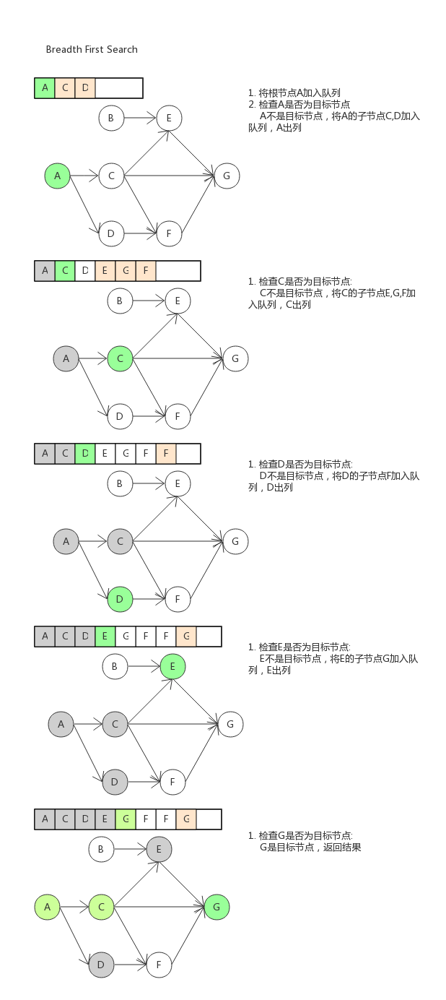
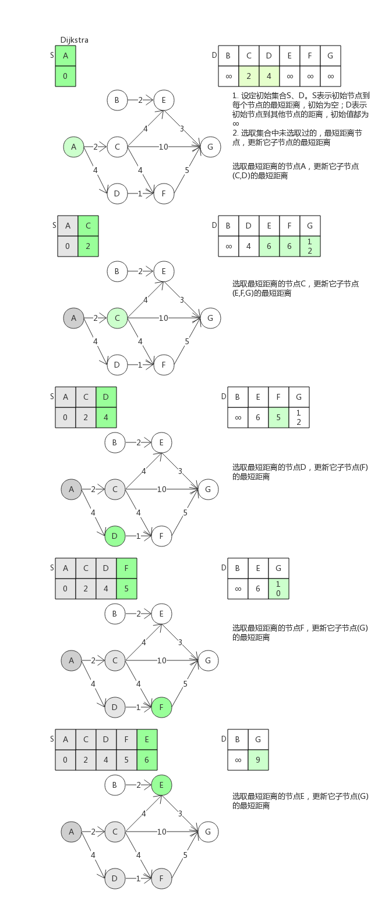

##Breadth First Search

- 简介

  广度优先搜索算法是一种图形搜索算法，用于求*有向无权*图中两个节点之间的最短距离。

  广度优先搜索算法是一种盲目搜寻方法，目的是从起始点开始系统的检查表中所有元素。

  

- 核心思想

  1. 将起始节点(起始节点)放入队列中
  2. 取出队列中的第一个元素，检查是否是为目标节点
     - 如果是，则结束搜索，并返回结果
     - 如果不是，则将其子节点(邻居节点)加入队列
  3. 如果队列为空，则未搜索到结果
  4. 重复步骤2

- 流程图

  

  求出最短路径为3

- 问题

  - 重复节点：记录入队的节点，来避免重复检查某个节点，同时，算法可拓展为‘求*无权无向*图中两节点的最短距离’

- 应用

  - 最短路径问题
  - 最近关系问题

- 拓展

  - 双向广度优先算法

    初始结点向目标结点和目标结点向初始结点同时进行搜索，直至在两个扩展方向上出现同一个子结点，搜索结束，这就是双向搜索过程

    

  - 迭代深化搜索(iterative deepening search)

    IDDFS 与广度优先算法是等价的，但对内存的使用会少很多；在每一步迭代中，它会按深度优先算法中的顺序，遍历搜索树中的节点，但第一次访问节点的累积顺序实际上是广度优先的。

## Dijkstra(迪克斯特拉)

- 简介

  狄克斯特拉是广度优先算法的升级版，主要用于求*有权有向*图中两节点的最短距离。

  此算法采用了贪心策略。

- 核心思想

  1. 创建两个集合S、D。
     - S表示初始节点到每个节点的最短距离，初始为空
     - D表示初始节点到其他节点的距离，初始值都为∞
  2. 选取集合中与初始节点距离最短的节点，将其从D集合中移到S中，更新其子节点的最短距离。
  3. 重复2

- 流程图

  