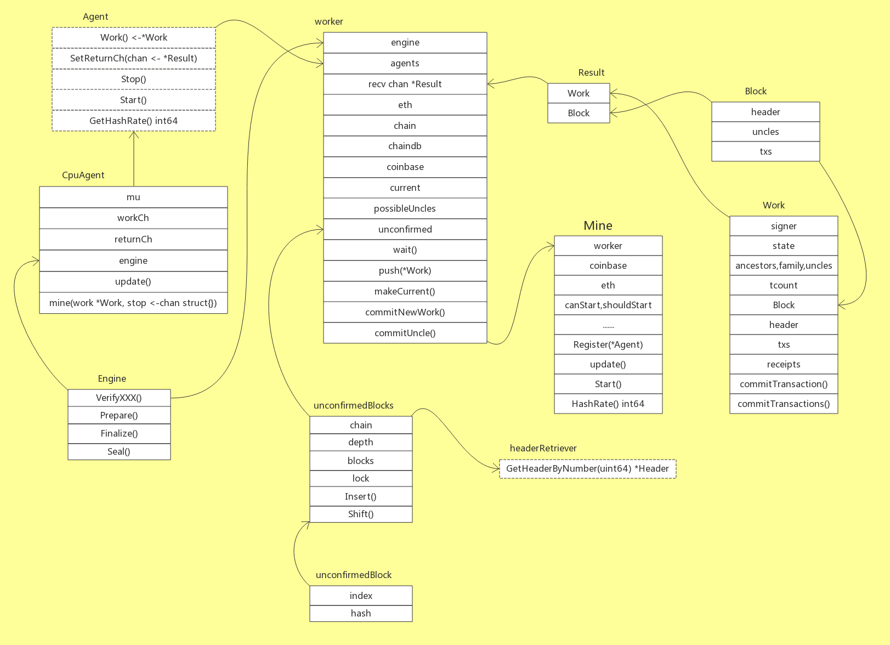
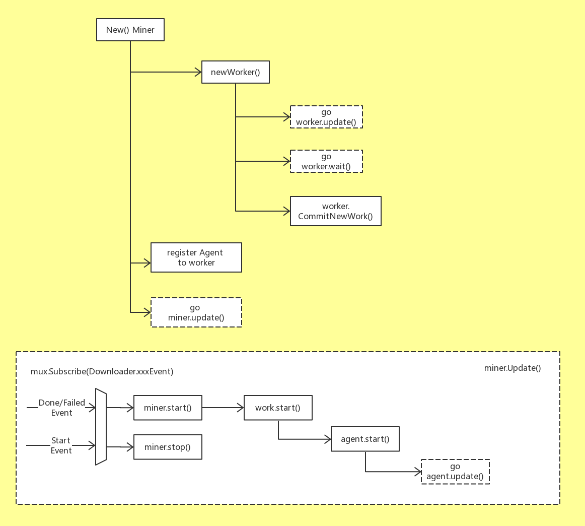
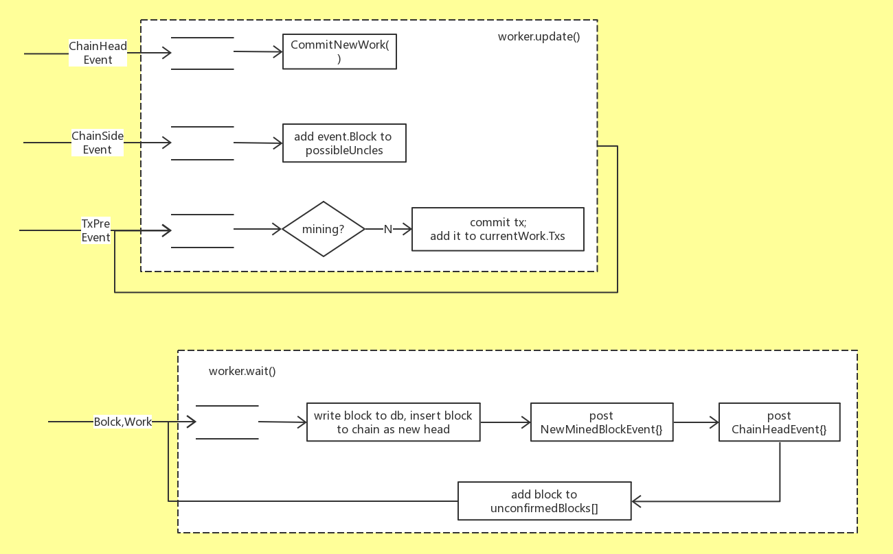
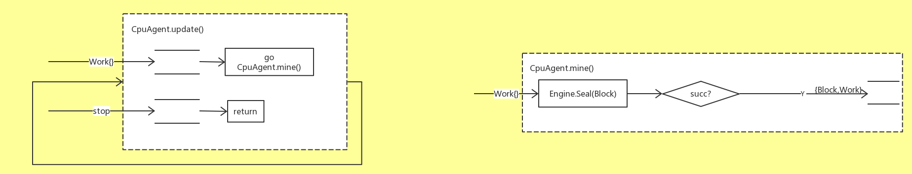
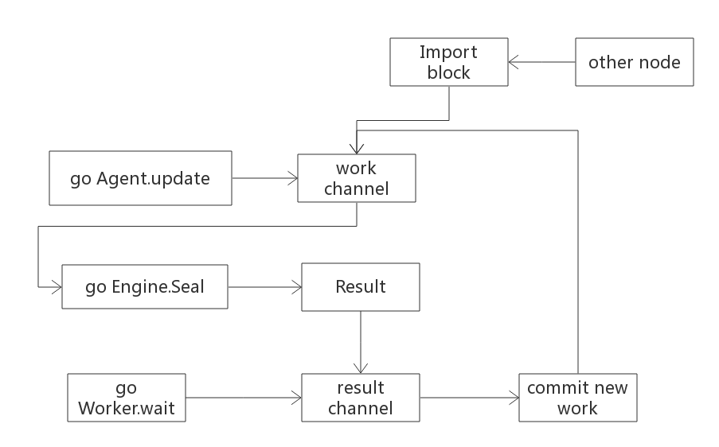

#mine

前几篇分别介绍了以太坊的基本概念，基本环节-交易，区块、区块链的存储方式等，这篇打算介绍一下“挖矿“得到新区块的整个过程，然后下一篇讲下不同共识算法的实现细节。

## 总览

在Ethereum 代码中，名为miner的包(package)负责向外提供一个“挖矿”得到的新区块，其主要结构体的UML关系图如下图所示：



处于入口的类是Miner，它作为公共类型，向外暴露mine功能；它有一个worker类型的成员变量，负责管理mine过程；worker内部有一组Agent接口类型对象，这个接口有两个实现:CpuAgent和RemoteAgent。这里使用的是CpuAgent，该Agent会完成一个块的出块工作，同级的多个Agent是竞争关系，最终通过共识算法完成出一个块的工作。Work结构体主要用以携带数据，被视为挖掘一个区块时所需的数据环境。

主要的数据传输发生在worker和它的Agent(们)之间：在合适的时候，worker把一个Work对象发送给每个Agent，然后任何一个Agent完成mine时，将一个经过授权确认的Block加上那个更新过的Work，组成一个Result对象发送回worker。

调用方worker内部声明了一个Agent数组，但目前只有一个实现类CpuAgent的对象会被加到该数组。CpuAgent通过全局的<<Engine>>对象，借助共识算法完成最终的区块授权。

另外，unconfirmedBlocks 也挺特别，它会以unconfirmedBlock的形式存储最近一些本地挖掘出的区块。在一段时间之后，根据区块的Number和Hash，再确定这些区块是否已经被收纳进主干链(canonical chain)里，以输出Log的方式来告知用户。

对于一个新区块被挖掘出的过程，代码实现上基本分为两个环节：一是组装出一个新区块，这个区块的数据基本完整，包括成员Header的部分属性，以及交易列表txs，和叔区块组uncles[]，并且所有交易已经执行完毕，所有收据(Receipt)也已收集完毕，这部分主要由worker完成；二是填补该区块剩余的成员属性，比如Header.Difficulty等，并完成授权，这些工作是由Agent调用<Engine>接口实现体，利用共识算法来完成的。

## 新区块的组装流程

挖掘新区块的流程入口在Miner里，具体入口在Miner结构体的创建函数(避免称之为‘构造函数’)里。



### Miner的函数

####New()

```go
func New(eth Backend, config *params.ChainConfig, mux *event.TypeMux, engine consensus.Engine) *Miner {
    miner := &Miner{
        eth:      eth,
        mux:      mux,
        engine:   engine,
        worker:   newWorker(config, engine, common.Address{}, eth, mux),
        canStart: 1,
    }
    miner.Register(NewCpuAgent(eth.BlockChain(), engine))
    go miner.update()

    return miner
}
```

在New()里，针对新对象miner的各个成员变量初始化完成后，会紧跟着创建worker对象，然后将Agent对象登记给worker，最后用一个单独线程去运行miner.Update()函数；

```go
func newWorker(config *params.ChainConfig, engine consensus.Engine, coinbase common.Address, eth Backend, mux *event.TypeMux) *worker {
    worker := &worker{
        config:         config,
        engine:         engine,
        eth:            eth,
        mux:            mux,
        txCh:           make(chan core.TxPreEvent, txChanSize),// TxPreEvent事件是TxPool发出的事件，代表一个新交易tx加入到了交易池中，这时候如果work空闲会将该笔交易收进work.txs，准备下一次打包进块。
        chainHeadCh:    make(chan core.ChainHeadEvent, chainHeadChanSize),// ChainHeadEvent事件，代表已经有一个块作为链头，此时work.update函数会监听到这个事件，则会继续挖新的区块。
        chainSideCh:    make(chan core.ChainSideEvent, chainSideChanSize),// ChainSideEvent事件，代表有一个新块作为链的旁支，会被放到possibleUncles数组中，可能称为叔块。
        chainDb:        eth.ChainDb(),// 区块链数据库
        recv:           make(chan *Result, resultQueueSize),
        chain:          eth.BlockChain(), // 链
        proc:           eth.BlockChain().Validator(),
        possibleUncles: make(map[common.Hash]*types.Block),// 存放可能称为下一个块的叔块数组
        coinbase:       coinbase,
        agents:         make(map[Agent]struct{}),
        unconfirmed:    newUnconfirmedBlocks(eth.BlockChain(), miningLogAtDepth),// 返回一个数据结构，包括追踪当前未被确认的区块。
    }
    // 注册TxPreEvent事件到tx pool交易池
    worker.txSub = eth.TxPool().SubscribeTxPreEvent(worker.txCh)
    // 注册事件到blockchain
    worker.chainHeadSub = eth.BlockChain().SubscribeChainHeadEvent(worker.chainHeadCh)
    worker.chainSideSub = eth.BlockChain().SubscribeChainSideEvent(worker.chainSideCh)
    go worker.update()

    go worker.wait()
    worker.commitNewWork()

    return worker
}
```

worker的创建函数里也如法炮制，分别用单独线程去启动worker.updater()和wait()；最后worker.CommitNewWork()会开始准备一个新区块所需的基本数据，如Header，Txs, Uncles等。注意此时Agent尚未启动。

####Miner.Update()

```go
// update方法可以保持对下载事件的监听，请了解这是一段短型的update循环。
func (self *Miner) update() {
    // 注册下载开始事件，下载结束事件，下载失败事件。
    events := self.mux.Subscribe(downloader.StartEvent{}, downloader.DoneEvent{}, downloader.FailedEvent{})
out:
    for ev := range events.Chan() {
        switch ev.Data.(type) {
        case downloader.StartEvent:
            atomic.StoreInt32(&self.canStart, 0)
            if self.Mining() {
                self.Stop()
                atomic.StoreInt32(&self.shouldStart, 1)
                log.Info("Mining aborted due to sync")
            }
        case downloader.DoneEvent, downloader.FailedEvent: // 下载完成和失败都走相同的分支。
            shouldStart := atomic.LoadInt32(&self.shouldStart) == 1

            atomic.StoreInt32(&self.canStart, 1)
            atomic.StoreInt32(&self.shouldStart, 0)
            if shouldStart {
                self.Start(self.coinbase) // 执行Miner的start方法。
            }
            // 处理完以后要取消订阅
            events.Unsubscribe()
            // 跳出循环，不再监听
            break out
        }
    }
}
```

####Miner.Start()

```go
func (self *Miner) Start(coinbase common.Address) {
	atomic.StoreInt32(&self.shouldStart, 1)
	self.SetEtherbase(coinbase)

	if atomic.LoadInt32(&self.canStart) == 0 {
		log.Info("Network syncing, will start miner afterwards")
		return
	}
	atomic.StoreInt32(&self.mining, 1)

	log.Info("Starting mining operation")
	self.worker.start()
	self.worker.commitNewWork()
}
```

####worker.start()

```go
func (self *worker) start() {
	self.mu.Lock()
	defer self.mu.Unlock()

	atomic.StoreInt32(&self.mining, 1)

	// spin up agents
	for agent := range self.agents {
		agent.Start()
	}
}
```

这个update()会订阅(监听)几种事件，均跟Downloader相关。当收到Downloader的StartEvent时，意味者此时本节点正在从其他节点下载新区块，这时miner会立即停止进行中的挖掘工作，并继续监听；如果收到DoneEvent或FailEvent时，意味本节点的下载任务已结束-无论下载成功或失败-此时都可以开始挖掘新区块，并且此时会退出Downloader事件的监听。

从miner.Update()的逻辑可以看出，对于任何一个Ethereum网络中的节点来说，挖掘一个新区块和从其他节点下载、同步一个新区块，根本是相互冲突的。这样的规定，保证了在某个节点上，一个新区块只可能有一种来源，这可以大大降低可能出现的区块冲突，并避免全网中计算资源的浪费。

### worker的函数

worker的属性非常多而具体了，都是挖矿具体操作相关的，其中包括链本身的属性以及区块数据结构的属性。首先来看ChainConfig：

```go
type ChainConfig struct {
    ChainId *big.Int `json:"chainId"` // 链id标识了当前链，主键唯一id，也用于replay protection重发保护（用来防止replay attack重发攻击：恶意重复或拖延正确数据传输的一种网络攻击手段）

    HomesteadBlock *big.Int `json:"homesteadBlock,omitempty"` // 当前链Homestead，置为0

    DAOForkBlock   *big.Int `json:"daoForkBlock,omitempty"`   // TheDAO硬分叉切换。
    DAOForkSupport bool     `json:"daoForkSupport,omitempty"` // 结点是否支持或者反对DAO硬分叉。

    // EIP150 implements the Gas price changes (https://github.com/ethereum/EIPs/issues/150)
    EIP150Block *big.Int    `json:"eip150Block,omitempty"` // EIP150 HF block (nil = no fork)
    EIP150Hash  common.Hash `json:"eip150Hash,omitempty"`  // EIP150 HF hash (needed for header only clients as only gas pricing changed)

    EIP155Block *big.Int `json:"eip155Block,omitempty"` // EIP155 HF block，没有硬分叉置为0
    EIP158Block *big.Int `json:"eip158Block,omitempty"` // EIP158 HF block，没有硬分叉置为0

    ByzantiumBlock *big.Int `json:"byzantiumBlock,omitempty"` // Byzantium switch block (nil = no fork, 0 = already on byzantium)

    // Various consensus engines
    Ethash *EthashConfig `json:"ethash,omitempty"`
    Clique *CliqueConfig `json:"clique,omitempty"`
}
```

ChainConfig顾名思义就是链的配置属性。ChainConfig中包含了ChainID等属性，其中有很多都是针对以太坊历史发生的问题进行的专门配置。

- ChainId可以预防replay攻击。
- Homestead是以太坊发展蓝图中的一个阶段。第一阶段是以太坊区块链面世，代号为frontier，第二个阶段即为当前阶段，代号为Homestead（家园），第三阶段为Metropolis（大都会），大都会又细分为两个小阶段，第一个是Byzantium（拜占庭）硬分叉(引入新型零知识证明算法以及pos权益证明共识算法)，第二个是Constantinople（君士坦丁堡）硬分叉（以太坊正式应用pow和pos混合链，解决拜占庭引发的问题）。最后一个阶段代号Serenity（宁静），最终版本的以太坊稳定运行。
- 2017年6月18日，以太坊上DAO（去中心自治组织）的一次大危机做出的相应调整。感兴趣的可以自行谷百。
- 2017年10月16日，以太坊的一次Byzantium拜占庭硬分叉。
- EIPs(Ethereum Improvement Proposals)，是以太坊更新改善的一些方案，对应后面的数字就是以太坊github源码issue的编号。


再来看下 Backend对象，Backend是一个自定义接口封装了所有挖矿所需方法。

```go
type Backend interface {
	AccountManager() *accounts.Manager
	BlockChain() *core.BlockChain
	TxPool() *core.TxPool
	ChainDb() ethdb.Database
}
```


这里我们主要关注worker.updater()和wait()



####worker.update()

```go
func (self *worker) update() {
	defer self.txSub.Unsubscribe()
	defer self.chainHeadSub.Unsubscribe()
	defer self.chainSideSub.Unsubscribe()

	for {
		// A real event arrived, process interesting content
		select {
		// Handle ChainHeadEvent
		case <-self.chainHeadCh:
			self.commitNewWork()

		// Handle ChainSideEvent
		case ev := <-self.chainSideCh:
			self.uncleMu.Lock()
			self.possibleUncles[ev.Block.Hash()] = ev.Block
			self.uncleMu.Unlock()

		// Handle TxPreEvent
		case ev := <-self.txCh:
			// Apply transaction to the pending state if we're not mining
			if atomic.LoadInt32(&self.mining) == 0 {
				self.currentMu.Lock()
				acc, _ := types.Sender(self.current.signer, ev.Tx)
				txs := map[common.Address]types.Transactions{acc: {ev.Tx}}
				txset := types.NewTransactionsByPriceAndNonce(self.current.signer, txs)

				self.current.commitTransactions(self.mux, txset, self.chain, self.coinbase)
				self.updateSnapshot()
				self.currentMu.Unlock()
			} else {
				// If we're mining, but nothing is being processed, wake on new transactions
				if self.config.Clique != nil && self.config.Clique.Period == 0 {
					self.commitNewWork()
				}
			}

		// System stopped
		case <-self.txSub.Err():
			return
		case <-self.chainHeadSub.Err():
			return
		case <-self.chainSideSub.Err():
			return
		}
	}
}
```

worker.update()分别监听ChainHeadEvent，ChainSideEvent，TxPreEvent几个事件，每个事件会触发worker不同的反应。ChainHeadEvent是指区块链中已经加入了一个新的区块作为整个链的链头，这时worker的回应是立即开始准备挖掘下一个新区块(也是够忙的)；ChainSideEvent指区块链中加入了一个新区块作为当前链头的旁支，worker会把这个区块收纳进possibleUncles[]数组，作为下一个挖掘新区块可能的Uncle之一；TxPreEvent是TxPool对象发出的，指的是一个新的交易tx被加入了TxPool，这时如果worker没有处于挖掘中，那么就去执行这个tx，并把它收纳进Work.txs数组，为下次挖掘新区块备用。

需要稍稍注意的是，ChainHeadEvent 并不一定是外部源发出。由于 worker 对象有个成员变量chain(eth.BlockChain)，所以当worker自己完成挖掘一个新区块，并把它写入数据库，加进区块链里成为新的链头时，worker自己也可以调用chain发出一个ChainHeadEvent，从而被worker.update()函数监听到，进入下一次区块挖掘。

####worker.wait()

```go
func (self *worker) wait() {
    for {
        mustCommitNewWork := true
        for result := range self.recv {
            atomic.AddInt32(&self.atWork, -1)

            if result == nil {
                continue
            }
            block := result.Block
            work := result.Work

            // Update the block hash in all logs since it is now available and not when the receipt/log of individual transactions were created.
            for _, r := range work.receipts {
                for _, l := range r.Logs {
                    l.BlockHash = block.Hash()
                }
            }
            for _, log := range work.state.Logs() {
                log.BlockHash = block.Hash()
            }
            stat, err := self.chain.WriteBlockAndState(block, work.receipts, work.state)
            if err != nil {
                log.Error("Failed writing block to chain", "err", err)
                continue
            }
            // 检查是否是标准块，写入交易数据。
            if stat == core.CanonStatTy {
                // 受ChainHeadEvent事件的影响。
                mustCommitNewWork = false
            }
            // 广播一个块声明插入链事件NewMinedBlockEvent
            self.mux.Post(core.NewMinedBlockEvent{Block: block})
            var (
                events []interface{}
                logs   = work.state.Logs()
            )
            events = append(events, core.ChainEvent{Block: block, Hash: block.Hash(), Logs: logs})
            if stat == core.CanonStatTy {
                events = append(events, core.ChainHeadEvent{Block: block})
            }
            self.chain.PostChainEvents(events, logs)

            // 将处理中的数据插入到区块中，等待确认
            self.unconfirmed.Insert(block.NumberU64(), block.Hash())

            if mustCommitNewWork {
                self.commitNewWork() // 多次见到，顾名思义，就是提交新的work
            }
        }
    }
}
```

worker.wait()会在一个channel处一直等待Agent完成挖掘发送回来的新Block和Work对象。这个Block会被写入数据库，加入本地的区块链试图成为最新的链头。注意，此时区块中的所有交易，假设都已经被执行过了，所以这里的操作，不会再去执行这些交易对象。

当这一切都完成，worker就会发送一条事件(NewMinedBlockEvent{})，等于通告天下：我挖出了一个新区块！这样监听到该事件的其他节点，就会根据自身的状况，来决定是否接受这个新区块成为全网中公认的区块链新的链头。至于这个公认过程如何实现，就属于共识算法的范畴了。

####worker.commitNewWork()

commitNewWork方法源码比较长，这里就不粘贴出来了，这个方法主要的工作是为新块准备基本数据，包括header，txs，uncles等。commitNewWork()会在worker内部多处被调用，注意它每次都是被直接调用，并没有以goroutine的方式启动。commitNewWork()内部使用sync.Mutex对全部操作做了隔离。这个函数的基本逻辑如下：

1. 准备新区块的时间属性Header.Time，一般均等于系统当前时间，不过要确保父区块的时间(parentBlock.Time())要早于新区块的时间，父区块当然来自当前区块链的链头了。
2. 创建新区块的Header对象，其各属性中：Num可确定(父区块Num +1)；Time可确定；ParentHash可确定;其余诸如Difficulty，GasLimit等，均留待之后共识算法中确定。
3. 调用Engine.Prepare()函数，完成Header对象的准备。
4. 根据新区块的位置(Number)，查看它是否处于DAO硬分叉的影响范围内，如果是，则赋值予header.Extra。
5. 根据已有的Header对象，创建一个新的Work对象，并用其更新worker.current成员变量。
6. 如果配置信息中支持硬分叉，在Work对象的StateDB里应用硬分叉。
7. 准备新区块的交易列表，来源是TxPool中那些最近加入的tx，并执行这些交易。
8. 准备新区块的叔区块uncles[]，来源是worker.possibleUncles[]，而possibleUncles[]中的每个区块都从事件ChainSideEvent中搜集得到。注意叔区块最多有两个。
9. 调用Engine.Finalize()函数，对新区块“定型”，填充上Header.Root, TxHash, ReceiptHash, UncleHash等几个属性。
10. 如果上一个区块(即旧的链头区块)处于unconfirmedBlocks中，意味着它也是由本节点挖掘出来的，尝试去验证它已经被吸纳进主干链中。
11. 把创建的Work对象，通过channel发送给每一个登记过的Agent，进行后续的挖掘。

以上步骤中，4和6都是仅仅在该区块配置中支持DAO硬分叉，并且该区块的位置正好处于DAO硬分叉影响范围内时才会发生；其他步骤是普遍性的。commitNewWork()完成了待挖掘区块的组装，block.Header创建完毕，交易数组txs，叔区块Uncles[]都已取得，并且由于所有交易被执行完毕，相应的Receipt[]也已获得。万事俱备，可以交给Agent进行‘挖掘’了。

### CpuAgent的函数

CpuAgent中与mine相关的函数，主要是update()和mine():



####CpuAgent.update()

```go
func (self *CpuAgent) update() {
out:
    for {
        select {
        case work := <-self.workCh:
            self.mu.Lock()
            if self.quitCurrentOp != nil {
                close(self.quitCurrentOp)
            }
            self.quitCurrentOp = make(chan struct{})
            go self.mine(work, self.quitCurrentOp)
            self.mu.Unlock()
        case <-self.stop:
            self.mu.Lock()
            if self.quitCurrentOp != nil {
                close(self.quitCurrentOp)
                self.quitCurrentOp = nil
            }
            self.mu.Unlock()
            break out
        }
    }
}
```

CpuAgent.update()就是worker.commitNewWork()结束后发出Work对象的会一直监听相关channel，如果收到Work对象(显然由worker.commitNewWork()结束后发出)，就启动mine()函数；如果收到停止(mine)的消息，就退出一切相关操作。

####CpuAgent.mine()

```go
func (self *CpuAgent) mine(work *Work, stop <-chan struct{}) {
    if result, err := self.engine.Seal(self.chain, work.Block, stop); result != nil {
        log.Info("Successfully sealed new block", "number", result.Number(), "hash", result.Hash())
        self.returnCh <- &Result{work, result}
    } else {
        if err != nil {
            log.Warn("Block sealing failed", "err", err)
        }
        self.returnCh <- nil
    }
}
```

CpuAgent.mine()会直接调用Engine.Seal()函数，利用Engine实现体的共识算法对传入的Block进行最终的授权，如果成功，就将Block同Work一起通过channel发还给worker，那边worker.wait()会接收并处理。

显然，这两个函数都没做什么实质性工作，它们只是负责调用<Engine>接口实现体，待授权完成后将区块数据发送回worker。挖掘出一个区块的真正奥妙全在Engine实现体所代表的共识算法里。

