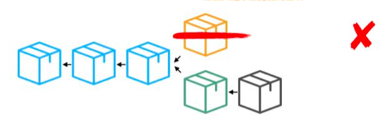

# 区块链是什么

区块链是一个**具有共享状态的密码性安全交易的单机**。

- **“密码性安全(Cryptographically secure)”**是指用一个很难被解开的复杂数学机制算法来保证数字货币生产的安全性。将它想象成类似于防火墙的这种。它们使得欺骗系统近乎是一个不可能的事情（比如：构造一笔假的交易，消除一笔交易等等）。
- **“交易的单机(Transactional singleton machine)”**是指只有一个权威的机器实例为系统中产生的交易负责任。换句话说，只有一个全球真相是大家所相信的。
- **“具有共享状态(With shared-state)”**是指在这台机器上存储的状态是共享的，对每个人都是开放的。

上面所说的复杂数学机制算法主要是指（1）密码学哈希函数，（2）非对称加密。简单的说，密码学哈希函数就是指任意长度的字符串、甚至文件体本身经过Hash函数工厂的加工，都会输出一个固定长度的字符串；同时，输入的字符串或者文件稍微做一丢丢的改动，Hash() 函数给出的输出结果都将发生翻天覆地的改变。注意，Hash()函数是公开的，任何人都能使用。

这个算法主要用于验证信息完整性——在一个信息后面放上这个信息的哈希值，收到信息之后收信人再算一遍哈希值，对比两者就知道这条信息是否被篡改过了。如果被篡改过，哪怕只有一bit，整个哈希值也会截然不同。而根据哈希函数的性质，没有人能够伪造出另一个消息具有同样的哈希值，也就是说篡改过的数据完全不可能通过哈希校验。

非对称加密就是指任何人手里都有两把钥匙，其中一把只有自己知道，叫做“私钥”，以及一把可以公布于众，叫做“公钥”；通过私钥加密的信息，必须通过公钥才能解密，连自己的私钥也无解。公钥可以通过私钥生成多把。

非对称加密除了用于信息加密之外，还有另一个用途，就是身份验证。因为通常情况我们假设一对公私钥，公钥是公开的，而私钥只有本人有，于是一个人如果有对应的私钥，我们就可以认定他是本人。其中一个重要的应用就是数字签名——某个消息后面，发信人对这个消息做哈希运算，然后用私钥加密。接着收信人首先对消息进行哈希运算，接着用相应的公钥解密数字签名，再对比两个哈希值，如果相同，就代表这个消息是本人发出的而且没有被篡改过。

单机不是说它不联网，是指全球只有一个机器或者叫系统，它是由全球所有的节点共同组成的，不属于任何组织或个人，也就是通常所说的去中心化。对于比特币来说这个系统存储着全球所有的交易信息，所以也有人把区块链叫做分布式账本，但区块链不是只可以存储交易，它还可以存储合约，数据等其他内容。

刚刚说了，区块链是一个分布式的系统，它也要解决分布式系统中的共识问题。在区块链之前，就已经有了很多关于分布式共识的研究，发明了许多共识算法。共识算法的核心在于如何解决某个变更在网络中是一致的，是被大家都承认的，同时这个信息是被确定的，不可推翻的。在区块链中则是让所有节点对于新增区块达成共识，也就是说，所有人都要认可新增的区块。

比特币区块链考虑的是公开匿名场景下的最坏保证，引入了工作量证明（Proof of Work）策略来规避少数人恶意破坏数据，并通过概率模型保证最后大家看到的就是合法的最长链。比特币网络需要所有试图参与者（矿工）都首先要付出挖矿的代价，进行算力消耗，越想拿到新区块的决定权，意味着抵押的算力越多。一旦失败，这些算力都会被没收掉，成为沉没成本。当网络中存在众多参与者时，个体试图拿到新区块决定权要付出的算力成本是巨大的，意味着进行一次作恶付出的代价已经超过可能带来的好处。简单来说比特币共识模型就是：模型中有公认的“价值”，每个节点说话都需要一定代价，诚实节点会受到奖励，而恶意节点由于只付出代价而收不到奖励，变相受到了惩罚。

然后我们来看一下比特币区块链是如何运行的，首先我们先从最基本的概念入手—公共账本。假如某几个人之间有频繁的金钱往来，每次交易结束后用现金支付可能会有点麻烦，你们想到了使用账本系统。每次交易后将交易信息写入账本，比如它记录了某个时间 A 转给了 B 1000 元等类似的信息。那么这个账本必须是公开的，每个人都可以查阅信息，同样的每个人也可以添加记录。等到了月底大家对账本的交易记录没有异议就会合计一下，假如某个人的交易显示为负值，则需要向系统交钱补上负值，如果为正值就可以从系统中取钱。

但这样的公共开放的系统存在一个问题，如何保证上面所记录的交易信息都是真实的呢？比如说 A 瞒着 B 在上面偷偷添加了一条 B 转给了 A 1000 元记录，也就是说我们怎么相信账本中所记载的信息都是准确无误的呢？这就用到了我们刚刚说的数字签名技术，记录者在添加每条记录时需在后加上数字签名。其他人通过公钥进行验证此记录是否由他本人添加，同时也可以防止他人对记录进行篡改。但这样仍存在一个问题，某个人可以将某条记录复制多次同样会导致系统出错。所以我们需要将每一条记录编号，这样哈希后的结果就是不一样的，也就是最终的数字签名也是不一样的，这样我们就保证了账本中所记载的信息都是准确无误，也就是解决了账本系统中的记录信任问题。

但这样虽然记录是没有问题的，但月底结算时如果出现有人无法支付欠款的情况该怎么办？为了解决这个问题，我们在每次添加交易时系统需要进行简单的验证，它会计算转账人的余额是否足够用来支出，假如不够，会拒绝添加此条记录。这样就可以避免出现上面提到的情况了。我们可以发现，我们完全不需要现实中的货币，只通过这个账本就可以进行所有的交易了。

现在我们的系统好像是可以解决各种问题了，但这样的一个完美的系统仍需运行在一个中心上，我们要把它运行在哪个可以信任的中心呢？这个系统要由谁来维护呢？这样的一看，我们刚刚解决的信任问题好像又出现了。。。问题好像出在了只有一个账本的身上，那假如我们让每个人都有一份账本，当某个人添加新纪录时他就向其他人广播这条记录，其他人收到消息后就记录在自己的账本中。这样我们的系统就变成了分布式的，看起来还是挺不错的。但还是存在问题，比如说 A 收到了一条 B 支付给 A 1000 元的消息，他怎么保证别人也收到了同样的一条消息呢，否则他就无法在接下来的交易中使用这 1000 元。而且即使别人收到相同的消息，但如何保证其他人接受的顺序是一致的呢？这是个比较麻烦的事情。

当每个人都拥有一份账本时，这个系统已经成为了分布式系统。我们刚刚提出来的问题其实就是分布式系统中的共识问题。我们刚刚讲过了，比特币区块链使用的是工作量证明策略来解决这个问题的。当系统中状态发生变化也就是有新纪录产生时，系统中可能会出现多个不同版本的账本，工作量证明策略选择相信消耗最多资源的那份账本。它基本的思路如下：假如某个人给了你一份交易记录并说，我发现一个数字，将这个数字放在交易记录的后面然后经过哈希算法（这里我们假设是SHA256）之后得到的哈希值前30位为零，我们可以想下找到这样一个数字有多难，SHA256产生的结果为256位，要求前30位为零的概率大概是二的三十次方分之一，差不多是十亿分之一。。。而且这个算法是无法逆向推倒的，所以为了找到这个值，除了暴力枚举外没有什么更好的办法了。而且当我们经过简单的计算验证发现它的哈希值确实符合要求时，我们有理由相信他是付出了很多的工作量的，这就是工作量证明。更加重要的是，这份工作量证明和这份交易记录紧密相关，假如你对记录做了某个微小的改动，哈希值将会发生很大的变化，就需要重新计算才能达到要求。

再回过头来看分布式账本，我们如果想要在系统中只保留一份账本的话，假如每一条交易记录都需要付出这么多的工作量显然是有些不合适的，我们可以将账单整理成区块，区块包含了一系列的交易记录已及相对应的工作量证明，其中不同区块的工作量证明的要求可能是不一样的，这个我们待会再说怎么计算，这里我们先以 60 个零为例，同需要在每份转账记录后加入发送者的数字签名一样，这里只有拥有工作量证明的区块才是合法的区块。为了保证这些区块的顺序，每个区块都要将前一个区块的哈希值加入到当前区块的头部，当你想要改变之前某个区块的内容或者交换区块顺序时，你就要重新计算这个区块以后的所有区块的工作量证明，这样整个系统就变成了区块的一套链，所以叫区块链。

在这种体系下，世界上任何一个人都可以成为区块的建立者，他们都可以接受网络中的交易信息并把它们整理成区块，然后花大量的计算完成工作量证明，一旦找到符合要求的值后，他们就将区块广播出去，为了奖励这个建立者的付出，当他完成区块的挖掘后，系统会奖励他一定数额的资产。这样看来，对于试图建立区块也就是通常所说的矿工来说，挖矿就像是买彩票，每个人都想尽快猜出那个数字，进而挖出区块拿到奖励。对于只是想通过他来交易的人来说，他只要接受矿工的广播然后把它加到自己链的末尾就可以了。但这样仍存在一个问题，假如某一时刻，我们收到了两个不同的区块链，我们应该相信哪一个呢？这种情况是很有可能出现的，虽然全网会尽力控制在一个周期内只有一个节点能够成功挖出区块，但是不能够完全避免多个节点同时挖出区块的可能性，这样同时计算出的矿工会沿着自己计算出来的链继续计算下一个区块，所以就会出现两条链，也叫分叉。遇到这种情况时，我们倾向于选择两条链中的较长的那一条，也就是付出工作量较多的那一条。如果目前两条链相等，可以等待下一个区块的产生，这样就可以做出选择，所以即使没有中心机构维持，所有人也都自己维持自己的那份区块链，我们就达成了一个去中心化的共识。

下面我们可以看下这个系统到底有多可信，我们来尝试下在这个系统中伪造信息欺骗他人有多难。比如说 Alice 想要用一个伪造的区块来欺骗 Bob ，于是他将一个包含了 一条 Alice 转账给 Bob 1000 元的消息广播给 Bob，但他并没有将这个区块广播给其他人，这样其他人就会以为  Alice 还拥有那 1000 元，为了欺骗其他人，他需要在其他人之前找到工作量证明，这是很有可能发生的。但同时 Bob 也会收到其他人的广播， 为了让 Bob 相信 Alice ，Alice 必须伪造 Bob 接收到的那个假区块后面的所有区块，这样的话，他可能就此陷入泥潭不能自拔了。。。必须一直计算下去。但仍凭他怎么计算，他的算力如果不是达到了系统的 51%，总会在某个区块被其他人先算出区块，导致他恶意创造的链被抛弃，同时他也浪费了大量算力。所以为了防止伪造情况出现，要求在区块挖出后，当有 6 个区块在其区块后又被挖掘出来，这个区块才会被真正承认。同时为了调整区块被挖出来的频率，公作量证明的难度也是不断变化的，保证大约每 10 分钟挖出一个区块。

