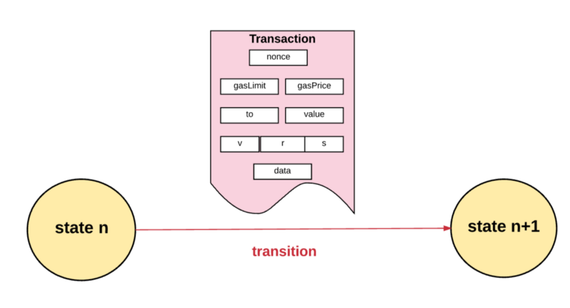
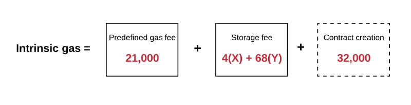
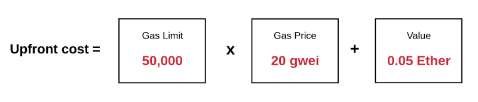
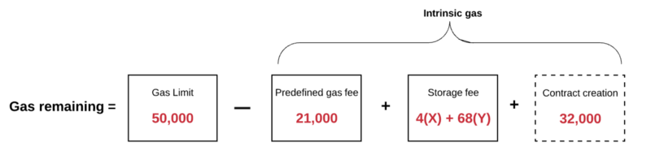

#初识以太坊

前面几节我们介绍了比特币的一些情况，比特币是一个很伟大的发明，但它仍存在一些问题，比如我们上节讲过，比特币系统支持简单的脚本，但它的脚本语言存在一些严重的限制：

- **缺少图灵完备性** – 这就是说，尽管比特币脚本语言可以支持多种计算，但是它不能支持所有的计算。最主要的缺失是循环语句。不支持循环语句的目的是避免交易确认时出现无限循环。理论上，对于脚本程序员来说，这是可以克服的障碍，因为任何循环都可以用多次重复if 语句的方式来模拟，但是这样做会导致脚本空间利用上的低效率，例如，实施一个替代的椭圆曲线签名算法可能将需要256次重复的乘法，而每次都需要单独编码。
- **价值盲（Value-blindness）**。UTXO脚本不能为账户的取款额度提供精细的的控制。例如，预言机合约（oracle contract）的一个强大应用是对冲合约，A和B各自向对冲合约中发送价值1000美元的比特币，30天以后，脚本向A发送价值1000美元的比特币，向B发送剩余的比特币。虽然实现对冲合约需要一个预言机（oracle）决定一比特币值多少美元，但是与现在完全中心化的解决方案相比，这一机制已经在减少信任和基础设施方面有了巨大的进步。然而，因为UTXO是不可分割的，为实现此合约，唯一的方法是非常低效地采用许多有不同面值的UTXO（例如对应于最大为30的每个k，有一个2^k的UTXO)并使预言机挑出正确的UTXO发送给A和B。
- **缺少状态** – UTXO只能是已花费或者未花费状态，这就没有给需要任何其它内部状态的多阶段合约或者脚本留出生存空间。这使得实现多阶段期权合约、去中心化的交换要约或者两阶段加密承诺协议（对确保计算奖励非常必要）非常困难。这也意味着UTXO只能用于建立简单的、一次性的合约，而不是例如去中心化组织这样的有着更加复杂的状态的合约，使得元协议难以实现。二元状态与价值盲结合在一起意味着另一个重要的应用-取款限额-是不可能实现的。
- **区块链盲（Blockchain-blindness）**- UTXO看不到区块链的数据，例如随机数和上一个区块的哈希。这一缺陷剥夺了脚本语言所拥有的基于随机性的潜在价值，严重地限制了博彩等其它领域应用。

除了脚本语言外，比特币的共识机制也会导致很多的算力浪费，虽然这样是为了保持全局状态唯一。而且区块被挖掘的速度太慢，对于正常的中心化的金融系统来说，每秒千万条交易是很常见的，但在比特币区块链中很难达到这样的交易量。比特币的扩容问题严重限制了其在金融领域的落地，虽然有闪电网络的出现来解决这些问题，但总是不尽如人意。

以太坊（Ethereum）是一个建立在区块链技术之上的去中心化应用平台。它允许任何人在平台中建立和使用通过区块链技术运行的去中心化应用。如果说比特币是一个分布式账本的话，那么以太坊则是一个全球的计算机。以太坊通过建立终极的抽象的基础层-内置有图灵完备编程语言的区块链-使得任何人都能够创建合约和去中心化应用并在其中设立他们自由定义的所有权规则、交易方式和状态转换函数。

### 以太坊账户

在以太坊系统中，状态是由被称为“账户”（每个账户由一个20字节的地址）的对象和在两个账户之间转移价值和信息的状态转换构成的。以太坊的账户包含四个部分：

- 随机数，用于确定每笔交易只能被处理一次的计数器
- 账户目前的以太币余额
- 账户的合约代码，如果有的话
- 账户的存储（默认为空）

以太币（Ether）是以太坊内部的主要加密燃料，用于支付交易费用。一般而言，以太坊有两种类型的账户：外部所有的账户（由私钥控制的）和合约账户（由合约代码控制）。外部所有的账户没有代码，人们可以通过创建和签名一笔交易从一个外部账户发送消息。每当合约账户收到一条消息，合约内部的代码就会被激活，允许它对内部存储进行读取和写入，和发送其它消息或者创建合约。

### 消息和交易

以太坊的消息在某种程度上类似于比特币的交易，但是两者之间存在三点重要的不同。第一，以太坊的消息可以由外部实体或者合约创建，然而比特币的交易只能从外部创建。第二，以太坊消息可以选择包含数据。第三，如果以太坊消息的接受者是合约账户，可以选择进行回应，这意味着以太坊消息也包含函数概念。

以太坊中“交易”是指存储从外部账户发出的消息的签名数据包。有两种类型的交易：**消息通信**和**合约创建(也就是交易产生一个新的以太坊合约)**。交易包含消息的接收者、用于确认发送者的签名、以太币账户余额、要发送的数据和两个被称为STARTGAS和GASPRICE的数值。为了防止代码的指数型爆炸和无限循环，每笔交易需要对执行代码所引发的计算步骤-包括初始消息和所有执行中引发的消息-做出限制。STARTGAS就是限制，有的地方也叫 gas limit ，GASPRICE是每一计算步骤需要支付矿工的费用。如果执行交易的过程中，“用完了瓦斯”，所有的状态改变恢复原状态，但是已经支付的交易费用不可收回了。如果执行交易中止时还剩余瓦斯，那么这些瓦斯将退还给发送者。创建合约有单独的交易类型和相应的消息类型；合约的地址是基于账号随机数和交易数据的哈希计算出来的。

消息机制的一个重要后果是以太坊的“头等公民”财产-合约与外部账户拥有同样权利，包括发送消息和创建其它合约的权利。这使得合约可以同时充当多个不同的角色，例如，用户可以使去中心化组织（一个合约）的一个成员成为一个中介账户（另一个合约），为一个偏执的使用定制的基于量子证明的兰波特签名（第三个合约）的个人和一个自身使用由五个私钥保证安全的账户（第四个合约）的共同签名实体提供居间服务。以太坊平台的强大之处在于去中心化的组织和代理合约不需要关心合约的每一参与方是什么类型的账户。

### 代码执行

以太坊合约的代码使用低级的基于堆栈的字节码的语言写成的，被称为“以太坊虚拟机代码”或者“EVM代码”。代码由一系列字节构成，每一个字节代表一种操作。一般而言，代码执行是无限循环，程序计数器每增加一（初始值为零）就执行一次操作，直到代码执行完毕或者遇到错误，`STOP`或者`RETURN`指令。操作可以访问三种存储数据的空间：

- **堆栈**，一种后进先出的数据存储，32字节的数值可以入栈，出栈。
- **内存**，可无限扩展的字节队列。
- **合约的长期存储**，一个秘钥/数值的存储，其中秘钥和数值都是32字节大小，与计算结束即重置的堆栈和内存不同，存储内容将长期保持。

代码可以象访问区块头数据一样访问数值，发送者和接受到的消息中的数据，代码还可以返回数据的字节队列作为输出。

EVM代码的正式执行模型令人惊讶地简单。当以太坊虚拟机运行时，它的完整的计算状态可以由元组`(block_state, transaction, message, code, memory, stack, pc, gas)`来定义，这里`block_state`是包含所有账户余额和存储的全局状态。每轮执行时，通过调出代码的第`pc`（程序计数器）个字节，当前指令被找到，每个指令都有定义自己如何影响元组。例如，`ADD`将两个元素出栈并将它们的和入栈，将`gas`（瓦斯）减一并将`pc`加一，`SSTORE`将顶部的两个元素出栈并将第二个元素插入到由第一个元素定义的合约存储位置，同样减少最多200的gas值并将`pc`加一，虽然有许多方法通过即时编译去优化以太坊，但以太坊的基础性的实施可以用几百行代码实现。

### 区块链和挖矿

虽然有一些不同，但以太坊的区块链在很多方面类似于比特币区块链。它们的区块链架构的不同在于，以太坊区块不仅包含交易记录和最近的状态，还包含区块序号和难度值。以太坊中的区块确认算法如下：

1. 检查区块引用的上一个区块是否存在和有效。
2. 检查区块的时间戳是否比引用的上一个区块大，而且小于15分钟。
3. 检查区块序号、难度值、 交易根，叔根和瓦斯限额（许多以太坊特有的底层概念）是否有效。
4. 检查区块的工作量证明是否有效。
5. 将`S[0]`赋值为上一个区块的`STATE_ROOT`。
6. 将`TX`赋值为区块的交易列表，一共有`n`笔交易。对于属于`0……n-1`的`i`，进行状态转换`S[i+1] = APPLY(S[i],TX[i])`。如果任何一个转换发生错误，或者程序执行到此处所花费的瓦斯（gas）超过了`GASLIMIT`，返回错误。
7. 用`S[n]`给`S_FINAL`赋值, 向矿工支付区块奖励。
8. 检查`S-FINAL`是否与`STATE_ROOT`相同。如果相同，区块是有效的。否则，区块是无效的。

这一确认方法乍看起来似乎效率很低，因为它需要存储每个区块的所有状态，但是事实上以太坊的确认效率可以与比特币相提并论。原因是状态存储在树结构中（tree structure），每增加一个区块只需要改变树结构的一小部分。因此，一般而言，两个相邻的区块的树结构的大部分应该是相同的，因此存储一次数据，可以利用指针（即子树哈希）引用两次。一种被称为“帕特里夏树”（“Patricia Tree”）的树结构可以实现这一点，其中包括了对默克尔树概念的修改，不仅允许改变节点，而且还可以插入和删除节点。另外，因为所有的状态信息是最后一个区块的一部分，所以没有必要存储全部的区块历史-这一方法如果能够可以应用到比特币系统中，经计算可以对存储空间有10-20倍的节省。

###交易流程

现在我们看下具体的一笔交易是如何执行的。假设你发送了一笔交易给以太坊网络处理，将以太坊状态转换成包含你的交易这个过程到底发生了什么？

首先，为了可以被执行所有的交易必须都要符合最基础的一系列要求，包括：

- 交易必须是正确格式化的RLP。”RLP”代表Recursive Length Prefix，它是一种数据格式，用来编码二进制数据嵌套数组。以太坊就是使用RLP格式序列化对象。
- 有效的交易签名。
- 有效的交易序号。账户中的nonce就是从此账户发送出去交易的计数。如果有效，那么交易序号一定等于发送账户中的nonce。
- 交易的STARTGAS 一定要等于或者大于交易使用的**intrinsic gas**，**intrinsic gas**包括：——-1.执行交易预订费用为21,000gas——-2.随交易发送的数据的gas费用（每字节数据或代码为0的费用为4gas，每个非零字节的数据或代码费用为68gas）——-3.如果交易是合约创建交易，还需要额外的32,000gas

- 发送账户余额必须有足够的Ether来支付”前期”gas费用。前期gas费用的计算比较简单：首先，交易的STARTGAS乘以交易的GASPRICE得到最大的gas费用。然后，这个最大gas费用被加到从发送方传送给接收方的总值。如果账户余额不足，返回错误。

如何交易符合上面所说的所有要求，那么我们进行下面步骤。

第一步，我们从发送者的余额中扣除执行的前期费用，并为当前交易将发送者账户中的nonce增加1。此时，我们可以计算剩余的gas，将交易的总gas减去使用的**intrinsic gas**。

第二步，开始执行交易。首先从发送者的账户转移价值到接收者账户。如果接收账户还不存在，创建此账户。如果接收账户是一个合约，运行合约的代码，直到代码运行结束或者瓦斯用完。如果没有合约接收交易，那么所有的交易费用就等于GASPRICE乘以交易的字节长度，交易的数据就与交易费用无关了。另外，需要注意的是，合约发起的消息可以对它们产生的计算分配瓦斯限额，如果子计算的瓦斯用完了，它只恢复到消息发出时的状态。因此，就像交易一样，合约也可以通过对它产生的子计算设置严格的限制，保护它们的计算资源。在交易执行的整个过程中，以太坊保持跟踪“子状态”。子状态是记录在交易中生成的信息的一种方式，当交易完成时会立即需要这些信息。具体来说，它包含：

- 自毁集：在交易完成之后会被丢弃的账户集（如果存在的话）
- 日志系列：虚拟机的代码执行的归档和可检索的检查点
- 退款余额：交易完成之后需要退还给发送账户的总额。我们之前提到的以太坊中的存储需要付费，发送者要是清理了内存就会有退款。以太坊使用退款计数进行跟踪退款余额。退款计数从0开始并且每当合约删除了一些存储中的东西都会进行增加。

第三步，交易所需的各种计算开始被处理。

当交易所需的步骤全部处理完成，并假设没有无效状态，通过确定退还给发送者的未使用的gas量，最终的状态也被确定。除了未使用的gas，发送者还会得到上面所说的“退款余额”中退还的一些津贴。

一旦发送者得到退款之后：

- gas的Ether就会矿工
- 交易使用的gas会被添加到区块的gas计数中（计数一直记录当前区块中所有交易使用的gas总量，这对于验证区块时是非常有用的）
- 所有在**自毁集**中的账户（如果存在的话）都会被删除

最后，我们就有了一个新的状态以及交易创建的一系列日志。

## 智能合约示例：

**储蓄钱包**。 假设Alice想确保她的资金安全，但她担心丢失或者被黑客盗走私钥。她把以太币放到和Bob签订的一个合约里，如下所示，这合同是一个银行：

- Alice单独每天最多可提取1%的资金。
- Bob单独每天最多可提取1%的资金，但Alice可以用她的私钥创建一个交易取消Bob的提现权限。
- Alice 和 Bob 一起可以任意提取资金。 

一般来讲，每天1%对Alice足够了，如果Alice想提现更多她可以联系Bob寻求帮助。如果Alice的私钥被盗，她可以立即找到Bob把她的资金转移到一个新合同里。如果她弄丢了她的私钥，Bob可以慢慢地把钱提出。如果Bob表现出了恶意，她可以关掉他的提现权限。