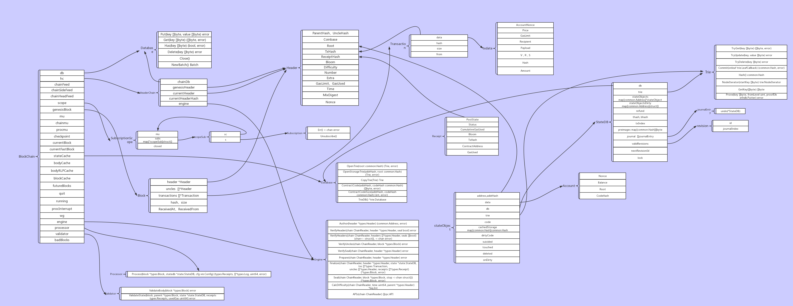

## 区块存储

区块(Block)是以太坊的核心数据结构之一，Block包含Header和Body两部分。区块的存储是由leveldb完成的，leveldb的数据是以键值对存储的。



```go
// BlockChain 表示了一个规范的链,这个链通过一个包含了创世区块的数据库指定. BlockChain管理了链的插入,还原,重建等操作.
// 插入一个区块需要通过一系列指定的规则指定的两阶段的验证器.
// 使用Processor来对区块的交易进行处理. 状态的验证是第二阶段的验证器. 错误将导致插入终止.
// 需要注意的是GetBlock可能返回任意不在当前规范区块链中的区块,
// 但是GetBlockByNumber总是返回当前规范区块链中的区块.
type BlockChain struct {
    chainConfig *params.ChainConfig // Chain & network configuration
    cacheConfig *CacheConfig        // Cache configuration for pruning

    db     ethdb.Database // Low level persistent database to store final content in
    triegc *prque.Prque   // Priority queue mapping block numbers to tries to gc
    gcproc time.Duration  // Accumulates canonical block processing for trie dumping

    hc            *HeaderChain // 只包含了区块头的区块链
    rmLogsFeed    event.Feed   // 底层数据库
    chainFeed     event.Feed   // 下面是很多消息通知的组件
    chainSideFeed event.Feed
    chainHeadFeed event.Feed
    logsFeed      event.Feed
    scope         event.SubscriptionScope
    genesisBlock  *types.Block  // 创世区块

    mu      sync.RWMutex // global mutex for locking chain operations
    chainmu sync.RWMutex // blockchain insertion lock
    procmu  sync.RWMutex // block processor lock

    checkpoint       int          // checkpoint counts towards the new checkpoint
    currentBlock     *types.Block // Current head of the block chain 当前的区块头
    currentFastBlock *types.Block // Current head of the fast-sync chain (may be above the block chain!) 当前的快速同步的区块头

    stateCache   state.Database // State database to reuse between imports (contains state cache)
    bodyCache    *lru.Cache     // Cache for the most recent block bodies
    bodyRLPCache *lru.Cache     // Cache for the most recent block bodies in RLP encoded format
    blockCache   *lru.Cache     // Cache for the most recent entire blocks
    futureBlocks *lru.Cache     // future blocks are blocks added for later processing 暂时还不能插入的区块存放位置

    quit    chan struct{} // blockchain quit channel
    running int32         // running must be called atomically
    // procInterrupt must be atomically called
    procInterrupt int32          // interrupt signaler for block processing
    wg            sync.WaitGroup // chain processing wait group for shutting down

    engine    consensus.Engine  // 一致性引擎
    processor Processor // block processor interface    // 区块处理器接口
    validator Validator // block and state validator interface // 区块和状态验证器接口
    vmConfig  vm.Config // 虚拟机的配置

    badBlocks *lru.Cache // Bad block cache 错误区块的缓存
}
```

 Blockchain管理所有的Block, 让其组成一个单向链表。Headerchain管理所有的Header,也形成一个单向链表， Headerchain是Blockchain里面的一部分  。

```go
type HeaderChain struct {
	config *params.ChainConfig

	chainDb       ethdb.Database
	genesisHeader *types.Header

	currentHeader     atomic.Value // Current head of the header chain (may be above the block chain!)
	currentHeaderHash common.Hash  // Hash of the current head of the header chain (prevent recomputing all the time)

	headerCache *lru.Cache // Cache for the most recent block headers
	tdCache     *lru.Cache // Cache for the most recent block total difficulties
	numberCache *lru.Cache // Cache for the most recent block numbers

	procInterrupt func() bool

	rand   *mrand.Rand
	engine consensus.Engine
}
```

以太坊的数据库体系-Merkle-Patricia Trie(MPT)， 它是由一系列节点组成的二叉树，在树底包含了源数据的大量叶子节点， 父节点是两个子节点的Hash值，一直到根节点。

```go
// Header represents a block header in the Ethereum blockchain.
type Header struct {
   ParentHash  common.Hash    `json:"parentHash"       gencodec:"required"`
   UncleHash   common.Hash    `json:"sha3Uncles"       gencodec:"required"`
   Coinbase    common.Address `json:"miner"            gencodec:"required"`
   Root        common.Hash    `json:"stateRoot"        gencodec:"required"`
   TxHash      common.Hash    `json:"transactionsRoot" gencodec:"required"`
   ReceiptHash common.Hash    `json:"receiptsRoot"     gencodec:"required"`
   Bloom       Bloom          `json:"logsBloom"        gencodec:"required"`
   Difficulty  *big.Int       `json:"difficulty"       gencodec:"required"`
   Number      *big.Int       `json:"number"           gencodec:"required"`
   GasLimit    uint64         `json:"gasLimit"         gencodec:"required"`
   GasUsed     uint64         `json:"gasUsed"          gencodec:"required"`
   Time        *big.Int       `json:"timestamp"        gencodec:"required"`
   Extra       []byte         `json:"extraData"        gencodec:"required"`
   MixDigest   common.Hash    `json:"mixHash"          gencodec:"required"`
   Nonce       BlockNonce     `json:"nonce"            gencodec:"required"`
}
```


```go
// Block represents an entire block in the Ethereum blockchain.
type Block struct {
   header       *Header
   uncles       []*Header
   transactions Transactions

   // caches
   hash atomic.Value
   size atomic.Value

   // Td is used by package core to store the total difficulty
   // of the chain up to and including the block.
   td *big.Int

   // These fields are used by package eth to track
   // inter-peer block relay.
   ReceivedAt   time.Time
   ReceivedFrom interface{}
}
```

Transaction是Body的重要数据结构，一个交易就是被外部拥有账户生成的加密签名的一段指令，序列化，然后提交给区块链。

在这里保存区块信息时，key一般是与hash相关的，value所保存的数据结构是经过RLP编码的。
在代码中，`core/database_util.go`中封装了区块存储和读取相关的代码。
在存储区块信息时，会将区块头和区块体分开进行存储。因此在区块的结构体中，能够看到Header和Body两个结构体。
区块头（Header）的存储格式为：

```go
 headerPrefix + num (uint64 big endian) + hash -> rlpEncode(header)
```

key是由区块头的前缀，区块号和区块hash构成。value是区块头的RLP编码。
区块体（Body）的存储格式为：

```go
bodyPrefix + num (uint64 big endian) + hash -> rlpEncode(block body)
```

key是由区块体前缀，区块号和区块hash构成。value是区块体的RLP编码。
在database_util.go中，key的前缀可以区分leveldb中存储的是什么类型的数据。

```go
 var (
        headHeaderKey = []byte("LastHeader")
        headBlockKey  = []byte("LastBlock")
        headFastKey   = []byte("LastFast")
    
        // Data item prefixes (use single byte to avoid mixing data types, avoid `i`).
        headerPrefix        = []byte("h") // headerPrefix + num (uint64 big endian) + hash -> header
        tdSuffix            = []byte("t") // headerPrefix + num (uint64 big endian) + hash + tdSuffix -> td
        numSuffix           = []byte("n") // headerPrefix + num (uint64 big endian) + numSuffix -> hash
        blockHashPrefix     = []byte("H") // blockHashPrefix + hash -> num (uint64 big endian)
        bodyPrefix          = []byte("b") // bodyPrefix + num (uint64 big endian) + hash -> block body
        blockReceiptsPrefix = []byte("r") // blockReceiptsPrefix + num (uint64 big endian) + hash -> block receipts
        lookupPrefix        = []byte("l") // lookupPrefix + hash -> transaction/receipt lookup metadata
        bloomBitsPrefix     = []byte("B") // bloomBitsPrefix + bit (uint16 big endian) + section (uint64 big endian) + hash -> bloom bits
    
        preimagePrefix = "secure-key-"              // preimagePrefix + hash -> preimage
        configPrefix   = []byte("ethereum-config-") // config prefix for the db
    
        // Chain index prefixes (use `i` + single byte to avoid mixing data types).
        BloomBitsIndexPrefix = []byte("iB") // BloomBitsIndexPrefix is the data table of a chain indexer to track its progress
    
        // used by old db, now only used for conversion
        oldReceiptsPrefix = []byte("receipts-")
        oldTxMetaSuffix   = []byte{0x01}
    
        ErrChainConfigNotFound = errors.New("ChainConfig not found") // general config not found error
    
        preimageCounter    = metrics.NewCounter("db/preimage/total")
        preimageHitCounter = metrics.NewCounter("db/preimage/hits")
    )
```

database_util.go最开始就定义了所有的前缀。这里的注释详细说明了每一个前缀存储了什么数据类型。
database_util.go中的其他方法则是对leveldb的操作。其中get方法是读取数据库中的内容，write则是向leveldb中写入数据。
要讲一个区块的信息写入数据库，则需要调用其中的WriteBlock方法。

```go
// WriteBlock serializes a block into the database, header and body separately.
func WriteBlock(db ethdb.Putter, block *types.Block) error {
     // Store the body first to retain database consistency
     if err := WriteBody(db, block.Hash(), block.NumberU64(), block.Body()); err != nil {
            return err
     }
     // Store the header too, signaling full block ownership
     if err := WriteHeader(db, block.Header()); err != nil {
            return err
     }
     return nil
}
```

这里我们看到，将一个区块信息写入数据库其实是分别将区块头和区块体写入数据库。
首先来看区块头的存储。区块头的存储是由WriteHeader方法完成的。

```go
// WriteHeader serializes a block header into the database.
func WriteHeader(db ethdb.Putter, header *types.Header) error {
        data, err := rlp.EncodeToBytes(header)
        if err != nil {
            return err
        }
        hash := header.Hash().Bytes()
        num := header.Number.Uint64()
        encNum := encodeBlockNumber(num)
        key := append(blockHashPrefix, hash...)
        if err := db.Put(key, encNum); err != nil {
            log.Crit("Failed to store hash to number mapping", "err", err)
        }
        key = append(append(headerPrefix, encNum...), hash...)
        if err := db.Put(key, data); err != nil {
            log.Crit("Failed to store header", "err", err)
        }
        return nil
}
```

这里首先对区块头进行了RLP编码，然后将区块号转换成为byte格式，开始组装key。
这里首先向数据库中存储了一条区块hash->区块号的键值对，然后才将区块头的信息写入数据库。
接下来是区块体的存储。区块体存储是由WriteBody方法实现。

```go
// WriteBody serializes the body of a block into the database.
func WriteBody(db ethdb.Putter, hash common.Hash, number uint64, body *types.Body) error {
        data, err := rlp.EncodeToBytes(body)
        if err != nil {
            return err
        }
        return WriteBodyRLP(db, hash, number, data)
    }

// WriteBodyRLP writes a serialized body of a block into the database.
func WriteBodyRLP(db ethdb.Putter, hash common.Hash, number uint64, rlp rlp.RawValue) error {
        key := append(append(bodyPrefix, encodeBlockNumber(number)...), hash.Bytes()...)
        if err := db.Put(key, rlp); err != nil {
            log.Crit("Failed to store block body", "err", err)
        }
        return nil
}
```

WriteBody首先将区块体的信息进行RLP编码，然后调用WriteBodyRLP方法将区块体的信息写入数据库。key的组装方法如之前所述。

## 交易存储

交易主要在数据库中仅存储交易的Meta信息。

```go
txHash + txMetaSuffix -> rlpEncode(txMeta)
```

交易的Meta信息结构体如下：

```go
// TxLookupEntry is a positional metadata to help looking up the data content of
// a transaction or receipt given only its hash.
type TxLookupEntry struct {
        BlockHash  common.Hash
        BlockIndex uint64
        Index      uint64
}
```

这里，meta信息会存储块的hash，块号和块上第几笔交易这些信息。
交易Meta存储是以交易hash加交易的Meta前缀为key，Meta的RLP编码为value。
交易写入数据库是通过WriteTxLookupEntries方法实现的。

```go
// WriteTxLookupEntries stores a positional metadata for every transaction from
// a block, enabling hash based transaction and receipt lookups.
func WriteTxLookupEntries(db ethdb.Putter, block *types.Block) error {
	// Iterate over each transaction and encode its metadata
	for i, tx := range block.Transactions() {
		entry := TxLookupEntry{
			BlockHash:  block.Hash(),
			BlockIndex: block.NumberU64(),
			Index:      uint64(i),
		}
		data, err := rlp.EncodeToBytes(entry)
		if err != nil {
			return err
		}
		if err := db.Put(append(lookupPrefix, tx.Hash().Bytes()...), data); err != nil {
			return err
		}
	}
	return nil
}
```

这里，在将交易meta入库时，会遍历块上的所有交易，并构造交易的meta信息，进行RLP编码。然后以交易hash为key，meta为value进行存储。
这样就将一笔交易写入数据库中。
从数据库中读取交易信息时通过GetTransaction方法获得的。

```go
// GetTransaction retrieves a specific transaction from the database, along with
// its added positional metadata.
func GetTransaction(db DatabaseReader, hash common.Hash) (*types.Transaction, common.Hash, uint64, uint64) {
	// Retrieve the lookup metadata and resolve the transaction from the body
	blockHash, blockNumber, txIndex := GetTxLookupEntry(db, hash)

	if blockHash != (common.Hash{}) {
		body := GetBody(db, blockHash, blockNumber)
		if body == nil || len(body.Transactions) <= int(txIndex) {
			log.Error("Transaction referenced missing", "number", blockNumber, "hash", blockHash, "index", txIndex)
			return nil, common.Hash{}, 0, 0
		}
		return body.Transactions[txIndex], blockHash, blockNumber, txIndex
	}
	// Old transaction representation, load the transaction and it's metadata separately
	data, _ := db.Get(hash.Bytes())
	if len(data) == 0 {
		return nil, common.Hash{}, 0, 0
	}
	var tx types.Transaction
	if err := rlp.DecodeBytes(data, &tx); err != nil {
		return nil, common.Hash{}, 0, 0
	}
	// Retrieve the blockchain positional metadata
	data, _ = db.Get(append(hash.Bytes(), oldTxMetaSuffix...))
	if len(data) == 0 {
		return nil, common.Hash{}, 0, 0
	}
	var entry TxLookupEntry
	if err := rlp.DecodeBytes(data, &entry); err != nil {
		return nil, common.Hash{}, 0, 0
	}
	return &tx, entry.BlockHash, entry.BlockIndex, entry.Index
}

// GetTxLookupEntry retrieves the positional metadata associated with a transaction
// hash to allow retrieving the transaction or receipt by hash.
func GetTxLookupEntry(db DatabaseReader, hash common.Hash) (common.Hash, uint64, uint64) {
	// Load the positional metadata from disk and bail if it fails
	data, _ := db.Get(append(lookupPrefix, hash.Bytes()...))
	if len(data) == 0 {
		return common.Hash{}, 0, 0
	}
	// Parse and return the contents of the lookup entry
	var entry TxLookupEntry
	if err := rlp.DecodeBytes(data, &entry); err != nil {
		log.Error("Invalid lookup entry RLP", "hash", hash, "err", err)
		return common.Hash{}, 0, 0
	}
	return entry.BlockHash, entry.BlockIndex, entry.Index
}
```

这个方法会首先通过交易hash从数据库中获取交易的meta信息，包括交易所在块的hash，块号和第几笔交易。
接下来使用块号和块hash获取从数据库中读取块的信息。
然后根据第几笔交易从块上获取交易的具体信息。
这里以太坊将交易的存储换成了新的存储方式，即交易的具体信息存储在块上，交易hash只对应交易的meta信息，并不包含交易的具体信息。
而以前的交易存储则是需要存储交易的具体信息和meta信息。
因此GetTransaction方法会支持原有的数据存储方式。