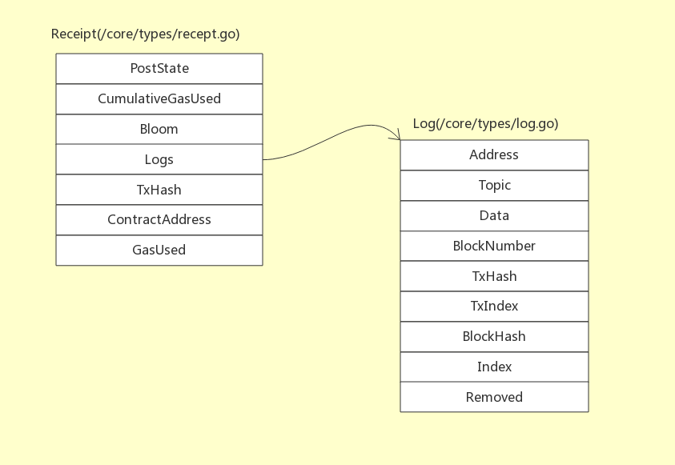
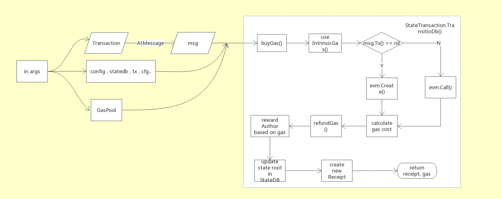
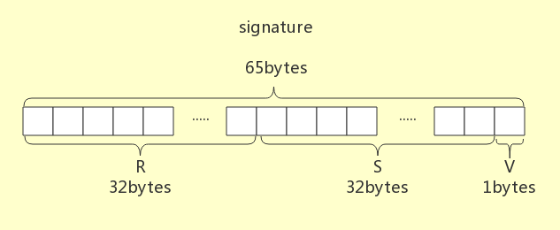
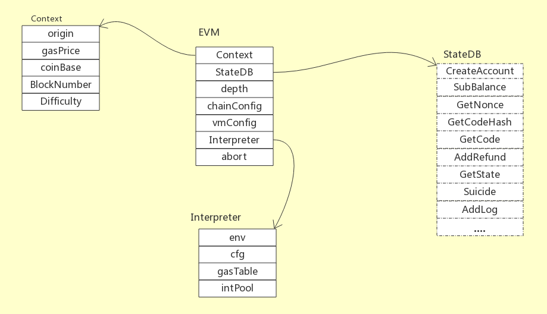
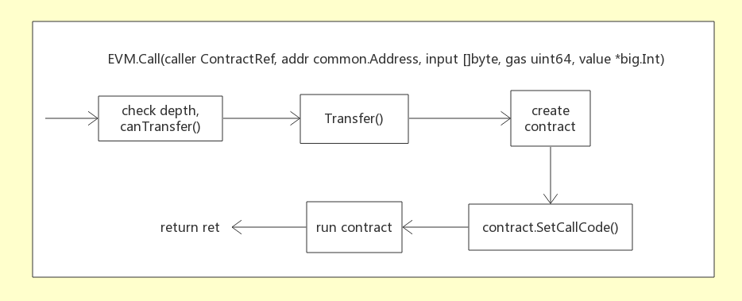
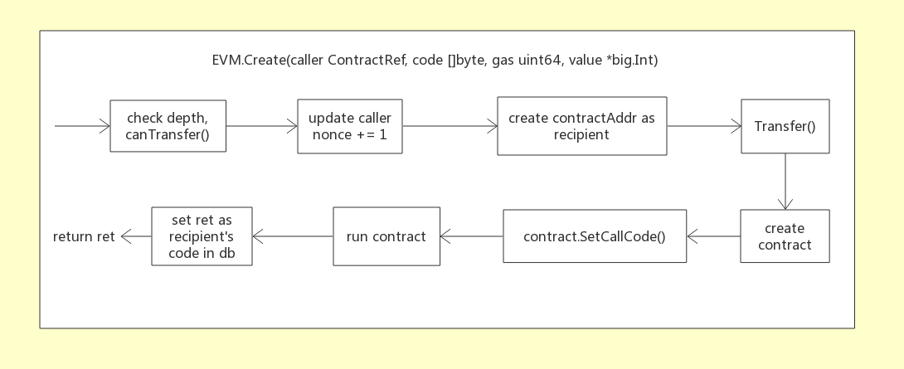
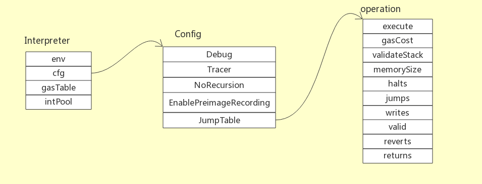
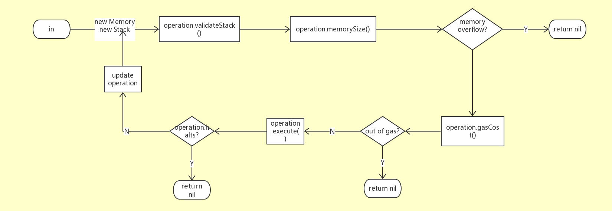

# 1. 基本概念

## 1.1 常用数据类型 哈希值和地址

两个最常用的自定义数据类型**common.Hash用来表示哈希值，common.Address**表示地址

```go
# /commons/types.go  
const (  
    HashLength = 32  
    AddressLength = 20  
)  
type Hash [HashLength]byte  
type Address [AddressLength]byte  
```

在Ethereum 代码里，所有用到的哈希值，都使用该Hash类型，长度为32bytes，即256 bits；Ethereum 中所有跟帐号(Account)相关的信息，比如交易转帐的转出帐号(地址)和转入帐号(地址)，都会用该Address类型表示，长度20bytes。

## 1.2 汽油(Gas)和以太币(Ether)

Gas, 是Ethereum里对所有活动进行消耗资源计量的单位。这里的活动是泛化的概念，包括但不限于：转帐，合约的创建，合约指令的执行，执行中内存的扩展等等。所以Gas可以想象成现实中的汽油或者燃气。

Ether, 是Ethereum世界中使用的数字货币，也就是常说的以太币。如果某个帐号，Address A想要发起一个交易，比如一次简单的转帐，即向 Address B 发送一笔金额H，那么Address A 本身拥有的Ether，除了转帐的数额H之外，还要有额外一笔金额用以支付交易所耗费的Gas。

如果可以实现Gas和Ether之间的换算，那么Ethereum系统里所有的活动，都可以用Ether来计量。这样，Ether就有了点一般等价物，也就是货币的样子。

## 1.3 区块是交易的集合

区块(Block)是Ethereum的核心结构体之一。在整个区块链(BlockChain)中，一个个Block是以**单向链表**的形式相互关联起来的。Block中带有一个Header(指针), Header结构体带有Block的所有属性信息，其中的ParentHash 表示该区块的父区块哈希值， 亦即**Block之间关联起来的前向指针**。只不过要想得到父区块(parentBlock)对象，直接解析这个ParentHash是不够的， 而是要将ParentHash同其他字符串([]byte)组合成合适的key([]byte), 去kv数据库里查询相应的value才能解析得到。 Block和Header的部分成员变量定义如下：

```go
# /core/types/block.go  
type Block struct {  
    header *Header  
    transactions Transactions  // type Transactions []*Transaction  
    ...  
}  
type Header struct {  
    ParentHash common.Hash  
    Number *big.Int  
    ...  
}   
```

Header的整型成员Number表示该区块在整个区块链(BlockChain)中所处的位置，每一个区块相对于它的父区块，其Number值是+1。这样，整个区块链会存在一个原始区块，即创世块(GenesisBlock)， 它的Number是0，由系统通过配置文件生成而不必去额外挖掘(mine)。Block和BlockChain的实现细节，之后会有更详细的讨论。

Block中还有一个Tranction(指针)数组，这是我们这里关注的。**Transaction(简称tx)，是Ethereum里标示一次交易的结构体**， 它的成员变量包括转帐金额，转入方地址等等信息。Transaction的完整声明如下：

```go
# /core/types/transaction.go  
type Transaction struct {  
    data txdata  
    hash, size, from atomic.Value  // for cache  
}  
type txdata struct {  
    AccountNonce uint64  
    Price *big.Int  
    GasLimit *big.Int  
    Recipient *common.Address  
    Amount *big.Int  
    Payload []byte  
    V, R, S *big.Int   // for signature  
    Hash *common.Hash  // for marshaling  
}  
```

每个tx都声明了自己的(Gas)Price 和 GasLimit。 Price指的是单位Gas消耗所折抵的Ether多少，它的高低意味着执行这个tx有多么昂贵。GasLimit 是该tx执行过程中所允许消耗资源的总上限，通过这个值，我们可以防止某个tx执行中出现恶意占用资源的问题，这也是Ethereum中有关安全保护的策略之一。拥有独立的Price和GasLimit, 也意味着每个tx之间都是相互独立的。

**转帐转入方地址Recipient可能为空(nil)**，这时在后续执行tx过程中，Ethereum 需要创建一个地址来完成这笔转帐。Payload是重要的数据成员，它既可以作为所创建合约的指令数组，其中每一个byte作为一个单独的虚拟机指令；也可以作为数据数组，由合约指令进行操作。合约由以太坊虚拟机(Ethereum Virtual Machine, EVM)创建并执行。

你在这里可能会有个疑问，为何交易的定义里没有声明转帐的转出方地址？ tx 的转帐转出方地址确实没有如转入方一样被显式的声明出来，而是被**加密**隐藏起来了，在Ethereum里这个转出方地址是机密，不能直接暴露。这个对tx加密的环节，在Ethereum里被称为签名(sign), 关于它的实现细节容后再述。

# 2. 交易的执行

Block 类型的基本目的之一，就是为了执行交易。狭义的交易可能仅仅是一笔转帐，而广义的交易同时还会支持许多其他的意图。Ethereum 中采用的是广义交易概念。按照其架构设计，交易的执行可大致分为**内外两层结构**：**第一层是虚拟机外**，包括执行前将Transaction类型转化成Message，创建虚拟机(EVM)对象，计算一些Gas消耗，以及执行交易完毕后创建收据(Receipt)对象并返回等；**第二层是虚拟机内**，包括执行转帐，和创建合约并执行合约的指令数组。

## 2.1 虚拟机外

### 2.1.1 入口和返回值

执行tx的入口函数是StateProcessor的Process()函数，其实现代码如下：

```go
# /core/state_processor.go  
func (p *StateProcessor) Process(block *types.Block, statedb *state.StateDB, cfg vm.Config) (types.Receipts, []*types.Log, uint64, error) {
	var (
		receipts types.Receipts
		usedGas  = new(uint64)
		header   = block.Header()
		allLogs  []*types.Log
		gp       = new(GasPool).AddGas(block.GasLimit())
	)
	......
	// Iterate over and process the individual transactions
	for i, tx := range block.Transactions() {
		statedb.Prepare(tx.Hash(), block.Hash(), i)
		receipt, _, err := ApplyTransaction(p.config, p.bc, nil, gp, statedb, header, tx, usedGas, cfg)
		if err != nil {
			return nil, nil, 0, err
		}
		receipts = append(receipts, receipt)
		allLogs = append(allLogs, receipt.Logs...)
	}
	// Finalize the block, applying any consensus engine specific extras (e.g. block rewards)
	p.engine.Finalize(p.bc, header, statedb, block.Transactions(), block.Uncles(), receipts)

	return receipts, allLogs, *usedGas, nil
}
```

GasPool 类型其实就是big.Int。在一个Block的处理过程(即其所有tx的执行过程)中，GasPool 的值能够告诉你，剩下还有多少Gas可以使用。在每一个tx执行过程中，Ethereum 还设计了偿退(refund)环节，所偿退的Gas数量也会加到这个GasPool里。

Process()函数的核心是一个for循环，它将Block里的所有tx逐个遍历执行。具体的执行函数叫ApplyTransaction()，它每次执行tx, 会返回一个收据(Receipt)对象。Receipt结构体的声明如下：



Receipt 中有一个Log类型的数组，其中每一个Log对象记录了Tx中一小步的操作。所以，每一个tx的执行结果**，**由**一个Receipt对象**来表示；更详细的内容，由**一组Log对象**来记录。这个Log数组很重要，比如在不同Ethereum节点(Node)的相互同步过程中，待同步区块的Log数组有助于验证同步中收到的block是否正确和完整，所以会被单独同步(传输)。

Receipt的PostState保存了创建该 Receipt 对象时，整个Block内所有“帐户”的当时状态。Ethereum 里用stateObject 来表示一个账户 Account，这个账户可转帐(transfer value), 可执行tx, 它的唯一标示符是一个Address类型变量。 这个Receipt.PostState 就是当时所在 Block 里所有 stateObject 对象的 RLP Hash 值。

Bloom 类型是一个 Ethereum 内部实现的一个 256bit长 Bloom Filter。它可用来快速验证一个新收到的对象是否处于一个已知的大量对象集合之中。这里Receipt的Bloom，被用以验证某个给定的Log是否处于Receipt已有的Log数组中。

### 2.1.2 消耗Gas，亦奖励Gas

我们来看下StateProcessor.ApplyTransaction()的具体实现，它的基本流程如下图：



ApplyTransaction()首先根据输入参数分别封装出一个Message对象和一个EVM对象，然后加上一个传入的GasPool类型变量，由TransitionDb()函数完成tx的执行，待TransitionDb()返回之后，创建一个收据Receipt对象，最后返回该Recetip对象，以及整个tx执行过程所消耗Gas数量。

GasPool对象是在一个Block执行开始时创建，并在该Block内所有tx的执行过程中共享，对于一个tx的执行可视为“全局”存储对象； Message由此次待执行的tx对象转化而来，并携带了解析出的tx的(转帐)转出方地址，属于待处理的数据对象；EVM 作为Ethereum世界里的虚拟机(Virtual Machine)，作为此次tx的实际执行者，完成转帐和合约(Contract)的相关操作。

我们来细看下TransitioDb()的执行过程(/core/state_transition.go)。假设有StateTransition对象st,  其成员变量initialGas表示初始可用Gas数量，gas表示即时可用Gas数量，初始值均为0，于是st.TransitionDb() 可由以下步骤展开：

1. 购买Gas。首先从交易的(转帐)转出方账户扣除一笔Ether，费用等于tx.data.GasLimit * tx.data.Price；同时 st.initialGas = st.gas = tx.data.GasLimit；然后(GasPool) gp -= st.gas。
2. 计算tx的固有Gas消耗 - intrinsicGas。它分为两个部分，每一个tx预设的消耗量，这个消耗量还因tx是否含有(转帐)转入方地址而略有不同；以及针对tx.data.Payload的Gas消耗，Payload类型是[]byte，关于它的固有消耗依赖于[]byte中非0字节和0字节的长度。最终，st.gas -= intrinsicGas
3. EVM执行。如果交易的(转帐)转入方地址(tx.data.Recipient)为空，调用EVM的Create()函数；否则，调用Call()函数。无论哪个函数返回后，更新st.gas。
4. 计算本次执行交易的实际Gas消耗： requiredGas = st.initialGas - st.gas
5. **偿退Gas**。它包括两个部分：首先将剩余st.gas 折算成Ether，归还给交易的(转帐)转出方账户；然后，基于实际消耗量requiredGas，系统提供一定的**补偿**，数量为refundGas。refundGas 所折算的Ether会被立即加在(转帐)转出方账户上，同时st.gas += refundGas，gp += st.gas，即剩余的Gas加上系统补偿的Gas，被一起归并进GasPool，供之后的交易执行使用。
6. **奖励所属区块的挖掘者**：系统给所属区块的作者，亦即挖掘者账户，增加一笔金额，数额等于 st.data=Price * (st.initialGas - st.gas)。注意，这里的st.gas在步骤5中被加上了refundGas, 所以这笔奖励金所对应的Gas，其数量小于该交易实际消耗量requiredGas。

由上可见，除了步骤3中EVM 函数的执行，其他每个步骤都在围绕着Gas消耗量作文章(EVM 虚拟机的运行原理容后再述)。到这里，大家可以对Gas在以太坊系统里的作用有个初步概念，Gas就是Ethereum系统中的血液。

由于步骤6的**奖励机制**的存在**，**才会吸引社会上的矿工(miner)去卖力“挖矿”(mining)。越大的运算能力带来越多的的区块(交易)产出，矿工也就能通过该奖励机制赚取越多的以太币。

### 2.1.3 交易的数字签名

Ethereum 中每个交易(transaction，tx)对象在被放进block时，都是经过**数字签名**的，这样可以在后续传输和处理中随时验证tx是否经过篡改。Ethereum 采用的数字签名是**椭圆曲线数字签名算法**(Elliptic Cure Digital Signature Algorithm,[ECDSA](https://en.wikipedia.org/wiki/Elliptic_Curve_Digital_Signature_Algorithm))。ECDSA 相比于基于大质数分解的RSA数字签名算法，可以在提供相同安全级别(in bits)的同时，仅需更短的公钥(public key)。这里需要特别留意的是，**tx的转帐转出方地址，就是对该tx对象作ECDSA签名计算时所用的公钥publicKey**。

Ethereum中的数字签名计算过程所生成的签名(signature), 是一个长度为65bytes的字节数组，它被截成三段放进tx中，前32bytes赋值给成员变量R, 再32bytes赋值给S，末1byte赋给V，当然由于R、S、V声明的类型都是*big.Int, 上述赋值存在[]byte -> big.Int的类型转换。



当需要恢复出tx对象的转帐转出方地址时(比如在需要执行该交易时)，Ethereum 会先从tx的signature中恢复出公钥，再将公钥转化成一个common.Address类型的地址，signature由tx对象的三个成员变量R,S,V转化成字节数组[]byte后拼接得到。

Ethereum 对此定义了一个接口Signer, 用来执行挂载签名，恢复公钥，对tx对象做哈希等操作。

```go
// core/types/transaction_signing.go  
type Signer innterface {  
    Sender(tx *Transaction) (common.Address, error)  
    SignatureValues(tx *Transaction, sig []byte) (r, s, v *big.Int, err error)  
    Hash(tx *Transaction) common.Hash  
    Equal(Signer) bool  
}  
```

生成数字签名的函数叫SignTx()，它会先调用其他函数生成signature, 然后调用tx.WithSignature()将signature分段赋值给tx的成员变量R,S,V。

```go
func SignTx(tx Transaction, s Signer, prv *ecdsa.PrivateKey) (Transaction, error)
```

恢复出转出方地址的函数叫Sender()， 参数包括一个Signer, 一个Transaction，代码如下：

```go
func Sender(signer Signer, tx *Transaction) (common.Address, error) {  
    if sc := tx.from().Load(); sc != null {  
        sigCache := sc.(sigCache)// cache exists,  
        if sigCache.signer.Equal(signer) {  
            return sigCache.from, nil  
        }   
    }  
    addr, err := signer.Sender(tx)  
    if err != nil {  
        return common.Address{}, err  
    }  
    tx.from.Store(sigCache{signer: signer, from: addr}) // cache it  
    return addr, nil  
}  
```

Sender()函数体中，signer.Sender()会从本次数字签名的签名字符串(signature)中恢复出公钥，并转化为tx的转出方地址。

在上文提到的ApplyTransaction()实现中，Transaction对象需要首先被转化成Message接口，用到的AsMessage()函数即调用了此处的Sender()。

```go
// core/types/transaction.go  
func (tx *Transaction) AsMessage(s Signer) (Message,error) {  
    msg := Message{  
        price: new(big.Int).Set(tx.data.price)  
        gasLimit: new(big.Int).Set(tx.data.GasLimit)  
        ...  
    }  
    var err error  
    msg.from, err = Sender(s, tx)  
    return msg, err  
} 
```

  在Transaction对象tx的转帐转出方地址被解析出以后，tx 就被完全转换成了Message类型，可以提供给虚拟机EVM执行了。

## 2.2 虚拟机内

每个交易(Transaction)带有两部分内容需要执行：

1. 转帐，由转出方地址向转入方地址转帐一笔以太币Ether; 
2. 携带的[]byte类型成员变量Payload，其每一个byte都对应了一个单独虚拟机指令。

这些内容都是由EVM(Ethereum Virtual Machine)对象来完成的。EVM 结构体是Ethereum虚拟机机制的核心，它以及与之协同的struct的关系如下：



其中Context结构体分别携带了Transaction的信息(GasPrice, GasLimit)，Block的信息(Number, Difficulty)，以及转帐函数等，提供给EVM；StateDB 接口是针对state.StateDB 结构体设计的本地行为接口，可为EVM提供statedb的相关操作； Interpreter结构体作为解释器，用来解释执行EVM中合约(Contract)的指令(Code)。

### 2.2.1 完成转帐

交易的转帐操作由Context对象中的TransferFunc类型函数来实现，类似的函数类型，还有CanTransferFunc和GetHashFunc。

```go
// core/vm/evm.go  
type {  
    CanTransferFunc func(StateDB, common.Address, *big.Int)  
    TransferFunc func(StateDB, common.Address, common.Address, *big.Int)  
    GetHashFunc func(uint64) common.Hash  
}   
```

这三个类型的函数变量CanTransfer, Transfer, GetHash，在Context初始化时从外部传入，目前使用的均是一个本地实现：

```go
// core/evm.go  
func NewEVMContext(msg Message, header *Header, chain ChainContext, author *Address){  
    return vm.Context {  
        CanTransfer: CanTransfer,  
        Transfer: Transfer,  
        GetHash： GetHash(header, chain),  
        ...  
    }  
}  
  
func CanTransfer(db vm.StateDB, addr common.Address, amount *big.Int) {  
    return db.GetBalance(addr).Cmp(amount) >= 0  
}  
func Transfer(db vm.StateDB, sender, recipient common.Address, amount *big.Int) {  
    db.SubBalance(sender, amount)  
    db.AddBalance(recipient, amount)  
}  
```

可见目前的转帐函数Transfer()的逻辑非常简单，转帐的转出账户减掉一笔以太币，转入账户加上一笔以太币。由于EVM调用的Transfer()函数实现完全由Context提供，所以，假设如果基于Ethereum平台开发，需要设计一种全新的“转帐”模式，那么只需写一个新的Transfer()函数实现，在Context初始化时赋值即可。

有人或许会问，这里Transfer()函数中对转出和转入账户的操作会立即生效么？万一两步操作之间有错误发生怎么办？答案是不会立即生效。StateDB 并不是真正的数据库，只是一行为类似数据库的结构体。它在内部以Trie的数据结构来管理各个基于地址的账户，可以理解成一个cache；当该账户的信息有变化时，变化先存储在Trie中。仅当整个Block要被插入到BlockChain时，StateDB 里缓存的所有账户的所有改动，才会被真正的提交到底层数据库。

### 2.2.2 合约的创建和赋值

合约(Contract)是EVM用来执行(虚拟机)指令的结构体。先来看下Contract的定义：

```go
// core/vm/contract.go  
type ContractRef interface {  
    Address() common.Address  
}  
type Contract struct {  
    CallerAddress common.Address  
    caller ContractRef  
    self ContractRef  
  
    jumpdests destinations  
    Code []byte  
    CodeHash common.Hash  
    CodeAddr *Address  
    Input []byte  
    Gas uint64  
    value *big.Int  
    Args []byte  
    DelegateCall bool  
}  
```

在这些成员变量里，caller是转帐转出方地址(账户)，self是转入方地址，不过它们的类型都用接口ContractRef来表示；Code是指令数组，其中每一个byte都对应于一个预定义的虚拟机指令；CodeHash 是Code的RLP哈希值；Input是数据数组，是指令所操作的数据集合；Args 是参数。

有意思的是self这个变量，为什么转入方地址要被命名成self呢？ Contract实现了ContractRef接口，返回的恰恰就是这个self地址。

```go
func (c *Contract) Address() common.Address {  
    return c.self.Address()  
}  
```

所以当Contract对象作为一个ContractRef接口出现时，它返回的地址就是它的self地址。那什么时候Contract会被类型转换成ContractRef呢？当Contract A调用另一个Contract B时，A就会作为B的caller成员变量出现。**Contract可以调用Contract**，这就为系统在业务上的潜在扩展，提供了空间。

创建一个Contract对象时，**重点关注对self的初始化，以及对Code, CodeAddr 和Input的赋值**。 

另外，StateDB 提供方法SetCode()，可以将指令数组Code存储在某个stateObject对象中; 方法GetCode()，可以从某个stateObject对象中读取已有的指令数组Code。

```go
func (self *StateDB) SetCode(addr common.Address, code []byte)  
func (self *StateDB) GetCode(addr common.Address) code []byte  
```

刚刚说过，**stateObject 是Ethereum里用来管理一个账户所有信息修改的结构体**，它以一个Address类型变量为唯一标示符。StateDB 在内部用一个巨大的map结构来管理这些stateObject对象。所有账户信息-包括Ether余额，指令数组Code, 该账户发起合约次数nonce等-它们发生的所有变化，会首先缓存到StateDB里的某个stateObject里，然后在合适的时候，被StateDB一起提交到底层数据库。注意，**一个Contract所对应的stateObject的地址，是Contract的self地址，也就是转帐的转入方地址**。

EVM 目前有五个函数可以创建并执行Contract，按照作用和调用方式，可以分成两类:

- Create(), Call(): 二者均在StateProcessor的ApplyTransaction()被调用以**执行单个交易**，并且都有**调用转帐函数完成转帐**。


- CallCode(), DelegateCall(), StaticCall()：三者由于分别对应于不同的虚拟机指令(1 byte)操作，**不会用以执行单个交易**，也都**不能处理转帐**。

考虑到与执行交易的相关性，这里着重探讨Create()和Call()。先来看Call()，它用来处理(转帐)转入方地址不为空的情况：



Call()函数的逻辑可以简单分为以上6步。其中步骤(3)调用了转帐函数Transfer()，转入账户caller, 转出账户addr；步骤(4)创建一个Contract对象，并初始化其成员变量caller, self(addr), value和gas； 步骤(5)赋值Contract对象的Code, CodeHash, CodeAddr成员变量；步骤(6) 调用run()函数执行该合约的指令，最后Call()函数返回。相关代码可见：

```go
// core/vm/evm.go  
func (evm *EVM) Call(caller ContractRef, addr common.Address, input []byte, gas uint64, value *big.Int) (ret []byte, leftGas *big.Int, error){  
    ...  
    var snapshot = evm.StateDB.Snapshot()  
    contract.SetCallCode(&addr, evm.StateDB.GetCodeHash(addr), evm.StateDB.GetCode(addr))  
    ret, err = run(evm, snapshot, contract, input)  
    return ret, contract.Gas, err  
}  
```

因为此时(转帐)转入地址不为空，所以直接将入参addr初始化Contract对象的self地址，并可从StateDB中(其实是以addr标识的账户stateObject对象)读取出相关的Code和CodeHash并赋值给contract的成员变量。注意，此时转入方地址参数addr同时亦被赋值予contract.CodeAddr。

再来看看EVM.Create()，它用来处理(转帐)转入方地址为空的情况。



与Call()相比，Create()因为没有Address类型的入参addr，其流程有几处明显不同：

- 步骤(3)中创建一个新地址contractAddr，作为(转帐)转入方地址，亦作为Contract的self地址；
- 步骤(6)由于contracrAddr刚刚新建，db中尚无与该地址相关的Code信息，所以会将类型为[]byte的参数code，赋值给Contract对象的Code成员；
- 步骤(8)将本次执行合约的返回结果，作为contractAddr所对应账户(stateObject对象)的Code储存起来，以备下次调用。

还有一点，Call()有一个入参input类型为[]byte，而Create()有一个入参code类型同样为[]byte，没有入参input，它们之间有无关系？其实，它们来源都是Transaction对象tx的成员变量Payload，调用EVM.Create()或Call()的入口在StateTransition.TransitionDb()中，当tx.Recipent为空时，tx.data.Payload 被当作所创建Contract的Code；当tx.Recipient 不为空时，tx.data.Payload 被当作Contract的Input。

### 2.2.3 预编译的合约

EVM中执行合约(指令)的函数是run()，其实现代码如下：

```go
// core/vm/evm.go  
func run(evm *EVM, snapshot int, contract *Contract, input []byte) ([]byte, error) {  
    if contract.CodeAddr != nil {  
        precompiles := PrecompiledContractsHomestead  
        ...  
        if p := precompiles[*contract.CodeAddr]; p != nil {  
            return RunPrecompiledContract(p, input, contract)  
        }  
    }  
    return evm.interpreter.Run(snapshot, contract, input)  
}  
```

可见如果待执行的Contract对象恰好属于一组预编译的合约集合-此时以指令地址CodeAddr为匹配项-那么它可以直接运行；没有经过预编译的Contract，才会由Interpreter解释执行。这里的"预编译"，可理解为不需要编译(解释)指令(Code)。预编译的合约，其逻辑全部固定且已知，所以执行中不再需要Code，仅需Input即可。

在代码实现中，预编译合约只需实现两个方法Required()和Run()即可，这两方法仅需一个入参input。

```go
// core/vm/contracts.go  
type PrecompiledContract interface {  
    RequiredGas(input []byte) uint64  
    Run(input []byte) ([]byte, error)  
}  
func RunPrecompiledContract(p PrecompiledContract, input []byte, contract *Contract) (ret []byte, err error) {  
    gas := p.RequiredGas(input)  
    if contract.UseGas(gas) {  
        return p.Run(input)  
    }  
    return nil, ErrOutOfGas  
}  
```

目前，Ethereuem 代码中已经加入了多个预编译合约，功能覆盖了包括椭圆曲线密钥恢复，SHA-3(256bits)哈希算法，RIPEMD-160加密算法等等。相信基于自身业务的需求，二次开发者完全可以加入自己的预编译合约，大大加快合约的执行速度。

### 2.2.4 解释器执行合约的指令

解释器Interpreter用来执行(非预编译的)合约指令。它的结构体UML关系图如下所示：



Interpreter结构体通过一个Config类型的成员变量，间接持有一个包括256个operation对象在内的数组JumpTable。operation是做什么的呢？**每个operation对象正对应一个已定义的虚拟机指令，它所含有的四个函数变量execute, gasCost, validateStack, memorySize 提供了这个虚拟机指令所代表的所有操作**。每个指令长度1byte，Contract对象的成员变量Code类型为[]byte，就是这些虚拟机指令的任意集合。operation对象的函数操作，主要会用到Stack，Memory, IntPool 这几个自定义的数据结构。

这样一来，Interpreter的Run()函数就很好理解了，其核心流程就是逐个byte遍历入参Contract对象的Code变量，将其解释为一个已知的operation，然后依次调用该operation对象的四个函数，流程示意图如下：



operation在操作过程中，会需要几个数据结构： Stack，实现了标准容器 -栈的行为；Memory，一个字节数组，可表示线性排列的任意数据;还有一个intPool，提供对big.Int数据的存储和读取。

已定义的operation，种类很丰富，包括：

- 算术运算：ADD，MUL，SUB，DIV，SDIV，MOD，SMOD，EXP...；
- 逻辑运算：LT，GT，EQ，ISZERO，AND，XOR，OR，NOT...；
- 业务功能：SHA3，ADDRESS，BALANCE，ORIGIN，CALLER，GASPRICE，LOG1，LOG2...等等

需要特别注意的是LOGn指令操作，它用来创建n个Log对象，这里n最大是4。还记得Log在何时被用到么？每个交易(Transaction,tx)执行完成后，会创建一个Receipt对象用来记录这个交易的执行结果。Receipt携带一个Log数组，用来记录tx操作过程中的所有变动细节，而这些**Log，正是通过合适的LOGn指令-即合约指令数组(Contract.Code)中的单个byte，在其对应的operation里被创建出来的**。每个新创建的Log对象被缓存在StateDB中的相对应的stateObject里，待需要时从StateDB中读取。

# 3. 小结

以太坊的出现大大晚于比特币，虽然明显受到比特币系统的启发，但在整个功能定位和设计架构上却做了很多更广更深的思考和尝试。以太坊更像是一个经济活动平台，而并不局限一种去中心化数字代币的产生，分发和流转。

- **Gas是Ethereum系统的血液。**一切资源，活动，交互的开销，都以Gas为计量单元。如果定义了一个GasPrice，那么所有的Gas消耗亦可等价于以太币Ether。
- **Block是Transaction的集合。**Block在插入BlockChain前，需要将所有Transaction逐个执行。Transaction的执行会消耗发起方的Ether，但系统在其执行完成时，会给予其作者（挖掘出这个Block的账户）一笔补偿，这笔补偿是“矿工”赚取收入的来源之一。
- Ethereum 定义了自己的**虚拟机EVM**, 它与**合约(Contract)**机制相结合，能够在提供非常丰富的操作的同时，又能很好的控制存储空间和运行速度。Contract由Transaction转化得到。
- Ethereum 里的哈希函数，用的是**SHA-3，256 bits**；数据(数组)的序列化，用的是**RLP编码**，所以所有对象，数组的哈希算法，实际用的RLP + SHA-3。数字签名算法，使用了**椭圆曲线数字签名算法(ECDSA)**。

