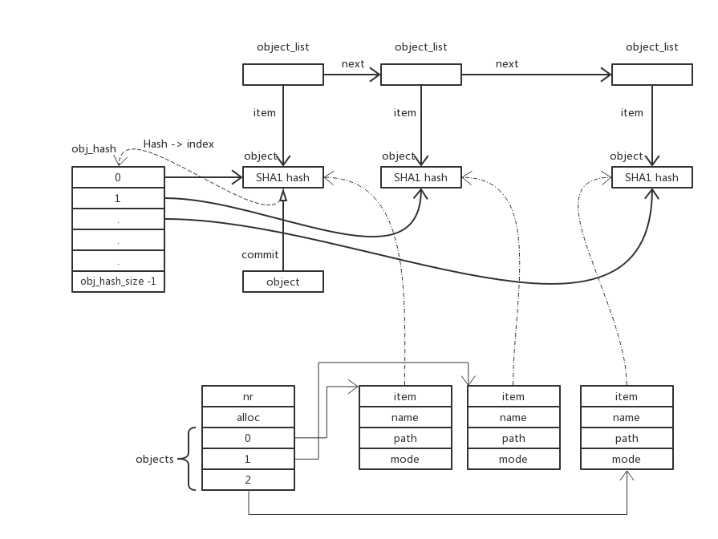

# Object

## 概览



## 详解

### 类型说明

先看 object，关键域为 oid，是 SHA1 Hash 后的字符串。

```C
struct object {
	unsigned parsed : 1;
	unsigned type : TYPE_BITS;
	unsigned flags : FLAG_BITS;
	struct object_id oid;
};
```

object 是其他核心对象的基础属性，其他核心对象通过包含 object 对象，实现部分类似 C++ 的面向对象功能。

object_array 结构

```C
struct object_array {
	unsigned int nr; // 当前 object_array_entry 数量
	unsigned int alloc; // 分配的 object_array_entry 数量
	struct object_array_entry {
		struct object *item;
		char *name;
		char *path;
		unsigned mode;
	} *objects;
};
```

obj_hash: 全局 Object 数组；

obj_hash_size: 必须为 2 的 n 次方；

对象类型预定义：

```C
static const char *object_type_strings[] = {
	NULL,		/* OBJ_NONE = 0 */
	"commit",	/* OBJ_COMMIT = 1 */
	"tree",		/* OBJ_TREE = 2 */
	"blob",		/* OBJ_BLOB = 3 */
	"tag",		/* OBJ_TAG = 4 */
};
```

### 关键代码解释

- SHA1 Hash 转 index

```C
static unsigned int hash_obj(const unsigned char *sha1, unsigned int n)
{
	return sha1hash(sha1) & (n - 1);
}
```

- 新增 Object

```C
static void insert_obj_hash(struct object *obj, struct object **hash, unsigned int size)
{
  // 计算 index
	unsigned int j = hash_obj(obj->oid.hash, size);

  // 如果 index 处，已有其他元素，顺延；调用本方法前，已确保存储空间足够
	while (hash[j]) {
		j++;
		if (j >= size)
			j = 0;
	}
	hash[j] = obj;
}
```

- 查找 Object

```C
// Hash 转 index
first = i = hash_obj(sha1, obj_hash_size);

// 顺序查找
while ((obj = obj_hash[i]) != NULL) {
  // 找到对象
	if (!hashcmp(sha1, obj->oid.hash))
		break;
	i++;
	if (i == obj_hash_size)
		i = 0;
}
if (obj && i != first) {
	// 交换至正确位置，方便下次查找
	SWAP(obj_hash[i], obj_hash[first]);
}
```

- 扩容

```C
int new_hash_size = obj_hash_size < 32 ? 32 : 2 * obj_hash_size;
```

扩容触发时机为容量低于现有对象的 2 倍时

```C
if (obj_hash_size - 1 <= nr_objs * 2)
```

- 对象类型转换

```C
if (obj->type == type) // 类型一致时
	return obj;
else if (obj->type == OBJ_NONE) { // 空对象只能转换为 commit 对象
	if (type == OBJ_COMMIT)
		((struct commit *)obj)->index = alloc_commit_index();
	obj->type = type;
	return obj;
}
```

- object array 过滤

通过下面的函数类型的实例，过滤 object_array 中元素

```C
typedef int (*object_array_each_func_t)(struct object_array_entry *, void *);
```

过滤代码如下：

```C
void object_array_filter(struct object_array *array,
			 object_array_each_func_t want, void *cb_data)
{
	unsigned nr = array->nr, src, dst;
	struct object_array_entry *objects = array->objects;

	// 遍历数组
	for (src = dst = 0; src < nr; src++) {
		if (want(&objects[src], cb_data)) {
			// 交换位置
			if (src != dst)
				objects[dst] = objects[src];

			// 满足条件数量加一
			dst++;
		} else {
			// 不满足条件，释放
			object_array_release_entry(&objects[src]);
		}
	}
	// 调整剩余元素数量
	array->nr = dst;
}
```

- 移除重名对象

```C
void object_array_remove_duplicates(struct object_array *array)
{
	unsigned nr = array->nr, src;
	struct object_array_entry *objects = array->objects;

	// 设置数组长度为 0
	array->nr = 0;

	// 遍历整个数组
	for (src = 0; src < nr; src++) {
		if (!contains_name(array, objects[src].name)) {
			// 满足不重名的部分，不含有重名元素
			if (src != array->nr)
				objects[array->nr] = objects[src];

			// 不重名数组长度加一
			array->nr++;
		} else {
			// 含重名元素，释放
			object_array_release_entry(&objects[src]);
		}
	}
}
```
