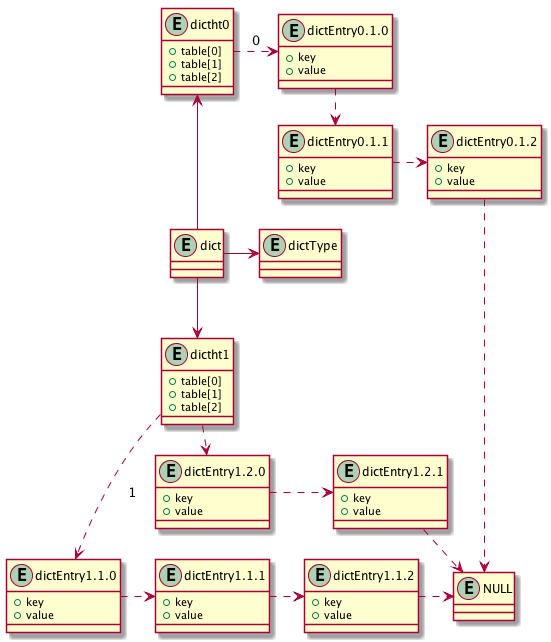

# Dictionary

## 基础数据结构

- dictEntry

存储 key/value。key 可为任意值，value 也可为任意值。注意此处定义中 union 的使用，是 union 的经典使用方法。

结合 dictType 中 hashFunction，next 域的作用应该是冲突解决。由于是链表方式，因此，如果 hash 实现不当，可能存在 Hash-flooding DoS Reloaded 攻击风险。

```C
typedef struct dictEntry {
    void *key;
    union {
        void *val;
        uint64_t u64;
        int64_t s64;
        double d;
    } v;
    struct dictEntry *next;
} dictEntry;
```

- dictType

通过行为定义数据结构，类似于 Go 语言的 interface。

```C
typedef struct dictType {
    uint64_t (*hashFunction)(const void *key);
    void *(*keyDup)(void *privdata, const void *key);
    void *(*valDup)(void *privdata, const void *obj);
    int (*keyCompare)(void *privdata, const void *key1, const void *key2);
    void (*keyDestructor)(void *privdata, void *key);
    void (*valDestructor)(void *privdata, void *obj);
} dictType;
```

- dictht

```C
typedef struct dictht {
    dictEntry **table;
    unsigned long size;
    unsigned long sizemask;
    unsigned long used;
} dictht;
```

- dict

```C
typedef struct dict {
    dictType *type;
    void *privdata;
    dictht ht[2];
    long rehashidx; /* rehashing not in progress if rehashidx == -1 */
    unsigned long iterators; /* number of iterators currently running */
} dict;
```

关系如下图



## 宏定义

```C
// 传入 dict, key, 返回 hash key
#define dictHashKey(d, key) (d)->type->hashFunction(key)

// 传入 dictEntry, 返回 dictEntry 的 key 值
#define dictGetKey(he) ((he)->key)

// 传入 dictEntry, 返回 val
#define dictGetVal(he) ((he)->v.val)

// 传入 dictEntry, 返回 s64
#define dictGetSignedIntegerVal(he) ((he)->v.s64)

// 传入 dictEntry, 返回 u64
#define dictGetUnsignedIntegerVal(he) ((he)->v.u64)

// 传入 dictEntry, 返回 d
#define dictGetDoubleVal(he) ((he)->v.d)

// 传入 dict，返回可用空间
#define dictSlots(d) ((d)->ht[0].size+(d)->ht[1].size)

// 传入 dict，返回已使用的空间
#define dictSize(d) ((d)->ht[0].used+(d)->ht[1].used)

// 传入 dict，返回 dict 是否在 rehashing
#define dictIsRehashing(d) ((d)->rehashidx != -1)

// 设置 dictEntry 的 key 值；
// 如果 keyDup 不为 NULL，key 值为 keyDup 返回值；
// 如果 keyDup 为 NULL，key 值为 __key__
#define dictSetKey(d, entry, _key_) do { \
    if ((d)->type->keyDup) \
        (entry)->key = (d)->type->keyDup((d)->privdata, _key_); \
    else \
        (entry)->key = (_key_); \
} while(0)

// 设置 dictEntry 的 v 值；
// 如果 valDup 不为 NULL，v 值为 valDup 返回值；
// 如果 valDup 为 NULL，v 值为 __val__
#define dictSetVal(d, entry, _val_) do { \
    if ((d)->type->valDup) \
        (entry)->v.val = (d)->type->valDup((d)->privdata, _val_); \
    else \
        (entry)->v.val = (_val_); \
} while(0)
```

## 方法

- dictCreate

```C
dict *dictCreate(dictType *type, void *privDataPtr)
{
	  // 分配 dict 结构基本内存空间
    dict *d = zmalloc(sizeof(*d));

    // 初始化 dict
    _dictInit(d,type,privDataPtr);
    return d;
}
```

- \_dictInit

```C
int _dictInit(dict *d, dictType *type, void *privDataPtr)
{
    _dictReset(&d->ht[0]);
    _dictReset(&d->ht[1]);
    d->type = type;
    d->privdata = privDataPtr;
    d->rehashidx = -1;
    d->iterators = 0;
    return DICT_OK;
}
```

- \_dictNextPower

返回大于等于 size 的第一个 2 的 n 次方数。 

```C
static unsigned long _dictNextPower(unsigned long size)
{
    unsigned long i = DICT_HT_INITIAL_SIZE;

    if (size >= LONG_MAX) return LONG_MAX + 1LU;
    while(1) {
        if (i >= size)
            return i;
        i *= 2;
    }
}
```

- dictExpand

```C
int dictExpand(dict *d, unsigned long size)
{
    dictht n; // 新 hash 表结构

    // 实际分配字节数
    unsigned long realsize = _dictNextPower(size);

    // 当前表需要重 hash 或新 size 不足以容纳已有 key/value 值
    if (dictIsRehashing(d) || d->ht[0].used > size)
        return DICT_ERR;

    // 实际分配条目与已有 key/value 条目数量相等，重排将失去意义
    if (realsize == d->ht[0].size) return DICT_ERR;

    // 初始化新 hash 表
    n.size = realsize;

    // 注意 sizemask 的作用
    n.sizemask = realsize-1;

    // 分配内存
    n.table = zcalloc(realsize*sizeof(dictEntry*));

    // 重置已使用计数
    n.used = 0;

    // 0 号表为空，此时为新建
    if (d->ht[0].table == NULL) {
        d->ht[0] = n;
        return DICT_OK;
    }

    // 1 号表为新建，那么需要重排 0 号表
    d->ht[1] = n;

    // 重排全部 0 号表内容
    d->rehashidx = 0;
    return DICT_OK;
}
```

- dictRehash

```C
// n: 最大执行数
// 返回 1 时，有剩余 key 需要重排；否则返回 0
int dictRehash(dict *d, int n) {
    int empty_visits = n*10; /* Max number of empty buckets to visit. */

    // 没有需要重新 rehash 的索引
    if (!dictIsRehashing(d)) return 0;

    while(n-- && d->ht[0].used != 0) {
        dictEntry *de, *nextde;

        // 确保 rehashidx 不溢出
        assert(d->ht[0].size > (unsigned long)d->rehashidx);

        // 找到第一个需要重排的非空索引，需要注意，table[i] 是链表
        while(d->ht[0].table[d->rehashidx] == NULL) {
            d->rehashidx++;

            // 超出最大空表重排次数
            if (--empty_visits == 0) return 1;
        }

        // 重排当前索引位置的 entry
        de = d->ht[0].table[d->rehashidx];
        
        // 将当前链表内全部元素移至新表中
        while(de) {
            uint64_t h;

           	// 保存下一条目地址，因为在本次修改中会改变 de->next 值
            nextde = de->next;
            
            // 找到在新表中的位置
            h = dictHashKey(d, de->key) & d->ht[1].sizemask;

            // 将 de 指向 entry 放入链表头部
            de->next = d->ht[1].table[h];
            d->ht[1].table[h] = de;

            // 两个 table 计数值刷新
            d->ht[0].used--;
            d->ht[1].used++;

            // 指向老表下一个 entry
            de = nextde;
        }

        // 旧表中链表置空
        d->ht[0].table[d->rehashidx] = NULL;

        // 移向下一个 slot
        d->rehashidx++;
    }

    // 检查是否已处理全部
    if (d->ht[0].used == 0) {
        zfree(d->ht[0].table);

        // 交换
        d->ht[0] = d->ht[1];
        _dictReset(&d->ht[1]);

        // 全部处理完成，rehashidx 置为 -1
        d->rehashidx = -1;
        return 0;
    }

    // 有剩余需要重排的元素
    return 1;
}
```

- dictRehashMilliseconds

```C
int dictRehashMilliseconds(dict *d, int ms) {
	  // 记录开始时间
    long long start = timeInMilliseconds();

    // rehash 次数
    int rehashes = 0;

    while(dictRehash(d,100)) {
        rehashes += 100;

        // 超出给定时间
        if (timeInMilliseconds()-start > ms) break;
    }
    return rehashes;
}
```

- \_dictKeyIndex

```C
static long _dictKeyIndex(dict *d, const void *key, uint64_t hash, dictEntry **existing)
{
    unsigned long idx, table;
    dictEntry *he;

    // 代码保护，防止无意义值出现
    if (existing) *existing = NULL;

    // 扩容
    if (_dictExpandIfNeeded(d) == DICT_ERR)
        return -1;

    // 只有在 rehash 不完全时才会遍历两张表
    // 如果 rehash 完整，ht[1] 为 NULL
    for (table = 0; table <= 1; table++) {
        idx = hash & d->ht[table].sizemask;
        
        // 遍历 idx 下对应链表，查看 key 是否已存在
        he = d->ht[table].table[idx];
        while(he) {
        	  // key 相同或 key 相等时
            if (key==he->key || dictCompareKeys(d, key, he->key)) {
                if (existing) *existing = he;
                return -1;
            }
            he = he->next;
        }

        // 如果不需要 rehash，直接跳出，因为 ht[1] 此时为 NULL
        if (!dictIsRehashing(d)) break;
    }
    return idx;
}
```

- dictAddRaw

```C
dictEntry *dictAddRaw(dict *d, void *key, dictEntry **existing)
{
    long index;
    dictEntry *entry;
    dictht *ht;

    // 如果需要 rehash，执行一步，腾出一个空间
    if (dictIsRehashing(d)) _dictRehashStep(d);

    // key 是否已存在
    if ((index = _dictKeyIndex(d, key, dictHashKey(d,key), existing)) == -1)
        return NULL;

    // 如果正在 rehash，从 ht[1] 中分配空间；否则，rehash 可能出错，因为 key 对应的 idx 可能小于 rehashidx
    ht = dictIsRehashing(d) ? &d->ht[1] : &d->ht[0];

    // 分配内存
    entry = zmalloc(sizeof(*entry));

    // 将 entry 放入 index 处链表头部
    entry->next = ht->table[index];
    ht->table[index] = entry;

    // 刷新使用计数
    ht->used++;

    // 设置 entry 的 key
    dictSetKey(d, entry, key);
    return entry;
}
```

- dictAdd

添加一个 key/value 对

```C
int dictAdd(dict *d, void *key, void *val)
{
    dictEntry *entry = dictAddRaw(d,key,NULL);

    if (!entry) return DICT_ERR;

    // 设置 value
    dictSetVal(d, entry, val);
    return DICT_OK;
}
```

- dictReplace

```C
int dictReplace(dict *d, void *key, void *val)
{
    dictEntry *entry, *existing, auxentry;

    // 尝试添加新记录
    entry = dictAddRaw(d,key,&existing);

    // 添加成功，说明记录不存在
    if (entry) {
    	  // 设置记录值
        dictSetVal(d, entry, val);
        return 1;
    }

    // 保存旧记录
    auxentry = *existing;

    // 设置新值
    dictSetVal(d, existing, val);

    // 释放旧值；因为值可能是由 valDup 生成的
    dictFreeVal(d, &auxentry);
    return 0;
}
```

- dictAddOrFind

```C
dictEntry *dictAddOrFind(dict *d, void *key) {
    dictEntry *entry, *existing;

    // 尝试添加新记录
    entry = dictAddRaw(d,key,&existing);

    // 添加成功，则返回新记录；失败，则返回已存在值
    return entry ? entry : existing;
}
```

- dictGenericDelete

删除 key 对应的记录

```C
static dictEntry *dictGenericDelete(dict *d, const void *key, int nofree) {
    uint64_t h, idx;
    dictEntry *he, *prevHe;
    int table;

    // 无记录，直接返回
    if (d->ht[0].used == 0 && d->ht[1].used == 0) return NULL;

    if (dictIsRehashing(d)) _dictRehashStep(d);

    // 生成 key 的 hash 值
    h = dictHashKey(d, key);

    for (table = 0; table <= 1; table++) {
        idx = h & d->ht[table].sizemask;
        he = d->ht[table].table[idx];
        prevHe = NULL;
        while(he) {
        	  // 找到需要删除的元素
            if (key==he->key || dictCompareKeys(d, key, he->key)) {
            	  // 从链表中移除元素
                if (prevHe)
                    prevHe->next = he->next;
                else
                    d->ht[table].table[idx] = he->next;

                // 需要删除
                if (!nofree) {
                    dictFreeKey(d, he);
                    dictFreeVal(d, he);
                    zfree(he);
                }

                // 刷新使用计数
                d->ht[table].used--;

                // 返回删除的元素
                return he;
            }

            // 指向下一个元素
            prevHe = he;
            he = he->next;
        }
        if (!dictIsRehashing(d)) break;
    }
    return NULL; /* not found */
}
```

- \_dictClear

```C
int _dictClear(dict *d, dictht *ht, void(callback)(void *)) {
    unsigned long i;

    // 释放全部记录
    for (i = 0; i < ht->size && ht->used > 0; i++) {
        dictEntry *he, *nextHe;

        if (callback && (i & 65535) == 0) callback(d->privdata);

        // 当前位置无记录
        if ((he = ht->table[i]) == NULL) continue;

        // 释放当前链表
        while(he) {
            nextHe = he->next;
            dictFreeKey(d, he);
            dictFreeVal(d, he);
            zfree(he);
            ht->used--;
            he = nextHe;
        }
    }
    // 释放 hash 表内部使用的内存
    zfree(ht->table);
    
    // 重置 hash 表
    _dictReset(ht);
    return DICT_OK; /* never fails */
}
```

- dictFind

```C
dictEntry *dictFind(dict *d, const void *key)
{
    dictEntry *he;
    uint64_t h, idx, table;

    if (d->ht[0].used + d->ht[1].used == 0) return NULL; /* dict is empty */

    if (dictIsRehashing(d)) _dictRehashStep(d);

    // 计算 hash 值
    h = dictHashKey(d, key);
    for (table = 0; table <= 1; table++) {
        idx = h & d->ht[table].sizemask;
        he = d->ht[table].table[idx];
        while(he) {
            if (key==he->key || dictCompareKeys(d, key, he->key))
                return he;
            he = he->next;
        }

        // ht[1] 为空
        if (!dictIsRehashing(d)) return NULL;
    }
    return NULL;
}
```

## 迭代器

- 定义

```C
typedef struct dictIterator {
    dict *d;
    long index;
    int table, safe;
    dictEntry *entry, *nextEntry;

    // fingerprint 用于检查非安全的迭代器是否执行了非法操作；
    // 迭代器创建时，计算该值；迭代完毕后，再次计算，如果两次结果不一致，那么一定是执行了非法操作
    long long fingerprint;
} dictIterator;
```

- dictGetIterator

```C
dictIterator *dictGetIterator(dict *d)
{
	  // 分配内存
    dictIterator *iter = zmalloc(sizeof(*iter));

    // 初始化
    iter->d = d;

    // 从 0 号表开始遍历
    iter->table = 0;

    // 索引为 -1
    iter->index = -1;
    iter->safe = 0;
    iter->entry = NULL;
    iter->nextEntry = NULL;
    return iter;
}
```

- dictNext

```C
dictEntry *dictNext(dictIterator *iter)
{
    while (1) {
    	  // 当前没有指向任何 entry，尝试找到第一个
        if (iter->entry == NULL) {
        	  // 选定 hash 表
            dictht *ht = &iter->d->ht[iter->table];

            // 首次迭代
            if (iter->index == -1 && iter->table == 0) {
                if (iter->safe)
                    iter->d->iterators++; // 是安全的，那么刷新 dict 中迭代器计数
                else
                    iter->fingerprint = dictFingerprint(iter->d); // 不安全，计算 fingerprint 值
            }

            // 指向下一个 hash 值
            iter->index++;

            // hash 值越界
            if (iter->index >= (long) ht->size) {
            	  // dict 正在 rehash，且当期使用的是 0 号表，切换至 1 号表
                if (dictIsRehashing(iter->d) && iter->table == 0) {
                    iter->table++;
                    iter->index = 0;
                    ht = &iter->d->ht[1];
                } else {
                	  // 迭代完毕
                    break;
                }
            }

            // 指向当前 hash 值的首个元素；可能为 NULL
            iter->entry = ht->table[iter->index];
        } else {
        	  // 当前 entry 不为空，则处于某个链表中，直接指向下一个；结果可能为 NULL
            iter->entry = iter->nextEntry;
        }

        // 当前找到元素不为 NULL
        if (iter->entry) {
        	  // 记录下一元素
            iter->nextEntry = iter->entry->next;

            // 返回当前元素
            return iter->entry;
        }
    }
    return NULL;
}
```

- dictReleaseIterator

```C
void dictReleaseIterator(dictIterator *iter)
{
	  // 迭代器已启用
    if (!(iter->index == -1 && iter->table == 0)) {
        if (iter->safe)
            iter->d->iterators--;
        else
            assert(iter->fingerprint == dictFingerprint(iter->d));
    }
    zfree(iter);
}
```

## References

- [Hash-flooding DoS Reloaded](http://emboss.github.io/blog/2012/12/14/breaking-murmur-hash-flooding-dos-reloaded/)
- [SipHash](https://en.wikipedia.org/wiki/SipHash)
- [Iterator Pattern](https://en.wikipedia.org/wiki/Iterator_pattern)
