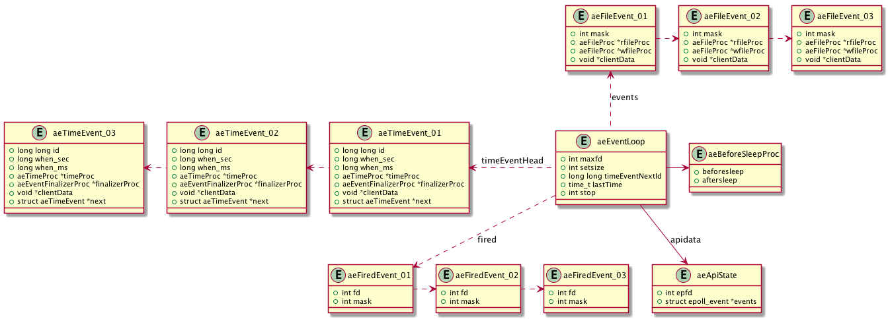

# Event Loop

## 概览

事件驱动编程(Event Driven Programming) 是一种处理高并发的异步编程模式。对于等待时间较久，但处理时间相对短的情形，尤其适用。

在 Redis 中，为了跨平台，支持了 [Epoll](https://en.wikipedia.org/wiki/Epoll), [Kqueue](https://en.wikipedia.org/wiki/Kqueue), [Evport](https://en.wikipedia.org/wiki/Libevent), [Select](https://en.wikipedia.org/wiki/Berkeley_sockets) 四种异步模式。在本章中，我们基于 Epoll 来分析事件循环。

数据结构概览图



## Event Loop 方法

### File Event

- aeCreateEventLoop

```C
aeEventLoop *aeCreateEventLoop(int setsize) {
    aeEventLoop *eventLoop;
    int i;

    // 分配内存空间
    if ((eventLoop = zmalloc(sizeof(*eventLoop))) == NULL) goto err;

    // 分配事件内存空间
    eventLoop->events = zmalloc(sizeof(aeFileEvent)*setsize);
    // 分配已触发事件内存空间
    eventLoop->fired = zmalloc(sizeof(aeFiredEvent)*setsize);
    if (eventLoop->events == NULL || eventLoop->fired == NULL) goto err;

    // 记录 event 可用数量
    eventLoop->setsize = setsize;

    // 获取当前时间
    eventLoop->lastTime = time(NULL);
    eventLoop->timeEventHead = NULL;
    eventLoop->timeEventNextId = 0;
    eventLoop->stop = 0;
    eventLoop->maxfd = -1;
    eventLoop->beforesleep = NULL;
    eventLoop->aftersleep = NULL;

    // 创建 event state
    if (aeApiCreate(eventLoop) == -1) goto err;
    
    // 没有关联事件
    for (i = 0; i < setsize; i++)
        eventLoop->events[i].mask = AE_NONE;
    return eventLoop;

err:
    if (eventLoop) {
        zfree(eventLoop->events);
        zfree(eventLoop->fired);
        zfree(eventLoop);
    }
    return NULL;
}
```

- aeResizeSetSize

调整注册事件的空间

```C
int aeResizeSetSize(aeEventLoop *eventLoop, int setsize) {
    int i;

    if (setsize == eventLoop->setsize) return AE_OK;
    // 空间不足够容纳当前全部 file descriptor
    if (eventLoop->maxfd >= setsize) return AE_ERR;

    // 调整底层事件存储空间
    if (aeApiResize(eventLoop,setsize) == -1) return AE_ERR;

    eventLoop->events = zrealloc(eventLoop->events,sizeof(aeFileEvent)*setsize);
    eventLoop->fired = zrealloc(eventLoop->fired,sizeof(aeFiredEvent)*setsize);
    eventLoop->setsize = setsize;

    // 多余空间暂不关联任何事件
    for (i = eventLoop->maxfd+1; i < setsize; i++)
        eventLoop->events[i].mask = AE_NONE;
    return AE_OK;
}
```

- aeDeleteEventLoop

```C
void aeDeleteEventLoop(aeEventLoop *eventLoop) {
    // 释放底层存储
    aeApiFree(eventLoop);
    // 释放全部内存
    zfree(eventLoop->events);
    zfree(eventLoop->fired);
    zfree(eventLoop);
}
```

- aeCreateFileEvent

关联文件句柄与事件

```C
int aeCreateFileEvent(aeEventLoop *eventLoop, int fd, int mask, aeFileProc *proc, void *clientData)
{
    // 文件描述符超过事件循环可保留的句柄数量
    if (fd >= eventLoop->setsize) {
        errno = ERANGE;
        return AE_ERR;
    }

    // 获取对应的 File Event 结构
    aeFileEvent *fe = &eventLoop->events[fd];

    // 底层事件处理关联事件
    if (aeApiAddEvent(eventLoop, fd, mask) == -1)
        return AE_ERR;

    // 设置事件类型
    fe->mask |= mask;

    // 设置读、写回调方法
    if (mask & AE_READABLE) fe->rfileProc = proc;
    if (mask & AE_WRITABLE) fe->wfileProc = proc;

    // 保存事件特有数据
    fe->clientData = clientData;

    // 刷新最大句柄值
    if (fd > eventLoop->maxfd)
        eventLoop->maxfd = fd;
    return AE_OK;
}
```

- aeDeleteFileEvent

```C
void aeDeleteFileEvent(aeEventLoop *eventLoop, int fd, int mask)
{
    if (fd >= eventLoop->setsize) return;
    aeFileEvent *fe = &eventLoop->events[fd];

    // 没有关联任何事件
    if (fe->mask == AE_NONE) return;

    // 如果关联了写操作，设置 barrier
    if (mask & AE_WRITABLE) mask |= AE_BARRIER;

    // 底层事件移除关联
    aeApiDelEvent(eventLoop, fd, mask);

    // 清理事件关联
    fe->mask = fe->mask & (~mask);
    if (fd == eventLoop->maxfd && fe->mask == AE_NONE) {
        int j;

        // 更新最大文件句柄值
        for (j = eventLoop->maxfd-1; j >= 0; j--)
            if (eventLoop->events[j].mask != AE_NONE) break;
        eventLoop->maxfd = j;
    }
}
```

- aeProcessEvents

```C
int aeProcessEvents(aeEventLoop *eventLoop, int flags)
{
    int processed = 0, numevents;

    // 没有需要处理的事件
    if (!(flags & AE_TIME_EVENTS) && !(flags & AE_FILE_EVENTS)) return 0;

    // 有关联句柄
    // 或设置了 Time Event 处理并且没有设置 AE_DONT_WAIT
    if (eventLoop->maxfd != -1 ||
        ((flags & AE_TIME_EVENTS) && !(flags & AE_DONT_WAIT))) {
        int j;
        aeTimeEvent *shortest = NULL;
        struct timeval tv, *tvp;

        // 优先处理 time event
        if (flags & AE_TIME_EVENTS && !(flags & AE_DONT_WAIT))
            shortest = aeSearchNearestTimer(eventLoop);

        if (shortest) {
            long now_sec, now_ms;

            aeGetTime(&now_sec, &now_ms);
            tvp = &tv;

            // 计算最近的 time event 触发还需要的时间
            long long ms =
                (shortest->when_sec - now_sec)*1000 +
                shortest->when_ms - now_ms;

            if (ms > 0) {
                tvp->tv_sec = ms/1000;
                tvp->tv_usec = (ms % 1000)*1000;
            } else {
                // 已经触发
                tvp->tv_sec = 0;
                tvp->tv_usec = 0;
            }
        } else {
            if (flags & AE_DONT_WAIT) {
                // 如果设置了尽快返回，不等待
                tv.tv_sec = tv.tv_usec = 0;
                tvp = &tv;
            } else {
                // 一直等待，直到触发
                tvp = NULL;
            }
        }

        // 根据 time event 情况，决定等待的时间
        numevents = aeApiPoll(eventLoop, tvp);

        // 等待结束，触发 aftersleep 方法
        if (eventLoop->aftersleep != NULL && flags & AE_CALL_AFTER_SLEEP)
            eventLoop->aftersleep(eventLoop);

        // 处理事件，如果有
        for (j = 0; j < numevents; j++) {
            // 获取触发事件的内容
            aeFileEvent *fe = &eventLoop->events[eventLoop->fired[j].fd];
            int mask = eventLoop->fired[j].mask;
            int fd = eventLoop->fired[j].fd;
            int fired = 0;

            // 是否设置了 barrier
            int invert = fe->mask & AE_BARRIER;

            // 没有设置 barrier，优先处理读事件
            if (!invert && fe->mask & mask & AE_READABLE) {
                fe->rfileProc(eventLoop,fd,fe->clientData,mask);
                fired++;
            }

            // 处理写事件
            if (fe->mask & mask & AE_WRITABLE) {
                if (!fired || fe->wfileProc != fe->rfileProc) {
                    fe->wfileProc(eventLoop,fd,fe->clientData,mask);
                    fired++;
                }
            }

            // 如果读事件被延迟执行，在此执行
            if (invert && fe->mask & mask & AE_READABLE) {
                if (!fired || fe->wfileProc != fe->rfileProc) {
                    fe->rfileProc(eventLoop,fd,fe->clientData,mask);
                    fired++;
                }
            }

            // 刷新处理文件句柄数
            processed++;
        }
    }

    // 处理 time event
    if (flags & AE_TIME_EVENTS)
        processed += processTimeEvents(eventLoop);

    return processed;
}
```

### Time Event

定时任务是一个单向链表，无序。注意实现时，由于遍历不可避免，因此，在删除无效节点时，并没有马上删除，而是标记为无效，在下次循环处理事件时一并清理。

- aeCreateTimeEvent

```C
long long aeCreateTimeEvent(aeEventLoop *eventLoop, long long milliseconds,
        aeTimeProc *proc, void *clientData,
        aeEventFinalizerProc *finalizerProc)
{
    // 获取 time event ID
    long long id = eventLoop->timeEventNextId++;
    aeTimeEvent *te;

    te = zmalloc(sizeof(*te));
    if (te == NULL) return AE_ERR;

    te->id = id;
    // 设置超时时间
    aeAddMillisecondsToNow(milliseconds,&te->when_sec,&te->when_ms);
    te->timeProc = proc;
    te->finalizerProc = finalizerProc;
    te->clientData = clientData;

    // 放入 time event 链表头部
    te->next = eventLoop->timeEventHead;
    eventLoop->timeEventHead = te;
    return id;
}
```

- aeDeleteTimeEvent

```C
int aeDeleteTimeEvent(aeEventLoop *eventLoop, long long id)
{
    aeTimeEvent *te = eventLoop->timeEventHead;

    // 遍历链表
    while(te) {
        // 找到了该 id
        if (te->id == id) {
            // 标记为删除
            te->id = AE_DELETED_EVENT_ID;
            return AE_OK;
        }
        te = te->next;
    }

    // id 不存在
    return AE_ERR;
}
```

- processTimeEvents

```C
static int processTimeEvents(aeEventLoop *eventLoop) {
    int processed = 0;
    aeTimeEvent *te, *prev;
    long long maxId;
    time_t now = time(NULL);

    // 当前时间被回拨，触发所有 time event
    if (now < eventLoop->lastTime) {
        te = eventLoop->timeEventHead;
        while(te) {
            te->when_sec = 0;
            te = te->next;
        }
    }
    // 记录最后处理时间
    eventLoop->lastTime = now;

    // 为移除无效节点做准备
    prev = NULL;
    te = eventLoop->timeEventHead;

    // 获取当前最大 id
    maxId = eventLoop->timeEventNextId-1;
    while(te) {
        long now_sec, now_ms;
        long long id;

        // 移除无效节点
        if (te->id == AE_DELETED_EVENT_ID) {
            aeTimeEvent *next = te->next;
            if (prev == NULL)
                eventLoop->timeEventHead = te->next;
            else
                prev->next = te->next;
            if (te->finalizerProc)
                te->finalizerProc(eventLoop, te->clientData);
            zfree(te);
            te = next;
            continue;
        }

        // 如果成立，那说明，在调用本函数时，有新节点加入
        if (te->id > maxId) {
            te = te->next;
            continue;
        }

        // 获取当前时间
        aeGetTime(&now_sec, &now_ms);

        // 任务被触发
        if (now_sec > te->when_sec ||
            (now_sec == te->when_sec && now_ms >= te->when_ms))
        {
            int retval;

            id = te->id;
            retval = te->timeProc(eventLoop, id, te->clientData);
            processed++;

            // 还需要再此处理
            if (retval != AE_NOMORE) {
                aeAddMillisecondsToNow(retval,&te->when_sec,&te->when_ms);
            } else {
                // 处理完成，标记为失效，下次循环会被移除
                te->id = AE_DELETED_EVENT_ID;
            }
        }
        prev = te;
        te = te->next;
    }
    return processed;
}
```

## Epoll 事件处理

- aeApiCreate

```C
static int aeApiCreate(aeEventLoop *eventLoop) {
    // state 内存分配
    aeApiState *state = zmalloc(sizeof(aeApiState));
    if (!state) return -1;

    // 预留 events 空间，根据 eventLoop 的 setsize 决定
    state->events = zmalloc(sizeof(struct epoll_event)*eventLoop->setsize);
    if (!state->events) {
        zfree(state);
        return -1;
    }
    state->epfd = epoll_create(1024); /* 1024 is just a hint for the kernel */
    if (state->epfd == -1) {
        zfree(state->events);
        zfree(state);
        return -1;
    }

    // event loop 关联 epoll 的 state
    eventLoop->apidata = state;
    return 0;
}
```

- aeApiResize

```C
static int aeApiResize(aeEventLoop *eventLoop, int setsize) {
    aeApiState *state = eventLoop->apidata;

    state->events = zrealloc(state->events, sizeof(struct epoll_event)*setsize);
    return 0;
}
```

- aeApiFree

```C
static void aeApiFree(aeEventLoop *eventLoop) {
    aeApiState *state = eventLoop->apidata;

    close(state->epfd);
    zfree(state->events);
    zfree(state);
}
```

- aeApiAddEvent

```C
static int aeApiAddEvent(aeEventLoop *eventLoop, int fd, int mask) {
    aeApiState *state = eventLoop->apidata;
    struct epoll_event ee = {0};
    
    // 根据当前状态决定是添加还是修改
    int op = eventLoop->events[fd].mask == AE_NONE ?
            EPOLL_CTL_ADD : EPOLL_CTL_MOD;

    ee.events = 0;

    // 设置 EPOLL flags
    mask |= eventLoop->events[fd].mask;
    if (mask & AE_READABLE) ee.events |= EPOLLIN;
    if (mask & AE_WRITABLE) ee.events |= EPOLLOUT;
    ee.data.fd = fd;
    if (epoll_ctl(state->epfd,op,fd,&ee) == -1) return -1;
    return 0;
}
```

- aeApiDelEvent

```C
static void aeApiDelEvent(aeEventLoop *eventLoop, int fd, int delmask) {
    aeApiState *state = eventLoop->apidata;
    struct epoll_event ee = {0};

    // 清除 mask
    int mask = eventLoop->events[fd].mask & (~delmask);

    ee.events = 0;
    if (mask & AE_READABLE) ee.events |= EPOLLIN;
    if (mask & AE_WRITABLE) ee.events |= EPOLLOUT;
    ee.data.fd = fd;

    if (mask != AE_NONE) {
        // 调整关联事件
        epoll_ctl(state->epfd,EPOLL_CTL_MOD,fd,&ee);
    } else {
        // 移除关联
        epoll_ctl(state->epfd,EPOLL_CTL_DEL,fd,&ee);
    }
}
```

- aeApiPoll

```C
static int aeApiPoll(aeEventLoop *eventLoop, struct timeval *tvp) {
    aeApiState *state = eventLoop->apidata;
    int retval, numevents = 0;

    // 执行 wait 操作
    retval = epoll_wait(state->epfd,state->events,eventLoop->setsize,
            tvp ? (tvp->tv_sec*1000 + tvp->tv_usec/1000) : -1);
    if (retval > 0) {
        // 有事件发生
        int j;

        numevents = retval;
        for (j = 0; j < numevents; j++) {
            int mask = 0;
            struct epoll_event *e = state->events+j;

            if (e->events & EPOLLIN) mask |= AE_READABLE;
            if (e->events & EPOLLOUT) mask |= AE_WRITABLE;
            if (e->events & EPOLLERR) mask |= AE_WRITABLE;
            if (e->events & EPOLLHUP) mask |= AE_WRITABLE;
            eventLoop->fired[j].fd = e->data.fd;
            eventLoop->fired[j].mask = mask;
        }
    }
    return numevents;
}
```

## References

- [Event Driver Programming](https://en.wikipedia.org/wiki/Event-driven_programming)
- [Epoll](https://en.wikipedia.org/wiki/Epoll)
- [Kqueue](https://en.wikipedia.org/wiki/Kqueue)
- [Evport](https://en.wikipedia.org/wiki/Libevent)
- [Select](https://en.wikipedia.org/wiki/Berkeley_sockets)
