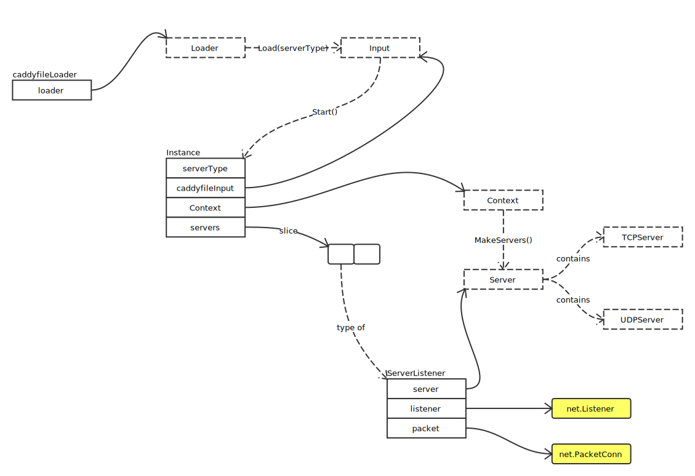

# Caddy

## Overview



Instance 创建过程：


### 关键接口定义

- TCPServer

```go
type TCPServer interface {
	// 监听
	Listen() (net.Listener, error)

	// 处理
	Serve(net.Listener) error
}
```

- UDPServer

```go
type UDPServer interface {
	// 监听
	ListenPacket() (net.PacketConn, error)

	// 处理
	ServePacket(net.PacketConn) error
}
```

- Stopper

```go
type Stopper interface {
	// 关闭
	Stop() error
}
```

- GracefulServer

```go
type GracefulServer interface {
	Server
	Stopper

	Address() string
}
```

- Listener

```go
type Listener interface {
	net.Listener

	// 低层文件描述符
	File() (*os.File, error)
}
```

- PacketConn

```go
type PacketConn interface {
	net.PacketConn
	File() (*os.File, error)
}
```

### 启动服务器

发送 StartupEvent，详细内容请参照 [Events](events.md)

```go
// Executes Startup events
caddy.EmitEvent(caddy.StartupEvent, nil)
```

读取配置文件：

```go
caddyfileinput, err := caddy.LoadCaddyfile(serverType)
```

启动：

```go
instance, err := caddy.Start(caddyfileinput)
```

发送 InstanceStartupEvent：

```go
caddy.EmitEvent(caddy.InstanceStartupEvent, instance)
```

caddy.Start 流程图如下：


