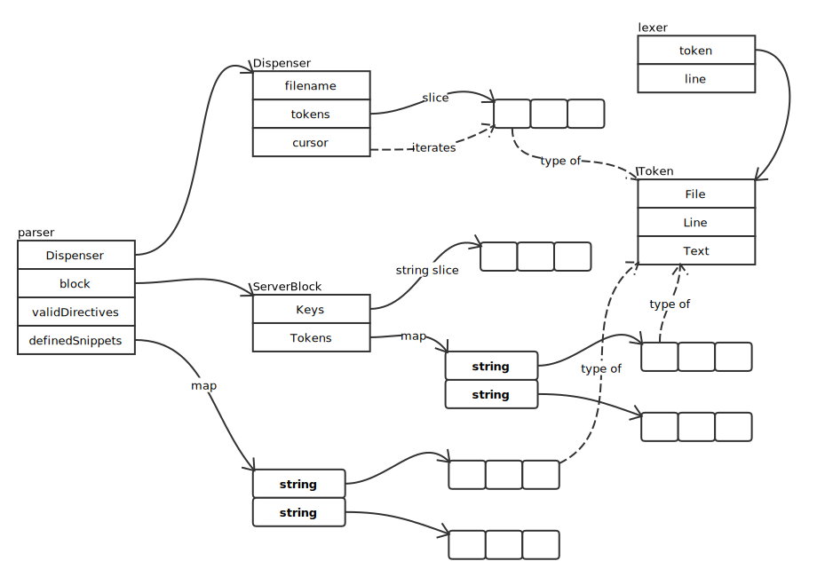

# Loader

## parser



### 词法分析

词法分析代码如下：

```go
func allTokens(input io.Reader) ([]Token, error) {
	l := new(lexer)
	err := l.load(input)
	if err != nil {
		return nil, err
	}
	var tokens []Token
	for l.next() {
		tokens = append(tokens, l.token)
	}
	return tokens, nil
}
```

关键方法为 next():

```go
func (l *lexer) next() bool {
	var val []rune
	var comment, quoted, escaped bool

	makeToken := func() bool {
		l.token.Text = string(val)
		return true
	}

	for {
		ch, _, err := l.reader.ReadRune()
		if err != nil {
			if len(val) > 0 {
				return makeToken()
			}
			if err == io.EOF {
				return false
			}
			panic(err)
		}

		if quoted {
			if !escaped {
				if ch == '\\' {
					escaped = true
					continue
				} else if ch == '"' {
					quoted = false
					return makeToken()
				}
			}
			if ch == '\n' {
				l.line++
			}
			if escaped {
				// only escape quotes
				if ch != '"' {
					val = append(val, '\\')
				}
			}
			val = append(val, ch)
			escaped = false
			continue
		}

		if unicode.IsSpace(ch) {
			if ch == '\r' {
				continue
			}
			if ch == '\n' {
				l.line++
				comment = false
			}
			if len(val) > 0 {
				return makeToken()
			}
			continue
		}

		if ch == '#' {
			comment = true
		}

		if comment {
			continue
		}

		if len(val) == 0 {
			l.token = Token{Line: l.line}
			if ch == '"' {
				quoted = true
				continue
			}
		}

		val = append(val, ch)
	}
}
```
