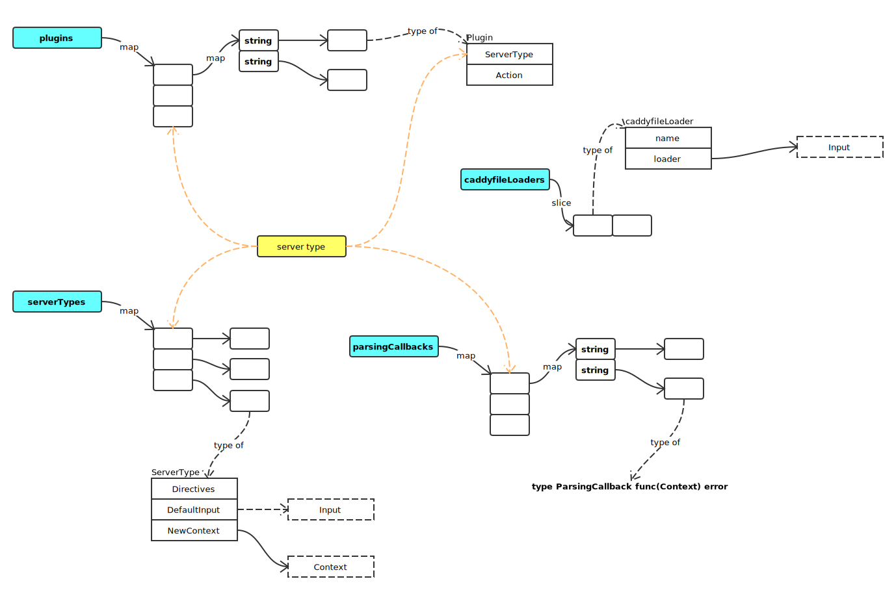

# Plugin

## 概览

```go
var (
	// serverTypes is a map of registered server types.
	serverTypes = make(map[string]ServerType)

	// plugins is a map of server type to map of plugin name to
	// Plugin. These are the "general" plugins that may or may
	// not be associated with a specific server type. If it's
	// applicable to multiple server types or the server type is
	// irrelevant, the key is empty string (""). But all plugins
	// must have a name.
	plugins = make(map[string]map[string]Plugin)

	// eventHooks is a map of hook name to Hook. All hooks plugins
	// must have a name.
	eventHooks = &sync.Map{}

	// parsingCallbacks maps server type to map of directive
	// to list of callback functions. These aren't really
	// plugins on their own, but are often registered from
	// plugins.
	parsingCallbacks = make(map[string]map[string][]ParsingCallback)

	// caddyfileLoaders is the list of all Caddyfile loaders
	// in registration order.
	caddyfileLoaders []caddyfileLoader
)
```

简图如下：


