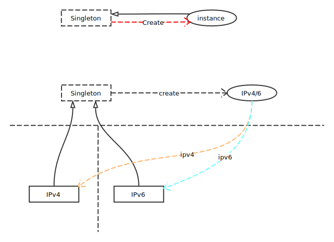
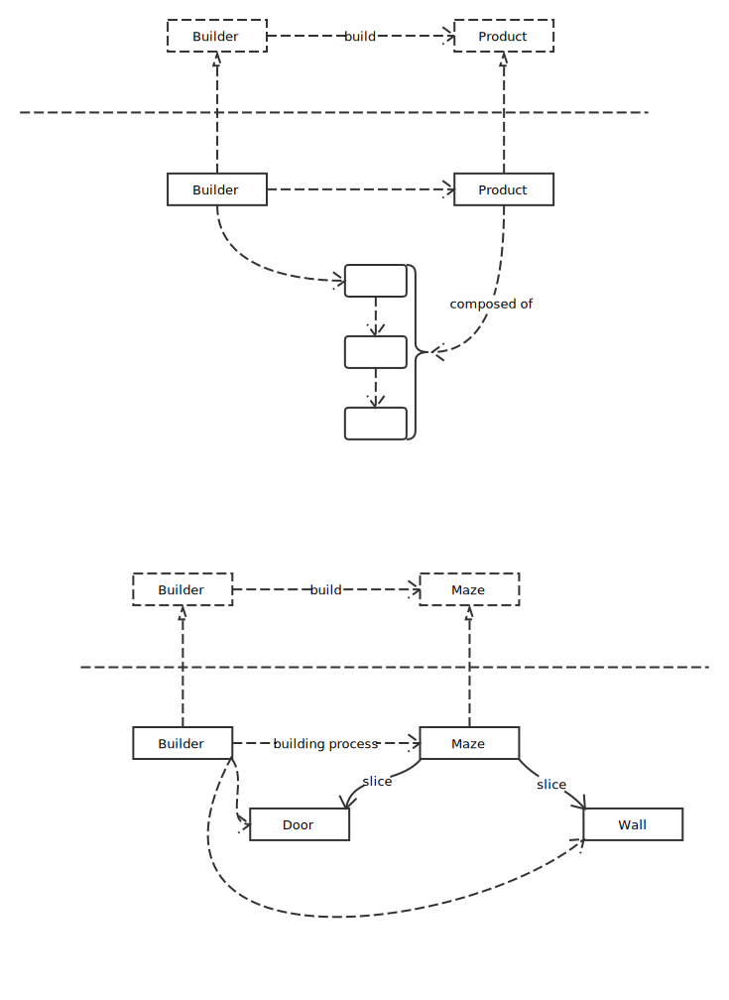
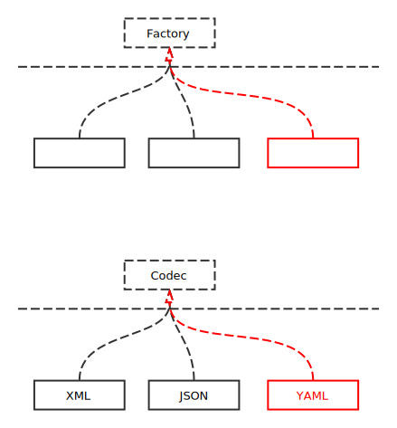
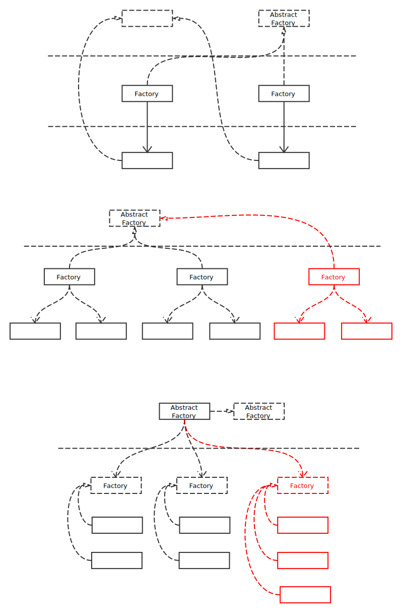
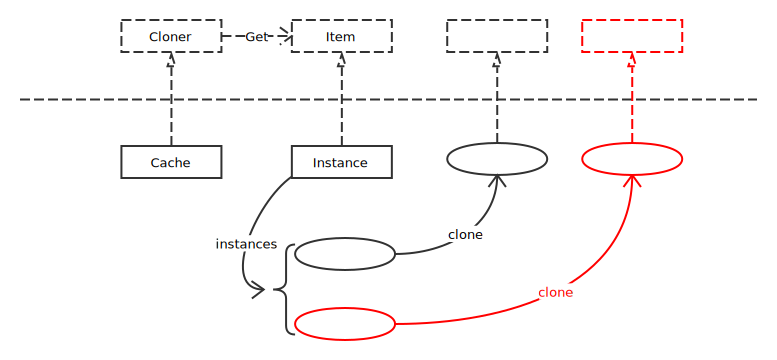

# Creational Patterns

## Singleton Pattern

全局唯一

## Builder Pattern

创建过程相同

## Factory Pattern

对象实现相同接口，不关心对象内部实现

## Abstract Factory

创建不同工厂，工厂创建各自实例

## Prototype Factory

通过复制原型创建实例，减小创建复杂实例时的开销

