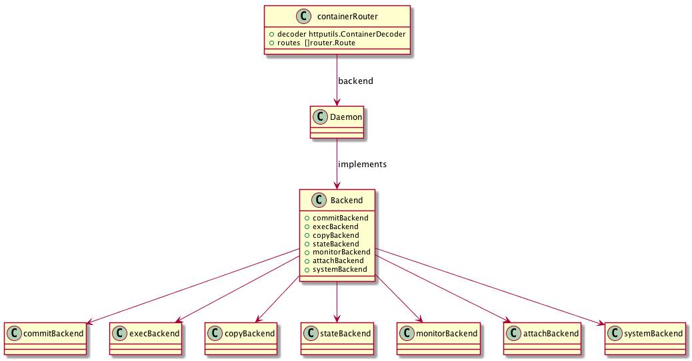
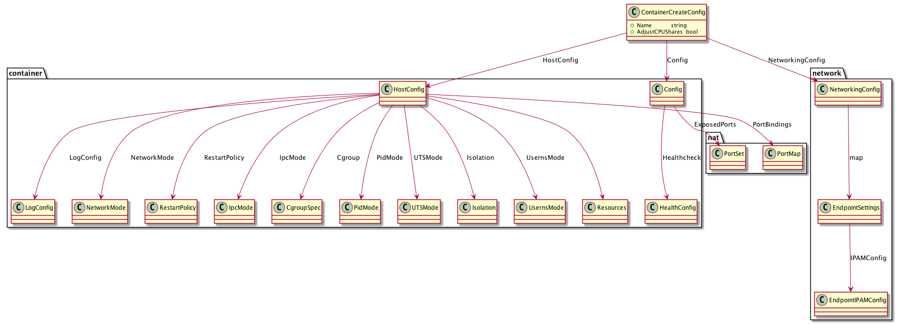
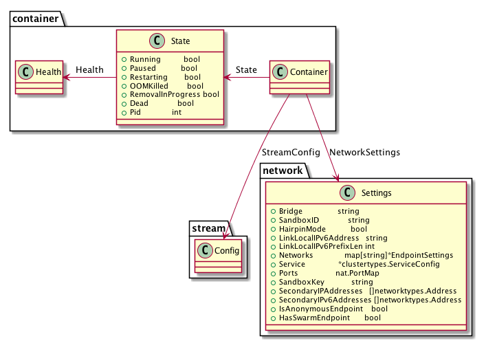

# Container Management

## Container 路由注册

查看 initRouter：

```go
routers := []router.Router{
	container.NewRouter(opts.daemon, decoder),
}
```

然后查看 opts 产生代码 newRouterOptions:

```go
return routerOptions{
	sessionManager: sm,
	buildBackend:   bb,
	buildCache:     buildCache,
	daemon:         daemon,
}, nil
```

可以看出，dockerd 本身就是 Container 服务提供者。整体结构如下：



## 情景分析

### 创建容器

根据路由条目：

```go
router.NewPostRoute("/containers/create", r.postContainersCreate),
```

可知，创建容器由方法 postContainersCreate 执行，代码如下：

```go
// 从 POST 请求 Body 中，获取配置文件
config, hostConfig, networkingConfig, err := s.decoder.DecodeConfig(r.Body)

// ...

// 创建容器
ccr, err := s.backend.ContainerCreate(types.ContainerCreateConfig{
	Name:             name,
	Config:           config,
	HostConfig:       hostConfig,
	NetworkingConfig: networkingConfig,
	AdjustCPUShares:  adjustCPUShares,
})
```

从路由注册中，我们知道，s.backend 是 Daemon 本身，因此，只要找到 Daemon 对应的方法即可：

```go
// daemon/create.go
func (daemon *Daemon) ContainerCreate(params types.ContainerCreateConfig) (containertypes.ContainerCreateCreatedBody, error) {
	return daemon.containerCreate(params, false)
}
```

不难看出，核心代码应该在 containerCreate 方法中：

```go
func (daemon *Daemon) containerCreate(params types.ContainerCreateConfig, managed bool) (containertypes.ContainerCreateCreatedBody, error) {
	start := time.Now()
	// ...

	// 获取 os
	os := runtime.GOOS
	if params.Config.Image != "" {
		img, err := daemon.imageService.GetImage(params.Config.Image)
		if err == nil {
			os = img.OS
		}
	} else {
		if runtime.GOOS == "windows" && system.LCOWSupported() {
			os = "linux"
		}
	}

	// 检查容器配置
	warnings, err := daemon.verifyContainerSettings(os, params.HostConfig, params.Config, false)

	// 检查网络配置
	err = verifyNetworkingConfig(params.NetworkingConfig)

	// 调整参数
	err = daemon.adaptContainerSettings(params.HostConfig, params.AdjustCPUShares)

	// 创建容器
	container, err := daemon.create(params, managed)

	// 记录创建时间
	containerActions.WithValues("create").UpdateSince(start)

	return containertypes.ContainerCreateCreatedBody{ID: container.ID, Warnings: warnings}, nil
}
```

配置文件结构如下图：



接下来，我们继续看真正的容器创建函数 create，第一步，获取 os 和镜像：

```go
os := runtime.GOOS
if params.Config.Image != "" {
	img, err = daemon.imageService.GetImage(params.Config.Image)
	if err != nil {
		return nil, err
	}
	if img.OS != "" {
		os = img.OS
	} else {
		// default to the host OS except on Windows with LCOW
		if runtime.GOOS == "windows" && system.LCOWSupported() {
			os = "linux"
		}
	}
	imgID = img.ID()

	if runtime.GOOS == "windows" && img.OS == "linux" && !system.LCOWSupported() {
		return nil, errors.New("operating system on which parent image was created is not Windows")
	}
} else {
	if runtime.GOOS == "windows" {
		os = "linux" // 'scratch' case.
	}
}
```

合并用户提供的容器配置与镜像提供的容器配置：

```go
if err := daemon.mergeAndVerifyConfig(params.Config, img); err != nil {
	return nil, errdefs.InvalidParameter(err)
}
```

创建容器：

```go
if container, err = daemon.newContainer(params.Name, os, params.Config, params.HostConfig, imgID, managed); err != nil {
	return nil, err
}
```

创建用于容器读写的 Layer:

```go
rwLayer, err := daemon.imageService.CreateLayer(container, setupInitLayer(daemon.idMappings))
if err != nil {
	return nil, errdefs.System(err)
}
container.RWLayer = rwLayer
```

记录容器关联：

```go
if err := daemon.setHostConfig(container, params.HostConfig); err != nil {
	return nil, err
}
```

与 Host 操作系统相关的设置：

```go
if err := daemon.createContainerOSSpecificSettings(container, params.Config, params.HostConfig); err != nil {
	return nil, err
}
```

创建容器网络：

```go
var endpointsConfigs map[string]*networktypes.EndpointSettings
if params.NetworkingConfig != nil {
	endpointsConfigs = params.NetworkingConfig.EndpointsConfig
}
runconfig.SetDefaultNetModeIfBlank(container.HostConfig)

daemon.updateContainerNetworkSettings(container, endpointsConfigs)
```

dockerd 进程更新容器状态：

```go
stateCtr.set(container.ID, "stopped")
daemon.LogContainerEvent(container, "create")
```

创建完毕后，Container 包含以下内容：



### 运行容器

运行容器的入口方法为：

```go
func (daemon *Daemon) ContainerStart(name string, hostConfig *containertypes.HostConfig, checkpoint string, checkpointDir string) error
```

具体执行过程为，首先通过 ID 或 容器名获取对应的容器：

```go
container, err := daemon.GetContainer(name)
```

然后，检查容器的当前状态是否满足运行条件：

```go
validateState := func() error {
	container.Lock()
	defer container.Unlock()

	// 暂停状态，不能运行
	if container.Paused {
		return errdefs.Conflict(errors.New("cannot start a paused container, try unpause instead"))
	}

	// 已经为运行状态
	if container.Running {
		return containerNotModifiedError{running: true}
	}

	// 容器已标记为删除，不能运行
	if container.RemovalInProgress || container.Dead {
		return errdefs.Conflict(errors.New("container is marked for removal and cannot be started"))
	}
	return nil
}

if err := validateState(); err != nil {
	return err
}
```

检查容器的设置：

```go
if _, err = daemon.verifyContainerSettings(container.OS, container.HostConfig, nil, false); err != nil {
	return errdefs.InvalidParameter(err)
}
```

前序状态、配置检查完毕后，进入容器执行代码：

```go
func (daemon *Daemon) containerStart(container *container.Container, checkpoint string, checkpointDir string, resetRestartManager bool) (err error)
```

根据是否基于 hyper-v 来决定是否 mount 容器文件系统：

```go
if err := daemon.conditionalMountOnStart(container); err != nil {
	return err
}
```

初始化容器网络：

```go
if err := daemon.initializeNetworking(container); err != nil {
	return err
}
```

创建 spec 配置：

```go
spec, err := daemon.createSpec(container)
```

获取 containerd 配置：

```go
createOptions, err := daemon.getLibcontainerdCreateOptions(container)
```

创建容器：

```go
err = daemon.containerd.Create(context.Background(), container.ID, spec, createOptions)
```

启动容器：

```go
pid, err := daemon.containerd.Start(context.Background(), container.ID, checkpointDir,
	container.StreamConfig.Stdin() != nil || container.Config.Tty,
	container.InitializeStdio)
```

设置容器 PID，修改容器运行状态：

```go
container.SetRunning(pid, true)
```

dockerd 修改容器运行状态，并开启健康检查：

```go
daemon.setStateCounter(container)
daemon.initHealthMonitor(container)
```

## References

- [IPAM](https://github.com/docker/libnetwork/blob/master/docs/ipam.md)
