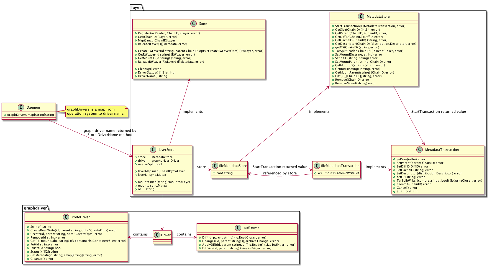

# Graph Driver

## 概览



## 初始化

```go
d.graphDrivers = make(map[string]string)
layerStores := make(map[string]layer.Store)
if runtime.GOOS == "windows" {
	d.graphDrivers[runtime.GOOS] = "windowsfilter"
	if system.LCOWSupported() {
		d.graphDrivers["linux"] = "lcow"
	}
} else {
	driverName := os.Getenv("DOCKER_DRIVER")
	if driverName == "" {
		driverName = config.GraphDriver
	} else {
		logrus.Infof("Setting the storage driver from the $DOCKER_DRIVER environment variable (%s)", driverName)
	}
	d.graphDrivers[runtime.GOOS] = driverName // May still be empty. Layerstore init determines instead.
}

// ...

for operatingSystem, gd := range d.graphDrivers {
	layerStores[operatingSystem], err = layer.NewStoreFromOptions(layer.StoreOptions{
		Root: config.Root,
		MetadataStorePathTemplate: filepath.Join(config.Root, "image", "%s", "layerdb"),
		GraphDriver:               gd,
		GraphDriverOptions:        config.GraphOptions,
		IDMappings:                idMappings,
		PluginGetter:              d.PluginStore,
		ExperimentalEnabled:       config.Experimental,
		OS:                        operatingSystem,
	})
	if err != nil {
		return nil, err
	}
}

// As layerstore initialization may set the driver
for os := range d.graphDrivers {
	d.graphDrivers[os] = layerStores[os].DriverName()
}
```

## 情景分析

### 基本功能

- Driver 注册

```go
func Register(name string, initFunc InitFunc) error {
	if _, exists := drivers[name]; exists {
		return fmt.Errorf("Name already registered %s", name)
	}
	drivers[name] = initFunc // 注册 Driver 及对应的初始化函数

	return nil
}
```

- 获取 Driver

```go
func GetDriver(name string, pg plugingetter.PluginGetter, config Options) (Driver, error) {
	if initFunc, exists := drivers[name]; exists { // Driver 存在，执行初始化函数
		return initFunc(filepath.Join(config.Root, name), config.DriverOptions, config.UIDMaps, config.GIDMaps)
	}

	pluginDriver, err := lookupPlugin(name, pg, config) // Driver 不存在，查看 plugin
	if err == nil {
		return pluginDriver, nil
	}
        // 返回错误
	return nil, ErrNotSupported
}
```

- 获取内建 Driver

```go
func getBuiltinDriver(name, home string, options []string, uidMaps, gidMaps []idtools.IDMap) (Driver, error) {
	if initFunc, exists := drivers[name]; exists {
		return initFunc(filepath.Join(home, name), options, uidMaps, gidMaps)
	}
        // 不检查 plugin
	return nil, ErrNotSupported
}
```

- New Driver

```go
func New(name string, pg plugingetter.PluginGetter, config Options) (Driver, error) {
	if name != "" {
		// 指定了 Driver，直接返回
		return GetDriver(name, pg, config)
	}

	driversMap := scanPriorDrivers(config.Root) // 扫描本地已有驱动，config.Root 为系统目录
	list := strings.Split(priority, ",") // 驱动优先级列表

         // 检查 Host 是否已使用了驱动优先列表中的驱动
	for _, name := range list {
		if name == "vfs" {
			// don't use vfs even if there is state present.
			continue
		}
		if _, prior := driversMap[name]; prior {
                         // 查看 Driver 是否存在，初始化函数能否成功
			driver, err := getBuiltinDriver(name, config.Root, config.DriverOptions, config.UIDMaps, config.GIDMaps)
			if err != nil {
				return nil, err
			}

			// 本地有多个 Driver，告知用户明确选择一个
			if len(driversMap)-1 > 0 {
				var driversSlice []string
				for name := range driversMap {
					driversSlice = append(driversSlice, name)
				}

				return nil, fmt.Errorf("%s contains several valid graphdrivers: %s; Please cleanup or explicitly choose storage driver (-s <DRIVER>)", config.Root, strings.Join(driversSlice, ", "))
			}

			return driver, nil
		}
	}

	// Host 没有使用优先列表中的 Driver，按顺序选择第一个可用 Driver
	for _, name := range list {
		driver, err := getBuiltinDriver(name, config.Root, config.DriverOptions, config.UIDMaps, config.GIDMaps)
		if err != nil {
			if IsDriverNotSupported(err) {
				continue
			}
			return nil, err
		}
		return driver, nil
	}

	// 优先列表不含名为 name 的驱动，检查全部 Driver
	for name, initFunc := range drivers {
		driver, err := initFunc(filepath.Join(config.Root, name), config.DriverOptions, config.UIDMaps, config.GIDMaps)
		if err != nil {
			if IsDriverNotSupported(err) {
				continue
			}
			return nil, err
		}
		return driver, nil
	}
        // 没有找到 Driver
	return nil, fmt.Errorf("No supported storage backend found")
}
```

## NaiveDiffDriver

NaiveDiffDriver 提供一个通用的基于文件系统的 diff 工具。其结构为：

```go
type NaiveDiffDriver struct {
	ProtoDriver
	uidMaps []idtools.IDMap
	gidMaps []idtools.IDMap
}
```

由于包含一个 ProtoDriver 同时，实现了 DiffDriver，所以，NaiveDiffDriver 满足 Driver 接口。NaiveDiffDriver 可以将一个 ProtoDriver 封装为 Driver.

创建代码为：

```go
func NewNaiveDiffDriver(driver ProtoDriver, uidMaps, gidMaps []idtools.IDMap) Driver {
	return &NaiveDiffDriver{ProtoDriver: driver,
		uidMaps: uidMaps,
		gidMaps: gidMaps}
}
```

### DiffDriver 方法

#### Diff

```go
func (gdw *NaiveDiffDriver) Diff(id, parent string) (arch io.ReadCloser, err error) {
	startTime := time.Now()
	driver := gdw.ProtoDriver

	layerRootFs, err := driver.Get(id, "") // 获取一个 ContainerFS 实例
	if err != nil {
		return nil, err
	}
	layerFs := layerRootFs.Path() // 获取文件路径

	defer func() {
		if err != nil {
			driver.Put(id) // Get，Put 要成对出现
		}
	}()

	if parent == "" { // parent 为空
		archive, err := archive.Tar(layerFs, archive.Uncompressed)
		if err != nil {
			return nil, err
		}
		return ioutils.NewReadCloserWrapper(archive, func() error {
			err := archive.Close()
			driver.Put(id)
			return err
		}), nil
	}

	parentRootFs, err := driver.Get(parent, "")
	if err != nil {
		return nil, err
	}
	defer driver.Put(parent)

	parentFs := parentRootFs.Path() // 获取 parent 路径

	changes, err := archive.ChangesDirs(layerFs, parentFs) // 对比路径差异
	if err != nil {
		return nil, err
	}

	archive, err := archive.ExportChanges(layerFs, changes, gdw.uidMaps, gdw.gidMaps)
	if err != nil {
		return nil, err
	}

	return ioutils.NewReadCloserWrapper(archive, func() error { // 导出差异
		err := archive.Close()
		driver.Put(id)

		// NaiveDiffDriver compares file metadata with parent layers. Parent layers
		// are extracted from tar's with full second precision on modified time.
		// We need this hack here to make sure calls within same second receive
		// correct result.
		time.Sleep(time.Until(startTime.Truncate(time.Second).Add(time.Second)))
		return err
	}), nil
}
```

- 当没有 parent 目录时，使用了 Tar 方法，Tar 封装压缩方式后调用 TarWithOptions 方法：

```go
func TarWithOptions(srcPath string, options *TarOptions) (io.ReadCloser, error) {
	// Fix the source path to work with long path names. This is a no-op
	// on platforms other than Windows.
	srcPath = fixVolumePathPrefix(srcPath)

        // 构建 exclude 匹配模式
	pm, err := fileutils.NewPatternMatcher(options.ExcludePatterns)
	if err != nil {
		return nil, err
	}

	pipeReader, pipeWriter := io.Pipe()
        // 通过 options.Compression(压缩方式)，封装 PipeWriter，压缩后内容会写入 PipeWriter
	compressWriter, err := CompressStream(pipeWriter, options.Compression)
	if err != nil {
		return nil, err
	}

	go func() {
                // 创建 tar 编码器
		ta := newTarAppender(
			idtools.NewIDMappingsFromMaps(options.UIDMaps, options.GIDMaps),
			compressWriter,
			options.ChownOpts,
		)
                // whiteout 是 UFS 系统的一种权限
		ta.WhiteoutConverter = getWhiteoutConverter(options.WhiteoutFormat)

		defer func() {
			// Make sure to check the error on Close.
			if err := ta.TarWriter.Close(); err != nil {
				logrus.Errorf("Can't close tar writer: %s", err)
			}
			if err := compressWriter.Close(); err != nil {
				logrus.Errorf("Can't close compress writer: %s", err)
			}
			if err := pipeWriter.Close(); err != nil {
				logrus.Errorf("Can't close pipe writer: %s", err)
			}
		}()

		// ta.Buffer 是在 newTarAppender 中获取的，在外部释放
		defer pools.BufioWriter32KPool.Put(ta.Buffer)

		stat, err := os.Lstat(srcPath) // 获取文件信息
		if err != nil {
			return
		}

                // 如果当前路径不是目录，调整 srcPath
		if !stat.IsDir() {
			if len(options.IncludeFiles) > 0 {
				logrus.Warn("Tar: Can't archive a file with includes")
			}

			dir, base := SplitPathDirEntry(srcPath)
			srcPath = dir
			options.IncludeFiles = []string{base}
		}
                // IncludeFiles 默认为 "."
		if len(options.IncludeFiles) == 0 {
			options.IncludeFiles = []string{"."}
		}

		seen := make(map[string]bool)

		for _, include := range options.IncludeFiles {
			rebaseName := options.RebaseNames[include]

                        // 拼接路径形成当前要遍历的目录, srcPath/include
			walkRoot := getWalkRoot(srcPath, include)
                        // 递归遍历目录
			filepath.Walk(walkRoot, func(filePath string, f os.FileInfo, err error) error {
				if err != nil {
					logrus.Errorf("Tar: Can't stat file %s to tar: %s", srcPath, err)
					return nil
				}
                                // 获取 filePath 相对于 srcPath 的相对路径
				relFilePath, err := filepath.Rel(srcPath, filePath)
				if err != nil || (!options.IncludeSourceDir && relFilePath == "." && f.IsDir()) {
					// 错误发生或相对路径为 "."
					return nil
				}

				if options.IncludeSourceDir && include == "." && relFilePath != "." {
					relFilePath = strings.Join([]string{".", relFilePath}, string(filepath.Separator))
				}

				skip := false

                                // 只有当 include 与相对路径不匹配时，才使用 Exclude 模式匹配，来决定是否 skip
				if include != relFilePath {
					skip, err = pm.Matches(relFilePath)
					if err != nil {
						logrus.Errorf("Error matching %s: %v", relFilePath, err)
						return err
					}
				}
                                // 由于函数在 Walk 中递归调用，当需要跳过时，返回错误；不需要跳过时，返回 nil
				if skip { 
					// 不是目录，不跳过
					if !f.IsDir() {
						return nil
					}

					// 没有例外模式匹配规则，跳过
					if !pm.Exclusions() {
						return filepath.SkipDir
					}

					dirSlash := relFilePath + string(filepath.Separator)

					for _, pat := range pm.Patterns() {
						if !pat.Exclusion() {
							continue
						}
						if strings.HasPrefix(pat.String()+string(filepath.Separator), dirSlash) {
							// 找到了例外规则，不跳过
							return nil
						}
					}

					// 跳过
					return filepath.SkipDir
				}
                                // 已经遍历一次
				if seen[relFilePath] {
					return nil
				}
                                // 标示首次遍历
				seen[relFilePath] = true

				// 需要重命名
				if rebaseName != "" {
					var replacement string
					if rebaseName != string(filepath.Separator) {
						replacement = rebaseName
					}

					relFilePath = strings.Replace(relFilePath, include, replacement, 1)
				}
                                // 将重命名后文件，加入 tar 文件
				if err := ta.addTarFile(filePath, relFilePath); err != nil {
					logrus.Errorf("Can't add file %s to tar: %s", filePath, err)
					// if pipe is broken, stop writing tar stream to it
					if err == io.ErrClosedPipe {
						return err
					}
				}
				return nil
			})
		}
	}()

	return pipeReader, nil // 返回 PipeReader，读取内容由上面的 goroutine 生成
}
```

- 当 parent 目录存在时，通过 ChangesDirs 方法，将不同部分导出：

```go
func ChangesDirs(newDir, oldDir string) ([]Change, error) {
	var (
		oldRoot, newRoot *FileInfo
	)
        // ... 
	oldRoot, newRoot, err := collectFileInfoForChanges(oldDir, newDir)
        // ... 
	return newRoot.Changes(oldRoot), nil
}
```

代码主要分为两步调用，首先调用 collectFileInfoForChanges 获取变化信息，然后将变化信息转换为 Change 结构。Change 相关结构定义如下：

```go
type Change struct {
	Path string
	Kind ChangeType
}

type ChangeType int

const (
	// ChangeModify represents the modify operation.
	ChangeModify = iota
	// ChangeAdd represents the add operation.
	ChangeAdd
	// ChangeDelete represents the delete operation.
	ChangeDelete
)
```

collectFileInfoForChanges 会构建如下图所示的目录结构：


构建过程如下：

```go
func (w *walker) walk(path string, i1, i2 os.FileInfo) (err error) {
	// 递归过程，构建 FileInfo 树
	if path != "/" {
		if err := walkchunk(path, i1, w.dir1, w.root1); err != nil {
			return err
		}
		if err := walkchunk(path, i2, w.dir2, w.root2); err != nil {
			return err
		}
	}

	is1Dir := i1 != nil && i1.IsDir()
	is2Dir := i2 != nil && i2.IsDir()

        // 目录是否在同一设备上
	sameDevice := false
	if i1 != nil && i2 != nil {
		si1 := i1.Sys().(*syscall.Stat_t)
		si2 := i2.Sys().(*syscall.Stat_t)
		if si1.Dev == si2.Dev {
			sameDevice = true
		}
	}

	// 都不是目录，递归结束
	if !is1Dir && !is2Dir {
		return nil
	}

	var names1, names2 []nameIno
	if is1Dir {
                // 获取目录下全部文件
		names1, err = readdirnames(filepath.Join(w.dir1, path))
		if err != nil {
			return err
		}
	}
	if is2Dir {
                // 获取目录下全部文件
		names2, err = readdirnames(filepath.Join(w.dir2, path)) // getdents(2): fs access
		if err != nil {
			return err
		}
	}

	// 获取 name1 与 name2 的并集，name1, name2 本身有序（字母增序）；合并结果 name 有序
        // 归并排序中 merge 部分
	var names []string
	ix1 := 0
	ix2 := 0

	for {
		if ix1 >= len(names1) {
			break
		}
		if ix2 >= len(names2) {
			break
		}

		ni1 := names1[ix1]
		ni2 := names2[ix2]

		switch bytes.Compare([]byte(ni1.name), []byte(ni2.name)) {
		case -1: // ni1 < ni2 -- advance ni1
			// we will not encounter ni1 in names2
			names = append(names, ni1.name)
			ix1++
		case 0: // ni1 == ni2
			if ni1.ino != ni2.ino || !sameDevice {
				names = append(names, ni1.name)
			}
			ix1++
			ix2++
		case 1: // ni1 > ni2 -- advance ni2
			// we will not encounter ni2 in names1
			names = append(names, ni2.name)
			ix2++
		}
	}
	for ix1 < len(names1) {
		names = append(names, names1[ix1].name)
		ix1++
	}
	for ix2 < len(names2) {
		names = append(names, names2[ix2].name)
		ix2++
	}

	// 拼接文件路径，递归处理
	for _, name := range names {
		fname := filepath.Join(path, name)
		var cInfo1, cInfo2 os.FileInfo
		if is1Dir {
			cInfo1, err = os.Lstat(filepath.Join(w.dir1, fname))
			if err != nil && !os.IsNotExist(err) {
				return err
			}
		}
		if is2Dir {
			cInfo2, err = os.Lstat(filepath.Join(w.dir2, fname))
			if err != nil && !os.IsNotExist(err) {
				return err
			}
		}
		if err = w.walk(fname, cInfo1, cInfo2); err != nil {
			return err
		}
	}
	return nil
}
```

FileInfo 新节点创建：

```go
func walkchunk(path string, fi os.FileInfo, dir string, root *FileInfo) error {
	// ...
        // 找到最近的父节点, eg: path 为 a/b/c/d 时，c 对应的 FileInfo 为最近父节点
	parent := root.LookUp(filepath.Dir(path))
	if parent == nil {
		return fmt.Errorf("walkchunk: Unexpectedly no parent for %s", path)
	}
	info := &FileInfo{
		name:     filepath.Base(path),
		children: make(map[string]*FileInfo),
		parent:   parent,
	}
	cpath := filepath.Join(dir, path)
        // 获取文件信息
	stat, err := system.FromStatT(fi.Sys().(*syscall.Stat_t))
	// ...
	info.stat = stat
	info.capability, _ = system.Lgetxattr(cpath, "security.capability")
	parent.children[info.name] = info
	return nil
}
```

构建完毕后，Change 将对遍历两侧目录树，检测到变更结果集。

#### Changes

```go
func (gdw *NaiveDiffDriver) Changes(id, parent string) ([]archive.Change, error) {
        // 获取 proto driver
	driver := gdw.ProtoDriver

	layerRootFs, err := driver.Get(id, "")
	if err != nil {
		return nil, err
	}
	defer driver.Put(id)

	layerFs := layerRootFs.Path()
	parentFs := ""

        // 如果 parent 不为空，获取 parent
	if parent != "" {
		parentRootFs, err := driver.Get(parent, "")
		if err != nil {
			return nil, err
		}
		defer driver.Put(parent)
		parentFs = parentRootFs.Path()
	}

        // 返回变更
	return archive.ChangesDirs(layerFs, parentFs)
}
```

#### ApplyDiff

```go
func (gdw *NaiveDiffDriver) ApplyDiff(id, parent string, diff io.Reader) (size int64, err error) {
	// 获取 layerFS，代码略
	if size, err = ApplyUncompressedLayer(layerFs, diff, options); err != nil {
		return
	}
	// ...

	return
}
```

不难看出，核心代码就是将 diff 中读取的内容(tar 文件)，应用到文件系统中。通过如下代码：

```go
cmd := reexec.Command("docker-applyLayer", dest)
cmd.Stdin = layer
cmd.Env = append(cmd.Env, fmt.Sprintf("OPT=%s", data))
```

将方法 docker-applyLayer 启动，并将 Stdin 指向 diff（同为 io.Reader）。最终应用代码为：

```go
func applyLayer() {

	var (
		tmpDir  string
		err     error
		options *archive.TarOptions
	)
	runtime.LockOSThread()
	flag.Parse()

	inUserns := rsystem.RunningInUserNS()
	if err := chroot(flag.Arg(0)); err != nil {
		fatal(err)
	}

	// We need to be able to set any perms
	oldmask, err := system.Umask(0)
	defer system.Umask(oldmask)
	if err != nil {
		fatal(err)
	}

	if err := json.Unmarshal([]byte(os.Getenv("OPT")), &options); err != nil {
		fatal(err)
	}

	if inUserns {
		options.InUserNS = true
	}

	if tmpDir, err = ioutil.TempDir("/", "temp-docker-extract"); err != nil {
		fatal(err)
	}

	os.Setenv("TMPDIR", tmpDir)
	size, err := archive.UnpackLayer("/", os.Stdin, options)
	os.RemoveAll(tmpDir)
	if err != nil {
		fatal(err)
	}

	encoder := json.NewEncoder(os.Stdout)
	if err := encoder.Encode(applyLayerResponse{size}); err != nil {
		fatal(fmt.Errorf("unable to encode layerSize JSON: %s", err))
	}

	if _, err := flush(os.Stdin); err != nil {
		fatal(err)
	}

	os.Exit(0)
}
```

## References

- [Docker storage drivers](https://docs.docker.com/storage/storagedriver/select-storage-driver/)
- [Comprehensive Overview of Storage Scalability in Docker](https://developers.redhat.com/blog/2014/09/30/overview-storage-scalability-docker/)
- [UnionFS](https://en.wikipedia.org/wiki/UnionFS)
- [Union Mount](https://en.wikipedia.org/wiki/Union_mount)
- [Tar](https://en.wikipedia.org/wiki/Tar_(computing))
- [Use the OverlayFS storage driver](https://docs.docker.com/storage/storagedriver/overlayfs-driver/)
- [Use the ZFS storage driver](https://docs.docker.com/storage/storagedriver/zfs-driver/)
- [Use the Device Mapper storage driver](https://docs.docker.com/storage/storagedriver/device-mapper-driver/)
- [io.Pipe](https://golang.org/pkg/io/#Pipe)
- [filepath.Walk](https://golang.org/pkg/path/filepath/#Walk)
