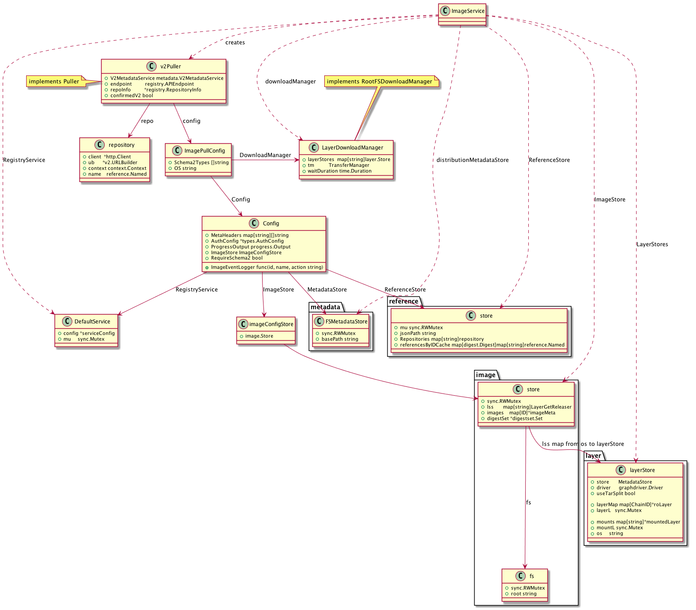

# 镜像管理

## 概览

- 核心数据结构


- ImageService 注册路由


## 情景分析

### List 本地镜像

当执行 docker images 是，触发路由：

```go
router.NewGetRoute("/images/json", r.getImagesJSON),
```

该路由处理函数为：

```go
func (s *imageRouter) getImagesJSON(ctx context.Context, w http.ResponseWriter, r *http.Request, vars map[string]string) error {
	// ...
	images, err := s.backend.Images(imageFilters, httputils.BoolValue(r, "all"), false)
	// ...
	return httputils.WriteJSON(w, http.StatusOK, images)
}
```

可以看到，核心代码为 ImageService.Images 方法：

```go
func (i *ImageService) Images(imageFilters filters.Args, all bool, withExtraAttrs bool) ([]*types.ImageSummary, error) {
	var (
		allImages    map[image.ID]*image.Image
		err          error
		danglingOnly = false
	)

	// 验证 imageFilters 合法性
	if err := imageFilters.Validate(acceptedImageFilterTags); err != nil {
		return nil, err
	}

 	// ... 

	if danglingOnly {
		allImages = i.imageStore.Heads() // 仅获取无 tag 镜像
	} else {
		allImages = i.imageStore.Map() // 获取全部镜像
	}

	// before, since 的基准镜像获取 (略)

	images := []*types.ImageSummary{}
	var imagesMap map[*image.Image]*types.ImageSummary
	var layerRefs map[layer.ChainID]int
	var allLayers map[layer.ChainID]layer.Layer
	var allContainers []*container.Container

	for id, img := range allImages {
		// before, since 过滤 (代码略)
 		// label 过滤
		if imageFilters.Contains("label") {
			// ...
			if !imageFilters.MatchKVList("label", img.Config.Labels) { // 对比镜像 label
				continue
			}
		}

		// 过滤操作系统不能支持的镜像
		if !system.IsOSSupported(img.OperatingSystem()) {
			continue
		}

		layerID := img.RootFS.ChainID()
		var size int64
		if layerID != "" {
			l, err := i.layerStores[img.OperatingSystem()].Get(layerID)
			if err != nil {
				// The layer may have been deleted between the call to `Map()` or
				// `Heads()` and the call to `Get()`, so we just ignore this error
				if err == layer.ErrLayerDoesNotExist {
					continue
				}
				return nil, err
			}

			size, err = l.Size()
			layer.ReleaseAndLog(i.layerStores[img.OperatingSystem()], l)
			if err != nil {
				return nil, err
			}
		}

		newImage := newImage(img, size) // 创建 ImageSummary 记录

		for _, ref := range i.referenceStore.References(id.Digest()) {
			// reference 过滤
			// repo 信息
			if _, ok := ref.(reference.Canonical); ok {
				newImage.RepoDigests = append(newImage.RepoDigests, reference.FamiliarString(ref))
			}
			// tag 信息
			if _, ok := ref.(reference.NamedTagged); ok {
				newImage.RepoTags = append(newImage.RepoTags, reference.FamiliarString(ref))
			}
		}
		if newImage.RepoDigests == nil && newImage.RepoTags == nil {
			if all || len(i.imageStore.Children(id)) == 0 {

				// dangling, reference 过滤
				// repo, tag 默认信息
				newImage.RepoDigests = []string{"<none>@<none>"}
				newImage.RepoTags = []string{"<none>:<none>"}
			} else {
				continue
			}
		} else if danglingOnly && len(newImage.RepoTags) > 0 {
			continue
		}

		// 获取额外信息，由于传入参数为 false，此部分代码略

		images = append(images, newImage)
	}

	// 获取额外信息，由于传入参数为 false，此部分代码略

	sort.Sort(sort.Reverse(byCreated(images)))

	return images, nil
}
```

### Pull

主要数据结构关系图：



Pull 镜像流程如下：


- ImageService.PullImage

```go
func (i *ImageService) PullImage(ctx context.Context, image, tag, os string, metaHeaders map[string][]string, authConfig *types.AuthConfig, outStream io.Writer) error {
	image = strings.TrimSuffix(image, ":")

	// 获取镜像的 Reference
	ref, err := reference.ParseNormalizedNamed(image)
	if err != nil {
		return errdefs.InvalidParameter(err)
	}

	// tag 不空，调整 Reference
	if tag != "" {
		var dgst digest.Digest
		dgst, err = digest.Parse(tag)
		if err == nil {
			ref, err = reference.WithDigest(reference.TrimNamed(ref), dgst)
		} else {
			ref, err = reference.WithTag(ref, tag)
		}
	}

	return i.pullImageWithReference(ctx, ref, os, metaHeaders, authConfig, outStream)
}
```

- pullImageWithReference

```go
func (i *ImageService) pullImageWithReference(ctx context.Context, ref reference.Named, os string, metaHeaders map[string][]string, authConfig *types.AuthConfig, outStream io.Writer) error {
	// 下载进度显示
	progressChan := make(chan progress.Progress, 100)
	// 写入结束 channel
	writesDone := make(chan struct{})

	ctx, cancelFunc := context.WithCancel(ctx)

	// 启动 goroutine 显示下载进度，下载完成、失败后，关闭 writesDone
	go func() {
		progressutils.WriteDistributionProgress(cancelFunc, outStream, progressChan)
		close(writesDone)
	}()

	// ...

	imagePullConfig := &distribution.ImagePullConfig{
		Config: distribution.Config{
			MetaHeaders:      metaHeaders,
			AuthConfig:       authConfig,
			ProgressOutput:   progress.ChanOutput(progressChan),
			RegistryService:  i.registryService,
			ImageEventLogger: i.LogImageEvent,
			MetadataStore:    i.distributionMetadataStore,
			ImageStore:       distribution.NewImageConfigStoreFromStore(i.imageStore),
			ReferenceStore:   i.referenceStore,
		},
		DownloadManager: i.downloadManager,
		Schema2Types:    distribution.ImageTypes,
		OS:              os,
	}

	err := distribution.Pull(ctx, ref, imagePullConfig)
	close(progressChan)
	<-writesDone
	return err
}
```

- Pull

首先，根据传入的 ref 获取镜像下载地址:

```go
repoInfo, err := imagePullConfig.RegistryService.ResolveRepository(ref)
```

通过 repoInfo 获取可用的 endpoints:

```go
endpoints, err := imagePullConfig.RegistryService.LookupPullEndpoints(reference.Domain(repoInfo.Name))
```

再遍历 endpoints，执行下载操作：

```go
for _, endpoint := range endpoints {
	// 检查 Schema 是否匹配，代码略

	// 检查 https 设置是否匹配
	if endpoint.URL.Scheme != "https" {
		if _, confirmedTLS := confirmedTLSRegistries[endpoint.URL.Host]; confirmedTLS {
			continue
		}
	}

	// 使用当前 endpoint，创建 puller 对象
	puller, err := newPuller(endpoint, repoInfo, imagePullConfig)
	if err != nil {
		lastErr = err
		continue
	}

	// ...

  // 执行 pull 操作
	if err := puller.Pull(ctx, ref, imagePullConfig.OS); err != nil {
		fallback := false
		select {
		case <-ctx.Done():
		default:
			// 是否需要 fallback，代码略
		}
		if fallback {
			if _, ok := err.(ErrNoSupport); !ok {
				discardNoSupportErrors = true
				lastErr = err
			} else if !discardNoSupportErrors {
				lastErr = err
			}
			continue
		}
		// 不需要 fallback，直接返回错误
		return TranslatePullError(err, ref)
	}

	imagePullConfig.ImageEventLogger(reference.FamiliarString(ref), reference.FamiliarName(repoInfo.Name), "pull")
	return nil
}
```

我们以 API V2 为例，继续跟进：

```go
func (p *v2Puller) Pull(ctx context.Context, ref reference.Named, os string) (err error) {
	// 创建 distribution.Repository 实例
	p.repo, p.confirmedV2, err = NewV2Repository(ctx, p.repoInfo, p.endpoint, p.config.MetaHeaders, p.config.AuthConfig, "pull")
	// ...
	// 执行 pull 操作
	if err = p.pullV2Repository(ctx, ref, os); err != nil {
		if _, ok := err.(fallbackError); ok {
			return err
		}
		if continueOnError(err, p.endpoint.Mirror) {
			return fallbackError{
				err:         err,
				confirmedV2: p.confirmedV2,
				transportOK: true,
			}
		}
	}
	return err
}
```

在 NewV2Repository 中设置 http 相关内容：

```
func NewV2Repository(ctx context.Context, repoInfo *registry.RepositoryInfo, endpoint registry.APIEndpoint, metaHeaders http.Header, authConfig *types.AuthConfig, actions ...string) (repo distribution.Repository, foundVersion bool, err error) {
	// 设置 Dialer
	direct := &net.Dialer{
		Timeout:   30 * time.Second,
		KeepAlive: 30 * time.Second,
		DualStack: true,
	}
	// 设置 transport
	base := &http.Transport{
		Proxy:               http.ProxyFromEnvironment,
		Dial:                direct.Dial,
		TLSHandshakeTimeout: 10 * time.Second,
		TLSClientConfig:     endpoint.TLSConfig,
		DisableKeepAlives: true,
	}
	// 设置代理 dialer
	proxyDialer, err := sockets.DialerFromEnvironment(direct)
	if err == nil {
		base.Dial = proxyDialer.Dial
	}

	modifiers := registry.Headers(dockerversion.DockerUserAgent(ctx), metaHeaders)
	authTransport := transport.NewTransport(base, modifiers...)

	// ...

	tr := transport.NewTransport(base, modifiers...)

	// ...

	repo, err = client.NewRepository(ctx, repoNameRef, endpoint.URL.String(), tr)
	if err != nil {
		err = fallbackError{
			err:         err,
			confirmedV2: foundVersion,
			transportOK: true,
		}
	}
	return
}
```

设置完成后结构如下图：


在 pullV2Repository 中，根据 tag 下载对应镜像：

```go
for _, tag := range tags {
	tagRef, err := reference.WithTag(ref, tag)
	if err != nil {
		return err
	}
	pulledNew, err := p.pullV2Tag(ctx, tagRef, os)
	if err != nil {
		// Since this is the pull-all-tags case, don't
		// allow an error pulling a particular tag to
		// make the whole pull fall back to v1.
		if fallbackErr, ok := err.(fallbackError); ok {
			return fallbackErr.err
		}
		return err
	}
	layersDownloaded = layersDownloaded || pulledNew
}
```

继续看 pullV2Tag:

```go
// 获取 ManifestService
manSvc, err := p.repo.Manifests(ctx)

var (
	manifest    distribution.Manifest
	tagOrDigest string // Used for logging/progress only
)
// 通过 ManifestService 获取 manifest
if digested, isDigested := ref.(reference.Canonical); isDigested {
	manifest, err = manSvc.Get(ctx, digested.Digest())
	// ...
	tagOrDigest = digested.Digest().String()
} else if tagged, isTagged := ref.(reference.NamedTagged); isTagged {
	manifest, err = manSvc.Get(ctx, "", distribution.WithTag(tagged.Tag()))
	// ...
	tagOrDigest = tagged.Tag()
}

// ...

// If manSvc.Get succeeded, we can be confident that the registry on
// the other side speaks the v2 protocol.
p.confirmedV2 = true

var (
	id             digest.Digest
	manifestDigest digest.Digest
)

switch v := manifest.(type) {
case *schema1.SignedManifest:
	// ...
	id, manifestDigest, err = p.pullSchema1(ctx, ref, v, os)
	if err != nil {
		return false, err
	}
case *schema2.DeserializedManifest:
	id, manifestDigest, err = p.pullSchema2(ctx, ref, v, os)
	if err != nil {
		return false, err
	}
case *manifestlist.DeserializedManifestList:
	id, manifestDigest, err = p.pullManifestList(ctx, ref, v, os)
	if err != nil {
		return false, err
	}
default:
	return false, invalidManifestFormatError{}
}
	
```

可以看出， manSvc.Get 是后续分支判断的关键代码，我们需要进入：github.com/docker/distribution/registry/client/repository.go 查看详细代码。

```go
// manifest.Get
for _, t := range distribution.ManifestMediaTypes() {
	req.Header.Add("Accept", t)
}

if _, ok := ms.etags[digestOrTag]; ok {
	req.Header.Set("If-None-Match", ms.etags[digestOrTag])
}

resp, err := ms.client.Do(req)
// ...
mt := resp.Header.Get("Content-Type")
body, err := ioutil.ReadAll(resp.Body)
// ...
m, _, err := distribution.UnmarshalManifest(mt, body)
// ...
return m, nil
```

可以看出，Get 是一段 HTTP 请求代码，Manifest 文件，是由服务端提供的。

看一下 UnmarshalManifest 方法：

```go
unmarshalFunc, ok := mappings[mediaType]

return unmarshalFunc(p)
```

可以看出，mediaType 解码方法是提前注册的。

进入 github.com/docker/distribution/manifest/schema2 可以找到注册代码：

```go
MediaTypeManifest = "application/vnd.docker.distribution.manifest.v2+json"

schema2Func := func(b []byte) (distribution.Manifest, distribution.Descriptor, error) {
	m := new(DeserializedManifest)
	err := m.UnmarshalJSON(b)
	if err != nil {
		return nil, distribution.Descriptor{}, err
	}

	dgst := digest.FromBytes(b)
	return m, distribution.Descriptor{Digest: dgst, Size: int64(len(b)), MediaType: MediaTypeManifest}, err
}
err := distribution.RegisterManifestSchema(MediaTypeManifest, schema2Func)
```

回到 pullV2Tag，switch 选择的应该是：

```go
case *schema2.DeserializedManifest:
	id, manifestDigest, err = p.pullSchema2(ctx, ref, v, os)
```

pullSchema2 核心代码：

```go
func (p *v2Puller) pullSchema2(ctx context.Context, ref reference.Named, mfst *schema2.DeserializedManifest, requestedOS string) (id digest.Digest, manifestDigest digest.Digest, err error) {
	manifestDigest, err = schema2ManifestDigest(ref, mfst)
	// ...
	target := mfst.Target()
	// 镜像在本地已存在，不需要下载，直接返回结果
	if _, err := p.config.ImageStore.Get(target.Digest); err == nil {
		return target.Digest, manifestDigest, nil
	}

	var descriptors []xfer.DownloadDescriptor

	// 构建需要下载的镜像层
	for _, d := range mfst.Layers {
		layerDescriptor := &v2LayerDescriptor{
			digest:            d.Digest,
			repo:              p.repo,
			repoInfo:          p.repoInfo,
			V2MetadataService: p.V2MetadataService,
			src:               d,
		}

		descriptors = append(descriptors, layerDescriptor)
	}
	// ...
	// 拉取镜像配置
	go func() {
		configJSON, err := p.pullSchema2Config(ctx, target.Digest)
		// ...
		configChan <- configJSON // 发送镜像配置文件
	}()

	var (
		configJSON       []byte          // raw serialized image config
		downloadedRootFS *image.RootFS   // rootFS from registered layers
		configRootFS     *image.RootFS   // rootFS from configuration
		release          func()          // release resources from rootFS download
		configPlatform   *specs.Platform // for LCOW when registering downloaded layers
	)

	// ...

  // 下载镜像
	if p.config.DownloadManager != nil {
		go func() {
			var (
				err    error
				rootFS image.RootFS
			)
			downloadRootFS := *image.NewRootFS()
			rootFS, release, err = p.config.DownloadManager.Download(ctx, downloadRootFS, requestedOS, descriptors, p.config.ProgressOutput)
			if err != nil {
				// Intentionally do not cancel the config download here
				// as the error from config download (if there is one)
				// is more interesting than the layer download error
				layerErrChan <- err
				return
			}

			downloadedRootFS = &rootFS
			close(downloadsDone)
		}()
	} else {
		// We have nothing to download
		close(downloadsDone)
	}

	if configJSON == nil {
		configJSON, configRootFS, _, err = receiveConfig(p.config.ImageStore, configChan, configErrChan)
		// ...
	}

	// ...

	if downloadedRootFS != nil {
		// The DiffIDs returned in rootFS MUST match those in the config.
		// Otherwise the image config could be referencing layers that aren't
		// included in the manifest.
		if len(downloadedRootFS.DiffIDs) != len(configRootFS.DiffIDs) {
			return "", "", errRootFSMismatch
		}

		for i := range downloadedRootFS.DiffIDs {
			if downloadedRootFS.DiffIDs[i] != configRootFS.DiffIDs[i] {
				return "", "", errRootFSMismatch
			}
		}
	}

	imageID, err := p.config.ImageStore.Put(configJSON)
	if err != nil {
		return "", "", err
	}

	return imageID, manifestDigest, nil
}
```
