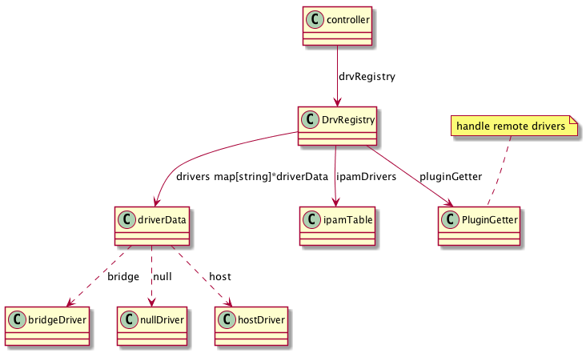

# Driver

## 概览



## 驱动注册

驱动注册是在创建 NetworkController 时完成的：

```go
c := &controller{
	id:               stringid.GenerateRandomID(),
	cfg:              config.ParseConfigOptions(cfgOptions...),
	sandboxes:        sandboxTable{},
	svcRecords:       make(map[string]svcInfo),
	serviceBindings:  make(map[serviceKey]*service),
	agentInitDone:    make(chan struct{}),
	networkLocker:    locker.New(),
	DiagnosticServer: diagnostic.New(),
}

// 初始化 Store， 支持 zookeeper, etcd, consul, boltdb
if err := c.initStores(); err != nil {
	return nil, err
}

// 前两个传入参数，并没有在 drvRegistry 中保留
drvRegistry, err := drvregistry.New(c.getStore(datastore.LocalScope), c.getStore(datastore.GlobalScope), c.RegisterDriver, nil, c.cfg.PluginGetter)

// 遍历内置的驱动
for _, i := range getInitializers(c.cfg.Daemon.Experimental) {
	var dcfg map[string]interface{}

	// 外部驱动不需要用户提供配置
	if i.ntype != "remote" {
		dcfg = c.makeDriverConfig(i.ntype)
	}

	// 加载驱动
	if err := drvRegistry.AddDriver(i.ntype, i.fn, dcfg); err != nil {
		return nil, err
	}
}
```

以 Linux 为例，getInitializers 返回的内建驱动列表为：

```go
in := []initializer{
	{bridge.Init, "bridge"},
	{host.Init, "host"},
	{macvlan.Init, "macvlan"},
	{null.Init, "null"},
	{remote.Init, "remote"},
	{overlay.Init, "overlay"},
}
```

然后初始化全局 IPAM：

```go
if err = initIPAMDrivers(drvRegistry, nil, c.getStore(datastore.GlobalScope)); err != nil {
	return nil, err
}

c.drvRegistry = drvRegistry
```

具体来说，initIPAMDrivers 执行以下代码：

```go
// lDs: Local Data Store
// gDs: Global Data Store
func initIPAMDrivers(r *drvregistry.DrvRegistry, lDs, gDs interface{}) error {
	for _, fn := range [](func(ipamapi.Callback, interface{}, interface{}) error){
		builtinIpam.Init,	// 内建
		remoteIpam.Init,	// 外部驱动
		nullIpam.Init,		// null 驱动
	} {
		if err := fn(r, lDs, gDs); err != nil {
			return err
		}
	}

	return nil
}
```

## References

- [consul](https://github.com/hashicorp/consul)
- [zookeeper](https://github.com/apache/zookeeper)
- [etcd](https://github.com/coreos/etcd)
- [boltdb](https://github.com/coreos/bbolt)
