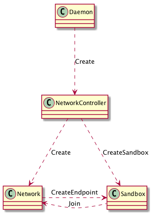

# Docker Networking

## The Container Network Model


- Sandbox: 包含容器网络协议栈的配置，如：网络接口、路由表、DNS 设置等。Sandbox 可包含多个网络的多个 Endpoint。

- Endpoint: 连接 Sandbox 与底层网络。可用 veth, Open vSwitch 实现。

- Network: 包含一组可互相直接通信的 Endpoint。可通过 VLAN、Linux Bridge 实现。

核心对象与 Daemon 的关联图：



## 对象

- NetworkController: 用户可见，管理 libnetwork

- Driver: 用户不可见，提供网络驱动；用户可通过 NetworkController 配置驱动。支持 remote 驱动。

- Network: 提供 CNM:Network 的实现。可通过 NetworkController 创建、管理 Network 对象。

- Endpoint: 服务端点，为容器暴露出的服务与同网络其他容器暴露的服务提供连通性。由 Network 创建。

- Sandbox: 容器的网络配置。在用户请求创建 Endpoint 时创建。所需资源由 Driver 提供。

- Options: 用户提供的 Driver 相关配置。

- Labels: 用户可见的 Options 子集。

## CNM Lifecycle

- 注册 Drivers.

- libnetwork.New() -> NetworkController

- NetworkController.NewNetwork(options, labels) -> Network

- Network.CreateEndpoint -> Endpoint

- Endpoint.Join(): 连接容器与 Endpoint

- Endpoint.Leave()

- Endpoint.Delete()

- Network.Delete()

## Dockerd 网络初始化

Dockerd 的网络初始化是在 Daemon 对象创建时进行的：

```go
daemon.netController, err = daemon.initNetworkController(daemon.configStore, activeSandboxes)
```

我们以 Linux 系统为例，在 initNetworkController 中主要执行了以下操作：

- 生成 libnetwork 配置文件

```go
netOptions, err := daemon.networkOptions(config, daemon.PluginStore, activeSandboxes)
```

- 创建 NetworkController

```go
controller, err := libnetwork.New(netOptions...)
```

- 创建 null 网络

```go
if n, _ := controller.NetworkByName("none"); n == nil {
	if _, err := controller.NewNetwork("null", "none", "", libnetwork.NetworkOptionPersist(true)); err != nil {
		return nil, fmt.Errorf("Error creating default \"null\" network: %v", err)
	}
}
```

- 创建 host 网络

```go
if n, _ := controller.NetworkByName("host"); n == nil {
	if _, err := controller.NewNetwork("host", "host", "", libnetwork.NetworkOptionPersist(true)); err != nil {
		return nil, fmt.Errorf("Error creating default \"host\" network: %v", err)
	}
}
```

- 初始化 bridge 网络

```go
// 如果有旧的 bridge 网络，移除
if n, err := controller.NetworkByName("bridge"); err == nil {
	if err = n.Delete(); err != nil {
		return nil, fmt.Errorf("could not delete the default bridge network: %v", err)
	}
}

if !config.DisableBridge {
	// 没有禁用 bridge 网络，创建
	if err := initBridgeDriver(controller, config); err != nil {
		return nil, err
	}
} else {
	// 如果禁用 bridge，清理 bridge 接口
	removeDefaultBridgeInterface()
}
```

## References

- [Network Overview](https://docs.docker.com/network/)
- [Networking with standalone containers](https://docs.docker.com/network/network-tutorial-standalone/)
- [Networking using the host network](https://docs.docker.com/network/network-tutorial-host/)
- [Networking with overlay networks](https://docs.docker.com/network/network-tutorial-overlay/)
- [Networking using a macvlan network](https://docs.docker.com/network/network-tutorial-macvlan/)
- [libnetwork](https://github.com/docker/libnetwork)
- [Libnetwork Design Documentation](https://github.com/docker/libnetwork/blob/master/docs/design.md)
- [Kuryr](https://github.com/openstack/kuryr)