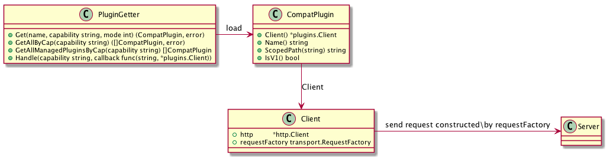

# Plugin

插件系统，为 docker 提供了特定的扩展能力。Docker 的插件系统采用 HTTP 服务形式，全景图如下：



## Volumn 插件

以 volumn 插件为例，首先，定义 Driver 结构：

```go
type Driver interface {
	Create(*CreateRequest) error
	List() (*ListResponse, error)
	Get(*GetRequest) (*GetResponse, error)
	Remove(*RemoveRequest) error
	Path(*PathRequest) (*PathResponse, error)
	Mount(*MountRequest) (*MountResponse, error)
	Unmount(*UnmountRequest) error
	Capabilities() *CapabilitiesResponse
}
```

插件实现者，只要实现该接口即可。在 [go-plugins-helper](https://github.com/docker/go-plugins-helpers) 中定义的接口，与 docker 源码中的接口是完全一致的。

然后，通过 NewHandler 创建一个 Handler 结构：

```go
func NewHandler(driver Driver) *Handler {
	h := &Handler{driver, sdk.NewHandler(manifest)}
	h.initMux()
	return h
}

type Handler struct {
	driver Driver
	sdk.Handler
}
```

Handler 结构通过路由调用 Driver 中方法即可：

```go
func (h *Handler) initMux() {
	h.HandleFunc(createPath, func(w http.ResponseWriter, r *http.Request) {
		log.Println("Entering go-plugins-helpers createPath")
		req := &CreateRequest{}
		err := sdk.DecodeRequest(w, r, req)
		if err != nil {
			return
		}
		err = h.driver.Create(req)
		if err != nil {
			sdk.EncodeResponse(w, NewErrorResponse(err.Error()), true)
			return
		}
		sdk.EncodeResponse(w, struct{}{}, false)
	})
	h.HandleFunc(removePath, func(w http.ResponseWriter, r *http.Request) {
		log.Println("Entering go-plugins-helpers removePath")
		req := &RemoveRequest{}
		err := sdk.DecodeRequest(w, r, req)
		if err != nil {
			return
		}
		err = h.driver.Remove(req)
		if err != nil {
			sdk.EncodeResponse(w, NewErrorResponse(err.Error()), true)
			return
		}
		sdk.EncodeResponse(w, struct{}{}, false)
	})
	h.HandleFunc(mountPath, func(w http.ResponseWriter, r *http.Request) {
		log.Println("Entering go-plugins-helpers mountPath")
		req := &MountRequest{}
		err := sdk.DecodeRequest(w, r, req)
		if err != nil {
			return
		}
		res, err := h.driver.Mount(req)
		if err != nil {
			sdk.EncodeResponse(w, NewErrorResponse(err.Error()), true)
			return
		}
		sdk.EncodeResponse(w, res, false)
	})
	h.HandleFunc(hostVirtualPath, func(w http.ResponseWriter, r *http.Request) {
		log.Println("Entering go-plugins-helpers hostVirtualPath")
		req := &PathRequest{}
		err := sdk.DecodeRequest(w, r, req)
		if err != nil {
			return
		}
		res, err := h.driver.Path(req)
		if err != nil {
			sdk.EncodeResponse(w, NewErrorResponse(err.Error()), true)
			return
		}
		sdk.EncodeResponse(w, res, false)
	})
	h.HandleFunc(getPath, func(w http.ResponseWriter, r *http.Request) {
		log.Println("Entering go-plugins-helpers getPath")
		req := &GetRequest{}
		err := sdk.DecodeRequest(w, r, req)
		if err != nil {
			return
		}
		res, err := h.driver.Get(req)
		if err != nil {
			sdk.EncodeResponse(w, NewErrorResponse(err.Error()), true)
			return
		}
		sdk.EncodeResponse(w, res, false)
	})
	h.HandleFunc(unmountPath, func(w http.ResponseWriter, r *http.Request) {
		log.Println("Entering go-plugins-helpers unmountPath")
		req := &UnmountRequest{}
		err := sdk.DecodeRequest(w, r, req)
		if err != nil {
			return
		}
		err = h.driver.Unmount(req)
		if err != nil {
			sdk.EncodeResponse(w, NewErrorResponse(err.Error()), true)
			return
		}
		sdk.EncodeResponse(w, struct{}{}, false)
	})
	h.HandleFunc(listPath, func(w http.ResponseWriter, r *http.Request) {
		log.Println("Entering go-plugins-helpers listPath")
		res, err := h.driver.List()
		if err != nil {
			sdk.EncodeResponse(w, NewErrorResponse(err.Error()), true)
			return
		}
		sdk.EncodeResponse(w, res, false)
	})

	h.HandleFunc(capabilitiesPath, func(w http.ResponseWriter, r *http.Request) {
		log.Println("Entering go-plugins-helpers capabilitiesPath")
		sdk.EncodeResponse(w, h.driver.Capabilities(), false)
	})
}
```

## Reference

- [go-plugins-helper](https://github.com/docker/go-plugins-helpers)
- [Legacy Plugins](https://docs.docker.com/engine/extend/legacy_plugins/)
