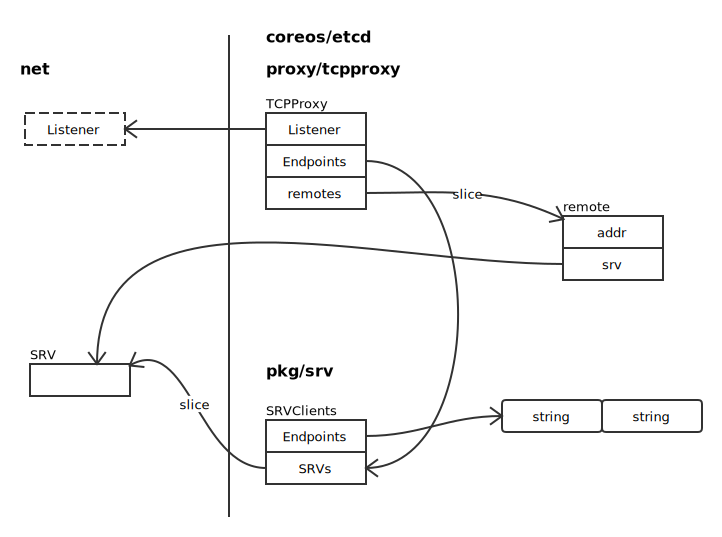
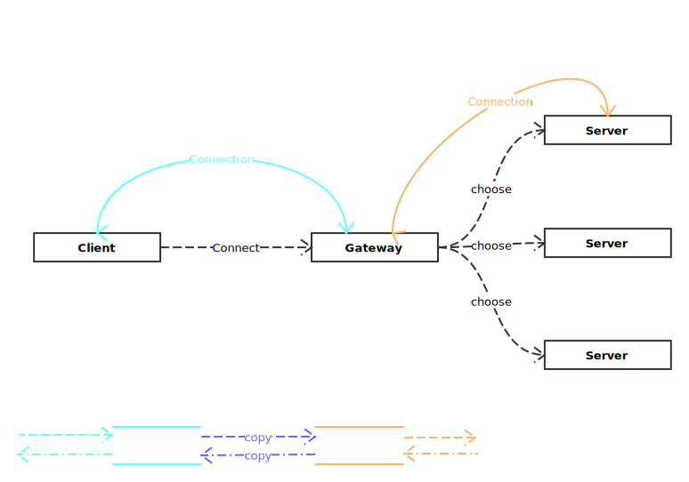

# Gateway

## 涉及数据结构



## 代理原理



选择一个后端服务器：

```go
for {
	tp.mu.Lock()
	remote := tp.pick()	// 根据规则，选择一个后端服务
	tp.mu.Unlock()
	if remote == nil {
		break
	}
	// TODO: add timeout
	out, err = net.Dial("tcp", remote.addr)
	// 连接成功，跳出循环
	if err == nil {
		break
	}

	// 标记当前选择的后端为不可用状态
	remote.inactivate()
	plog.Warningf("deactivated endpoint [%s] due to %v for %v", remote.addr, err, tp.MonitorInterval)
}
```

代理开始：

```go
if out == nil {
	in.Close()
	return
}

go func() {
	io.Copy(in, out)
	in.Close()
	out.Close()
}()

io.Copy(out, in)
out.Close()
in.Close()
```
