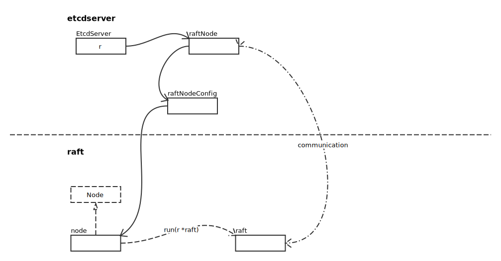
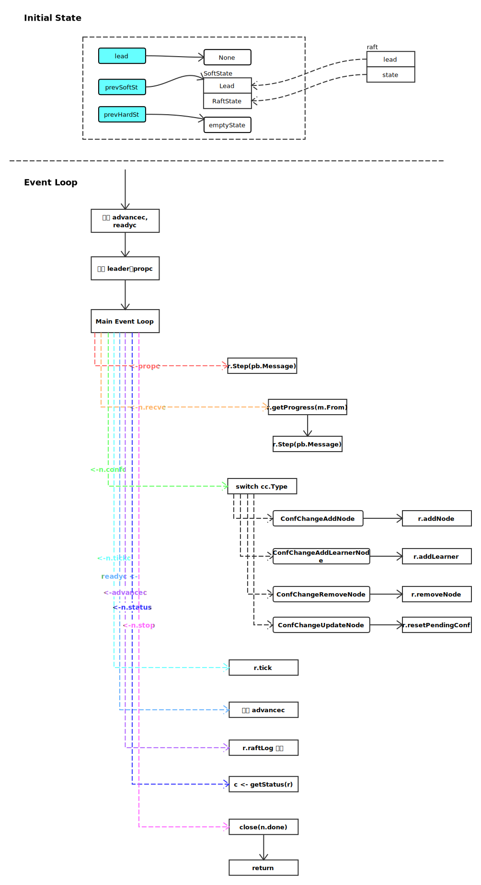
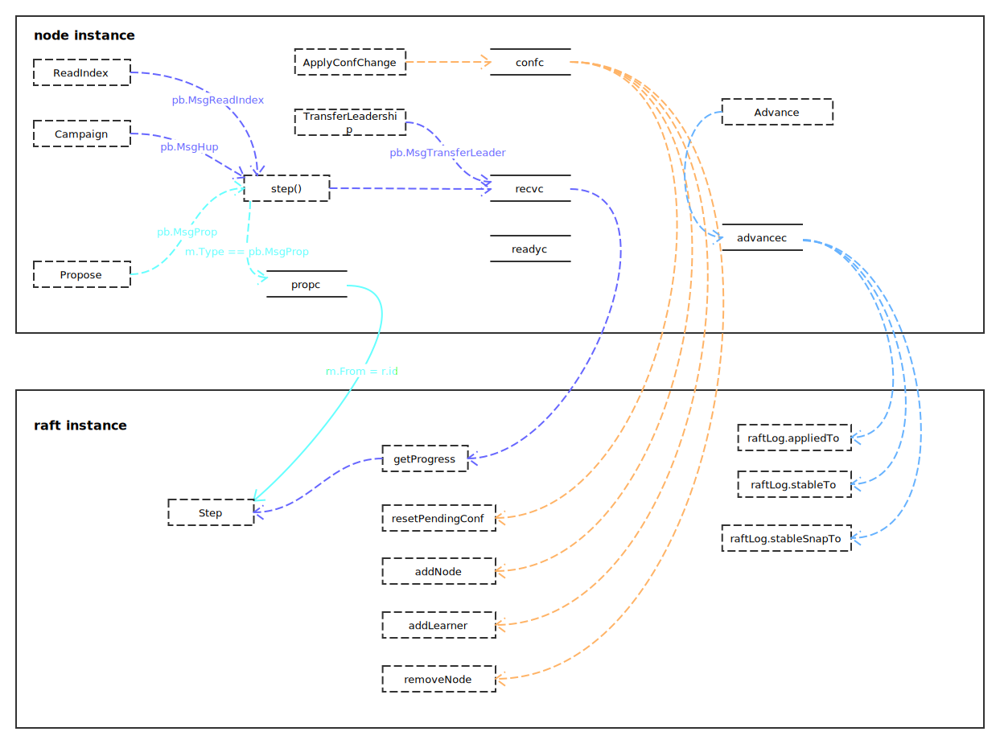
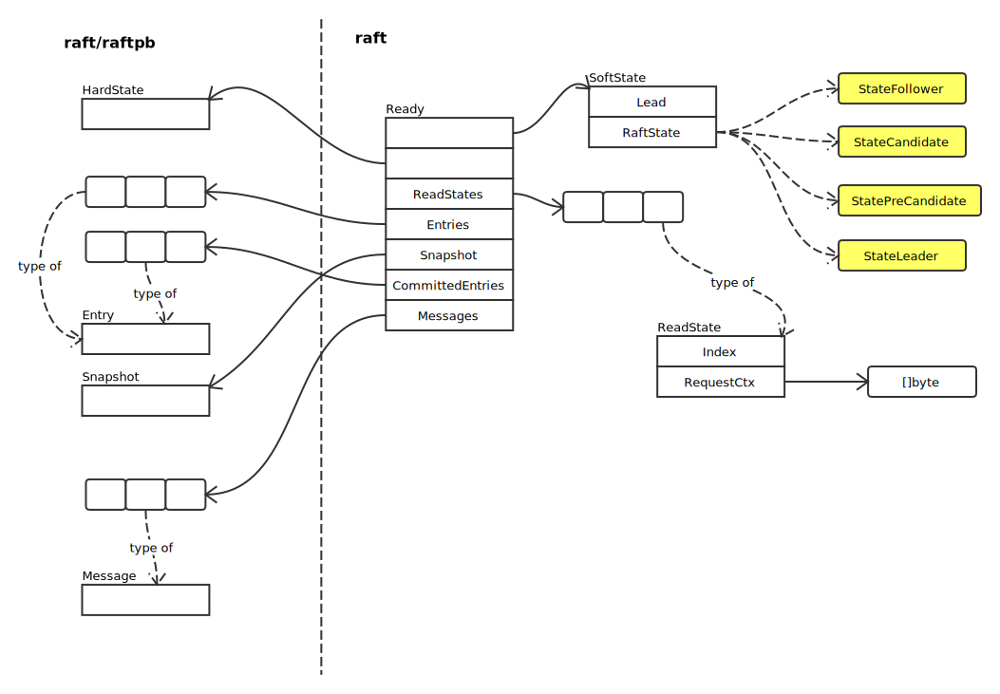
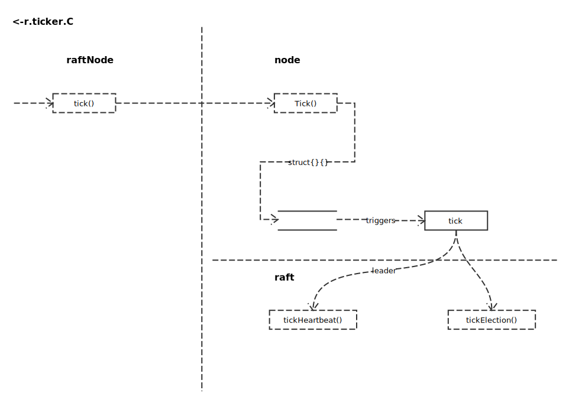

# Raft Hanling Process

## Overview



## node.run

全景图如下：



### Raft Handling Procedures



#### Step 方法

方法声明：

```go
func (r *raft) Step(m pb.Message) error
```

处理 Term：

```go
switch {
case m.Term == 0:
	// 本地消息，非 Raft 协议内容
case m.Term > r.Term:
	if m.Type == pb.MsgVote || m.Type == pb.MsgPreVote {
		force := bytes.Equal(m.Context, []byte(campaignTransfer))
		inLease := r.checkQuorum && r.lead != None && r.electionElapsed < r.electionTimeout
		if !force && inLease {
			// 如果本服务器在当前 Leader 超时前，收到其他服务器的 RequestVote 请求，不更新本服务器 Term，且不给投票
			r.logger.Infof("%x [logterm: %d, index: %d, vote: %x] ignored %s from %x [logterm: %d, index: %d] at term %d: lease is not expired (remaining ticks: %d)",
				r.id, r.raftLog.lastTerm(), r.raftLog.lastIndex(), r.Vote, m.Type, m.From, m.LogTerm, m.Index, r.Term, r.electionTimeout-r.electionElapsed)
			return nil
		}
	}
	switch {
	case m.Type == pb.MsgPreVote:
		// PreVote 时，不改变本地 Term
	case m.Type == pb.MsgPreVoteResp && !m.Reject:
		// 当发出 MsgPreVote 后，由于使用的一定是下一个 Term；如果对端服务器投票成功，那么当获取多数票后，更新 Term；
		// 如果对端拒绝投票，同时，对端服务器的 Term 大于自身，那么本服务器需要变为 Follower(进入 default 分支)
	default:
		r.logger.Infof("%x [term: %d] received a %s message with higher term from %x [term: %d]",
			r.id, r.Term, m.Type, m.From, m.Term)
		if m.Type == pb.MsgApp || m.Type == pb.MsgHeartbeat || m.Type == pb.MsgSnap {
			r.becomeFollower(m.Term, m.From)
		} else {
			r.becomeFollower(m.Term, None)
		}
	}

case m.Term < r.Term:
	if r.checkQuorum && (m.Type == pb.MsgHeartbeat || m.Type == pb.MsgApp) {
		// We have received messages from a leader at a lower term. It is possible
		// that these messages were simply delayed in the network, but this could
		// also mean that this node has advanced its term number during a network
		// partition, and it is now unable to either win an election or to rejoin
		// the majority on the old term. If checkQuorum is false, this will be
		// handled by incrementing term numbers in response to MsgVote with a
		// higher term, but if checkQuorum is true we may not advance the term on
		// MsgVote and must generate other messages to advance the term. The net
		// result of these two features is to minimize the disruption caused by
		// nodes that have been removed from the cluster's configuration: a
		// removed node will send MsgVotes (or MsgPreVotes) which will be ignored,
		// but it will not receive MsgApp or MsgHeartbeat, so it will not create
		// disruptive term increases
		r.send(pb.Message{To: m.From, Type: pb.MsgAppResp})
	} else {
		// ignore other cases
		r.logger.Infof("%x [term: %d] ignored a %s message with lower term from %x [term: %d]",
			r.id, r.Term, m.Type, m.From, m.Term)
	}
	return nil
}
```

消息类型处理：

```go
switch m.Type {
case pb.MsgHup:
	if r.state != StateLeader {
		ents, err := r.raftLog.slice(r.raftLog.applied+1, r.raftLog.committed+1, noLimit)
		if err != nil {
			r.logger.Panicf("unexpected error getting unapplied entries (%v)", err)
		}
		// 存在未应用的配置变更项
		if n := numOfPendingConf(ents); n != 0 && r.raftLog.committed > r.raftLog.applied {
			r.logger.Warningf("%x cannot campaign at term %d since there are still %d pending configuration changes to apply", r.id, r.Term, n)
			return nil
		}

		// 发起竞选
		r.logger.Infof("%x is starting a new election at term %d", r.id, r.Term)
		if r.preVote {
			r.campaign(campaignPreElection)
		} else {
			r.campaign(campaignElection)
		}
	} else {
		r.logger.Debugf("%x ignoring MsgHup because already leader", r.id)
	}

case pb.MsgVote, pb.MsgPreVote:
	if r.isLearner {
		// Learner 不投票
		r.logger.Infof("%x [logterm: %d, index: %d, vote: %x] ignored %s from %x [logterm: %d, index: %d] at term %d: learner can not vote",
			r.id, r.raftLog.lastTerm(), r.raftLog.lastIndex(), r.Vote, m.Type, m.From, m.LogTerm, m.Index, r.Term)
		return nil
	}
	// The m.Term > r.Term clause is for MsgPreVote. For MsgVote m.Term should
	// always equal r.Term.
	if (r.Vote == None || m.Term > r.Term || r.Vote == m.From) && r.raftLog.isUpToDate(m.Index, m.LogTerm) {
		r.logger.Infof("%x [logterm: %d, index: %d, vote: %x] cast %s for %x [logterm: %d, index: %d] at term %d",
			r.id, r.raftLog.lastTerm(), r.raftLog.lastIndex(), r.Vote, m.Type, m.From, m.LogTerm, m.Index, r.Term)
		// When responding to Msg{Pre,}Vote messages we include the term
		// from the message, not the local term. To see why consider the
		// case where a single node was previously partitioned away and
		// it's local term is now of date. If we include the local term
		// (recall that for pre-votes we don't update the local term), the
		// (pre-)campaigning node on the other end will proceed to ignore
		// the message (it ignores all out of date messages).
		// The term in the original message and current local term are the
		// same in the case of regular votes, but different for pre-votes.
		r.send(pb.Message{To: m.From, Term: m.Term, Type: voteRespMsgType(m.Type)})
		if m.Type == pb.MsgVote {
			// Only record real votes.
			r.electionElapsed = 0
			r.Vote = m.From
		}
	} else {
		r.logger.Infof("%x [logterm: %d, index: %d, vote: %x] rejected %s from %x [logterm: %d, index: %d] at term %d",
			r.id, r.raftLog.lastTerm(), r.raftLog.lastIndex(), r.Vote, m.Type, m.From, m.LogTerm, m.Index, r.Term)
		r.send(pb.Message{To: m.From, Term: r.Term, Type: voteRespMsgType(m.Type), Reject: true})
	}

default:
	r.step(r, m)
}
```

#### Ready 结构



## raftNode.start

### r.ticker 处理


