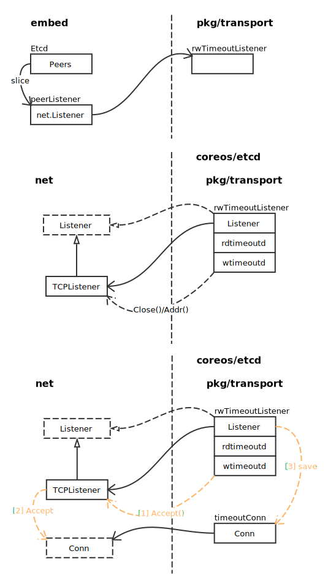
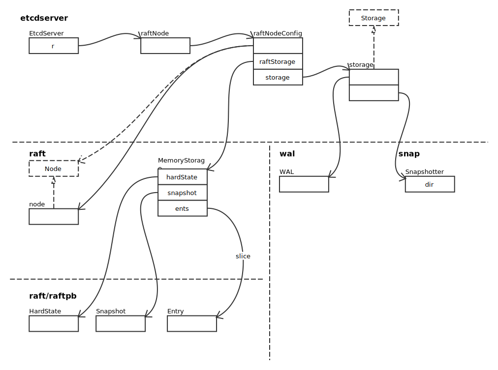
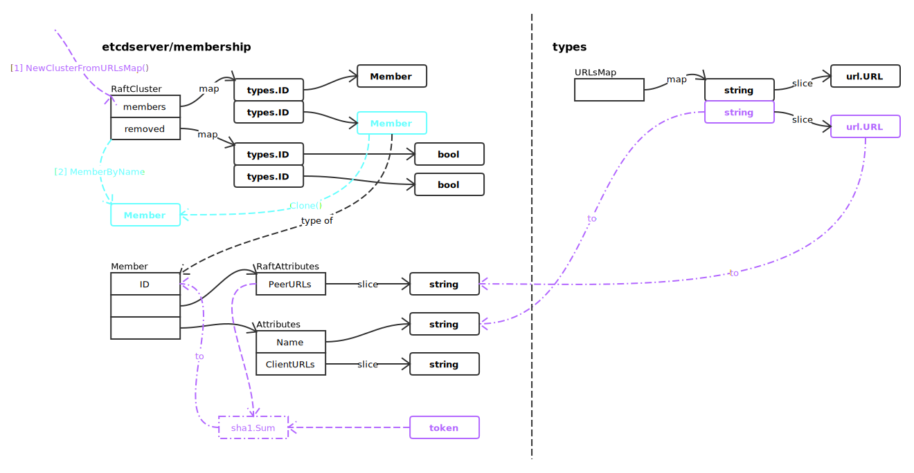
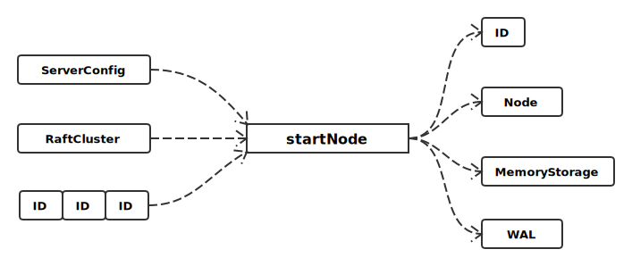
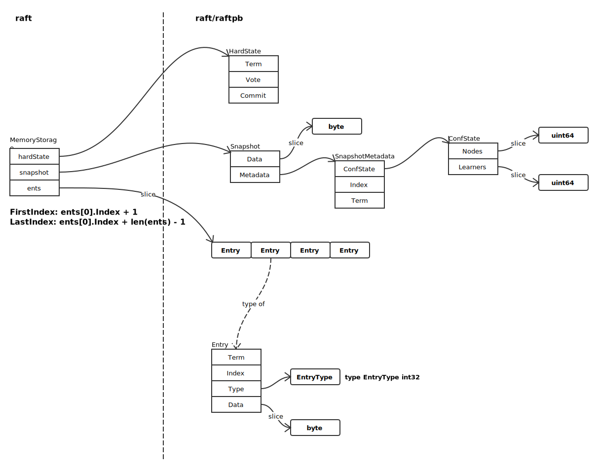
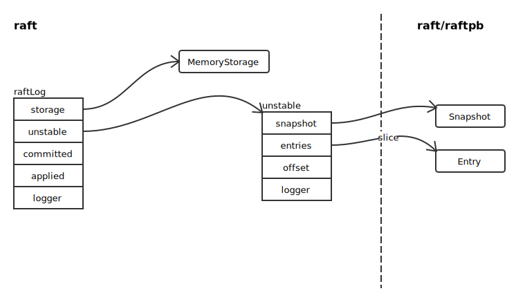
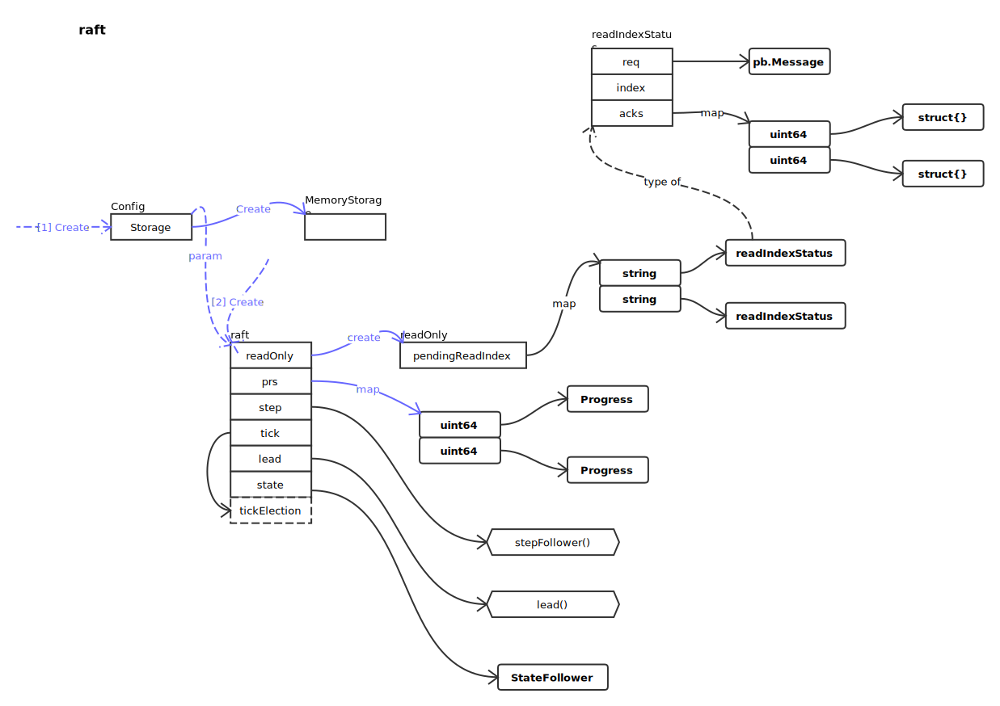
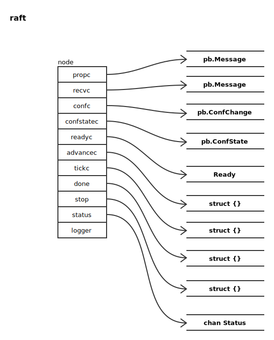

# Raft

## 辅助结构

### Raft Listener



### RaftNode



## 创建过程

### 创建集群结构

首先创建 RaftCluster 结构，**RaftCluster** 记录当前集群全部 Member 的基本信息。



然后执行 etcdserver/raft.go 中 startNode 方法创建 Raft 节点：

### startNode

函数定义：

```go
func startNode(cfg ServerConfig, cl *membership.RaftCluster, ids []types.ID) (id types.ID, n raft.Node, s *raft.MemoryStorage, w *wal.WAL)
```



```go
// 获取当前服务器信息
member := cl.MemberByName(cfg.Name)

// 构建元数据
metadata := pbutil.MustMarshal(
	&pb.Metadata{
		NodeID:    uint64(member.ID),
		ClusterID: uint64(cl.ID()),
	},
)
```

根据 **metadata** 构建 WAL 日志：

```go
if w, err = wal.Create(cfg.WALDir(), metadata); err != nil {
	plog.Fatalf("create wal error: %v", err)
}
```

关于 WAL 的详细介绍，请看 [WAL](wal.md)。

构建全部 Peers：

```go
peers := make([]raft.Peer, len(ids))
for i, id := range ids {
	ctx, err := json.Marshal((*cl).Member(id))
	if err != nil {
		plog.Panicf("marshal member should never fail: %v", err)
	}
	peers[i] = raft.Peer{ID: uint64(id), Context: ctx}
}
```

创建 MemoryStorage:

```go
s = raft.NewMemoryStorage()
```

如下图所示：



创建配置文件，并调用 raft.StartNode 启动节点。

```go
c := &raft.Config{
	ID:              uint64(id),
	ElectionTick:    cfg.ElectionTicks,
	HeartbeatTick:   1,
	Storage:         s,
	MaxSizePerMsg:   maxSizePerMsg,
	MaxInflightMsgs: maxInflightMsgs,
	CheckQuorum:     true,
}

n = raft.StartNode(c, peers)
```

### raft.StartNode

创建 raft 协议处理结构：

```go
r := newRaft(c)
```

#### newRaft

创建 raftLog：

```go
raftlog := newLog(c.Storage, c.Logger)
```

结构如下图所示:



获取记录的状态：

```go
hs, cs, err := c.Storage.InitialState()
```

获取 peers 及 learners 信息，并检查：

```go
peers := c.peers
learners := c.learners
if len(cs.Nodes) > 0 || len(cs.Learners) > 0 {
	if len(peers) > 0 || len(learners) > 0 {
		// TODO(bdarnell): the peers argument is always nil except in
		// tests; the argument should be removed and these tests should be
		// updated to specify their nodes through a snapshot.
		panic("cannot specify both newRaft(peers, learners) and ConfState.(Nodes, Learners)")
	}
	peers = cs.Nodes
	learners = cs.Learners
}
```

创建 raft 结构：

```go
r := &raft{
	id:                        c.ID,
	lead:                      None,
	isLearner:                 false,
	raftLog:                   raftlog,
	maxMsgSize:                c.MaxSizePerMsg,
	maxInflight:               c.MaxInflightMsgs,
	prs:                       make(map[uint64]*Progress),
	learnerPrs:                make(map[uint64]*Progress),
	electionTimeout:           c.ElectionTick,
	heartbeatTimeout:          c.HeartbeatTick,
	logger:                    c.Logger,
	checkQuorum:               c.CheckQuorum,
	preVote:                   c.PreVote,
	readOnly:                  newReadOnly(c.ReadOnlyOption),
	disableProposalForwarding: c.DisableProposalForwarding,
}
```

恢复从 Leader 视角观察的每个节点的进度：

```go
for _, p := range peers {
	r.prs[p] = &Progress{Next: 1, ins: newInflights(r.maxInflight)}
}
for _, p := range learners {
	if _, ok := r.prs[p]; ok {
		panic(fmt.Sprintf("node %x is in both learner and peer list", p))
	}
	r.learnerPrs[p] = &Progress{Next: 1, ins: newInflights(r.maxInflight), IsLearner: true}
	if r.id == p {
		r.isLearner = true
	}
}
```

恢复最后的状态：

```go
if !isHardStateEqual(hs, emptyState) {
	r.loadState(hs)
}
if c.Applied > 0 {
	raftlog.appliedTo(c.Applied)
}
```

节点启动时，默认为 Follower：

```go
r.becomeFollower(r.Term, None) // None 表示没有 Leader
```

最终如下图所示：



----

newRaft 执行完毕后，由于是首次启动，需要执行：

```go
r.becomeFollower(1, None) // Term 为 1， 没有 Leader
```

并将全部已知节点写入日志：

```go
for _, peer := range peers {
	cc := pb.ConfChange{Type: pb.ConfChangeAddNode, NodeID: peer.ID, Context: peer.Context}
	d, err := cc.Marshal()
	if err != nil {
		panic("unexpected marshal error")
	}
	e := pb.Entry{Type: pb.EntryConfChange, Term: 1, Index: r.raftLog.lastIndex() + 1, Data: d}
	r.raftLog.append(e)
}
```

并标记配置项为已提交状态：

```go
r.raftLog.committed = r.raftLog.lastIndex()
```

添加全部已知节点信息：

```go
for _, peer := range peers {
	r.addNode(peer.ID) // r.addNodeOrLearnerNode(peer.ID, false)
}
```

#### addNodeOrLearnerNode

```go
func (r *raft) addNodeOrLearnerNode(id uint64, isLearner bool) {
	r.pendingConf = false

	// 获取节点同步进度信息
	pr := r.getProgress(id)

	// 如果不存在，认为是新增节点，添加同步记录
	if pr == nil {
		r.setProgress(id, 0, r.raftLog.lastIndex()+1, isLearner)
	} else {
		// 状态不匹配；记录中，id 节点不是 Learner
		if isLearner && !pr.IsLearner {
			r.logger.Infof("%x ignored addLeaner: do not support changing %x from raft peer to learner.", r.id, id)
			return
		}

		// 状态一致，不做任何后续处理
		if isLearner == pr.IsLearner {
			return
		}

		// Learner -> Voter，从 learnerPrs 中移除 id，并更新 IsLearner 状态为 false
		delete(r.learnerPrs, id)
		pr.IsLearner = false
		r.prs[id] = pr
	}

	// 如果是调整自己，修正状态
	if r.id == id {
		r.isLearner = isLearner
	}

	// When a node is first added, we should mark it as recently active.
	// Otherwise, CheckQuorum may cause us to step down if it is invoked
	// before the added node has a chance to communicate with us.
	pr = r.getProgress(id)
	pr.RecentActive = true
}
```

然后创建 node：

```go
n := newNode()
```

执行完毕后如下图：



最后执行：

```go
go n.run(r)
```

并返回 node：

```go
return &n
```

## References

- [The Raft Consensus Algorithm](https://raft.github.io/)
