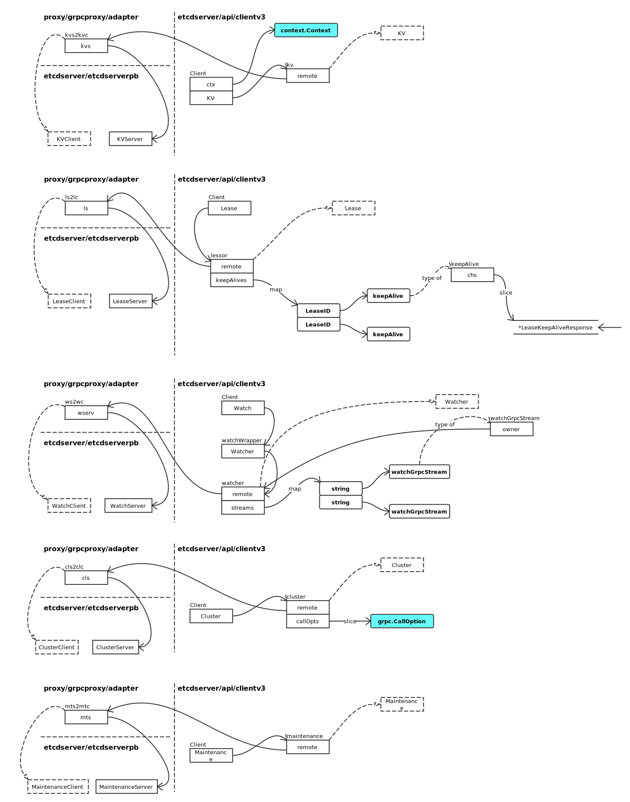

# Client Request Handling

## Server Context


创建 serverCtx：

```go
func startClientListeners(cfg *Config) (sctxs map[string]*serveCtx, err error) {
	sctxs = make(map[string]*serveCtx)
	for _, u := range cfg.LCUrls {
		sctx := newServeCtx()

		// ...

		if sctx.l, err = net.Listen(proto, addr); err != nil {
			return nil, err
		}
		sctx.addr = addr

		// ...

		for k := range cfg.UserHandlers {
			sctx.userHandlers[k] = cfg.UserHandlers[k]
		}
		sctx.serviceRegister = cfg.ServiceRegister

		// ...

		sctxs[addr] = sctx
	}
}
```

### serve 方法


