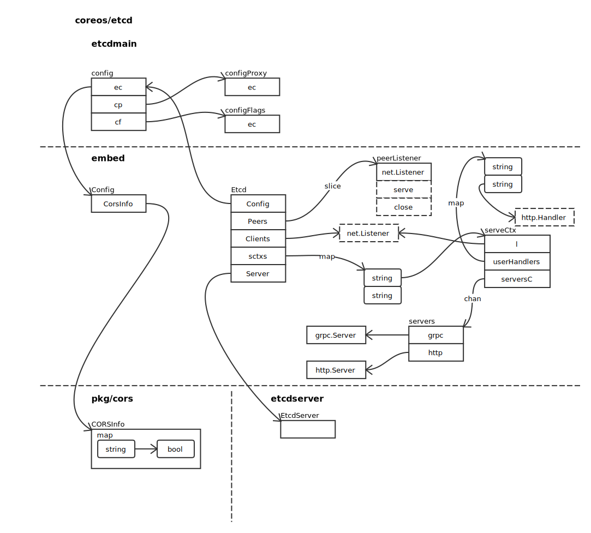

# Server

## Overview



## 启动

### startEtcd

源码如下：

```go
func startEtcd(cfg *embed.Config) (<-chan struct{}, <-chan error, error) {
	e, err := embed.StartEtcd(cfg)
	if err != nil {
		return nil, nil, err
	}
	osutil.RegisterInterruptHandler(e.Close)
	select {
	case <-e.Server.ReadyNotify(): // wait for e.Server to join the cluster
	case <-e.Server.StopNotify(): // publish aborted from 'ErrStopped'
	}
	return e.Server.StopNotify(), e.Err(), nil
}
```

首先创建 Etcd 结构，并注册信号量处理函数 e.Close。然后等待服务器 Ready 或 Stop，最后返回。重点方法应该为： ```go embed.StartEtcd ```.

### StartEtcd

验证传入的 Config 参数：

```go
if err = inCfg.Validate(); err != nil {
	return nil, err
}
```

创建 Etcd 结构体：

```go
e = &Etcd{cfg: *inCfg, stopc: make(chan struct{})}
```

启动 Raft 处理，详细过程请参照 [Raft](../raft/raft.md)：

```go
if e.Peers, err = startPeerListeners(cfg); err != nil {
	return e, err
}
```

然后启动请求处理，详细过程请参照 [Client Request Handling](client_handling.md)：

```go
if e.sctxs, err = startClientListeners(cfg); err != nil {
	return e, err
}

for _, sctx := range e.sctxs {
	e.Clients = append(e.Clients, sctx.l)
}
```

创建配置文件，并构建 EtcdServer：

```go
srvcfg := etcdserver.ServerConfig{
	Name:                       cfg.Name,
	ClientURLs:                 cfg.ACUrls,
	PeerURLs:                   cfg.APUrls,
	DataDir:                    cfg.Dir,
	DedicatedWALDir:            cfg.WalDir,
	SnapCount:                  cfg.SnapCount,
	MaxSnapFiles:               cfg.MaxSnapFiles,
	MaxWALFiles:                cfg.MaxWalFiles,
	InitialPeerURLsMap:         urlsmap,
	InitialClusterToken:        token,
	DiscoveryURL:               cfg.Durl,
	DiscoveryProxy:             cfg.Dproxy,
	NewCluster:                 cfg.IsNewCluster(),
	ForceNewCluster:            cfg.ForceNewCluster,
	PeerTLSInfo:                cfg.PeerTLSInfo,
	TickMs:                     cfg.TickMs,
	ElectionTicks:              cfg.ElectionTicks(),
	InitialElectionTickAdvance: cfg.InitialElectionTickAdvance,
	AutoCompactionRetention:    autoCompactionRetention,
	AutoCompactionMode:         cfg.AutoCompactionMode,
	QuotaBackendBytes:          cfg.QuotaBackendBytes,
	MaxTxnOps:                  cfg.MaxTxnOps,
	MaxRequestBytes:            cfg.MaxRequestBytes,
	StrictReconfigCheck:        cfg.StrictReconfigCheck,
	ClientCertAuthEnabled:      cfg.ClientTLSInfo.ClientCertAuth,
	AuthToken:                  cfg.AuthToken,
	InitialCorruptCheck:        cfg.ExperimentalInitialCorruptCheck,
	CorruptCheckTime:           cfg.ExperimentalCorruptCheckTime,
	Debug:                      cfg.Debug,
}

if e.Server, err = etcdserver.NewServer(srvcfg); err != nil {
	return e, err
}
```

启动服务：

```go
e.Server.Start()

if err = e.servePeers(); err != nil {
	return e, err
}
if err = e.serveClients(); err != nil {
	return e, err
}
if err = e.serveMetrics(); err != nil {
	return e, err
}
```
