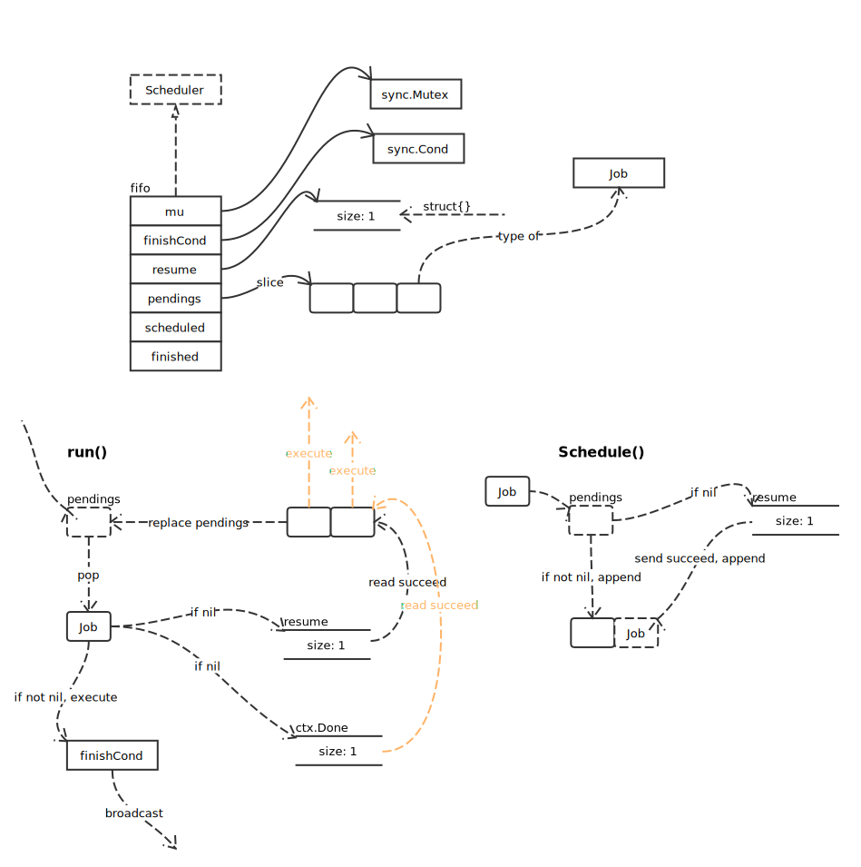

# 辅助结构

## Wait


## WaitTime


## notifier

记录错误并，发送通知：

```go
type notifier struct {
	c   chan struct{}
	err error
}

func newNotifier() *notifier {
	return &notifier{
		c: make(chan struct{}),
	}
}

func (nc *notifier) notify(err error) {
	nc.err = err
	close(nc.c)
}
```

## Scheduler



- Schedule

```go
func (f *fifo) Schedule(j Job) {
	f.mu.Lock()
	defer f.mu.Unlock()

	if f.cancel == nil {
		panic("schedule: schedule to stopped scheduler")
	}

	// pendings 队列为空
	if len(f.pendings) == 0 {
		// 锁的存在，已经可以保证发送一定成功；使用 default 只是为了更加保险
		select {
		case f.resume <- struct{}{}:
		default:
		}
	}
	f.pendings = append(f.pendings, j)
}
```
