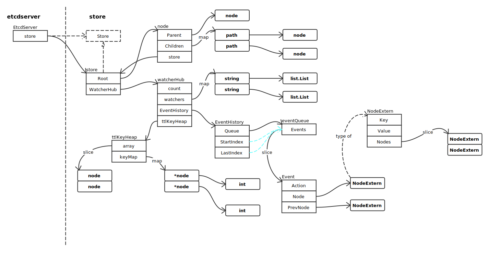
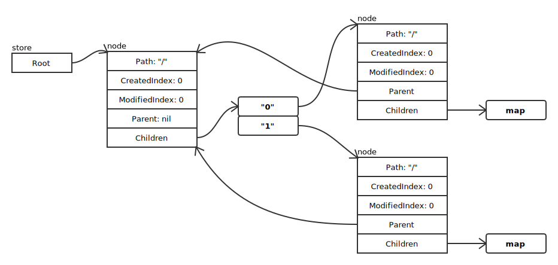
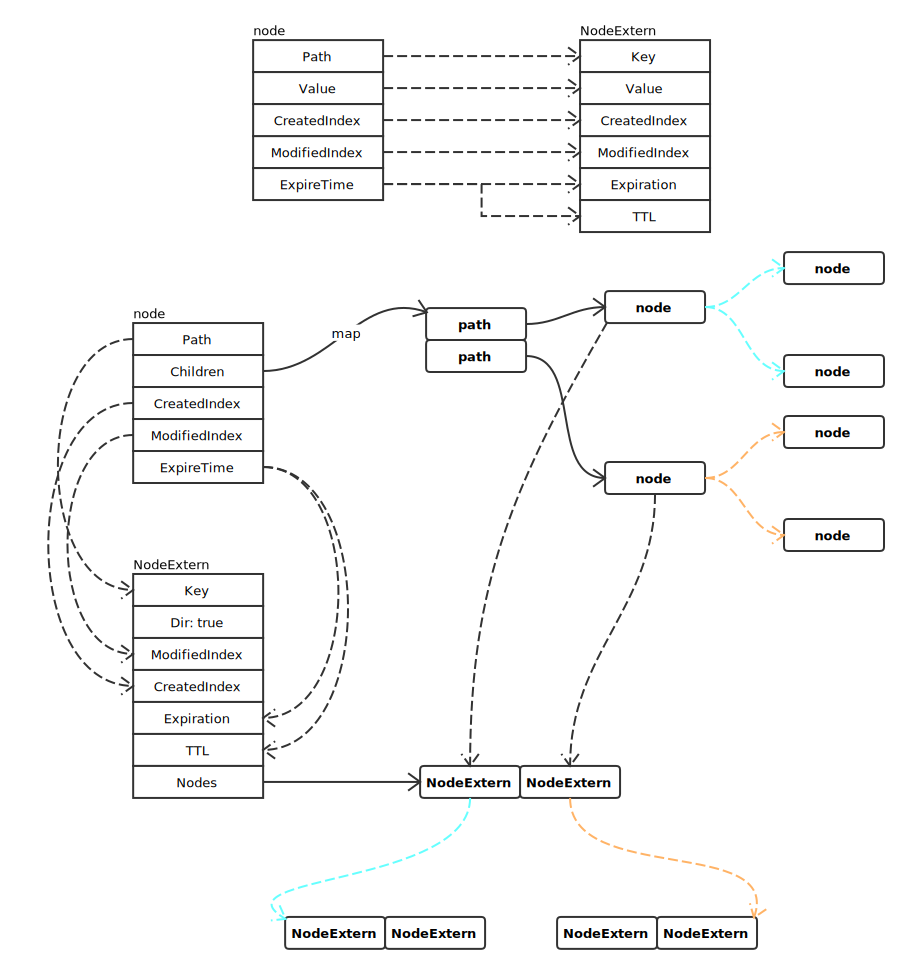
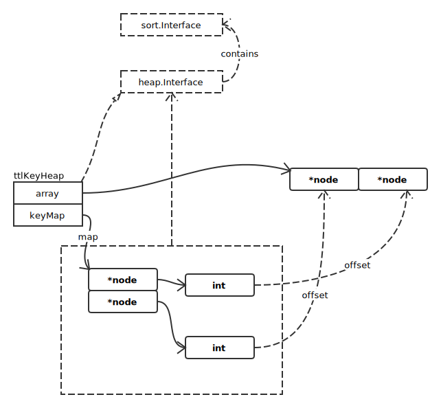

# Storage

## Store Overview



Store 接口定义：

```go
type Store interface {
	Version() int
	Index() uint64

	Get(nodePath string, recursive, sorted bool) (*Event, error)
	Set(nodePath string, dir bool, value string, expireOpts TTLOptionSet) (*Event, error)
	Update(nodePath string, newValue string, expireOpts TTLOptionSet) (*Event, error)
	Create(nodePath string, dir bool, value string, unique bool,
		expireOpts TTLOptionSet) (*Event, error)
	CompareAndSwap(nodePath string, prevValue string, prevIndex uint64,
		value string, expireOpts TTLOptionSet) (*Event, error)
	Delete(nodePath string, dir, recursive bool) (*Event, error)
	CompareAndDelete(nodePath string, prevValue string, prevIndex uint64) (*Event, error)

	Watch(prefix string, recursive, stream bool, sinceIndex uint64) (Watcher, error)

	Save() ([]byte, error)
	Recovery(state []byte) error

	Clone() Store
	SaveNoCopy() ([]byte, error)

	JsonStats() []byte
	DeleteExpiredKeys(cutoff time.Time)

	HasTTLKeys() bool
}
```

### Node

node 数据结构定义为：

```go
type node struct {
	Path string

	CreatedIndex  uint64
	ModifiedIndex uint64

	Parent *node `json:"-"` // should not encode this field! avoid circular dependency.

	ExpireTime time.Time
	Value      string           // for key-value pair
	Children   map[string]*node // for directory

	// A reference to the store this node is attached to.
	store *store
}
```

如果一个 node 的 Children 不为 nil，那么这个节点是一个 Dir；否则为一个 Key-Value 节点。Dir 节点的 Value 域没有具体值。

store 创建时，构建如下结构：



### 转换为 NodeExtern 结构



### ttlKeyHeap



array 只要负责 append 存储元素即可；排序操作通过 keyMap 操作。使用最小堆的特性，将超时时间最早的元素作为根节点。

### 创建节点

方法定义如下：

```go
func (s *store) internalCreate(nodePath string, dir bool, value string, unique, replace bool, expireTime time.Time, action string) (*Event, *v2error.Error)
```

变量初始化：

```go
	currIndex, nextIndex := s.CurrentIndex, s.CurrentIndex+1

	if unique { // 添加唯一性节点
		nodePath += "/" + fmt.Sprintf("%020s", strconv.FormatUint(nextIndex, 10))
	}

	nodePath = path.Clean(path.Join("/", nodePath))

	// path 是否为只读
	if s.readonlySet.Contains(nodePath) {
		return nil, v2error.NewError(v2error.EcodeRootROnly, "/", currIndex)
	}

	// 获取目录名、节点名称
	dirName, nodeName := path.Split(nodePath)
```

遍历路径，如果路径不存在，则创建，并返回最后一级目录节点结构：

```go
	d, err := s.walk(dirName, s.checkDir)
```

创建通知事件：

```go
	e := newEvent(action, nodePath, nextIndex, nextIndex)
	eNode := e.Node

	n, _ := d.GetChild(nodeName)

	// 如果 nodeName 存在，是否替换
	if n != nil {
		if replace {
			if n.IsDir() {
				return nil, v2error.NewError(v2error.EcodeNotFile, nodePath, currIndex)
			}
			e.PrevNode = n.Repr(false, false, s.clock)

			n.Remove(false, false, nil)
		} else {
			return nil, v2error.NewError(v2error.EcodeNodeExist, nodePath, currIndex)
		}
	}
```

创建新节点（目录、文件）：

```go
	if !dir {
		valueCopy := value
		eNode.Value = &valueCopy

		n = newKV(s, nodePath, value, nextIndex, d, expireTime)

	} else {
		eNode.Dir = true

		n = newDir(s, nodePath, nextIndex, d, expireTime)
	}
```

添加新节点：

```go
	d.Add(n)

	// node with TTL
	if !n.IsPermanent() {
		s.ttlKeyHeap.push(n)

		eNode.Expiration, eNode.TTL = n.expirationAndTTL(s.clock)
	}

	s.CurrentIndex = nextIndex

	return e, nil
```

### 查找节点

```go
func (s *store) internalGet(nodePath string) (*node, *v2error.Error) {
	nodePath = path.Clean(path.Join("/", nodePath))

	// 遍历方法
	walkFunc := func(parent *node, name string) (*node, *v2error.Error) {

		if !parent.IsDir() {
			err := v2error.NewError(v2error.EcodeNotDir, parent.Path, s.CurrentIndex)
			return nil, err
		}

		// 返回子节点
		child, ok := parent.Children[name]
		if ok {
			return child, nil
		}

		return nil, v2error.NewError(v2error.EcodeKeyNotFound, path.Join(parent.Path, name), s.CurrentIndex)
	}

	f, err := s.walk(nodePath, walkFunc)

	if err != nil {
		return nil, err
	}
	return f, nil
}
```
