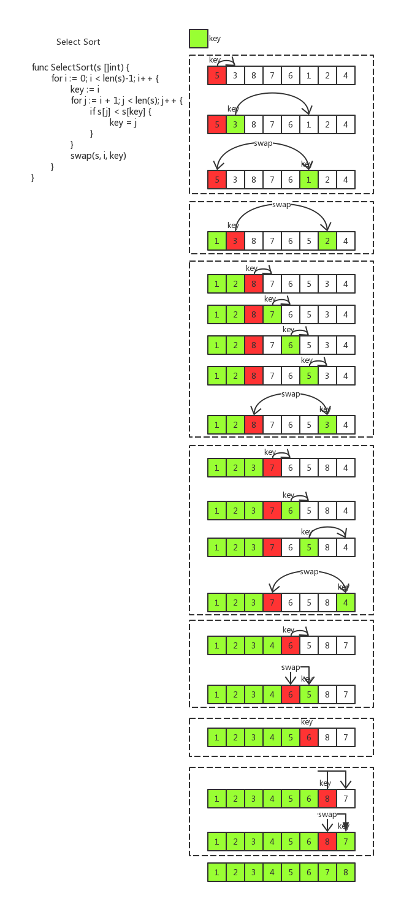
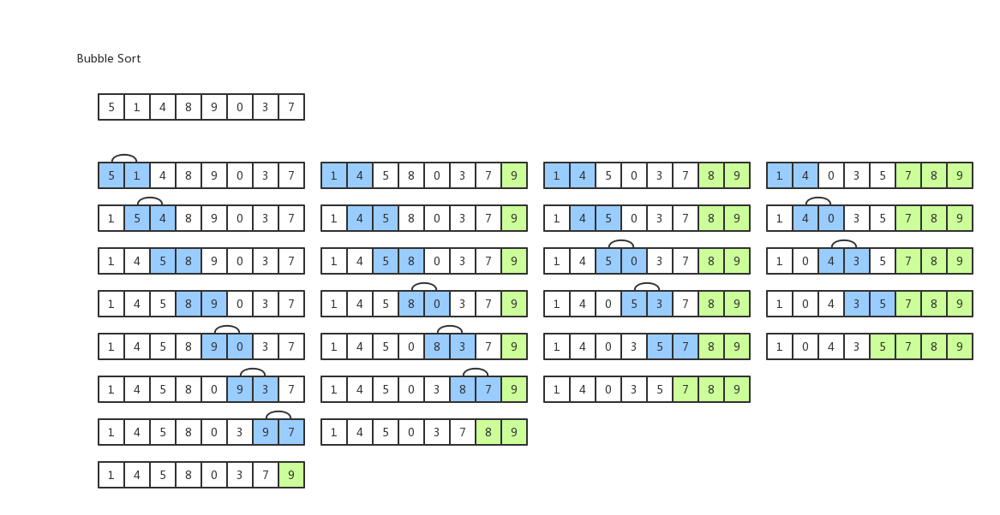
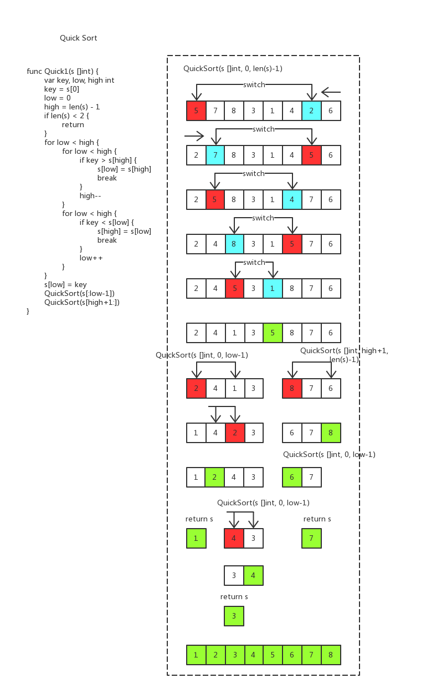
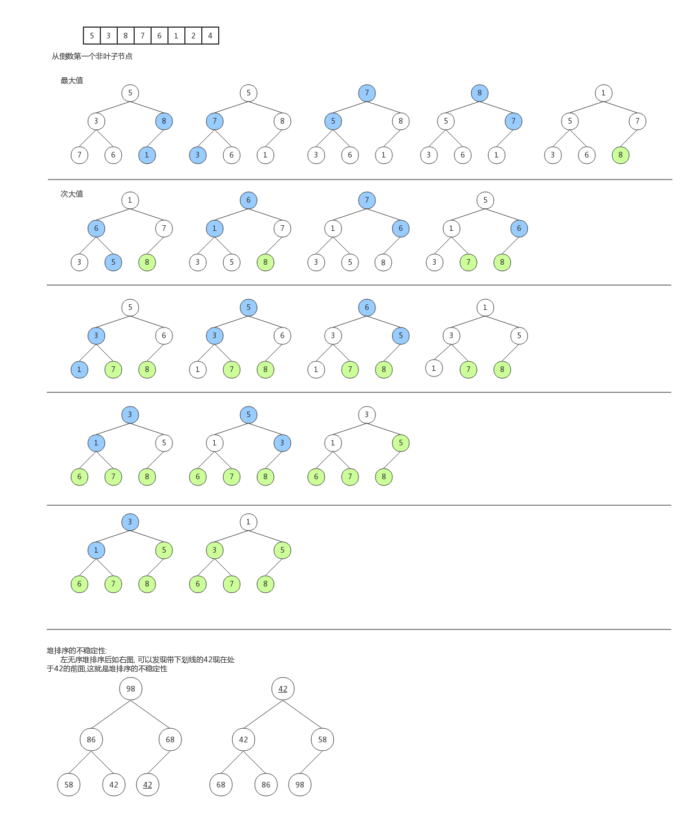

# Sort

- Select Sort
- Bubble Sort
- Quick Sort
- Heap Sort

### 选择排序(Select Sort)

- 算法时间复杂度: O(n^2)

- 核心思想

  每次遍历序列中剩下的元素并选出最大值(最小值)，依次放到序列中， 排列出降序(升序)序列。

  以升序为例：

  取数组的第一个元素的位置为key的初始值(key=0)，从第key个元素开始与其后的每一个元素比较，遇到第一个比第一个元素小的值时，key值改变，并继续向后比较，直到遍历完数组，找到了数组中的最小值，交换第一个元素与第key个元素的位置。依次可对数组进行升序排列。

- 代码示例

  ```go
  func SelectSort(s []int) {
  	for i := 0; i < len(s)-1; i++ {
  		key := i
  		for j := i + 1; j < len(s); j++ {
  			if s[j] < s[key] {
  				key = j
  			}
  		}
  		s[i], s[key] = s[key], s[i] // swap(s, i, key)
  	}
  }
  ```

- 流程图

  

### 冒泡排序(Bubble Sort)

- 算法时间复杂度: O(n^2)

- 核心思想

  选取无序序列的第一个元素与其后的的一个元素比较，如果大，交换位置，在从第二个元素于后一个元素比较，如果大就交换，这样遍历一次后最大值就排在了序列的末尾，执行n次，得到升序序列。

- 代码示例

  ```go
  func BubbleSort(s []int) {
      for i := len(s); i >= 0; i-- {
          for j := 0; j < len(s)-1; j++ {
              if s[j] > s[j+1] {
                  s[j], s[j+1] = s[j+1], s[j]
              }
          }
      }
  }
  ```

- 流程图

  

### 快速排序(Quick Sort)

- 算法时间复杂度: O(n*log*n)

- 核心思想

  选取序列中的一个元素(通常为第一个元素，最合适的是序列中间的元素)，通过与其它元素比较来把它放在正确的位置(左边的元素都比它小，右边的比它大)，然后在分别将它左边的数组和右边的数组重复快排。

  - 基线条件: 数组长度不小于2

- 流程图

  

###堆排序(Heap Sort)

- 算法时间复杂度: O(n*log*n)

- 核心思想

  1. 将无序序列构建成大顶堆
  2. 将大顶堆的根结点与最后一个元素交换位置，此时数组末尾就是最大值
  3. 将剩下的 n-1个节点构建成大顶堆
  4. 重复步骤2

  - 如何构建大顶堆：从堆的最后一个非叶子节点开始，和它的子节点构造大顶堆 个元素构建成大顶堆，将根结点与倒数第二位元素交换位置，得到次大值，依次往复得到一个有序序列。

- 代码示例

  ```go
  // 交换元素位置
  func swap(s []int, i, j int) {
      s[i], s[j] = s[j], s[i]
  }
  
  // 构建建大顶堆, start 为最后一个非叶子节点
  func adjustHeap(s []int, start) {
      // 若父节点小于左叶子节点则交换位置
      if s[start] < s[start*2+1] { swap(s, start, start*2+1)
      // 若父节点小于右叶子节点则交换位置
      if s[start] < s[start*2+2] { swap(s, start, start*2+2)
  }
  
  // 排序算法
  func HeapSort(s []int) {
      length := len(s)
      if length < 2 { return }
      
      for i := length-1; i >= 0; i-- {
          // 从当前剩余元素的最后一个非叶子节点开始构建大顶堆
          for j := (i-1)/2; j >= 0; j-- {
              adjust(s, j)
          }
          swap(s, 0, i)
      }
  }
  ```

- 流程图

  