## 索引

在 MySQL 中，主要有四种类型的索引，分别为：B-Tree 索引，Hash 索引，Fulltext 索引和 R-Tree 索引。前一节已经讲了 B 类树的结构特点，这次讲哈希索引，至于后面的[全文索引](https://en.wikipedia.org/wiki/Full-text_search)和 [R 树索引](https://zh.wikipedia.org/wiki/R%E6%A0%91)感兴趣自己看吧。

之前讲 B 树时提到过哈希索引可以支持动态长度，而且由于 Hash 索引结构的特殊性，其检索效率非常高，最好的情况可以一次定位，查询效率远大于 B 树，但是实际运用中主要还是用 B 树做索引，因为哈希索引有以下局限性:

> （1）Hash 索引适合定值查询，不能做范围查询
>
> 由于 Hash 索引比较的是进行 Hash 运算之后的 Hash 值，所以它只能用于等值的过滤，不能用于基于范围的过滤，因为经过相应的 Hash 算法处理之后的 Hash 值的大小关系，并不能保证和 Hash 运算前完全一样。
>
> （2）Hash 索引无法用于排序操作
>
> 由于 Hash 索引中存放的是经过 Hash 计算之后的 Hash 值，而且 Hash 值的大小关系并不一定和 Hash 运算前的键值完全一样，所以数据库无法利用索引的数据来进行任何排序运算；
>
> （3）Hash 索引不能利用部分索引键查询
>
> 比如 (a,b,c) 形式的组合索引，查询中只用到了 a 和 b 也是可以查询的，如果使用 hash 表，组合索引会将几个字段合并 hash，没办法支持部分索引
>
> （4）Hash 索引遇到大量 Hash 值相等的情况后性能并不一定就会比 B-Tree 索引高
>
> 数据库支持非唯一的 Hash 索引，如果遇到非唯一值，存储引擎会将他们链接到同一个 hash 键值下以一个链表的形式存在，然后在取得实际键值的时候再过滤不符合的键

Hash 索引在 MySQL 中使用的并不是很多，目前主要是 Memory 和 NDB 引擎会使用；而常用的 Innodb 存储引擎和 MyISAM 引擎使用的索引还是 B+ 树为主

## 哈希表

[哈希表 (Hash Table)](https://zh.wikipedia.org/wiki/%E5%93%88%E5%B8%8C%E8%A1%A8)，也叫散列表，是根据键（Key）转换而直接访问在存储地址的数据结构。

### 定义

比如我们有关键字 k，则其值存放在 f(k) 的存储位置上，因此不需要比较就可以找到记录。这个映射关系 f(x) 称为**哈希函数(散列函数)**，以此建立的表就是**哈希表**。

哈希表中存着的是包含存储单元的数组，这些存储单元我们称作**槽 (slot)** 或者**桶 (bucket)** ，每个存储单元可以容纳一个或多个关键字信息。理想情况下，完美的散列函数能为关键字找到唯一的独占的桶，但大多数情况下用到的散列函数都是不完美的，会存在冲突；

对不同的关键字可能得到同一散列地址，即 k1 != k2，而 f(k1) == f(k2)，这种现象称为**冲突** (Collision)。具有相同函数值的关键字对该散列函数来说称做**同义词**。

若对于关键字集合中的任一个关键字，经散列函数映象到地址集合中任何一个地址的概率是相等的，则称此类散列函数为**均匀散列函数**（Uniform Hash function），这就是使关键字经过散列函数得到一个“随机的地址”，从而减少冲突

### 原理

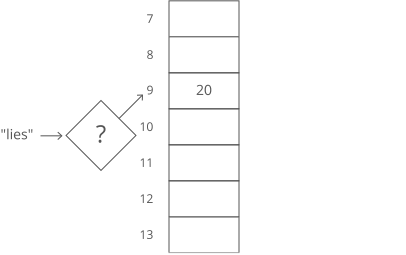

输入一个关键字 "lies"，经过散列得到值 9，对应哈希表得到我们要的地址 20

从关键字到索引值的转换过程使用的就是散列函数，散列函数有很多种，比如一种简单的散列方式如下:

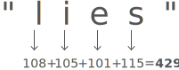

取关键字每个字符的 ASCII 码，相加，即 lies -> 108+105+101+115 -> 429

但是我们的表只有 30 项，那么可以再把上面的值模 30: 429 mod 30 = 9

一个散列就完成了

但是继续输入发现:

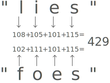

关键字 "foes" 散列后也对应表下标 9，这就是冲突，"lies" 和 "foes" 是同义词

每种哈希表实现都要有处理冲突的方法，处理冲突也有很多方式，比如这里可以用简单的链表来处理:

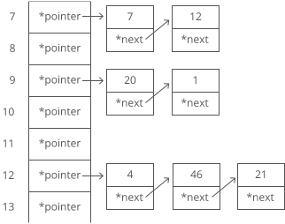

之前哈希表中索引对应的就是具体的地址，而现在改成一个指向链表的指针，所有同义词都存在相应链表中

但是我们怎么直到链表哪个是 "lies" 哪个是 "foes" 呢，可以在链表每个节点中添加关键字信息:

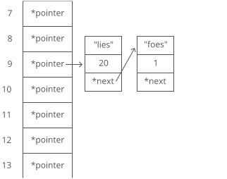

这样冲突就算处理了，但是这种哈希表结构的最坏情况是 O(n)，不同于之前 O(1)。因为假如大部分关键字都是冲突的，那么这些关键字就变为链表查询了。

因此一个**均匀的散列函数**和一个高效的**处理冲突的方法**对哈希表来说至关重要

下面会介绍一些常见的哈希函数和处理冲突的方法

### 哈希函数

1.  直接定址法：取关键字或关键字的某个线性函数值为散列地址。即 hash(k) = k 或 hash(k) = a \* k + b，其中 a, b 为常数（这种散列函数叫做自身函数）
2.  数字分析法：假设关键字是以 r 为基的数，并且哈希表中可能出现的关键字都是事先知道的，则可取关键字的若干数位组成哈希地址
3.  平方取中法：取关键字平方后的中间几位为哈希地址。通常在选定哈希函数时不一定能知道关键字的全部情况，取其中的哪几位也不一定合适，而一个数平方后的中间几位数和数的每一位都相关，由此使随机分布的关键字得到的哈希地址也是随机的。取的位数由表长决定。比如 {421，423，436}，平方之后的结果为{177241，178929，190096}，那么可以取中间的两位数{72，89，00}作为 Hash 地址
4.  折叠法：将关键字分割成位数相同的几部分（最后一部分的位数可以不同），然后取这几部分的叠加和（舍去进位）作为哈希地址。比如图书的 ISBN 号为 8903-241-23，可以将 address(key)=89+03+24+12+3 作为 Hash 地址。
5.  随机数法
6.  除留余数法：取关键字被某个不大于散列表表长 m 的数 p 除后所得的余数为散列地址。即 hash(k) = k mod p, p <= m。不仅可以对关键字直接取模，也可在折叠法、平方取中法等运算之后取模。对 p 的选择很重要，一般取素数或 m，若 p 选择不好，也容易产生冲突

### 冲突

#### 影响因素

影响产生冲突多少有以下三个因素：

- 散列函数是否均匀
- 处理冲突的方法
- 散列表的负载因子

散列表的负载因子定义为：α = 填入表中的元素个数 / 散列表的长度。α 是散列表装满程度的标志因子。
由于表长是定值，α 与“填入表中的元素个数”成正比，所以 α 越大，表明填入表中的元素越多，产生冲突的可能性就越大。

#### 处理方法

1、[开放寻址 (open addressing/closed hashing)](https://en.wikipedia.org/wiki/Open_addressing): 一旦发生了冲突，通过**探测**寻找其他空的位置，然后插入。

$$ hash_i = (hash(k) + d_i) $$ mod m, i = 1, 2, 3...m-1, 其中 hash(k) 为散列函数，$$ d_i $$ 是增量序列，m 为哈希表长，i 为已发生冲突的次数。

hash(k) 是初始的探测位置，之后的探测位置 $$ hash _1, hash_2, hash_3...hash _{m-1} $$ 形成一个探测序列。

如果 $$ d_i $$ = i = 1, 2, 3...m-1，则为**线性探测**，相当于逐一往下找表空闲位置

如果 $$ d_i = \pm1^2, \pm2^2, \pm3^2...\pm k^2 $$，则为**二次探测(或者叫平方探测)**，相当于探测间隔为 $$ \pm i^2 $$

如果 $$ d_i = i * another\_hash(k) $$，则为**双散列探测**

如果 $$ d_i $$ = 伪随机数序列，则为**伪随机探测**

对开放寻址散列表性能的关键影响是载荷因子。随着载荷系数增加到 100％，可能需要查找或插入给定关键字的探针数量急剧增加。一旦表格变满，探测算法甚至可能无法终止。即使具有良好的散列函数，也应严格限制载荷因子在 0.7-0.8 以下，比如 Java 的系统库限制了荷载因子为 0.75，超过此值将动态调整散列表大小。

2、单独链表法。即上述原理用到的方法，也叫**拉链法**，链表的使用方式可以分很多种，可以见 [WikiPedia 的事例](https://en.wikipedia.org/wiki/Hash_table#Separate_chaining)，另外算法导论里提到一种完全散列的方式，相当于二维哈希表，每个槽对应的是另一个哈希列表，也值得借鉴

3、再散列: $$ hash_i = rhash_i(k), i = 1, 2, 3...k $$, 在发生冲突时，使用其他散列函数计算哈希值，直到冲突不再发生。这种方法不易产生“聚集”，但增加了计算时间。

4、建立一个公共溢出区

### 动态哈希

前面的问题都是以哈希表定长为基础的，但是当关键字较多时，哈希表出现**聚集**时，性能会急剧下降。

即散列表的载荷因子较大时需要考虑扩充哈希表大小，如果是静态 hash，则需要新建一张更大的表，然后将所有关键字重新散列到新的表中，之后删除旧表

而动态散列可以在哈希表元素增长的同时，动态的调整 hash 桶的数目，动态 hash 不需要对原有元素进行重新插入(重组)，而是在原基础上，进行动态的桶扩展。

有以下三种方法可以实现动态 hash:

- 多 hash 表
- 可扩展的动态散列
- 线性散列

#### 多 hash 表

多 hash 表就是采用多张哈希表来扩充原哈希表。

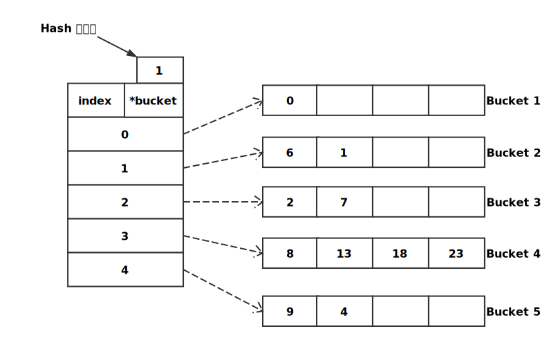

如图，哈希函数为 hash(k) = k % 5，每个桶最多含 4 个关键字

当我们要插入关键字 5 时，hash 值为 0，应该插入 Bucket 1 中，而且 Bucket 1 有空闲位置，直接插入即可；

当我们要插入关键字 3 时，hash 值为 3，应该插入 Bucket 3 中，但是 Bucket 3 已经满了，此时新建一张 hash 表来完成插入

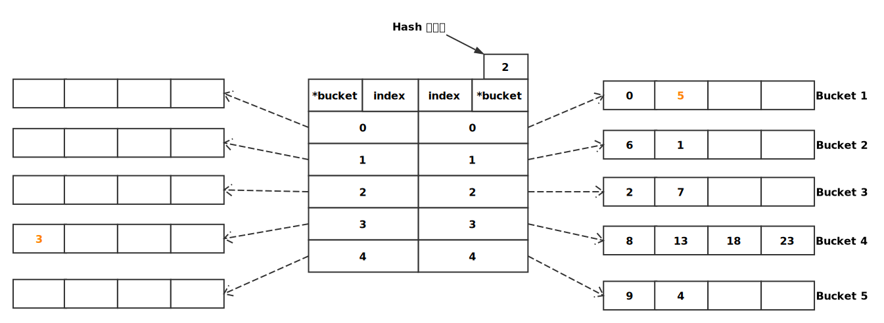

对于此种方式，执行插入、查找、删除操作时，均需先求得 hash 值 x。

- 插入时，得到当前的 hash 表的个数，并分别取得各个 hash 表的 x 位置上的索引项，若其中某个项指向的桶存在空闲位置，则插入之。同时，在插入时，可保持多个 hash 表在某个索引项上桶中元素的个数近似相等。若不存在空闲位置，则简单的进行表扩充，即新建一个 hash 表，如上所示
- 查找时，由于某个记录值可能存在当前 hash 结构的多个表中，因此需同时在多个 hash 表的同一位置上进行查找操作，等待所有的查找结束后，方可判定该元素是否存在。由于该种结构需进行多次查找，当表元素非常多时，为提高效率，在多处理器上可采用多线程，并发执行查找操作
- 删除操作，与上述过程基本类似。需要注意的是，若删除操作导致某个 hash 表元素为空，这时可将该表从结构中剔除

这种方式的优点是设计和实现比较简单的。缺点是占用空间大，而且关键字较密集时空间利用率低。

#### 可扩展的动态散列

引入一个仅存储桶指针的索引数组，用翻倍的索引项数来取代翻倍的桶的数目，且每次只分裂有溢出的桶，从而减小翻倍的代价。

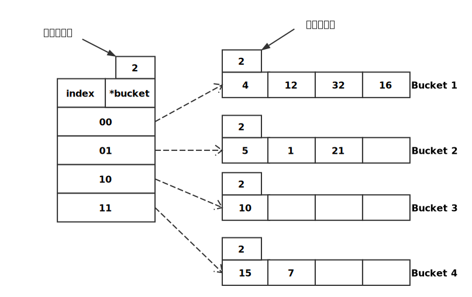

如图所示哈希表有一个标识表示全局位深度 (Global Depth)，全局位深度表示取哈希值的低几位作为索引，比如 hash(k4) = 0100，全局位深度为 2，则取低两位 00 归属到 00 索引的桶中，而且哈希表索引项数始终等于 2 ^ Global Depth；桶中有一个本地位深度 (Local Depth)，本地位深度表示当前桶中元素的低几位是一样的；图中给出的桶中元素表示哈希后的值，比如桶 1 中 4 表示哈希值为 0100 的关键字 k4

- 插入时，计算出哈希值再根据全局位深度匹配索引项，如果找到的桶未满，则直接插入即可；如果桶已满，则判断当前桶的本地位深度 L 与全局位深度 G 的大小关系: 如果 L = G，此时只有一个指针指向当前桶，则扩展索引，本地位深度和全局位深度均加一，索引项翻倍，重组当前桶的元素；如果 L < G，此时不止一个指针指向当前桶，故不需要翻倍索引项，只需分裂出一个桶，将本地位深度加一然后重组当前桶元素即可
- 查找时，对于需要查找的关键字 x，hash(x) = y，根据当前 hash 表的全局位深度，决定对 y 取其后 G 位，位数不够用 0 填充，找到对应的索引项，从而找到对应的桶，在桶中逐一进行比较
- 删除时，和查找操作类似，先定位元素，删除之。若删除时发现桶为空，则可以考虑将该桶与其兄弟桶进行合并，并使局部位深度减一

插入实例:

当我们插入某个关键字 k13，hash(k13) = 1101，对应索引 01 的桶 Bucket 2，桶未满直接插入即可；

再插入某个关键字 k20，hash(k20) = 10100，对应索引 00 的桶 Bucket 1，桶已满而且本地位深度等于全局位深度，需要扩展索引，全局位深度和本地位深度均加一，并重组当前桶的元素，变为下图:

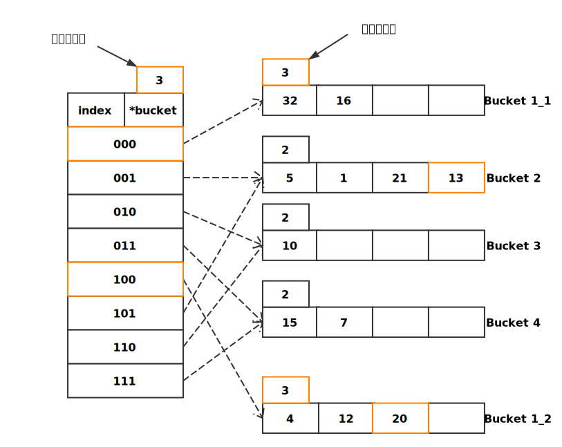

继续插入某个关键字 k25，hash(k25) = 11001，对应索引 001 的桶 Bucket 2，桶已满而且本地位深度小于全局位深度，当前桶存在两个指针，只需要分裂出一个桶即可并将桶的本地位深度加一，如图:

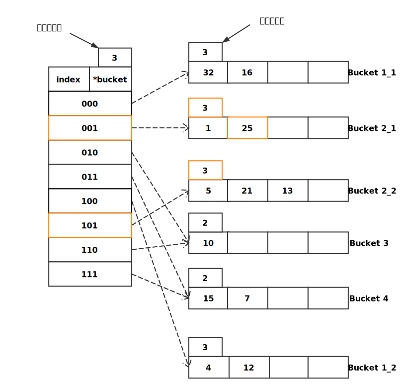

这种方式的优点是可以可动态进行桶的增长，且增长的同时，用索引项的翻倍代替桶数翻倍的传统做法，可用性更好。缺点是当散列的数据分布不均或偏斜较大时，会使得索引项的数目很大，数据桶的利用率很低；还有索引的增长速度，是指数级增长，扩展较快

#### 线性散列

[线性散列](https://zh.wikipedia.org/wiki/%E7%BA%BF%E6%80%A7%E6%95%A3%E5%88%97)能随数据的插入和删除，适当的对 hash 桶数进行调整，一次只分裂一个桶，线性散列不需要存放数据桶指针的专门索引项。

定义:

| 标识符      | 描述                                                                                         |
| ----------- | -------------------------------------------------------------------------------------------- |
| h0,h1,h2... | 一系列哈希函数，后者的范围总是前者的两倍，i 为下标，h_i(key) = hash(key) mod (N\*2^i)        |
| N           | 桶的初始个数，必须是 2 的幂次方                                                              |
| di          | 多少比特位用于表示 N，N = 2^di                                                               |
| Level       | 当前轮数，每轮的初始桶数等于 N\*2^Level                                                      |
| Next        | 一个指针指向需要分裂的桶，每次发生分裂的桶总是由 Next 决定，与当前值被插入的桶已满或溢出无关 |
| Load Factor | 负载因子，当桶中记录数达到该值时进行分裂；也可选择当桶满时才进行分裂                         |

当某个桶发生溢出时，可以将溢出元素以链表的形式链在桶后；
可以监控整张哈希表或者桶的负载因子，视情况选择是否分裂，比如全表的负载达到 0.75 可以对当前桶进行分裂，也可以选择只有桶满了才分裂；

实例:

初始状态 N = 4, Level = 0, Next 指向第一个桶

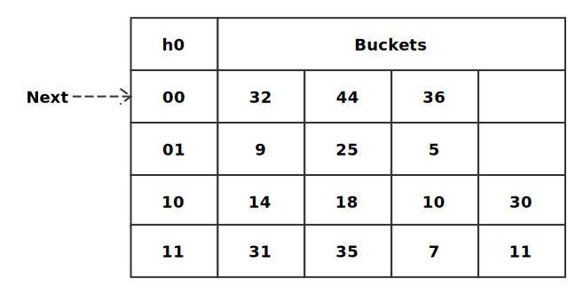

插入某个关键字 k37，hash(k37) = 37 = 100101，h0(k37) = 01(取低两位)，对应编号 1 的桶，此时桶未满直接插入即可:

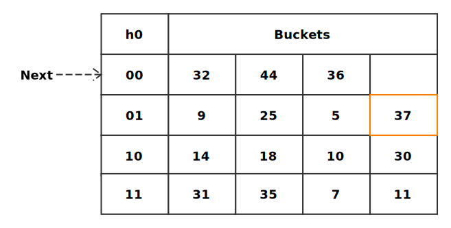

插入某个关键字 k43，hash(k43) = 43 = 101011，h0(k43) = 11(取低两位)，对应编号 3 的桶，此时桶已满需要分裂:
首先把 43 链在桶 3 后面，然后分裂 Next 指向的桶 0，产生一个新桶，新桶编号 = N + Next = 4 + 0 = 100，Next 指向下一个桶；最后把桶 0 的元素按 h1 散列重组

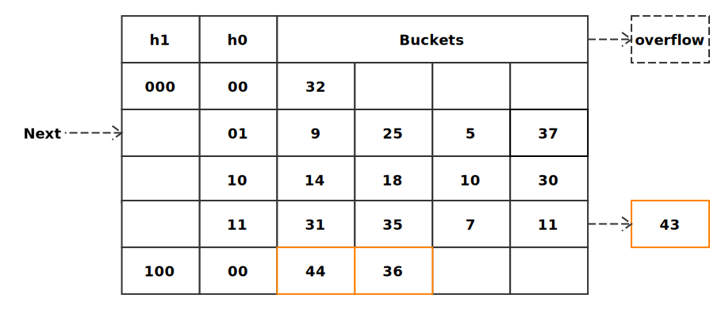

继续插入某个关键字 k29，hash(k29) = 29 = 11101，h0(k29) = 01，对应编号 1 的桶，此时桶已满需要分裂:
也是按刚才的步骤处理，不过这次 Next 指向的桶就是当前桶

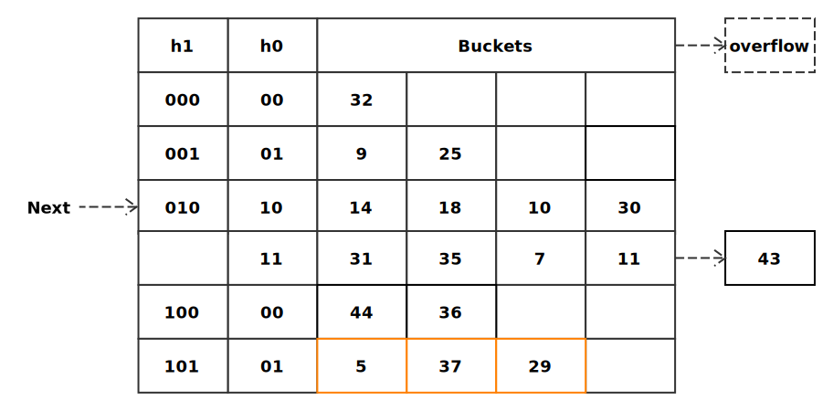

向桶 1 中连续插入 17，33，41，引起分裂:

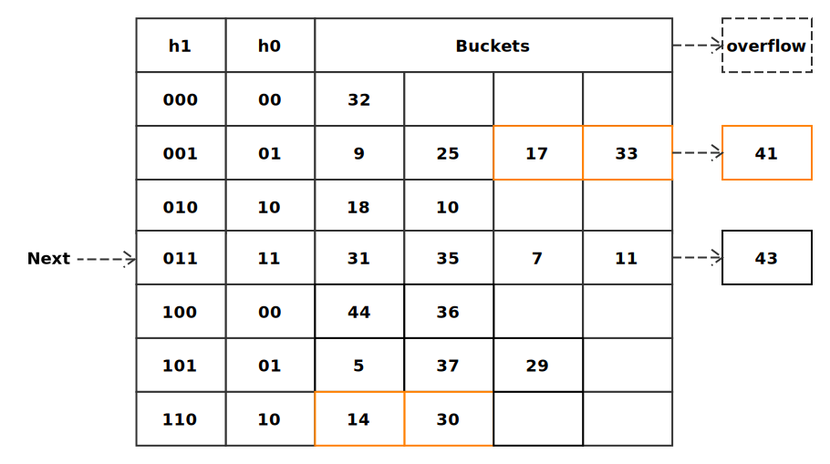

继续向桶 1 插入 57，引起分裂，需要注意的是这时 Next 指针已经遍历过初始的四个桶，第一轮已结束，Level 加一，Next 指向第一个桶，第二轮初始为八个桶(即 N = 8):

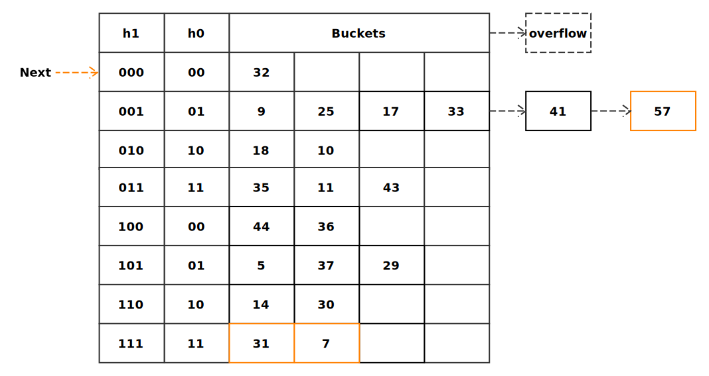

插入就是如上形式进行，接下来看怎么查找:
假如要查找某个关键字 key 对应的位置，如果 $$Next \leq h _{Level}(key) \leq N$$，则查询 $$h _{Level}$$ 列的与低 di 位对应的桶，否则查询 $$ h _{Level+1} $$ 列的与低 di +1 位对应的桶。

在此图中 N = 4，Level = 0，Next = 2，d0 = 2

比如查询 k44，h0(k44) = 00，00(= 0) 不在 2 和 4 之间，则查询 h1 列与 k44 低三位 (100) 对应的桶，找到编号为 4 的桶，再从桶找到对应位置；

假如查询的是 k7，ho(k7) = 11，11(= 3) 在 2 和 4 之间，则查询 h0 列与 k7 低两位 (11) 对应的桶，找到编号为 3 的桶，再从桶中找到对应位置

在此图中 N = 8，Level = 1，Next = 0，d1 = 3

假如查询 k44，h1(k44) = 100，100(= 4) 在 1 和 8 之间，所以查询 h1 列与 100 对应的桶，即编号为 4 的桶；

其他关键字的 h1 值都是在范围 [Next, N] 内的，所以都是找 h1 列的

线性散列的删除操作是插入操作的逆操作，若溢出块为空，则可释放。若删除导致某个桶元素变空，则 Next 指向上一个桶。当 Next 减少到 0，且最后一个桶也是空时，则 Next 指向 N/2 - 1 的位置，同时 Level 值减 1。

线性散列比可扩展动态散列更灵活，且不需要存放数据桶指针的专门索引项，节省了空间；但如果数据散列后分布不均匀，导致的问题可能会比可扩展散列还严重

## 分布式哈希

[分布式哈希表 - DHT](https://zh.wikipedia.org/wiki/%E5%88%86%E6%95%A3%E5%BC%8F%E9%9B%9C%E6%B9%8A%E8%A1%A8)增加或移除节点只改变邻近节点所拥有的关键值集合，而其他节点的则不会被改变。传统的散列表，若增加或移除一个位置，则整个关键值空间必须重新散列。

其中[一致性哈希](https://en.wikipedia.org/wiki/Consistent_hashing)算法非常适用于分布式哈希表，一致性哈希允许任意顺序插入或删除存储桶，不同于线性散列那样需要顺序处理。

### 一致性哈希

#### 应用场景

有 N 台服务器提供缓存服务，需要对服务器进行负载均衡，将请求平均分发到每台服务器上，每台机器负责 1/N 的服务。

常用的算法是对 hash 结果模 N 取余，比如 N = 5，hash = 103，余数为 3 则分发到编号为 3 的服务器上。但是这样的算法存在严重问题，如果有某台机器宕机或者新添加服务器，都会造成大量缓存请求失效或者需要转移重组数据。

而使用一致性哈希后，同样增加或者删除服务器节点只会对少量数据产生影响，不需要大规模迁移数据。比如分布式缓存系统节点数多，而且容易变动，非常适合使用一致性哈希

#### 原理

假设一致性哈希算法的结果是 32 位的 Key 值，将这 2^32 个数值映射在一个环形空间上，则对应有 2^32 个缓存区。比如下图中五个 Key 值分布在环形空间上

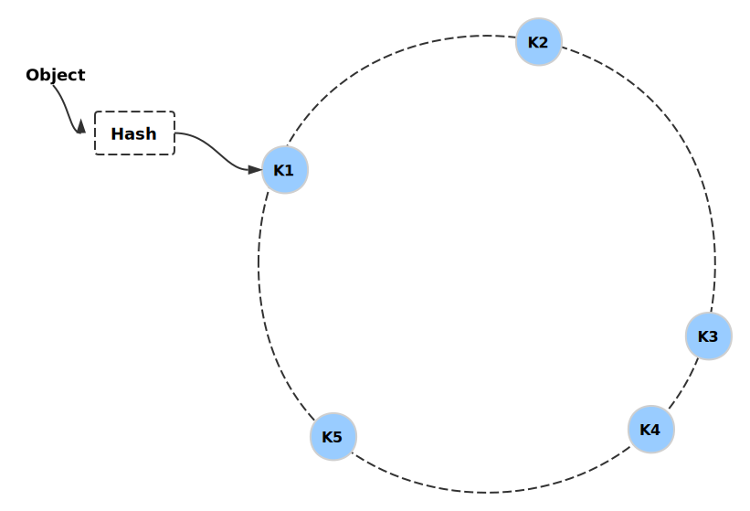

每一个缓存节点（Shard）也遵循同样的 Hash 算法，比如利用 IP 做 Hash，映射到环形空间当中

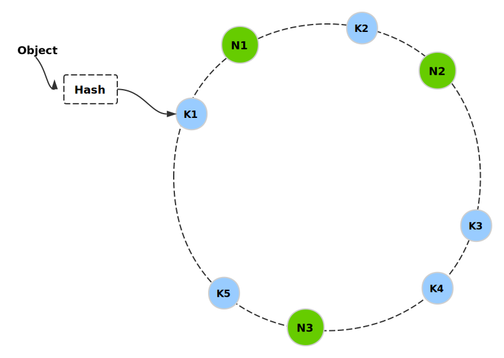

然后按顺时针将 Key 归属到最近的节点上，比如 K5、K1 归属为节点 N1 上

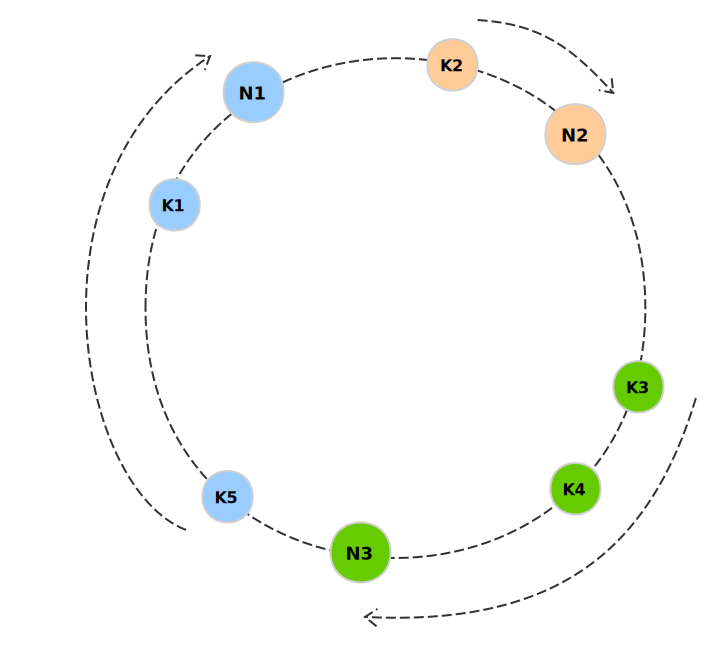

增加节点 N4 时，我们只需要改变 K5 的归属即可，不会对其他节点和数据造成影响

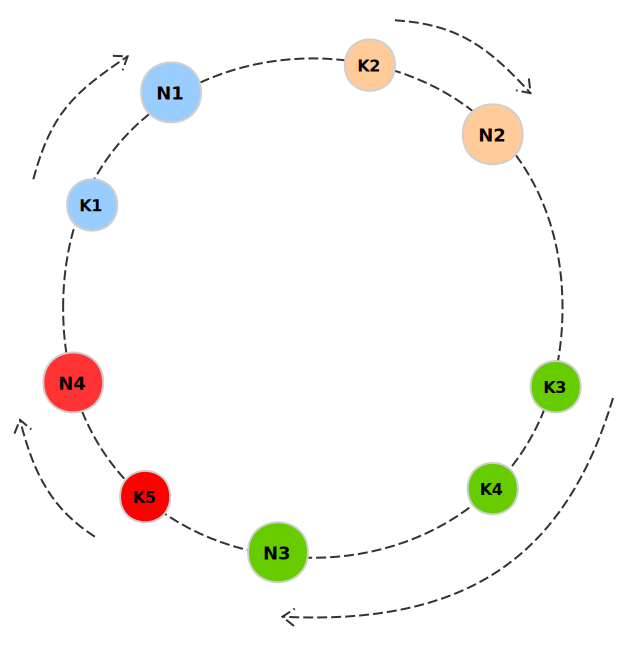

删除节点 N1 时，我们只需要将 K1 归属到 N2 上就行

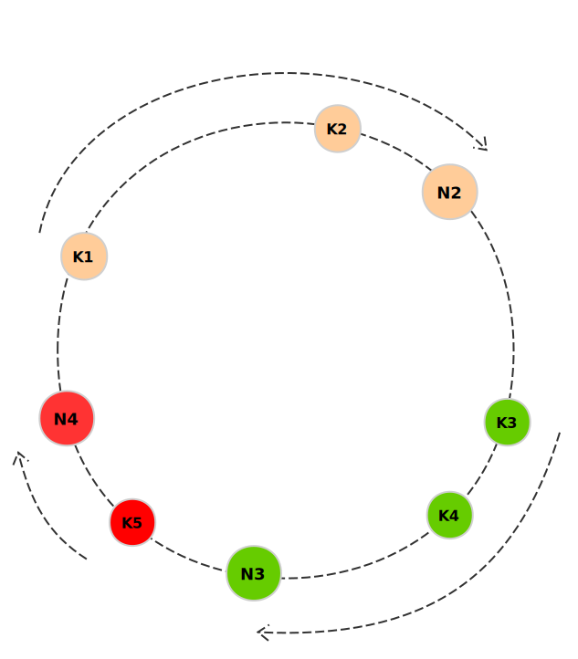

但是仍会有分布不均的情况，特别是服务器节点较少时，比如下图大部分键值都流向某个单一节点

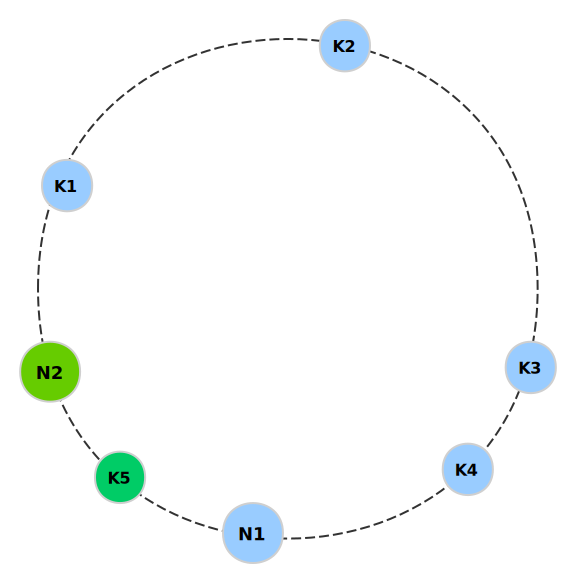

为了应对这种情况，引入了虚拟节点的概念，将原来的一个物理节点映射出多个子节点，让子节点代替物理节点放置在环形空间中

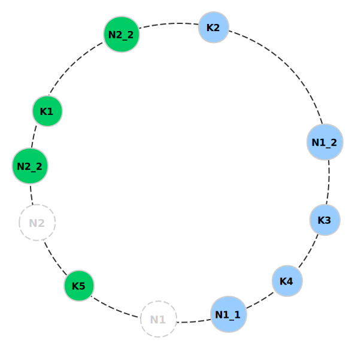

比如原本的物理节点 N1 使用的关键字是自己的 IP 192.168.1.109，其位置是 hash("192.168.1.109")。现在为其创建两个虚拟节点 N1_1 和 N1_2，两个子节点可以使用 IP + 编号 的方式计算哈希，比如 hash("192.168.1.109#1") 和 hash("192.168.1.109#2")，同理为 N2 也创建了两个虚拟节点，

创建虚拟节点的好处是分布更均匀

## 其他常见散列函数

### MD5

[Message-Digest Algorithm 5 - 消息摘要算法](https://zh.wikipedia.org/wiki/MD5)，一种被广泛使用的密码散列函数，可以产生出一个 128 位的散列值

可以应用于文件校验，例如，服务器预先提供一个 MD5 校验和，用户下载完文件以后，用 MD5 算法计算下载文件的 MD5 校验和，然后通过检查这两个校验和是否一致，就能判断下载的文件是否出错

MD5 是输入不定长度信息，输出固定长度 128 位的算法。经过程序流程，生成四个 32 位数据，最后联合起来成为一个 128 位散列。基本方式为，求余、取余、调整长度、与链接变量进行循环运算，得出结果。

但是 MD5 可以被破解，不适合高度安全性的场景，比如不能用于密钥认证和数字签名

### SHA

[Secure Hash Algorithm - 安全散列算法](https://zh.wikipedia.org/wiki/SHA%E5%AE%B6%E6%97%8F)是一个密码散列函数家族，也能计算出一个数字消息所对应到的，长度固定的字符串（又称消息摘要）的算法。安全性高于 MD5，比如数字签名常用的就是 SHA-256。

SHA 分为 SHA-0、SHA-1、SHA-2、SHA-3 四个大版本，其中 SHA-0 和 SHA-1 输出的散列值为 160 位；SHA-2 细分为多种，比如 SHA-256 输出的是 256 位散列值，另外还有 SHA-224、SHA-384、SHA-512 等等；SHA-3 是 2015 年正式发布的，SHA-3 并不是要取代 SHA-2，因为 SHA-2 目前并没有出现明显的弱点，由于对 MD5 出现成功的破解，以及对 SHA-0 和 SHA-1 出现理论上破解的方法，[NIST](https://zh.wikipedia.org/wiki/%E5%9C%8B%E5%AE%B6%E6%A8%99%E6%BA%96%E6%8A%80%E8%A1%93%E7%A0%94%E7%A9%B6%E6%89%80) 感觉需要一个与之前算法不同的，可替换的加密散列算法，也就是现在的 SHA-3

### CRC

[Cyclic redundancy check - 循环冗余校验](https://zh.wikipedia.org/wiki/%E5%BE%AA%E7%92%B0%E5%86%97%E9%A4%98%E6%A0%A1%E9%A9%97)是一种根据网络数据包或计算机文件等数据产生简短固定位数校验码的一种散列函数，主要用来检测或校验数据传输或者保存后可能出现的错误。一般来说，循环冗余校验的值都是 32 位的整数。

CRC 的计算过程网络课程便讲过，不算复杂，这里不深入。WikiPedia 上提供了一些 CRC 变体的描述，感兴趣可以了解一下。

尽管在错误检测中非常有用，CRC 并不能可靠地校验数据完整性，因为 CRC 多项式是线性结构，可以非常容易地故意改变量据而维持 CRC 不变。一般使用[Message authentication code](https://zh.wikipedia.org/wiki/%E8%A8%8A%E6%81%AF%E9%91%91%E5%88%A5%E7%A2%BC)校验数据完整性

## Reference

- [Hash Table - WikiPedia](https://en.wikipedia.org/wiki/Hash_table)
- [Data Structures for Coding Interviews - Hash Table](https://www.interviewcake.com/article/python/data-structures-coding-interview?course=dsa#hash-tables)
- [动态 hash 思想方法](http://blog.sina.com.cn/s/blog_5e4516af01019frj.html)
- [Extendible hashing - WikiPedia](https://en.wikipedia.org/wiki/Extendible_hashing)
- [Linear Hashing - Youtube](https://www.youtube.com/watch?v=h37Jhr21ByQ&t=61s)
- [漫画：什么是一致性哈希？](https://mp.weixin.qq.com/s/yimfkNYF_tIJJqUIzV7TFA)
- [雪崩效应 - WikiPedia](https://zh.wikipedia.org/wiki/%E9%9B%AA%E5%B4%A9%E6%95%88%E5%BA%94)
