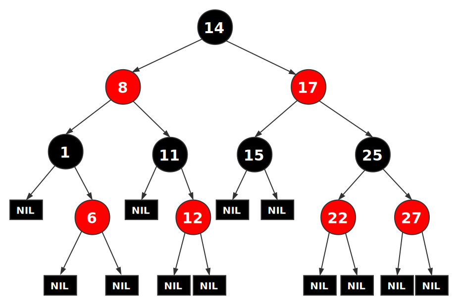
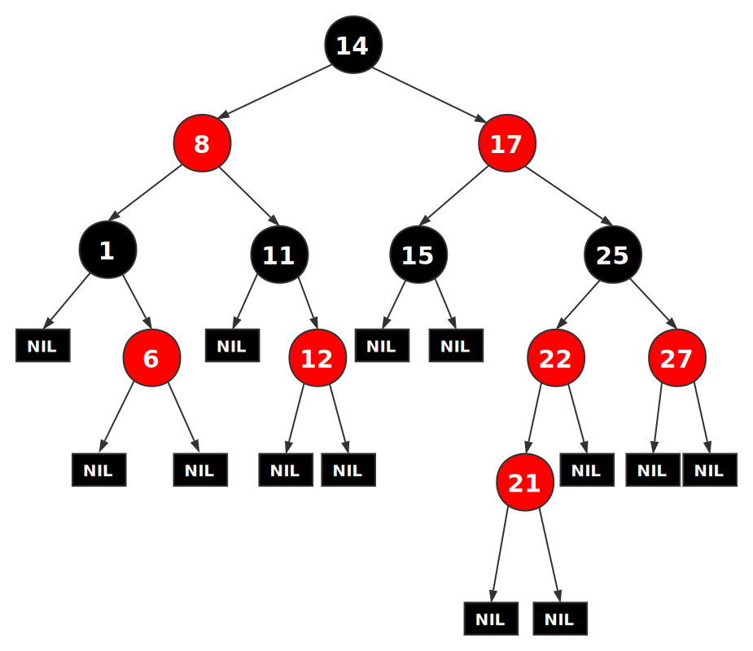
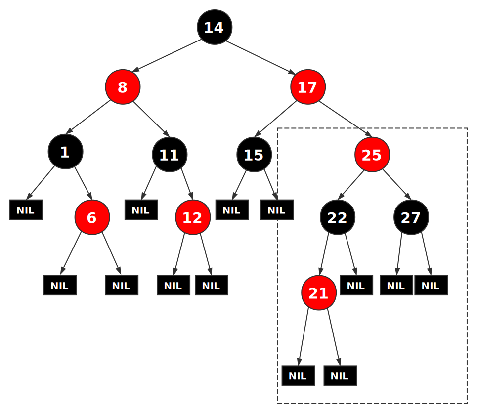
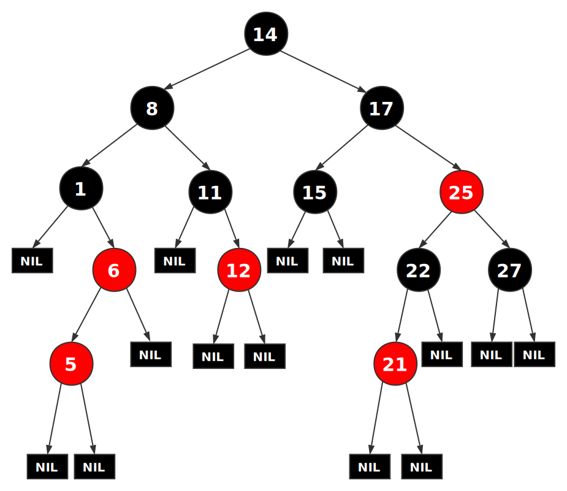
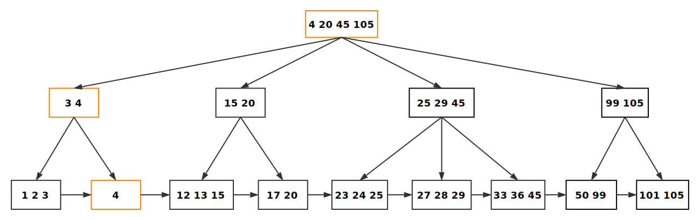

与数据库相关的树结构主要为 B 类树，B 类树通常用于数据库和操作系统的文件系统

在学习 B 类树之前先复习一下二叉查找树的概念和红黑树

## 二叉树

[二叉树 - Binary Tree](https://zh.wikipedia.org/wiki/%E4%BA%8C%E5%8F%89%E6%A0%91) 是每个节点最多只有两个分支（即不存在分支度大于 2 的节点）的树结构。

### 分类

- 完美二叉树 (Perfect Binary Tree): 除了叶子结点之外的每一个结点都有两个孩子，每一层(当然包含最后一层)都被完全填充
- 完全二叉树 (Complete Binary Tree): 除了最后一层之外的其他每一层都被完全填充，并且所有结点都保持向左对齐
- 满二叉树 (Full/Strictly Binary Tree): 除了叶子结点之外的每一个结点都有两个孩子结点

### 遍历

- 前序遍历: 首先访问根结点然后遍历左子树，最后遍历右子树。在遍历左、右子树时，仍然先访问根结点，然后遍历左子树，最后遍历右子树
- 中序遍历: 首先遍历左子树，然后访问根结点，最后遍历右子树。在遍历左、右子树时，仍然先遍历左子树，再访问根结点，最后遍历右子树
- 后序遍历: 首先遍历左子树，然后遍历右子树，最后访问根结点。在遍历左、右子树时，仍然先遍历左子树，然后遍历右子树，最后遍历根结点

* 深度优先搜索: 顾名思义，查找时深度优先，从根结点访问最远的结点直到找到所有节点。前序，中序和后序遍历都是深度优先遍历的特例
* 广度优先搜索: 广度优先遍历会先访问离根节点最近的节点，二叉树的广度优先遍历又称按层次遍历。算法借助队列实现

## 二叉查找树

[二叉查找树 - Binary Search Tree](https://zh.wikipedia.org/wiki/%E4%BA%8C%E5%85%83%E6%90%9C%E5%B0%8B%E6%A8%B9): 也称二叉搜索树、有序二叉树。对于根树和所有子树都满足，每个节点都大于左子树元素，而小于右子树元素，**且没有键值相等的结点**

搜索、插入、删除的复杂度等于**树高**，期望 $$O(\log_2^n)$$，最坏 O(n)（数列有序，树退化成线性表）

### 缺陷

当数据基本有序时，二叉查找树会退化成线性表，查找效率严重下降

所以后面出现了很多改进的[平衡树](https://zh.wikipedia.org/wiki/%E5%B9%B3%E8%A1%A1%E6%A0%91)结构以满足树高最坏也为 $$O(\log_2^n)$$，
如[伸展树 (Splay Tree)](https://zh.wikipedia.org/wiki/%E4%BC%B8%E5%B1%95%E6%A0%91)、平衡二叉树 (SBT)、[AVL 树](https://zh.wikipedia.org/wiki/AVL%E6%A0%91)、红黑树等

## 红黑树

[红黑树 - Red–black tree](https://zh.wikipedia.org/wiki/%E7%BA%A2%E9%BB%91%E6%A0%91) 是一种自平衡二叉查找树，除了符合二叉查找树的性质外，它还满足以下五条性质:

1.  每个结点要么是红的，要么是黑的
2.  根结点是黑的
3.  每个叶子结点是黑的（叶子结点指树尾端 NIL 指针或 NULL 结点，不包含数据，只充当树在此结束的指示）
4.  如果一个结点是红的，那么它的两个子节点都是黑的 (从根到每个叶子的所有路径上不能有两个连续的红色节点)
5.  对于任一结点而言，其到叶结点树尾端 NIL 指针的每一条路径都包含相同数目的黑结点


### 平衡优势

上述约束确保了红黑树的关键特性: **从根到叶子的最长路径不会超过最短路径的两倍**

证明: 主要看性质 4 和 性质 5，假设从根到叶子的最短路径 a 上有黑色节点 n 个，最长路径 b 肯定是交替的红色和黑色节点，而根据性质 5 可知从根到叶子的所有路径都有相同数目的黑色节点，
这就表明 b 的黑色节点也为 n 个，但 b 出现的红色节点不可能超过黑色节点个数，否则会破坏性质 4 (抽屉原理)，所以从根到叶子的最长路径不会超过最短路径的两倍

### 调整

因为每一个红黑树也是一个特化的二叉查找树，因此红黑树上的只读操作与普通二叉查找树上的只读操作相同。然而，在红黑树上进行插入操作和删除操作会导致不再匹配红黑树的性质。
恢复红黑树的性质需要少量 $$O(\log_2^n)$$ 的颜色变更（实际是非常快速的）和不超过三次树旋转（对于插入操作是两次）。虽然插入和删除很复杂，但操作时间仍可以保持为 $$O(\log_2^n)$$ 次。

红黑树发生变更时需要 [变色] 和 [旋转] 来调整，其中旋转又分 [左旋] 和 [右旋]。

- 变色就是更改颜色
- 左旋: 以 X 为支点`逆时针`旋转红黑树的两个节点 X-Y，使得父节点被自己的右孩子取代，而自己下降为左孩子


- 右旋: 以 X 为支点`顺时针`旋转红黑树的两个节点 X-Y，使得父节点被自己的左孩子取代，而自己下降为右孩子


旋转过程中只需要做三次指针变更就行

### 插入和删除

#### 插入节点

插入节点的位置跟二叉查找树的寻找方法基本一致，如果插入结点 z 小于当前遍历到的结点，则到当前结点的左子树中继续查找，如果 z 大于当前结点，则到当前结点的右子树中继续查找，
如果 z 依然比此刻遍历到的新的当前结点小，则 z 作为当前结点的左孩子，否则作为当前结点的右孩子。而红黑树插入节点后，为了保持约束还需要进行调整修复(变色加旋转)。

所以插入步骤如下: 红黑树按二叉查找树的规则找到位置后插入新节点 z，z 的左孩子、右孩子都是叶子结点 nil， z 结点初始都为红色，再根据下述情形进行变色旋转等操作，最后达到平衡。

- 情形 1: 如果**当前节点是根结点**，为满足性质 2，所以直接把此结点 z 涂为黑色
- 情形 2: 如果**当前结点的父结点是黑色**，由于不违反性质 2 和性质 4，红黑树没有被破坏，所以此时也是什么也不做

比如上图插入 12 时满足情形 2:



以下情形需要作出额外调整:

- 情形 3: 如果**当前结点的父结点是红色**且**祖父结点的另一个子结点(叔叔结点)是红色**
- 情形 4: **当前结点的父结点是红色**，**叔叔结点是黑色**或者 nil，当前结点相对其父结点的位置和父节点相对祖父节点的位置**不在同侧**
- 情形 5: **当前结点的父结点是红色**，**叔叔结点是黑色**或者 nil，当前结点相对其父结点的位置和父节点相对祖父节点的位置**在同侧**

下面着重讲讲后三种情况如何调整

##### 情形 3

`当前结点的父结点是红色且祖父结点的另一个子结点(叔叔结点)是红色`

> 因为当前节点的父节点是红色，所以父节点不可能是根节点，当前节点肯定有祖父节点，也就有叔叔节点

**解决步骤**: 将当前结点的父结点和叔叔结点涂黑，祖父结点涂红，再把祖父结点当做新节点(即当前节点的指针指向祖父节点)重新检查各种情形进行调整

由于对称性，不管父结点是祖父结点的左子还是右子，当前结点是其父结点的左子还是右子，处理都是一样的

我们插入 21 这个元素，当前节点指向 21：



此时会发现 21、22 两个红色相连与性质 4 冲突，但 21 节点满足情形 3，修复后:



此时当前节点指向 21 的祖父节点，即 25。而 25 节点同样遇到情形 3 的问题，继续修复:


此时当前节点指向根节点，满足情形 1，将 14 节点涂黑即可恢复红黑树平衡

##### 情形 4

`当前结点的父结点是红色，叔叔结点是黑色或者 nil，当前结点相对其父结点的位置和父节点相对祖父节点的位置不在同侧`

**解决步骤**:

- 如果当前节点是父节点的右子，父节点是祖父节点的左子，以当前结点的父结点做为新结点(即当前节点的指针指向父节点)，并作为支点左旋
- 如果当前节点是父节点的左子，父节点是祖父节点的右子，以当前结点的父结点做为新结点(即当前节点的指针指向父节点)，并作为支点右旋

在上图的基础上我们继续插入 5 这个元素:



可以看出 5 是父节点的左子，而父节点是祖父节点的右子，不同侧则为情形 4，将当前节点指向 5 的父节点 6，并以 6 为支点进行右旋:


此时当前节点是 6，而 6 是父节点 5 的右子，父节点 5 也是祖父节点 1 的右子，同侧则转为情形 5，继续往下看

##### 情形 5

`当前结点的父结点是红色，叔叔结点是黑色或者 nil，当前结点相对其父结点的位置和父节点相对祖父节点的位置在同侧`

**解决步骤**:

- 首先把父结点变为黑色，祖父结点变为红色
- 如果当前节点是父节点的左子，父节点是祖父节点的左子，以祖父结点为支点右旋
- 如果当前节点是父节点的右子，父节点是祖父节点的右子，以祖父结点为支点左旋

在上一张图的基础上修改节点 5 为黑色，节点 1 为红色，再以 1 为支点左旋:


此时便恢复平衡

#### 删除节点

删除节点 X 时第一步先判断两个孩子是否都是非空的，如果都非空，就先按二叉查找树的规则处理:

在删除带有两个非空子树的节点 X 的时候，我们可以找到左子树中的最大元素(或者右子树中的最小元素)，并把这个最值**复制**给 X 节点，只代替原来要删除的值，不改变节点颜色。

然后我们只要删除那个被复制出值的那个节点就行，因为是最值节点所以它的孩子不可能都非空。

因为只是复制了一个值，不违反任何性质，这就把原问题转化为**如何删除最多有一个非空子树的节点的问题**。它不关心这个节点是最初要删除的节点还是被复制出值的那个节点。

我们以图为例，图中三角形代表可能为空的子树:


节点 X 是要删除的节点，发现它的两个子树非空，我们可以找左子树中最大的元素 Max (也可以找右子树中最小的元素 Min)，把 Max 值(或者 Min 值)复制到 X 上覆盖原来的值，不修改其他属性，然后删除 Max 节点(或 Min 节点)即可，可以很清楚的看到最值节点最多只会有一个非空子树

---

接下来就是如何处理删除最多有一个非空子树的节点 X 的问题

简单情形:

1.  如果 X 的两个儿子都为空，即均为叶子，我们将其中任意一个看作它的儿子
2.  如果 **X 是一个红色节点**，它的父亲和儿子一定是黑色的，所以简单的**用它的黑色儿子替换它**就行，这并不会破坏性质 3 和性质 4，通过被删除节点的所有路径只是少了一个红色节点，这样可以继续保证性质 5
3.  如果 **X 是黑色而它的儿子是红色**，如果只是删除这个黑色节点，**用它的红色儿子代替**的话，会破坏性质 5，我们可以**重绘它的儿子为黑色**，则曾经通过 X 的所有路径将通过它的黑色儿子，这样可以继续保持性质 5

如果 X 和它的儿子都是黑色，这是一种复杂的情况，我们单拎出来讲

我们首先把要删除的节点 X 替换为它的儿子。出于方便，称呼这个新上位的儿子为 N，称呼它的兄弟为 S，使用 P 称呼 N 的新父亲，SL 称呼 S 的左儿子，SR 称呼 S 的右儿子

有以下六种情形需要考虑:

##### 情形 1

N 是新的根

我们不需要做什么，因为所有路径都去除了一个黑色节点，而新根也是黑色的，所以性质都保持着

> 情形 2、5、6 涉及到左右不同的情况，只取一种处理

##### 情形 2

S 是红色

- 交换兄弟 S 和父亲 P 的颜色
- 如果 N 是其父亲的左节点，我们在 N 的父亲上做左旋，把红色兄弟转换成 N 的祖父
- 如果 N 是其父亲的右节点，我们在 N 的父亲上做右旋，把红色兄弟转换成 N 的祖父


完成这两个操作后，尽管所有路径上黑色节点的数目没有改变，但现在 N 有了一个黑色的兄弟和一个红色的父亲，所以我们可以接下去按情形 4、情形 5 或情形 6 来处理

##### 情形 3

N 的父亲、S 和 S 的儿子都是黑色的

- 重绘 S 为红色
- 将 P 作为新的 N，从情形 1 开始，在 P 上做平衡处理


在这种情形下，我们简单的重绘 S 为红色。结果是通过 S 的所有路径都少了一个黑色节点。这与删除 N 的初始父亲 X 造成通过 N 的所有路径少了一个黑色节点达成平衡。但是，通过 P 的所有路径现在比不通过 P 的路径少了一个黑色节点，所以仍然违反性质 5。要修正这个问题，我们要从情形 1 开始，在 P 上做重新平衡处理

##### 情形 4

S 和 S 的儿子都是黑色，但是 N 的父亲是红色

- 交换 N 的兄弟 S 和父亲 P 的颜色


在这种情形下，我们简单的交换 N 的兄弟和父亲的颜色。这不影响不通过 N 的路径的黑色节点的数目，但是它在通过 N 的路径上对黑色节点数目增加了一，添补了在这些路径上删除的黑色节点

##### 情形 5

S 是黑色，S 的其中一个儿子是红色，且红色儿子的位置与 N 相对于父亲的位置处于**同侧**

- 如果 N 是其父亲的左节点，S 的左儿子是红色，右儿子是黑色，则在 S 上做右旋转
- 如果 N 是其父亲的右节点，S 的左儿子是黑色，右儿子是红色，则在 S 上做左旋转
- 将 S 和它之前的红色儿子交换颜色


所有路径仍有同样数目的黑色节点，但是现在 N 有了一个黑色兄弟，且兄弟的一个儿子仍为红色的，其位置与 N 相对于父亲的位置处于不同侧，进入情形 6

> 情形 5、6 中父节点 P 的颜色可以为黑色也可以是红色

##### 情形 6

S 是黑色，S 的其中一个儿子是红色，且其位置与 N 相对于父亲的位置处于**不同侧**

- 交换 N 的父亲 P 和 S 的颜色
- 如果 N 是其父亲的右节点，S 的左儿子是红色，右儿子是黑色，则在 N 的父亲上做右旋转，并使 S 的左儿子涂黑
- 如果 N 是其父亲的左节点，S 的左儿子是黑色，右儿子是红色，则在 N 的父亲上做左旋转，并使 S 的右儿子涂黑


交换前 N 的父亲可以是红色也可以是黑色，交换后，N 增加了一个黑色祖先，所以通过 N 的路径都增加了一个黑色节点，S 的右子树黑色节点个数也没有变化，达到平衡

##### 实例

还是以之前的图为例


我们自下而上开始尝试删除每一个节点:

- 假如要删除元素 1，根据简单情形中的第二条，我们直接删除 1，并用一个 nil 节点代替即可，元素 6、12、21 的处理与此相同

- 假如要删除元素 5，因为左右子树均不为空，所以找左子树的最大值 1 (或者右子树的最小值 6)，用找到的值代替 5 (这里只是值替换，其他均不变)，然后去删除 1 节点，这就转到问题 1 上了

- 假如要删除元素 11，根据简单情形的第三条，我们直接删除 11，并用子节点 12 代替，同时把 12 涂黑即可，元素 22 的处理与此相同

- 假如要删除元素 25，因为左右子树均不为空，所以找左子树的最大值 22 (或者右子树的最小值 27)，我们这里用值 22 代替 25，颜色不变。然后去删除 22 节点，这变成上一个问题了

- 假如要删除元素 27，黑色的 nil 叶子节点代替 27 节点，因为兄弟节点 22 有一个红色孩子，且在左边，和 nil 节点相对父亲 25 的位置不同侧，属于情形 6，所以第一步交换 22 和 25 的颜色，再以 25 为支点做右旋转，然后将 21 节点涂黑即可

- 假如要删除元素 8，选择右子树最小值 11 替换 8。然后去删除节点 11，对应问题 3

- 假如要删除元素 17，选择左子树最大值 15 替换 17。然后去删除节点 15，过程看下一个问题

- 假如要删除元素 15，删除的元素和替代的元素都是黑色，这属于复杂情形。检查其类型可以匹配到情形 2，元素 15 是被移除的 X，代替它的是 nil 节点，即为 N，17 为 P，25 为 S，根据上文可知第一步先交换 P 和 S 的颜色，然后以 P 为支点进行左旋，此时 N 多了一个黑色的兄弟 22 和红色的父亲 17:


此时 N 的兄弟 S 变为 22，P 变为 17，S 的左孩子是红色的 21，属于情形 5。S 做右旋转，并交换 22 和 21 的颜色:


此时 N 的兄弟 S 变为黑色的 21，但 21 的红色孩子节点 22 变为右侧，进入情形 6


P 节点 17 做左旋转，并将 S 的右节点涂黑，此时树恢复平衡

- 假如要删除根节点 14，取左子树最大值 12 代替 14。然后去删除节点 12，对应问题 1

至此，我们已经把节点都删了个遍，相信你对红黑树的删除操作应该了解了

## 实际问题

红黑树还是典型的二叉搜索树结构，主要应用在一些 map 和 set 类型的实现上，比如 Java 中的 TreeMap 和 C++ 的 set/map/multimap 等。其查找的时间复杂度 $$O(\log_2^n)$$ 与树的深度相关，降低树的深度可以提高查找效率。

但是大规模数据存储中，实现索引查询这样一个实际背景下，树节点存储的元素数量是有限的（如果元素数量非常多的话，查找就退化成节点内部的线性查找了），
这样导致二叉查找树结构由于树的深度过大而造成磁盘 I/O 读写过于频繁，进而导致查询效率低下，因此我们该想办法降低树的深度，从而减少磁盘查找存取的次数。

一个基本的思想就是：采用`多叉树结构`，所以出现了下述的平衡多路查找树

## B 树 (B - Tree)

> B-树，即为 B 树，不要读作 B 减树

B 树与红黑树最大的不同在于，B 树的结点可以有许多子女，从几个到几千个。

### 定义

> B 树的定义有两种，一种以阶数为限制的 B 树(下文所述的)，一种以度数为限制的 B 树(算法导论所描述的)，两者原理类似，这里以阶数来定义

[B 树](https://zh.wikipedia.org/wiki/B%E6%A0%91)属于平衡多路查找树。一棵 m 阶(m 阶即代表树中任一结点最多含有 m 个孩子)的 B 树的特性如下:

1.  除根节点外所有节点关键字个数范围: [$$\lceil\frac m2\rceil$$-1, m-1]
2.  若非叶子节点含 n 个关键字，则子树有 n+1 个，由关键字范围可知子树的个数范围: [$$\lceil\frac m2\rceil$$, m]
3.  根节点至少包含一个关键字，至少有两个孩子(除非 B 树只存在一个节点: 根结点)，即根节点关键字个数范围: [1, m-1]，孩子数范围: [2, m]
4.  所有叶子节点都处在同一层，即高度都一样
5.  每个节点中的关键字从小到大排列，节点当中 k-1 个元素正好是 k 个孩子包含的元素的值域划分


如图是一个典型的 [2-3-4 树](https://zh.wikipedia.org/wiki/2-3-4%E6%A0%91)结构，也是阶为 4 的 B 树。从图中查询元素最多只需要 3 次磁盘 I/O 就可以访问到我们需要的数据节点，将节点数据块读入内存后再查找指定元素会很快。如果同样的数据用红黑树表示，树高会增长很多，造成遍历节点的次数增多，访问磁盘的次数增多，查找性能会下降。

对于一棵包含 n 个元素、高度为 h 、阶数为 m 的 B 树:
影响 B 树高度的是每个结点所包含的子树数，如果尽可能使结点孩子数都等于 $$\lceil\frac m2\rceil$$，则层数最多，为最坏情况；如果尽可能使结点孩子数都等于 m，则层数最少，为最好情况。所以有

$$ \log _m{(n + 1)} \leq h \leq \log _{\lceil\frac m2\rceil}{(\frac{n + 1}{2})} + 1 $$

底数 $$\lceil\frac m2\rceil$$ 可以取很大，比如 m 可以达到几千，从而在关键字数一定的情况下，使得最终的 h 值尽量比较小，树的高度比较低。

实际运用中 B 树中的每个结点根据实际情况可以包含大量的关键字信息和分支(但不能超过磁盘块的大小，根据磁盘驱动的不同，一般块的大小在 1k~4k 左右)；这样树的深度降低了，意味着查找一个元素只要很少的结点从外存磁盘中读入内存，就可以很快地访问到要查找的数据

### 查找

一个节点的结构可以定义为:

```
type BTNode struct {
  KeyNum   int       // 关键字个数，math.Ceil(m/2)-1 <= KeyNum < 阶数 m
  Parent   *BTNode   // 指向父节点的指针
  IsLeaf   bool      // 是否为叶子，叶子节点 children 为 nil
  Key      []int     // 关键字切片，长度为 KeyNum
  Children []*BTNode // 子节点指针切片，长度为 KeyNum+1
}
```

以上面 2-3-4 树的根节点为例：


 所有数据以块的方式存储在外磁盘中，我们通过 B 树来查找数据时，每遍历到一个节点，便将其读入内存，比较其中的关键字，若能匹配到我们要找的元素，便返回；若未能找到，通过比较确定在哪两个关键字的值域区间， 即可确定子树的节点指针，继续往下找，把下一个节点的数据读入内存，重复以上步骤

### 插入

对于一棵 m 阶的 B 树来说，插入一个元素(或者叫关键字)时，首先判断在 B 树中是否已存在，如果存在则不插入；如果不存在，则在对应叶子结点中插入新的元素，需要判断是否会超出关键字个数限制(m-1)

插入步骤:

1.  根据元素大小查找插入位置，肯定是最底层的叶子节点，将元素插入到该节点中
2.  如果叶子节点的关键字个数小于等于 m-1，说明未超出限制，插入结束；否则进入下一步
3.  如果叶子节点的关键字个数大于 m-1 个，以结点中间的关键字为中心分裂成左右两部分，然后将这个中间的关键字插入到父结点中，这个关键字的左子树指向分裂后的左半部分，这个关键字的右子树指向分裂后的右半部分。
4.  然后将当前结点指向父结点，如果插入刚才的中间关键字后父节点的关键字个数也超出限制，继续进行第 3 步；否则结束插入

还是以上面的 2-3-4 树(阶数 m = 4)为例，我们依次插入元素

- 首先插入 1、2、3，因为关键字个数均为超过 m-1，所以直接插入即可:


- 当插入 4 时，该节点关键字个数达到 m，需要分裂，这里可以选 3 (也可以选 2) 作为中间字，分裂后:


- 继续插入 5、7，对应 4 所在的叶子节点:


- 当插入 8 时，也需要分裂，将中间字 5 上移至父节点，4 成为 5 的左区间子树，7 8 成为 5 的右区间子树:


之后的步骤类似，不再一一叙述

### 删除

删除操作是指删除 B 树中的某个节点中的指定关键字

删除步骤:

1.  如果当前要删除的关键字位于非叶子结点 N 上，则用后继最小关键字(找前继最大关键字也可以)覆盖要删除的关键字，然后在后继关键字所在的子树中删除该后继关键字。此后继关键字一定位于叶子结点上，这个过程和二叉搜索树删除结点的方式类似。删除这个后继关键字后进入第 2 步，如果原本要删除的关键字本身就位于叶子上同样删除关键字后进入第二步
2.  该结点(假设为 M)关键字个数大于等于 math.Ceil(m/2)-1，结束删除操作，否则进入第 3 步
3.  此时结点 M 关键字个数小于 math.Ceil(m/2)-1
    - 如果相邻兄弟结点(左右都可以)关键字个数大于 math.Ceil(m/2)-1，则父结点中取一个临近的关键字下移到 M，兄弟结点中取一个临近关键字上移至父节点，删除操作结束；
    - 如果相邻的兄弟节点关键字个数都不大于 math.Ceil(m/2)-1，将父结点中临近的关键字 key 下移至 M，合并 M 和它的兄弟节点形成一个新的结点。原父结点中的 key 的两个孩子指针就变成一个孩子指针，指向这个新结点。然后当前结点的指针指向父结点，重复第 2 步

以上面的 2-3-4 树为例


阶数为 4，节点关键字个数范围应该是 [1, 3]，即 math.Ceil(m/2)-1 = 1

- 删除关键字 2 或者 8，不影响节点


- 删除关键字 4，该叶子节点 X 关键字个数变为 0 小于范围下界，同时左右两个相邻兄弟的关键字个数都不大于 1，需要合并节点。
  - 第一步，将父节点的 5 下移到 X 上
  - 第二步，合并 X 和右兄弟节点 7 形成一个包含 5、7 的新节点
  - 第三步，父节点中原本 5 的左右两个孩子指针变为一个并指向这个新节点


这里第一步也可以选择下移 3，然后第二步跟左兄弟合并成 1、3 节点

- 继续删除 1，此时与上一个问题不同，该叶子节点的兄弟有富余的关键字，我们只需要把父节点的临近的一个关键字下移到该叶子节点代替删除的元素，然后把兄弟节点的一个临近关键字上移至父节点即可，这个操作有点类似红黑树的左旋操作


- 现在尝试删除非叶子节点 5，用后继最小关键字 7 代替 5，然后删除 7 所在的叶子节点。
  - 此时会引起连锁反应，7 所在的叶子节点现在为空，而兄弟节点关键字又不大于 1，需要合并
  - 将关键字 7 又从父节点移至原来的叶子上，合并成含 3、7 的新节点，假设新节点为 N，父节点的孩子指针变为一个并指向 N
  - 而父节点现在关键字是空的，而且其兄弟(N 的叔叔)关键字也不大于 1，也需要合并
  - 根节点取出关键字 9 下移到 N 的父节点上，合并 N 的父节点和叔叔节点，产生一个包含 9、15 的新节点，根节点的孩子指针减少一个且左子树指向这个新节点


删除操作就演示到这，B 树的内容讲完

## B+ 树 (B+ - Tree)

[B+ 树](https://zh.wikipedia.org/wiki/B%2B%E6%A0%91) 是基于 B 树的变体，查找性能更好

同为 m 阶的 B+ 树与 B 树的不同点:

1.  所有非叶子节点，每个节点最多有 m 个关键字，最少有 $$\lceil\frac m2\rceil$$ 个关键字(比 B 树的限制多一个)，其中每个关键字对应一棵子树
2.  所有的非叶子结点可以看成是索引部分，结点中仅含有其子树根结点中最大(或最小)关键字，不包含关键字数据的指针(B 树是包含这个指针的)
3.  所有的叶子结点中包含了全部关键字的信息，及指向含这些关键字记录的指针，且叶子结点本身依关键字的大小自小到大顺序链接.(而 B 树的全部关键字信息分散在各个节点中)


如图所示的是将之前的 2-3-4 树的数据存到 B+ 树结构中的示意图，叶子节点保存了所有关键字信息并且叶子节点之间也用指针连接起来(一个顺序链表)，而所有非叶子节点只包含子树根节点中对应的最大关键字，其作用只是用于索引

### 优势

B+ 树比 B 树更适合实际应用中操作系统的文件索引和数据库索引

1.  B+ 树索引节点可以存储更多的关键字，磁盘 I/O 可以更少

> 数据库中关键字可能只是某个数据列的索引信息(比如以 ID 列创建的索引)，而索引指向的数据记录(某个 ID 对应的数据行)我们称作**卫星数据**，可以看下这篇博文 [数据库的最简单实现](http://www.ruanyifeng.com/blog/2014/07/database_implementation.html)
>
> B- 树中间节点和叶子节点都会带有关键字和卫星数据的指针，B+ 树中间节点只带有关键字，而卫星数据的指针均放在叶子节点中

因为没有卫星数据的指针，所以 B+ 树内部结点相对 B 树占用空间更小。如果把所有同一结点的关键字存放在同一盘块中，那么对于 B+ 树来说盘块所能容纳的关键字数量也就更多，一次性读入内存中时能查找的关键字也就更多。相对来说 IO 读写次数也就降低了，性能就提升了。

举个例子，假设磁盘中的一个盘块能容纳 16 bytes，而一个关键字占 2 bytes，一个卫星数据指针占 2bytes。对于一棵 9 阶 B 树来说，一个结点最多含 8 个关键字(8\*4 bytes)，即一个内部结点需要 2 个盘块来存储。而对于 B+ 树来说，内部结点不含卫星数据的指针，所以一个内部节点只需要 1 个盘块。当需要把内部结点读入内存中的时候，B 树就比 B+ 树多一次盘块查找时间

2.  B+ 树的查询效率更加稳定

由于非叶子节点并不是最终指向文件内容的结点，而只是叶子结点中关键字的索引。所以任何关键字的查找必须走一条从根结点到叶子结点的路径。所有关键字查询的路径长度相同，导致每一个数据的查询效率相当。而 B 树查找一个文件时查找到的路径长度是不一的。

3.  B+ 树对范围查询操作更友好

如果是查找单一元素，B+ 树的查找过程与 B 树类似，只是每次查找都是从根查到叶

而进行范围查询的操作时，B+ 树只要遍历叶子节点就可以实现整棵树的遍历，而 B 树的范围查询要通过中序遍历，效率比较低下

### 插入

B+ 树的插入与 B 树类似，先寻找关键字对应的位置插入，需要注意的是插入比当前子树的最大关键字还大的数时要修改祖先节点对应的关键字，因为 B+ 树内部结点存的是子树的最大关键字

比如在上面给出的 B+ 树中插入 105 这个元素，因为 105 大于当前子树最大关键字 101，所以需要修改父节点和祖父节点的边界关键字:


- 如果插入元素的节点未超出上界限制，则结束；否则将节点分裂，中间节点上移到父节点中，再判断父节点是否需要调整

比如刚才插入 105 的叶子节点关键字个数达到 4 个，需要分裂，这里分裂与 B 树略有不同。B 树是把节点按中间节点分成三份，再把中间节点上移；而 B+ 树是分成两份，再把左半节点的最大关键字添加进父节点


此时父节点也需要分裂


根节点未超出 4，结束；假如此时根节点也超出上界了，需要把根节点也分裂，生成一个新的根节点，且新的根节点的关键字为左右子树的最大关键字

### 删除

B+ 树的删除与 B 树也类似，找到要删除的关键字，如果是当前子树的最大关键字，删除该关键字后还要修改祖先节点对应的关键字；如果不是当前子树的最大关键字，直接删除；

在上一张图的基础上删除 8，这是叶子的最大关键字，所以需要修改父节点和祖父节点的边界关键字:


- 如果删除元素的节点未低于下界限制，则结束；否则分两种情况处理:
  - 如果兄弟节点有富余关键字，则从兄弟节点中移动一个关键字到当前节点，修改父节点对应边界关键字即可
  - 如果兄弟节点关键字个数都处于下界值，不能外借元素，则合并当前节点和兄弟节点，修改父节点的孩子指针以及边界关键字，此时父节点关键字个数也少了一个，将当前节点的指针指向父节点继续判断处理

我们继续删除 7，此时该叶子节点关键字个数少于 1 需要调整，而兄弟节点有富余关键字，可以移动 5 到当前节点，修改父节点和祖父节点的边界关键字


继续删除 5，兄弟节点的关键字个数为下界值 1，不能外借，则合并当前节点和兄弟节点，并修改父节点指针及关键字，相应的祖父节点也需要修改边界关键字



## B\* 树 (B\* - Tree)

B* 树是 B+ 树的变体，在 B+ 树的基础上(所有的叶子结点中包含了全部关键字的信息，及指向含有这些关键字记录的指针)，B* 树多了两条性质:

- 中间结点也增加了指向兄弟的指针，即每一层节点都可以横向遍历
- B\* 树定义了非叶子结点关键字个数至少为 $$\lceil\frac {2m}3\rceil$$，即块的最低使用率为 2/3，代替 B+ 树的 1/2

下图的数据与之前 B+ 树的数据一样，但分支结构有所不同(因为中间节点关键字范围变为[2, 3]，不同于之前 B+ 树的 [1, 3])，而且第二层节点之间也用指针连接起来


### 优势

B+ 树节点满时就会分裂，而 B\* 树节点满时会先检查兄弟节点是否满(因为每个节点都有指向兄弟的指针):

- 如果兄弟节点未满则向兄弟节点转移关键字，然后修改原节点和兄弟结点的关键字以及会受最大关键字变动影响的祖先的边界关键字
- 如果兄弟节点已满，则从当前节点和兄弟节点各拿出 1/3 的数据创建一个新的节点出来，然后在父结点增加新结点的指针

B\* 树存有兄弟节点的指针，可以向兄弟节点转移关键字的特性使得 B\* 树分解次数变得更少，节点空间使用率更高

因为没有找到相关的内容，关于 B\* 树的插入删除这里不再讲解

## 总结

本文依次介绍了二叉树 -> 二叉搜索树 -> 平衡二叉搜索树(红黑树) -> 平衡多路查找树(B 类树)，各有特点，其中 B 类树是介绍的重点，因为实际运用中索引结构使用的是 B 类树

因为树的上面几层会反复查询，所以我们可以把树的前几层存在内存中，而底层的数据存在外部磁盘里，这样效率更高

当然 B 树也存在弊端:

因为一旦确定最大阶数，后面的使用过程中就不可以修改关键字个数的范围

那么除非完全重建数据库，否则无法改变键值的最大长度。这使得许多数据库系统将人名截断到 70 字符之内

后面一篇我们会讲解另一种 Mysql 的索引结构: 哈希表，可以动态适应任意长度的键值

## Reference

- [wikipedia - 红黑树](https://zh.wikipedia.org/wiki/%E7%BA%A2%E9%BB%91%E6%A0%91)
- [什么是 B-树](https://mp.weixin.qq.com/s/rDCEFzoKHIjyHfI_bsz5Rw)
- 《编程之法: 面试和算法心得》
