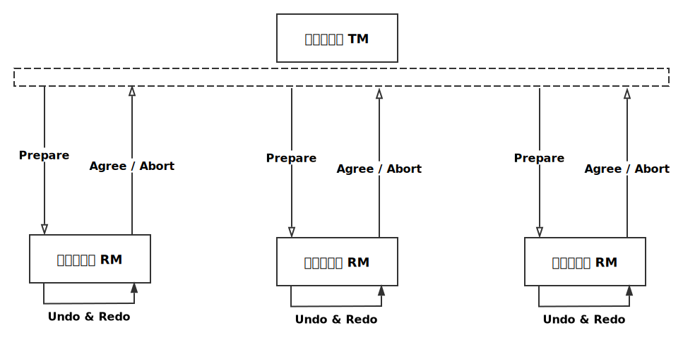
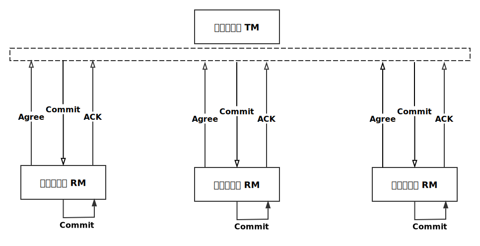

# 分布式系统理论

## CAP 定理

[CAP 定理](https://zh.wikipedia.org/wiki/CAP%E5%AE%9A%E7%90%86)指出对于一个分布式系统来说，不可能同时满足以下三点:

- **一致性** (Consistence): 等同于所有节点访问同一份最新的数据副本 (强一致性)
- **可用性** (Availability): 每次请求都能获取到非错的响应，但是不保证获取的数据为最新数据
- **分区容错性** (Partition tolerance): 系统如果不能在时限内达成数据一致性，就意味着发生了分区的情况，此时必须在 C 和 A 之间做出取舍

> 一个分布式系统里面，节点组成的网络本来应该是连通的。然而可能因为一些故障或者延时，使得有些节点之间不连通了，整个网络就分成了几块区域。数据就散布在了这些不连通的区域中，这就叫分区。当你一个数据项只在一个节点中保存，那么分区出现后，和这个节点不连通的部分就访问不到这个数据了。这时分区就是无法容忍的。提高分区容忍性的办法就是将一个数据项复制到多个节点上，那么出现分区之后，这一数据项就可能分布到各个区里，容忍性就提高了。然而，要把数据复制到多个节点，就会带来一致性的问题，就是多个节点上面的数据可能是不一致的。要保证一致，每次写操作就都要等待全部节点写成功，而这等待又会带来可用性的问题。总的来说就是，数据存在的节点越多，分区容忍性越高，但要复制更新的数据就越多，一致性就越难保证。为了保证一致性，更新所有节点数据所需要的时间就越长，可用性就会降低 -- 来自知乎邬江的回答

CAP 理论实际想表达的是任何分布式系统不能同时满足强一致性、高可用性和较好的分区容错性

> RDBMS: Relational Database Management System，关系型数据库管理系统

由 CAP 定理可知数据库的设计需要权衡取舍，所以可以把数据库大致分为三类:

- CA: 单点集群，满足一致性，可用性的系统，通常在可扩展性上不太强大
- CP: 满足一致性，分区容忍性的系统，通常性能不是特别高
- AP: 满足可用性，分区容忍性的系统，通常可能对一致性要求低一些

> 分布式和集群的区别:
>
> > 分布式: 不同的多台服务器上面部署不同的服务模块，他们之间通过 Rpc/HTTP 等方式进行通信和调用，对外提供服务和组内协作
>
> > 集群: 不同的多台服务器上面部署相同的服务模块，通过分布式调度软件进行统一的调度，对外提供服务和访问

## ACID 和 BASE

### ACID

[ACID](https://zh.wikipedia.org/wiki/ACID) 指的是传统数据库中事务操作所具备的四个特性:

- 原子性 (Atomicity): 一个事务 (transaction) 中的所有操作作为一个基本单元，要么全部完成，要么全部不完成，不会结束在中间某个环节。事务在执行过程中发生错误，会被回滚（Rollback）到事务开始前的状态，就像这个事务从来没有执行过一样
- 一致性 (Consistency): 在事务开始之前和事务结束以后，数据库的完整性没有被破坏。一个事务能够正确地将数据库从一个一致性状态变换为另一个一致性状态
- 隔离性 (Isolation): 也可以称作独立性，数据库允许多个并发事务同时对其数据进行读写和修改的能力，隔离性可以防止多个事务并发执行时由于交叉执行而导致数据的不一致。事务隔离分为不同级别，包括读未提交 (Read uncommitted)、读提交 (read committed)、可重复读 (repeatable read) 和串行化 (Serializable)
- 持久性 (Durability): 事务处理结束后，对数据的修改就是永久的，即便系统故障也不会丢失

### BASE

BASE 理论是对 CAP 理论的延伸，核心思想是虽然无法做到强一致性 (Strong Consistency)，但可以采用适合的方式达到最终一致性 (Eventual Consitency)

BASE 包含三部分:

- 基本可用 (Basically Available): 指分布式系统在出现故障的时候，允许损失部分可用性，保证核心可用
- 软状态 (Soft State): 指允许系统存在中间状态，而该中间状态不会影响系统整体可用性。分布式存储中一般一份数据至少会有三个副本，允许不同节点间副本同步的延时就是软状态的体现。mysql replication 的异步复制也是一种体现
- 最终一致性 (Eventual Consistency): 指系统中的所有数据副本经过一定时间后，最终能够达到一致的状态。最终一致性是弱一致性的一种特殊情况

### 两者区别

ACID 隶属于 CA，是传统数据库常用的设计理念，追求强一致性模型

BASE 隶属于 AP，支持的是大型分布式系统，提出通过牺牲强一致性获得高可用性

但在实际的分布式场景中，不同业务单元和组件对数据一致性的要求是不同的，因此在具体的分布式系统架构设计过程中，ACID 特性与 BASE 理论往往会结合在一起使用。比如整体满足 BASE，局部满足 ACID。

## 一致性模型

- 强一致性: 当更新操作完成之后，任何多个后续进程或者线程的访问都会返回最新的更新过的值。这种是对用户最友好的，就是用户上一次写什么，下一次就保证能读到什么。但是这种实现对性能影响较大，因为这意味着，只要上次的操作没有处理完，就不能让用户读取数据
- 弱一致性: 系统并不保证进程或者线程的访问都会返回最新的更新过的值。系统在数据写入成功之后，不承诺立即可以读到最新写入的值，也不会具体的承诺多久之后可以读到。但会尽可能保证在某个时间级别（比如秒级别）之后，可以让数据达到一致性状态
  - 最终一致性: 弱一致性的特定形式。系统保证在没有后续更新的前提下，系统最终返回上一次更新操作的值。在没有故障发生的前提下，不一致窗口的时间主要受通信延迟，系统负载和复制副本的个数影响。DNS 是一个典型的最终一致性系统
    - 因果一致性: 如果 A 进程在更新之后向 B 进程通知更新的完成，那么 B 的访问操作将会返回更新的值。如果没有因果关系的 C 进程将会遵循最终一致性的规则
    - 读己所写一致性: 因果一致性的特定形式。一个进程总可以读到自己更新的数据
    - 会话一致性: 读己所写一致性的特定形式。进程在访问存储系统同一个会话内，系统保证该进程读己之所写
    - 单调读一致性: 如果一个进程已经读取到一个特定值，那么该进程不会读取到该值旧版本的任何值
    - 单调写一致性: 系统保证对同一个进程的写操作串行化

上述最终一致性的不同方式可以进行组合，例如单调读一致性和读己之所写一致性就可以组合实现。并且从实践的角度来看，这两者的组合，读取自己更新的数据，和一旦读取到最新的版本不会再读取旧版本，对于此架构上的程序开发来说，会少很多额外的烦恼。

从服务端角度，如何尽快将更新后的数据分布到整个系统，降低达到最终一致性的时间窗口，是提高系统的可用度和用户体验非常重要的方面。

为了解决分布式的一致性问题，出现了很多一致性协议和算法，比如二阶段提交协议，三阶段提交协议和 Paxos 算法

## FLP 不可能定理

在**异步**通信场景，即使只有一个进程失败了，也没有任何算法能保证非失败进程能够达到一致性。

异步通信与同步通信的最大区别是没有时钟、不能时间同步、不能使用超时、不能探测失败、消息可任意延迟、消息可乱序

> [FLP Impossibility 的证明](http://danielw.cn/FLP-proof)

# 分布式事务

[分布式事务](https://en.wikipedia.org/wiki/Distributed_transaction)用于在分布式系统中保证不同节点之间的数据一致性，通常会涉及到多个数据库。分布式事务处理的关键是必须有一种方法可以知道事务在任何地方所做的所有动作，提交或回滚事务的决定必须产生统一的结果(全部提交或全部回滚)。

> DRDA: Distributed Relational Database Architecture，分布式关系数据库架构

## XA 规范

XA 规范是 X/Open 组织(即现在的 Open Group) 关于分布式事务处理 (DTP) 模型的处理规范。

DTP 模型包括**应用程序 AP**、**事务管理器 TM**、**资源管理器 RM**、**通信资源管理器 CRM** 四部分。常见的事务管理器 TM 是交易中间件，常见的资源管理器 RM 是数据库，常见的通信资源管理器 CRM 是消息中间件。交易中间件是必需的，由它通知和协调相关数据库的提交或回滚。

规范描述了全局的事务管理器与局部的资源管理器之间的接口。XA 规范的目的是允许的多个资源（如数据库，应用服务器，消息队列，等等）在同一事务中访问，这样可以使 ACID 属性跨越应用程序而保持有效。

XA 使用两阶段提交或三阶段提交来保证所有资源同时提交或回滚任何特定的事务

### 两阶段提交-2PC

当一个事务跨越多个节点时，为了保持事务的 ACID 特性，需要引入一个作为协调者的组件来统一掌控所有节点(称作参与者)的操作结果并最终指示这些节点是否要把操作结果进行真正的提交。所以[两阶段提交 (Two-phase Commit)](https://zh.wikipedia.org/wiki/%E4%BA%8C%E9%98%B6%E6%AE%B5%E6%8F%90%E4%BA%A4) 的算法思路可以概括为: 参与者将操作成败通知协调者，再由协调者根据所有参与者的反馈情报决定各参与者是否要提交操作还是中止操作。

两阶段提交需要的条件:

1.  分布式系统中，存在一个节点作为协调者 (Coordinator)，其他节点作为参与者 (Cohorts)，且节点之间可以进行网络通信
2.  所有节点都采用预写式日志，且日志被写入后即被保持在可靠的存储设备上，即使节点损坏不会导致日志数据的消失
3.  所有节点不会永久性损坏，即使损坏后仍然可以恢复

两个阶段分别为:

1.  准备阶段(投票阶段)
2.  提交阶段(执行阶段)

#### 准备阶段

1.  事务协调者(事务管理器)给每个参与者(资源管理器)发送 Prepare 消息，询问是否可以执行提交操作，并开始等待各参与者节点的响应
2.  参与者执行事务操作，并将 Undo 信息和 Redo 信息写入日志
3.  各参与者节点响应协调者节点发起的询问。如果参与者节点的事务操作实际执行成功，则它返回一个"同意" (agreement) 消息；如果参与者节点的事务操作实际执行失败，则它返回一个"中止" (Abort) 消息

第一阶段也被称作投票阶段，即各参与者投票是否要继续接下来的提交操作

#### 提交阶段

- 当协调者节点从所有参与者节点获得的响应消息都为"同意"时
  1.  协调者节点向所有参与者节点发出"正式提交"的请求
  2.  参与者节点正式完成操作，并释放在整个事务期间内占用的资源
  3.  参与者节点向协调者节点发送"完成"消息
  4.  协调者节点收到所有参与者节点反馈的"完成"消息后，完成事务

- 如果任一参与者节点在第一阶段返回的响应消息为"中止"，或者协调者节点在第一阶段的询问超时之前无法获取所有参与者节点的响应消息时
  1.  协调者节点向所有参与者节点发出"回滚操作"的请求
  2.  参与者节点利用之前写入的 Undo 信息执行回滚，并释放在整个事务期间内占用的资源
  3.  参与者节点向协调者节点发送"回滚完成"消息
  4.  协调者节点收到所有参与者节点反馈的"回滚完成"消息后，取消事务

不管最后结果如何，第二阶段都会结束当前事务

#### 缺陷

1、同步阻塞问题。执行过程中，所有参与节点都是事务阻塞型的。当参与者占有公共资源时，其他第三方节点访问公共资源都将处于阻塞状态

2、单点故障。由于协调者的重要性，一旦协调者发生故障。参与者会一直阻塞下去。尤其在第二阶段，协调者发生故障，那么所有的参与者还都处于锁定事务资源的状态中，而无法继续完成事务操作。（如果是协调者挂掉，可以重新选举一个协调者，但是无法解决因为协调者宕机导致的参与者处于阻塞状态的问题）

3、数据不一致。在第二阶段中，当协调者向参与者发送 commit 请求之后，发生了局部网络异常或者在发送 commit 请求过程中协调者发生了故障，这会导致只有一部分参与者接受到了 commit 请求。而在这部分参与者接到 commit 请求之后就会执行 commit 操作。但是其他部分未接到 commit 请求的机器则无法执行事务提交，于是整个分布式系统便出现了数据不一致的现象

4、二阶段提交存在一个无法解决的问题:

对于现有模型，可能会出现的错误和相应的措施如下

- 协调者出错，参与者不出错
  - 可以通过快速创建一个新的协调者来解决(或者原本就有备用协调者)
- 协调者不出错，参与者出错
  - 如果参与者是第一阶段一开始就挂了，那么投票失败，协调者取消事务即可
  - 如果参与者是投完票才挂的，那么投票依旧有效，协调者会下达最终的事务操作指令，正常节点都会完成最后的事务提交或回滚，而挂掉的参与者恢复后只要询问协调者并执行相同的操作即可
- 协调者出错，参与者也出错
  - 这种情况就比较复杂了，需要单独讲

关于第三个问题的详细描述如下:

协调者挂了，RM3 也挂了，此时分两种情况，RM3 是否执行了最后的事务操作:
- RM3 挂之前不管收没收到指令，只要没有执行事务操作，都是不影响最终一致性的，因为 RM3 挂了但它的事务尚未作出最后的提交或回滚时，新的协调者和其他正常节点不管最后是做了提交还是回滚，只要 RM3 恢复后询问新协调者采取相同的操作即可保证全局一致
- 严重的问题是挂掉的 RM3 挂之前执行了事务的最终操作:
  - 协调者第二阶段发出一条指令后挂了，而 RM3 收到这条指令后对事物做了操作后也跟着挂了，等新的协调者出现时，没有人知道之前原协调者发送的是 Commit 还是 Rollback，也不清楚 RM3 是执行了提交还是回滚；新的协调者出现后会询问各节点状态，如果有节点回复的是 No，那么发送回滚指令，如果各节点都回复 Yes，则发送提交指令；比如上图中新协调者和其他正常节点应该会投票成功然后执行了 Commit 指令，而 RM3 恢复正常后，整体是否一致很难确定，因为 RM3 可能在第一阶段回复的是 Abort，然后原协调者发送了 Rollback，挂之前 RM3 已经回滚，那么此时全局就不一致了(此时需要不一致的 RM3 通过其他方式恢复一致，但完成之前系统整体是不一致的)

最后这个问题就是 2PC 无法解决的问题，但 3PC 可以一定程度上解决

### 三阶段提交-3PC

三阶段提交 (Three-phase Commit) 是针对两阶段缺点而设计的改进型，相比较两阶段提交，做出以下两点改动:

1.  引入超时机制。同时在协调者和参与者中都引入超时机制(2PC 只有协调者设置了超时机制)，超时后可以默认执行 Commit 或者 Abort，这一点可以避免事务资源长时间被阻塞
2.  在第一阶段和第二阶段中插入一个准备阶段。保证了在最后提交阶段之前各参与节点的状态是一致的

三个阶段分为:

1.  CanCommit
2.  PreCommit
3.  DoCommit

#### CanCommit

1.  协调者向参与者发送 CanCommit 请求。询问是否可以执行事务提交操作。然后开始等待参与者的响应
2.  参与者接到 CanCommit 请求之后，正常情况下，如果其自身认为可以顺利执行事务，则返回 Yes 响应，并进入预备状态。否则反馈 No

#### PreCommit

- 假如协调者从所有的参与者获得的反馈都是 Yes 响应，那么就会执行事务的预执行:
  1.  发送预提交请求协调者向参与者发送 PreCommit 请求，并进入 Prepared 阶段
  2.  事务预提交参与者接收到 PreCommit 请求后，会执行事务操作，并将 Undo 和 Redo 信息记录到事务日志中
  3.  如果参与者成功的执行了事务操作，则返回 ACK 响应，同时开始等待最终指令

> 此图中如果某条 PreCommit 消息未到达或者超时，RM 应该中断自己本地的事务，就跟下图中 Abort 超时一样

- 假如有任何一个参与者向协调者发送了 No 响应，或者等待超时之后，协调者都没有接到参与者的响应，那么就执行事务的中断:
  1.  发送中断请求协调者向所有参与者发送 Abort 请求
  2.  参与者收到来自协调者的 Abort 请求之后（或超时之后，仍未收到协调者的请求），执行事务的中断

#### DoCommit

根据情况分为两种情形:

- 正常响应后执行提交操作完成事务:
  1.  协调者接收到 PreCommit 阶段中参与者发送的 ACK 响应，那么他将从预提交状态进入到提交状态，并向所有参与者发送 DoCommit 请求
  2.  参与者接收到 DoCommit 请求之后，执行正式的事务提交，并在完成事务提交之后释放所有事务资源
  3.  事务提交完之后，向协调者发送 ACK 响应
  4.  协调者接收到所有参与者的 ACK 响应之后，完成事务

- 协调者没有接收到参与者发送的 ACK 响应（可能是接受者发送的不是 ACK 响应，也可能响应超时），那么就会执行中断事务:
  1.  协调者向所有参与者发送 Abort 请求
  2.  参与者接收到 Abort 请求之后，利用其在阶段二记录的 Undo 信息来执行事务的回滚操作，并在完成回滚之后释放所有的事务资源。
  3.  参与者完成事务回滚之后，向协调者发送 ACK 消息
  4.  协调者接收到参与者反馈的 ACK 消息之后，结束事务

图中 RM3 在第二阶段未正常响应 ACK，可能有如下情况:

- 比如 RM3 未正常接收 PreCommit 消息，在第二阶段就取消了本地事务，所以没有返回 ACK，则第三阶段接收 Abort 时并不需要做什么
- 也可能是 RM3 收到了 PreCommit 消息并执行了事务操作，但是 ACK 消息发送超时，则第三阶段接收 Abort 时也是同其他节点一样执行 Undo 回滚
- 如果是第二阶段 RM3 挂了，如果是持久性挂了，那就挂了吧，现阶段就不管它了，等恢复了再做数据同步；如果挂了之后又恢复了，需要询问 TM 现在的事务状态来进行判断是否取消本地事务还是继续完成事务

> 在第三阶段，如果**参与者**无法及时接收到来自协调者的 DoCommit 或者 Abort 请求时，会在**等待超时之后，会继续进行事务的提交**
>
> 这么做是有一定考究的，因为能进入第三阶段，说明协调者肯定在第二阶段发起了 PreCommit 请求，而发起 PreCommit 请求的前提是第一阶段所有参与者都响应了 Yes，这表明所有参与者当时的状态都是乐观的，那么第三阶段参与者就算没有**按时**收到来自协调者的 DoCommit 请求，也继续完成本地事务的提交，这样完成全局事务的可能性还是很大的，这一点是针对 2PC 数据不一致问题的
>
> 但是这一点也会造成 3PC 的一致性缺陷: 如果此时是协调者对某个 RM 发出的 Abort 请求超时，而那个 RM 继续完成本地事务的提交，这就会造成与其他进行回滚操作的节点数据不一致(这种情况概率较小)

#### 缺陷

对应 2PC 的缺陷，我们可以看到 3PC 解决了不少问题，一方面默认的超时机制可以避免单点故障造成的资源长久阻塞的问题；另一方面状态确认和默认超时提交也可以解决 2PC 的数据不一致问题(虽然这会造成 3PC 自己的不一致问题，但是因为 3PC 的机制，这种概率更小)

至于前面提到的 2PC 无法解决的问题，3PC 又是怎么解决的呢?

我们可以回想 2PC 的问题，冲突的条件就是 RM3 第一阶段投了反对票，而这件事只有原协调者知道，挂掉的两者执行了回滚操作，而新协调者和正常节点会执行提交操作；但是 3PC 将准备阶段分为两步可以确保最终事务操作之前，大家都知道投票结果，描述如下:

- 假如同样是第二阶段协调者和 RM3 挂了

其实只要没有执行事务最终的提交或者回滚都不影响最终结果，只要后面 RM3 恢复后查询协调者并执行相同的操作即可

- 假如是进入第三阶段协调者和 RM3 挂了，而且 RM3 已经执行了最终操作

这时候新协调者出现后，只要查看正常节点的状态就可以知道发送提交还是回滚指令: 如果都是 Commited 或者 PreCommit 状态，说明第一轮投票结果都是 Yes，否则不可能进入 PreCommit 状态，所以新协调者发送提交指令即可；如果存在节点的状态是 Cancel，说明第一轮投票结果有反对票，那么新协调者发送回滚指令即可。可能这里会有个疑问，讲 DoCommit 的时候我们说过第二阶段参与者的 ACK 可能无法正常响应协调者，如果是 RM3 第一轮投了支持票后面进入 PreCommit 状态时没有把 ACK 正常响应给协调者，因此协调者发送了 Abort 指令给 RM3 后挂了，RM3 收到指令后也挂了，此时还是会造成 RM3 回滚，而新协调者和正常节点执行提交的状况，这里其实 3PC 好像也没法解决，但是这种情况的概率你可以估算一下，本来协调者发送指令挂了然后某些参与者执行后也挂了的概率本身就低了，还要满足挂的协调者在投完支持票后响应超时引起协调者发送 Abort 指令的概率，那就更小了

### 理解 2PC 和 3PC

我们用一个实际生活的例子来说明并理解这个过程:

假设协调者是牧师，而参与者是一男一女，他们来到教堂单独跟牧师见面并传达是否想跟另一方建立更深的关系的信息

#### 2PC

第一步男女双方给牧师递了小纸条，上面写着是否想跟另一方建立更深的关系，并且各自准备好了信物 (Undo&Redo)

第二步牧师看过之后，如果双方都写“是”，那么告知双方交换信物表示可以继续深交；如果有一方写“否”，那么告知双方分手吧，信物也撤了吧

但是这里 2PC 无法解决一个问题: 假如男方写的纸条信息是“否”，而牧师看过之后先告诉男方你把信物撤了吧，你们不合适，但是牧师紧接着心脏病犯了住院了，而男方收到消息后也撤了信物准备分手，可是男方突然被人打了住院昏迷；新牧师出现，继续询问女方的意见，因为不知道男方的意见，他们可能会促成一桩不美满的关系

#### 3PC

第一步男女双方还是递了小纸条，表示自己的意愿

第二步牧师看过之后，如果双方都写“是”，那么先告知双方准备信物；如果有一方写“否”，那么告知双方不用准备信物了；双方收到消息后再回应说自己知道了

第三步牧师确认双方的回应后，告知双方最后是否在一起，是否交换信物

在这里假如第三步牧师也是先告知男方后突发心脏病住院，而男方也是收到消息后被打昏迷，此时新牧师出现后可以查看女方是否准备了信物而完成最后的决定，因为假如男方原本是不同意，那么第二步双方肯定是没有准备信物的，而假如男方是同意的，那么双方肯定是准备了信物的，那么新牧师可以放心宣布双方可以在一起

3PC 还对双方都引入了超时，2PC 中只有牧师没收到消息时会取消事务，而 3PC 中如果男女双方长时间没有收到牧师消息后也会执行自己的决定，避免了 2PC 中同样情形时男女双方在这里一直耗着(阻塞)而错过了下一任。只不过我们提到了如果第三步牧师是因为长时间没有收到男方的消息时也取消了事务，虽然这时候男女双方都是同意的，但是还是会被取消事务，这也可能造成新的不一致问题，但是相对来说概率就小得多了

### 解决不一致问题

通过上述过程可知最后无论是二阶段提交还是三阶段提交都无法彻底解决分布式的一致性问题，如果系统正常运行都能满足强一致性，但是如果出现意外还是会导致不一致，不过可以通过其他手段达到一致性，比如分区数据恢复或者事务补偿机制或者采用其他一致性算法

#### 分区数据恢复

复杂的数据恢复可以参见 SVN 的版本控制，可能可以自动合并，也可能会发生冲突然后需要人工干预

简单的数据恢复可以参见 Mysql 的主从同步，数据可以自动从主库导到从库

合并分区数据达成一致并不是最困难的，更困难的是处理分区过程中产生的错误。当分区操作引起错误，可以通过事务补偿补救错误，这可能是人工的也可能是自动的

#### 分区事务补偿

比如 MQ 消息事务和 TCC 事务协议就是一种补偿机制:

- MQ 事务: 利用消息中间件来异步完成事务的后一半更新，实现系统的最终一致性
- TCC 事务: TCC 是阿里巴巴提出的协议，将一个事务分为 Try、Commit、Cancel 三部分，也可以达到最终一致性

#### 其他一致性算法

- [Paxos 算法](https://zh.wikipedia.org/wiki/Paxos%E7%AE%97%E6%B3%95): 一种基于消息传递且具有高度容错特性的一致性算法
  - [Raft 算法](https://zh.wikipedia.org/wiki/Raft): Raft 是一个共识算法，用于取代 Paxos。Raft 的目标是提供更好理解的算法，并且证明可以提供与 Paxos 相同的容错性以及性能
  - [Zab](https://distributedalgorithm.wordpress.com/2015/06/20/architecture-of-zab-zookeeper-atomic-broadcast-protocol/): Zookeeper atomic broadcast protocol，是 Zookeeper 内部用到的一致性协议。相比 Paxos，Zab 最大的特点是保证强一致性 (strong consistency，或叫线性一致性 linearizable consistency)

## Reference

- [分布式系统的 CAP 理论](http://www.hollischuang.com/archives/666)
- [CAP 理论](http://www.yunweipai.com/archives/8432.html)
- [深入理解分布式系统的2PC和3PC](http://www.hollischuang.com/archives/1580)
- [分布式服务化系统一致性的“最佳实干”](https://www.jianshu.com/p/1156151e20c8)
- [分布式一致性与共识算法](https://draveness.me/consensus)
