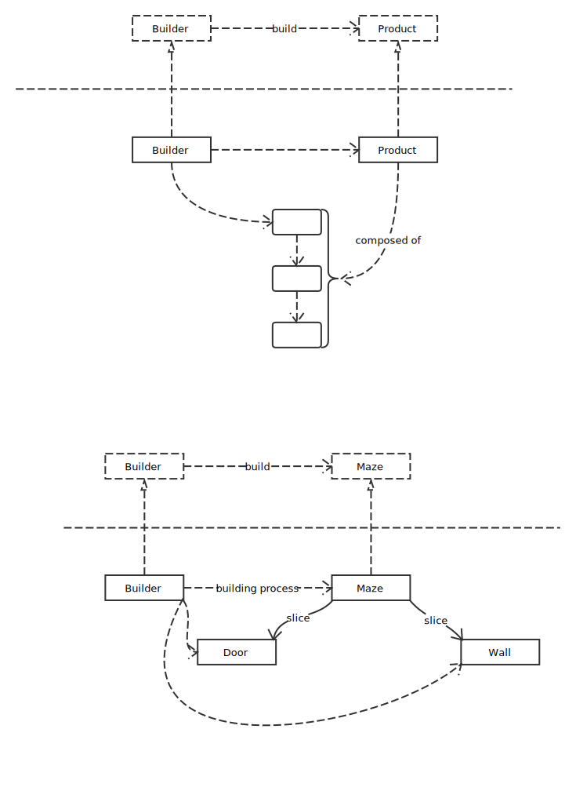
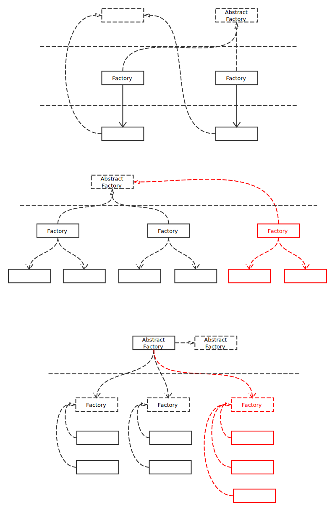
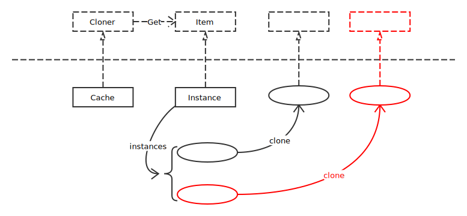

# Creational Patterns

## Singleton Pattern

确保只有一个实例，并提供对该实例的全局访问。

## Builder Pattern

将一个复杂对象的构建与它的表示分离，使得同样的构建过程可以创建不同的表示。

## Factory Pattern

使用者不需关心对象创建的过程，直接通过工厂即可创建相应的对象。

## Abstract Factory

抽象工厂创建工厂，不同工厂创建各自实例。

## Prototype Factory

通过复制原型创建实例，减小创建复杂实例时的开销。

