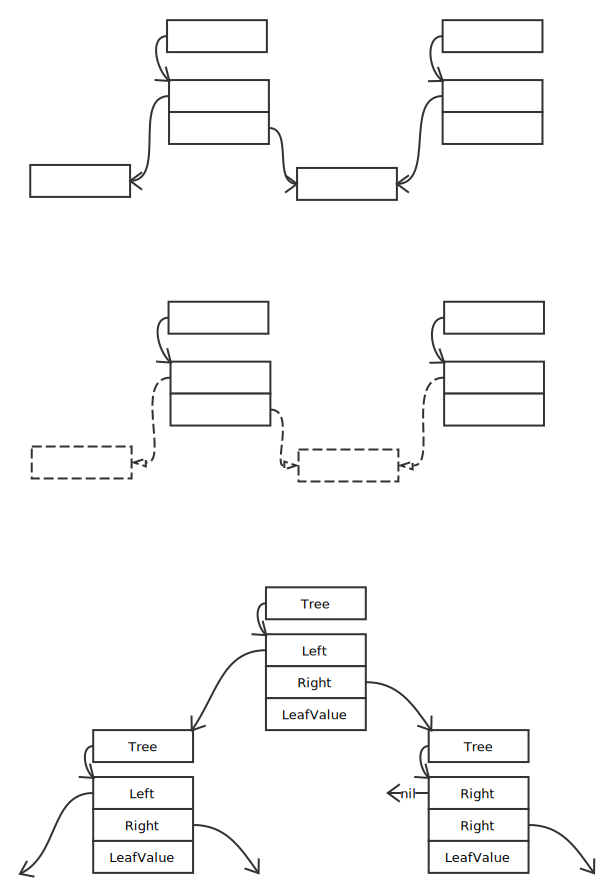
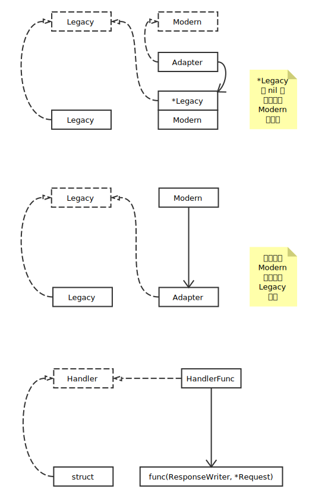
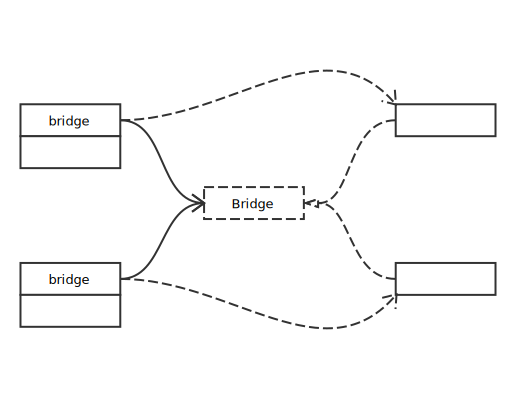
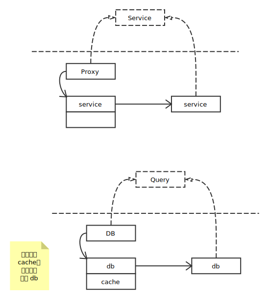
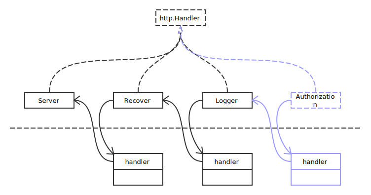
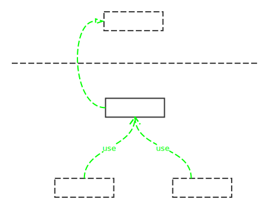
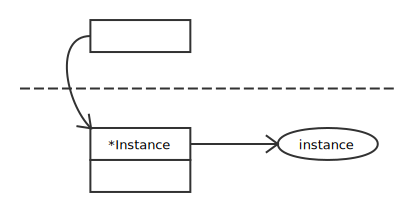

# Structural Patterns

## Composite Pattern

展现两个或多个结构之间的关系，可以看作 Go 中的继承关系。

## Adapter Pattern

在不修改旧代码的前提下，编写新的代码适配原有的代码。

## Bridge Pattern

分离抽象和实现，以便两者可以独立的变化。

注意：要理解桥接模式需要从宏观上进行思考

## Proxy Pattern

代理模式中，代理使用与它所包装类型相同的接口。对于使用者，它们两不应该有任何区别。

database, sniffer

## Decorator Pattern

向某个对象动态地添加更多的功能。修饰模式是除继承外另一种扩展功能的方法。

中间件

### Decorator Pattern vs Proxy Pattern

在 Proxy Pattern 中，proxy 对于使用者来说是一个完整的，内部添加了哪些功能是不可以选择的。而在 Decorator Pattern 中，使用者可以自由地选择需要添加的功能。

## Facade Pattern

为子系统中的一组接口提供一个统一的高层接口，使得子系统更容易使用。开发人员不需了解内部复杂的子系统的接口，方便了开发人员的使用。

## Flyweight Pattern

程序运行中需大量创建大的对象时，可以只创建一个对象实例，让使用的地方存对象的地址。

### Flyweight Pattern vs Singleton Pattern

享元模式，和单例模式相似，但是它们思考和处理的层面不一样。单例模式中所创建的对象在逻辑上本就只应该存在一份，例如：系统的配置、显示器的驱动等等。而享元模式中所创建的对象在逻辑上本就应该每次都创建一份，但现在只创建一份来减小内存开销。
