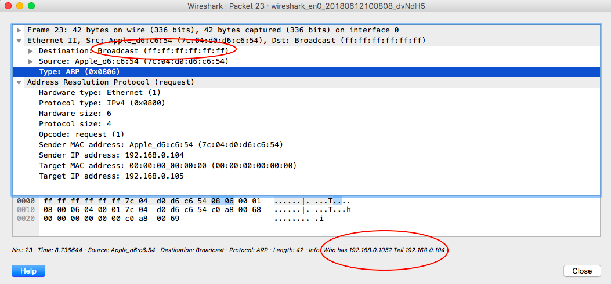

##    ARP 协议

> 在网络通信中，主机和主机通信的数据包需要依据OSI模型从上到下进行数据封装，当数据封装完整后，再向外发出。所以在局域网的通信中，不仅需要源目IP地址的封装，也需要源目MAC的封装。上层应用程序更多关心IP地址而不关心MAC地址，所以需要通过ARP协议来获知目的主机的MAC地址
>
> IP 协议使得报文可以跨越不同网络进行传输，当 IP 报文到达目标地址所在网络后，接下来要靠对方的 Mac 地址才能交付，这时候也要用到 ARP 地址解析协议。

### ARP 原理

#### 请求与应答

我在 Mac 上使用 ping 命令查询 192.168.0.105，由于不知道对方的 Mac 地址，所以先 ARP 请求。抓到的 ARP 请求报文如下：

不知道对方是否存在以及在哪里，所以向所在网段发送链路层广播请求，询问谁是 192.168.0.105 ，也就是目标 Mac 地址为 ff:ff:ff:ff:ff:ff，并且带上自己的 IP 和 Mac 信息。响应报文如下：

IP 地址为 ARP 目标 IP 地址的主机收到后，由于知道这个请求是谁发出的，就以单播的形式返回一个响应报文，并且告诉对方自己的 Mac 地址。其他主机收到 ARP 请求会默认丢弃。

请求方收到响应后，即可把目标 Mac 地址封装到帧里然后发送数据。

#### ARP 缓存

为了提高效率，每个主机维护了一个 ARP 缓存，维护着从网络层地址到硬件地址的最新映射，每条映射有一个到期时间，默认是 20min。

当收到多条 ARP 回应的时候，ARP 缓存按照"后到优先"原则，新的缓存直接覆盖旧的。

### ARP 攻击

#### 攻击原理

正常主机收到 ARP 请求，如果 目标 IP 不是自己，那么丢弃此报文。但当存在恶意节点时，则会造成 ARP 攻击：

恶意节点会发送大量的 ARP 响应，由于“后到覆盖”原则，几乎总是拿到错误数据。那么主机 A 会把发给主机 B 的数据都发送给 主机 C。同理，如果主机 B 要发送数据给主机 A，那么 C 也会冒充 A，就形成了 A <=> C <=> B 的情形，这就是典型的*中间人攻击*。

更严重的情况是，恶意节点冒充网关，拦截所有流量，这时候恶意节点可以直接使别的主机断连，当然很容易被发现，所以更多的时候实行限速。最严重的是，可能会盗取个人信息和密码。

#### 防御 ARP 攻击

> **ARP防御可以在网络设备上实现，也可以在用户端实现，更可以在网络设备和用户端同时实现**

##### 网络设备防御

先来了解下网络设备（例如这里的交换机）的防御技术，这种防御技术被称为**DAI（Dynamic ARP Inspection）- 动态ARP检测**，原理可以用两句话简单概括：

* 交换机记录每个接口对应的 IP 地址和 MAC，即 **port<->mac<->ip**，生成DAI检测表；
* 交换机检测每个接口发送过来的 ARP 回应包，根据 DAI 表判断是否违规，若违规则丢弃此数据包并对接口进行惩罚

如果判断出包是虚假的欺骗包，交换机马上丢弃这个包，并且可以对接口做惩罚（不同设备的惩罚方式有所不同，可以直接将接口"**软关闭**"，直接将攻击者断网；也可以"**静默处理**"，仅丢弃欺骗包，其他通信正常）

对于这个方案，有几点问题：

* 交换机可以查看 IP ？

  从现在的网络技术来看，分层界限越来越模糊，融合式的网络设备才是主流，现在的接入交换机基本能被Telnet/SSH/Web管理。不要被"交换机就是二层设备"给束缚了

* 如何生成 DAI 表 ？

  在交换机上开启**DHCP侦听**技术，当用户第一次通过DHCP获取到地址的时候，交换机就把用户电脑的IP、MAC、Port信息记录在DHCP侦听表，后面ARP检测直接调用这张DHCP侦听表即可

##### 主机防御

主机有两种方法防御：

* 安装 ARP 防火墙
* 静态绑定：静态绑定的信息比动态学习的优先级高

### 代理 ARP(PARP) 

在发送数据包时需要填写目标 Mac 地址，可是如果源主机和目标主机不在同一个网络会如何？如图，client 向 Server 发送请求，client 上配置了默认网关。

那么 client 上包的目标 Mac 填什么呢？很显然不可能知道 Server 的 Mac 地址：

* 路由器隔离广播域，每个接口/网段都是独立的广播域
* ARP 请求是二层广播包，广播包没法过路由器

此时如果 client 上配置了默认网关，那么直接找到默认网关的 Mac 地址作为目标地址。

但如果没有默认网关，则采用*代理 ARP*。

> 代理 ARP 本质上是一种欺骗，原理和 ARP 攻击一样，冒充目标地址，不过目的是为了正常通信

在这种情况下，路由器上如果配置了代理 ARP，则会冒充目的地址。

总结如下：

**①当电脑没有网关（采用代理ARP）时："跨网段访问谁，就问谁的MAC"**

**②当电脑有网关（采用正常ARP）时："跨网段访问谁，都问网关的MAC"**

**③无论哪种ARP，跨网段通信时，发送方请求得到的目标MAC地址都是网关MAC。**

### 免费/无故 ARP(Gratuitous ARP)

**用于检测局域网内的IP地址冲突**，在一定程度上能够给用户和网络运维人员提供帮助。相比『免费』这个翻译，『无故』这个词其实会更加好理解："**在没有人问自己的情况下，无缘无故自问自答**"。

如下是我的电脑和隔壁老王的电脑一起设置了静态 IP 地址，都设成 192.168.0.108，抓到的包：

先看第四条，我的电脑设了静态 IP 后，广播发送无故 ARP，注意这里 tell 后面是 0.0.0.0，也就是说，不用告诉我谁是 192.168.0.108，只是我自己宣告，我就是 192.168.0.108。

再看第五条，这不是一个 ARP 响应，而是老王的电脑也在向外宣告，他自己是 192.168.0.108，可以看到下面详细信息里目标 Mac 地址是老王的(72结尾的)。我这里收到后，告诉他我才是 192.168.0.108。

然后两台机器就开始互怼，同一局域网的其他主机，则根据这两个免费 ARP 信息不断的修改本地 ARP 表。

之后老王把他的 IP 改回 DHCP（第二个红框），路由器(192.168.0.1)这里同时扮演了 DHCP 的分配者，它向外询问是否有人占用了 192.168.0.104 这个地址，没有收到回应，于是分配给老王这个地址。分配了地址后，老王还是要向外宣告他自己的身份，使得同局域网的主机刷新 ARP 缓存，同时检测是否还有地址冲突。

第三个红框是老王关闭 WIFI 又重启。

### 总结一下

讨论了三种 ARP：

* ARP：通过 IP 地址找到 Mac 地址
* PARP：在没有网关的时候辅助通信
* GARP：解决地址冲突的问题

其实还有 RARP(Reverse ARP) 和 IARP(Inverse ARP)，不过使用极少，就不再赘述。