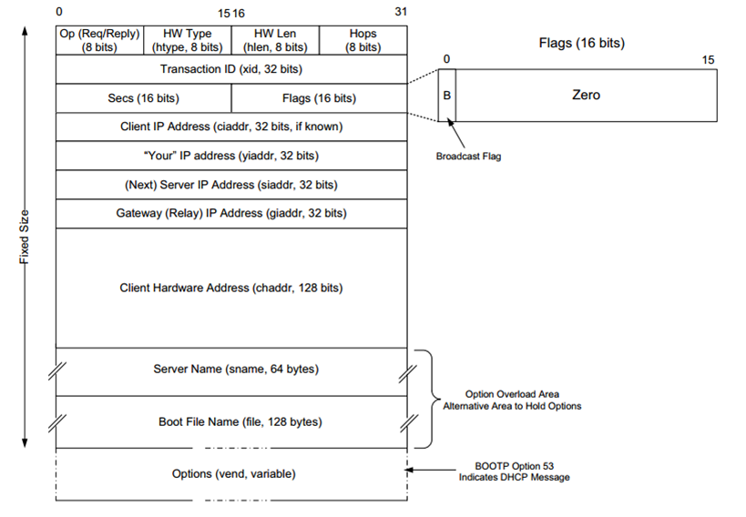
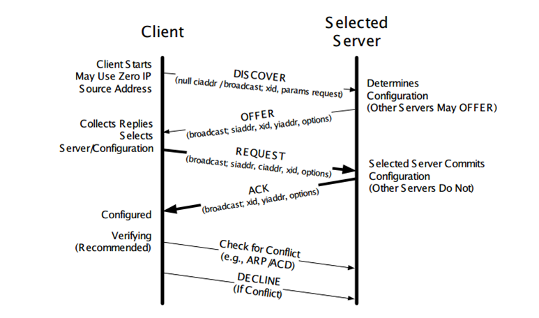
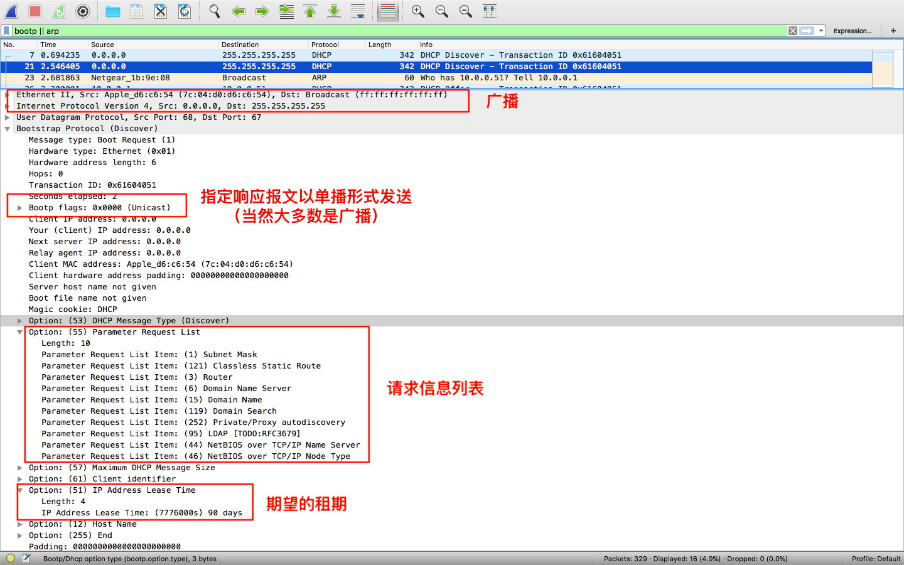
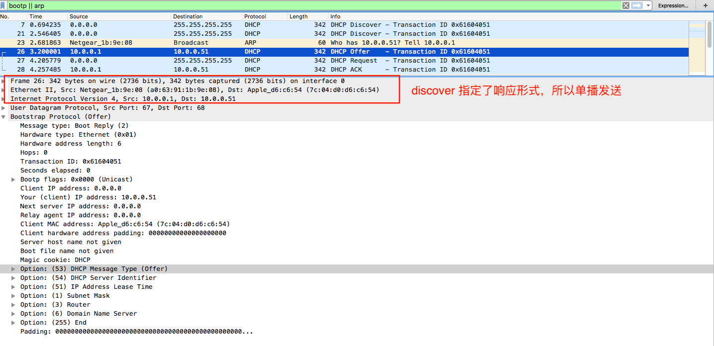
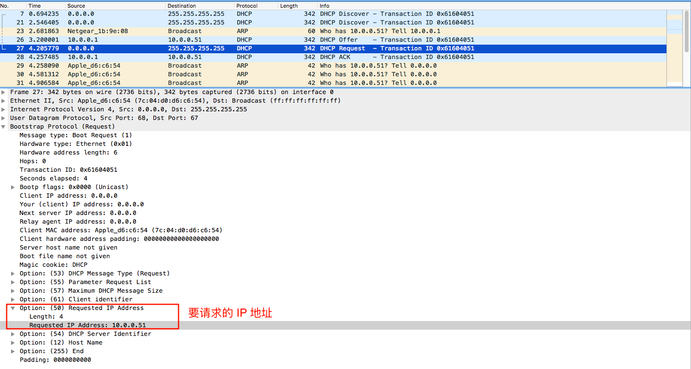
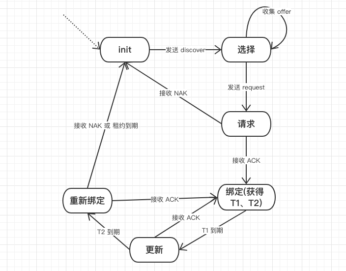
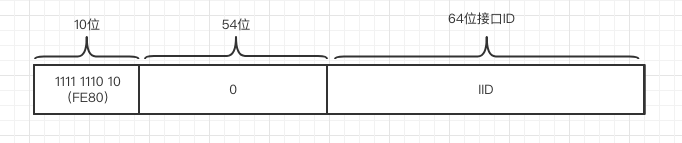
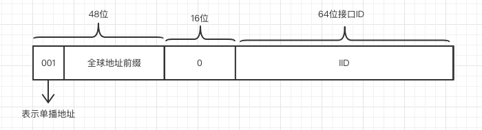

## DHCP 和自动配置

> 为了使用 TCP/IP 协议族，每台主机都要有一定的配置信息，特别是 IP 地址。通常这些配置信息有三种方法获得：
>
> * 手工获取
> * 通过一个系统服务获得
> * 通过某种算法获得

手工获取就是静态配置 IP、DNS 等信息，主要讨论后两种方法。

### DHCP

动态主机配置协议（Dynamic Host Configuration Protocol，DHCP），它动态的分配 IP 地址和其他信息（子网掩码、路由器 IP 地址、DNS 服务器 IP 地址）给主机。DHCP 的设计基于早期的 Internet 引导程序协议(BOOTP)，它使用*租用*的概念来扩展 BOOTP，允许客户机使用一个商定好的时间来配置信息。通常客户端使用 68 端口，服务端使用 67 端口。

租用的时间是一个重要的配置参数。如果时间太短，可以提供一个可用性较高的地址池，但频繁的分配导致稳定性减小、网络流量负荷增大；较长的租期稳定性较好，但通常会较快耗尽可用地址。默认的租期在 12~24 小时，在租期过半时，客户端可以申请续租。

#### DHCPv4 和 BOOTP

DHCP 是基于 BOOTP 的，并且 DHCPv4 是兼容 BOOTP 的，BOOTP 消息格式如下：



##### 基本字段

|      字段      | 含义                                                         |
| :------------: | ------------------------------------------------------------ |
|     yiaddr     | 从 server 送回 client 之 DHCP OFFER 与 DHCPACK 封包中，此栏填写分配给 client 的 IP 地址。 |
| TRANSACTION ID | DHCP REQUEST 时产生的数值，以作 DHCPREPLY 时的依据。         |
|     sname      | Server 之名称字符串，以 0x00 结尾。                          |
|     siaddr     | 若 client 需要透过网络开机，从 server 送出之 DHCP OFFER、DHCPACK、DHCPNACK封包中，此栏填写开机程序代码所在 server 之地址。 |
|    SECONDS     | Client 端启动时间（秒）。（时间戳）                          |
|    options     | 允许厂商定议选项（Vendor-Specific Area)，以提供更多的设定信息（如：Netmask、Gateway、DNS、等等）。 |
|       OP       | 若是 client 送给 server 的封包，设为 1 ，反向为 2。          |
|     HTYPE      | 硬件类别，Ethernet 为 1。                                    |
|      HOPS      | 若封包需经过 router 传送，每站加 1 ，若在同一网内，为 0。    |
|      HLEN      | 硬件地址长度， Ethernet 为 6。                               |
|     giaddr     | 若需跨网域进行 DHCP 发放，此栏为 relay agent 的地址，否则为 0。 |
|     FLAGS      | 从 0 到 15 共 16 bits ，最左一 bit 为 1 时表示 server 将以广播方式传送封包给 client ，其余尚未使用。 |
|      file      | 若 client 需要透过网络开机，此栏将指出开机程序名称，稍后以 TFTP 传送。 |
|     ciaddr     | 要是 client 端想继续使用之前取得之 IP 地址，则列于这里。     |
|     chaddr     | Client 之硬件地址。                                          |

##### 选项

DHCP 通过选项来扩展 BOOTP，选项用于携带 IP 地址之外的信息，如 子网掩码、路由器地址、DNS 地址 等等，其中还有一个消息类型选项，表明一个 BOOTP 报文是哪种 DHCP 消息：

* DHCP DISCOVER
* DHCP OFFER
* DHCP REQUEST
* DHCP DECLINE
* DHCP ACK
* DHCP NACK
* DHCP RELEASE

#### DHCP 操作过程

DHCP 消息是带有一组特殊选项的 BOOTP 消息，客户端连接到网络时，首先要发现网络中的 DHCP 服务器，然后请求服务器：



##### discover

一开始 client 使用 0 地址作为源，广播地址作为目标地址，去发现 DHCP 服务器：



##### offer

然后收到服务器的 offer 响应，这里可能有多个服务器，先收集所有信息。



注意大部分 offer 是以广播形式发送的，只不过我的电脑设置了单播，所以抓的包是单播形式。但是这里非常奇怪，为什么把还没正式分配的地址作为目标地址呢？如果网络中已经有一个 IP 地址为 10.0.0.51 的主机怎么办 ？这样为什么能够找到 client 主机呢？rfc 如下：

```
If the BROADCAST bit is cleared to 0, the message SHOULD be sent as an IP unicast to the IP address specified in the 'yiaddr' field and the link-layer address specified in the 'chaddr' field.
```

但 rfc 回答了第一个问题。第二个问题，注意图中 offer 之前，服务器发送了一个 ARP 报文，这是在探测目前是否有主机使用了这个 IP 地址，通常是没有的，如果有，那么服务器会在 offer 中提供另一个 IP 地址。第三个问题，通过 Mac 地址找到 client，虽然此时 client IP 地址(0.0.0.0) 和 报文目标 IP 地址不同，不过 client 并不会丢弃这个报文（这很特殊）。

##### request

offer 响应包含了服务器 可以提供的 IP 地址，client 从多个里面选取自己想要的（通常是以前使用过的），然后发送广播包请求：



##### ACK、NAK

服务器收到请求后，再次确认是否可以分配，然后响应 ACK 或 NAK 同意或不同意这个请求，如果发送 ACK，那么 client 就拥有了一个合法的 IP 地址，并且 client 发送 GARP 宣告自己的身份使得同网络的主机更新 ARP 缓存。

另外，client 从 ACK 中得到租用时间 T，计算出更新时间 T1=T/2，重新绑定时间 T2=7T/8.

#### DHCP 状态机



#### DHCPv6

DHCPv6 过程和 DHCPv4 类似，消息类型和 DHCPv4 对应如下：

|  DHCPv6   | DHCPv4   |
| :-------: | -------- |
|  SOLICIT  | DISCOVER |
| ADVERTISE | OFFER    |
|  REQUEST  | REQUEST  |
|   RENEW   | REQUEST  |
|  REBIND   | DISCOVER |
|   REPLY   | ACK/NAK  |
|  DECLINE  | DECLINE  |

略。

### DHCP 中继

以上 DHCP 服务有一个前提条件，就是服务器要和客户端在同一个网段，因为广播无法跨过路由器。如果一个企业有上百个部门，对应上百个子网，要配置上百个 DHCP 服务器。配置麻烦不说，而且资源分配可能不均衡，很可能出现一个部门地址不够分，另一个却有很多空闲。

所以需要统一管理分配，可是如何跨越广播域呢？可以通过一个中继来帮助客户端和服务器发现彼此。

#### DHCP 中继代理

当DHCP客户端与服务器不在同一个子网上，就必须有DHCP中继代理来转发DHCP请求和应答消息。DHCP中继代理的数据转发，与通常路由转发是不同的，通常的路由转发相对来说是透明传输的，设备一般不会修改IP包内容。而DHCP中继代理接收到DHCP消息后，进行**转换源目的IP，MAC**生成一个DHCP消息，然后转发出去。

在DHCP客户端看来，DHCP中继代理就像DHCP服务器；在DHCP服务器看来，DHCP中继代理就像DHCP客户端。 

不需要在各个用户网关设备上启用DHCP server功能，而只要在网络中心安装一个 DHCP 服务器，就可以实现对多个网段的动态IP管理，统一维护，即Client—Relay—Server 模式的DHCP动态IP管理

* 当dhcp client 启动并进行dhcp 初始化时，它会在本地网络广播配置请求报文。
* 如果本地网络存在 dhcp server，则可以直接进行 dhcp 配置，不需要 dhcp relay。
* 如果本地网络没有 dhcp server，则与本地网络相连的具有 dhcprelay 功能的网络设备收到该广播报文后，将进行适当处理并转发给指定的其它网络上的 dhcp server。
* dhcp server 根据 dhcp client 提供的信息进行相应的配置，并通过 dhcp relay 将配置信息发送给 dhcp client，完成对dhcp client 的动态配置。

### 无状态地址自动配置

对于一个全球性的地址，这些地址的某一部分通常需要被管理，也就是通过 DHCP 动态分配的。但如果只是[链路本地](https://zh.wikipedia.org/wiki/%E9%93%BE%E8%B7%AF%E6%9C%AC%E5%9C%B0%E5%9C%B0%E5%9D%80)的地址，通常通过*自动配置*来获得，也就是主机自己决定自己的 IP 地址。称为*无状态地址自动配置*（SLAAC）。

#### IPv4 链路本地的动态配置

当一个网络没有 DHCP 服务器和中继，主机不能获取 IP 地址，那么只能自己分配一个链路本地地址。IPv4 链路本地的范围是 168.254.0.1~168.254.254.254，使用子网掩码 255.255.0.0。

这种方法也叫自动专用 IP 寻址（Auto Private IP Addressing）。就是从特定范围随机选择一个地址，然后通过 GARP 检查是否有冲突。

#### 链路本地 IPv6 的 SLAAC

无状态地址自动配置（StateLess Address Auto Config，SLAAC）可用于无路由器环境，只分配链路本地地址。IPv6 的链路本地地址以 fe80::/10 为前缀，最后 N 位是一个*接口 ID（IID）*，其余位为 0。IID 可以通过主机的 Mac 地址按照一定的规则来生成，也可以是一个随机数，基本可以保证局域网中的唯一性。



由于没有路由器，这个地址只能在子网内部使用，不可路由。

#### 全球地址的 IPv6 SLAAC

一个节点获得链路本地地址后，还可能需要一个或多个全球地址。全球地址的形成类似于链路本地地址，只不过前缀不再是 fe80::/10，而是由路由器给出的可以路由的前缀。



#### 无状态 DHCP

无状态 DHCP 模式下， DHCPv6 提供 IP 地址以外的其他信息。在分配 IP 地址时，需要维护 IP 地址的租用状态（见前面的 DHCP 状态机），如果不提供 IP 地址，那么也就不用维护状态，故称无状态 DHCP。

通常把 IPv6 全球地址 SLAAC 和无状态 DHCP 结合起来用。

### 相关攻击

最大的漏洞就是如果有恶意主机，冒充正常主机，不断使用伪造的 Mac 地址来申请 IP 地址，那么 IP 地址资源很快用尽。可以采用授权的方式，使得合法的请求才能获取 IP 地址，同时限制未授权用户的数量，像链路层认证（如 WIFI 网络使用的 WPA2）就有助于限制未授权客户机的数量。