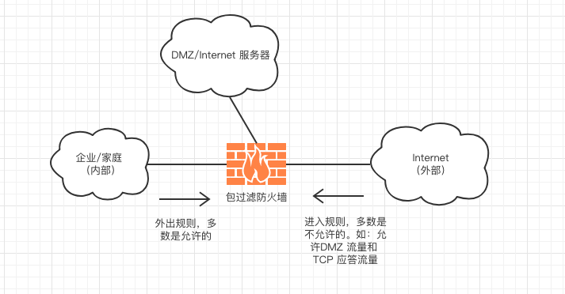
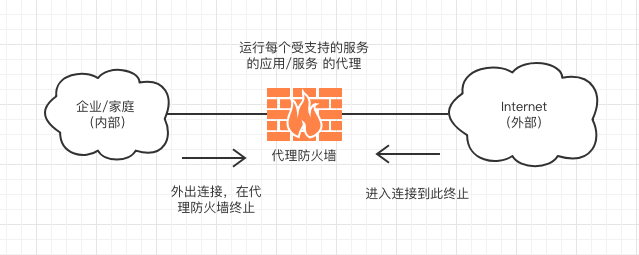
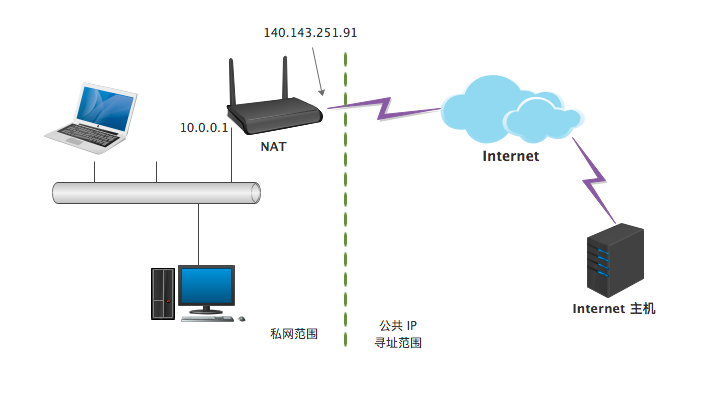
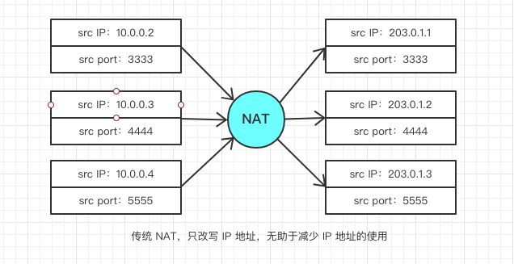
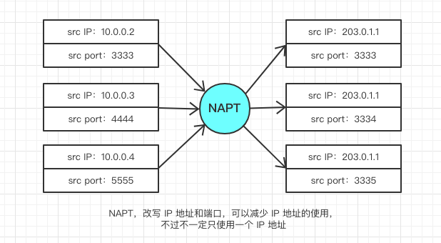
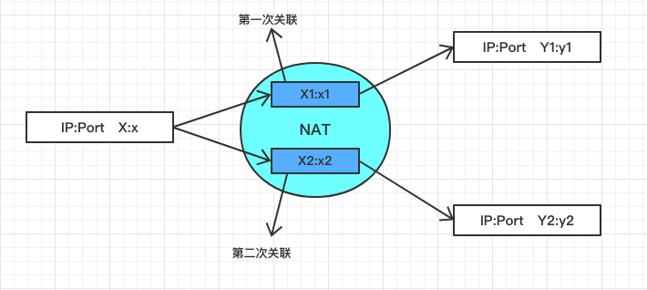
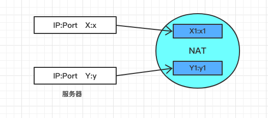
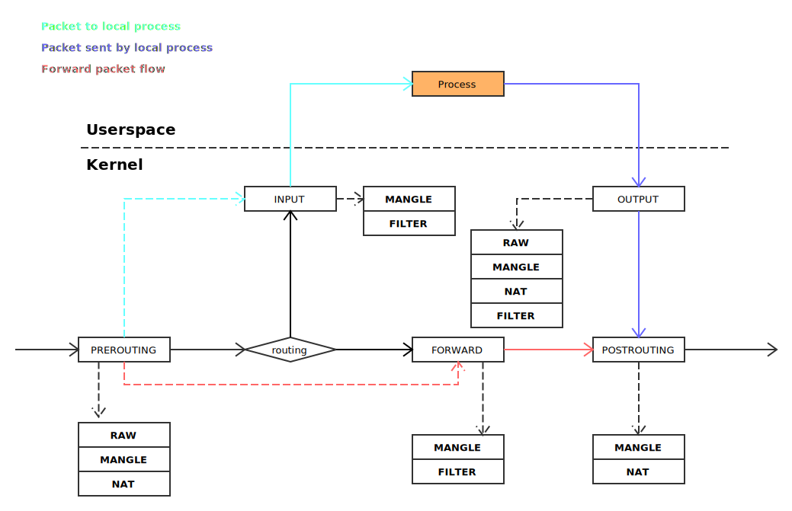
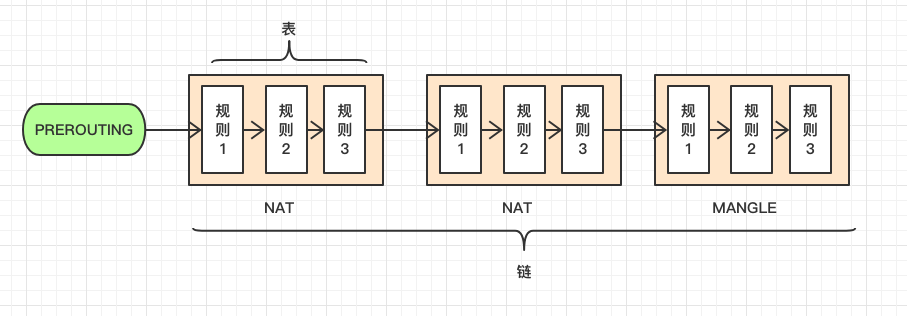

## 防火墙和网络地址转换

> 互联网发展到现在，最主要有两点问题：
>
> * 一是容易遭受攻击，通常使用防火墙来限制和控制互联网中流量的流向
> * 二是 IPv4 地址数量已经枯竭，虽然 IPv6 的进程在加快，但在完全应用之前，还是需要 NAT 地址转换来缓解 IPv4 地址不足的压力

### 防火墙

常见的防火墙分为两种，*包过滤防火墙* 和 *代理防火墙*。它们主要的区别是操作的协议层次不同。包过滤防火墙是一个互联网路由器，可以丢弃符合（或不符合）一定条件的数据包，而代理防火墙可以看作一个多宿主的服务器主机。

#### 包过滤防火墙

简单的过滤包括网络层或传输层报头中各个部分的比较，如 IP 地址、IP 选项、ICMP 报文的类型，或是根据端口确定的各种服务。

这里还可将其分为无状态和有状态的。无状态即对每个数据包单独处理，而有状态要考虑该报文是否为分片，能够关联已经到达或即将到达的数据包来推断流的信息。

通常来说，对于外出的规则很少，而为了防范各种攻击，只允许很少流量进入。



#### 代理防火墙

代理防火墙并不是真正意义上的路由器，它只是运行一个火多个*应用层网关*的主机，不转发 IP 报文，但能在应用层中继两个连接之间的特定类型的流量。



最常见的有两种，HTTP 代理防火墙和 SOCKS 代理防火墙

* HTTP 代理防火墙

也叫 Web 代理，只支持 HTTP 和 HTTPS。对于客户端来说，它是服务器，对于服务器来说，它是客户端。这种代理往往提供 Web 缓存功能，保存网页副本，减少延迟。也能作为*内容过滤器*，基于“黑名单”来阻止用户访问某些网站。相反的，有一些*隧道代理服务器*可以避免用户的访问被“黑名单”所过滤。

* SOCKS 协议

SOCKS 协议可以用于 Web 之外的服务，通常用作科学上网。[more](https://en.wikipedia.org/wiki/SOCKS)

### NAT 地址转换

> NAT （Network Address Translation），本质上是允许在互联网不同地方重复使用相同的 IP 地址的机制。当所有进出的流量通过 NAT 设备时，该设备把内部的地址空间和外部全球地址空间分割开。



#### 基本 NAT 和 NAPT

基本 NAT 只执行 IP 地址的重写，本质上将私有 IP 改写为一个公共地址，一个内部地址对应一个外部地址。




比较流行的方式是使用端口号来作为标识，通常使用一个外部地址(也可以是一个 IP 地址池)：



很明显 NAPT 可以减少对公共 IP 地址的需求。

不过注意，并不是说，NAT 内部的地址一定是私有地址范围，也可以是公网地址。原理上是可以接受的，但如果私有地址内部要访问一个远端地址，而这个地址正好呗内部某个主机使用，则造成屏蔽，永远到达不了远端系统。

通常我们说的 NAT 同时包含传统 NAT 和 NAPT。

##### NAT 和 TCP

对于 TCP 连接来说，需要保持 源 IP、源端口、目标 IP、目标端口 的四元组，NAT 会创建一个内部状态记住一个新的连接，以便收到该链接数据的时候，能够正确的返回给内部主机，这种状态叫 NAT 映射。

当连接正常断开（交换 FIN 包）时，这条映射会被清除。但如果连接没有正常关闭，会造成 NAT 映射无法删除。

NAT 在发出 SYN 报文后激活一个*连接计时器*，如果超时没有收到 ACK，那么删除映射。在建立连接后也激活一个*会话计时器*，时间通常为小时单位，如果没有数据传输并且会话计时器超时，那么响内部主机发送*探测*报文，以检测连接是否还“活着”，如果活着，重置计时器，如果连接已经断开，则会收到内部主机的 RST，然后清除映射。

另外，NAT 无法处理 IP 分片的报文，因为分片报文中除了第一个分片，都不包含端口信息。

#### NAT 端口转换和过滤行为

##### 转换

NAT 的操作方式差别很大，大部分细节设计具体的地址和端口映射。



* 若对于任何 Y1、Y2，X1:x1=X2:x2，那么称 NAT 是*独立于端点的*
* 若仅当 Y1=Y2 时，X1:x1=X2:x2，那么称 NAT 是*依赖于地址的*
* 若仅当 Y1:y1=Y2:y2 时，X1:x1=X2:x2，那么 NAT 是*依赖于端口和地址的*

##### 过滤

为了安全的考虑，对每种方式有不同的过滤行为：

|      行为名称      | 转换行为                         | 过滤行为                                             |
| :----------------: | :------------------------------- | ---------------------------------------------------- |
|    独立于端点的    | 对于任何 Y1、Y2，X1:x1=X2:x2     | 只要任何 X1:x1 存在，允许任何数据包进入              |
|    依赖于地址的    | 仅当 Y1=Y2 时，X1:x1=X2:x2       | 只要 X1之前联系过 Y1，就允许任何来自 Y1 的数据       |
| 依赖于端口和地址的 | 仅当 Y1:y1=Y2:y2 时，X1:x1=X2:x2 | 只要 X1之前联系过 Y1:y1，就允许任何来自 Y1:y1 的数据 |

##### 静态 NAT

有时候互联网上的服务器也位于 NAT 之后，要想提供稳定的服务，必须保证每次转换的 IP 和端口完全相同。可以采用*静态配置*，也叫*端口转发*。

##### NAT 环回

当一台主机要访问同一个 NAT 私有空间的服务器，且只知道服务器提供服务的公用地址时，源地址会是 Y:y 还是 Y1:y1 呢？



实际上 NAT 设备都支持 X 以 X1:x1 为源地址到达 Y，这种行为称作有“外部源 IP 地址和端口”的*发夹*行为。

#### NAT 穿越

当讨论 client/server 模型时，client 通过 NAT 向服务器发送请求，在 NAT 上生产了映射，那么服务器响应的数据可以畅通的返回。

但如果通信是以 P2P 为基础，那么 NAT 给通信带来了巨大的困难，特别是当双方的 NAT 不是独立于端口的时候。如：A、B 主机均在“依赖于端口和地址的 NAT”之后，A 主机向 B 主机发起连接，那么 B 主机所在的 NAT 设备没有关于 A 的信息，则会丢弃数据。反过来，B 要连接 A 也会被丢弃。

有的应用采用 TCP *同时连接* 的技术来解决这个问题。A 和 B 在“同一时刻”向对方发送 SYN，在经过各自的 NAT 设备时，都产生了一个映射，那么对方的 SYN 到来的时候，就能够通过 NAT 设备。当然并不是真的同时，允许差一些时间，但是不能太长（大约 6 s ？），因为太长的时间差内，很可能 NAT 设备已经删除了映射。

不过这种办法可靠性不是特别高，需要更可靠的方法：STUN 和 TURN。详见[more](https://cloud.tencent.com/developer/article/1005490)

### 配置防火墙和 NAT

NAT 通常只需要很少的配置，但防火墙通常需要配置，大多数网络中，NAT、IP 路由、防火墙等功能都在一台设备上。

防火墙需要一套说明匹配条件的指令来控制流量，通常叫*访问控制列表*（Access Control List，ACL）。许多防火墙允许在处理顺序中的某一点运用防火墙规则。Linux 中，主要使用 iptables。



如图，有五个重要节点（POSTROUTING/FORWARD/POSTROUTING/INPUT/OUTPUT），每个节点上有一条 *链*，这个链可以有多个行为组成：

* FILTER，负责过滤数据包
* NAT，负责地址转换
* MANGLE，拆解报文，做出修改并重新封装
* RAW，关闭连接追踪

其中，每种行为有对应的 *表*，这个表就是对应行为的多条规则，比如过滤有多条规则：IP 地址不能为 x.x.x.x；端口必须为 3000 等等。

链和表关系：



可以用如下命令查看 Linux iptables 配置：

```bash
# -t 代表查看哪个表，-L 表示 list
iptables -t filter -L
```

如下命令添加规则：

```bash
# 命令语法：iptables -t 表名 -A 链名 匹配条件 -j 动作
iptables -t filter -A INPUT -s 192.168.1.146 -j DROP
```