# Internet 协议

> IP 是 TCP/IP 的核心协议，它提供的是*尽力而为*的服务。

## IPv4 头部

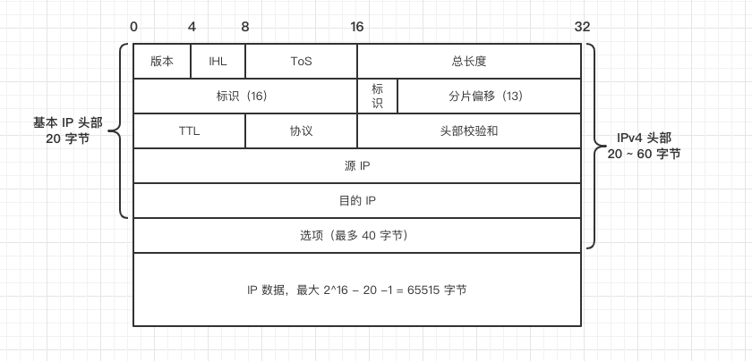

简单介绍一下一些字段：

* IHL ，initial header length。表示 IP 首部 长度。占 4 位，最大值为 15，单位是 32 位，也就是最大长度为 15 * 4 字节 = 60 字节

* ToS，type of service。这个字段使用很少，于是被分为两个部分，前六位 DS，后两位位 ECN

  * DS，distinguish service，服务区分。用于描述 IP 服务的类型，通常为 000000 ，表示*尽力而为*的服务。这个域极少使用
  * ECN，explicit congestion notification，显式拥塞提醒。这个字段用于在路由器由于拥塞丢弃数据时，显式的告知 TCP 发送方链路拥塞，以减缓发送速率

* 第二行是关于 IP 分片的。16 位的标识区别了属于不同源报文的分片，后面三位标识分别表示

  * 当前报文是否为一个分片，1 表示是一个分片
  * 是否允许分片，默认为 0，可以分片。如果需要分配，但是改标识位为 1，那么路由器丢弃该包
  * 是否有更多分片，0 表示没有

  13 位的分片偏移表示当前分片在源数据中的位置，由于只有 13 位，但可能表示 16 位的数据，所以这里单位为 8 字节。如果当前包不是一个分片，则全为 0。

* TTL，time to live，最开始表示 IP 包生存时间，现在表示剩余路由跳数，每经过一个路由，该值减一，若跳数为 0，那么路由器丢弃该包，并由 ICMP 告知发送方。这样可以防止包在路由环路中无限循环

* 协议字段，表示 IP 数据段有效荷载的数据类型。通常是传输层协议，17（UDP），6（TCP），但也可能表示其他协议，4（ipv4 in ipv4）

* 校验和，仅计算头部，由于每经过一个路由器 TTL 值减一，所以造成校验和字段重新计算

* IP 选项，多数选项很少或从未使用，并且通常会在企业网络边界被防火墙拒绝或剥离，所以略过

## IPv6 头部

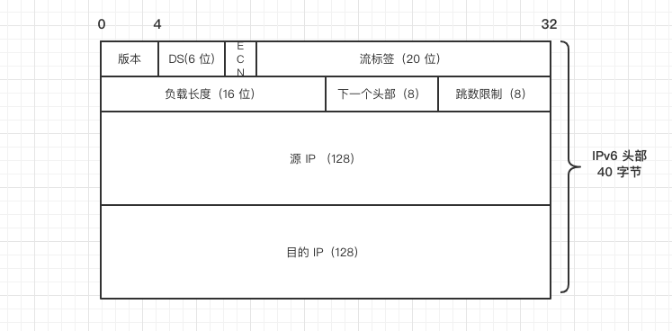

* IPv6 的头部精简了许多，版本、DS 和 ECN、跳数限制 都和 IPv4头部一个意思。
* 流标签本身也是一个比较复杂的话题，该字段用于某些对连接的服务质量有特殊要求的通信，诸如音频 或视频等实时数据传输。在IPv6中，同一信源和信宿之间可以有多种不同的数据流，彼此之间以非“0”流标记区分。如果不要求路由器做特殊处理，则该字段 值置为“0”。详见[这里](http://www.infocomm-journal.com/dxkx/article/2013/1000-0801/1000-0801-29-9-00083.shtml)。
* 负载长度表示数据段长度，包括扩展头部，最大 65535 个字节，超过这一字节数的负载，该字段 值置为“0”。不过 IPv6 支持超长数据报选项，单个分组最大可支持 4GB
* 下一个头部，8位。IPv6 通过增加扩展头部来实现一些想 IPv4 选项提供的特殊功能，这个字段说明紧跟着的下一个头部类型

### IPv6 扩展头部

IPv6 头部固定为 40 字节，扩展头部只在需要时添加，并且要求仅由终端主机处理（有一个例外）。扩展头部也可以是上层的协议如 TCP、UDP

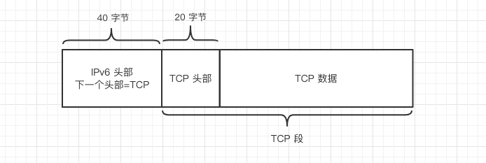

也可以是多个头部级联起来:

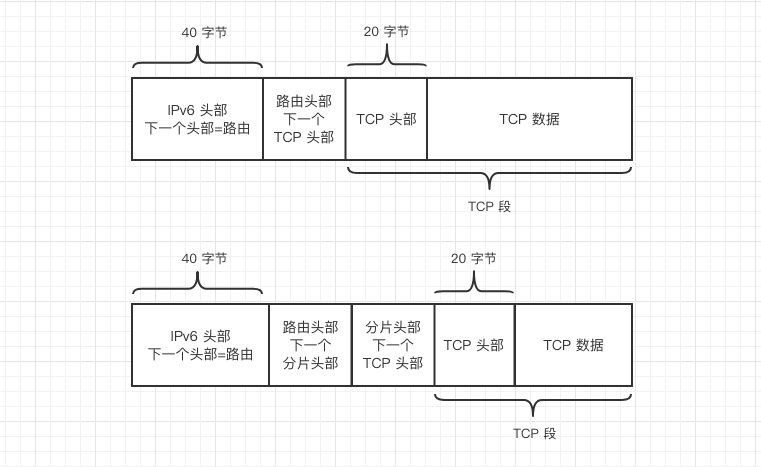

需要注意的是，每种类型的扩展头部必须按照固定的顺序排列：

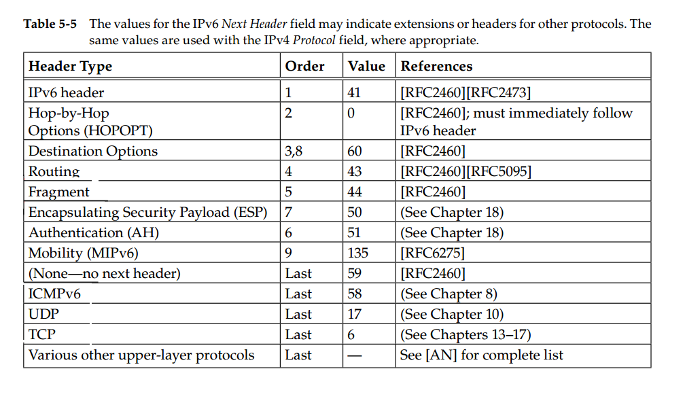

这其中 hop-by-hop 和 destination 比较特殊，称为选项头部。 hop-by-hop 逐跳选项可以出现多次，destination 目的地选项可以出现两次（传输过程的 IP 地址和最终 IP 地址），别的头部只能出现一次。

#### IPv6 选项

选项头部有固定的格式，被编码为 *类型-长度-值（TLV）*集合：

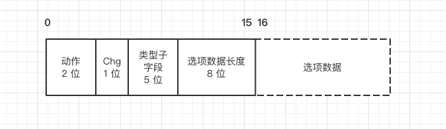

其中动作表示如果路由器不识别这个选项，应该做的操作：

|  值  | 动作                                               |
| :--: | :------------------------------------------------- |
|  00  | 跳过该选项，处理下一个选项或头部                   |
|  01  | 丢弃该数据包                                       |
|  10  | 丢弃该数据包，并向源地址发送 `ICMPv6参数问题` 消息 |
|  11  | 与 10 相同，但仅当目的地址不是组播地址时才这样     |

有如下常用的选项：

* 超大有效负荷：可以携带有效荷载为 64KB ~ 4GB 的数据包。用此选项时，IPv6负载长度字段被置为 0。属于逐跳选项
* 隧道封装限制：隧封指把一个 IP 数据包封装在另一个 IP 报文的有效荷载部分。这个选项指明了封装的最大层数。属于‘目的地选项’
* 家乡地址：使用移动 IP 时，这个选项保存家乡地址的值。属于目的地选项

#### 分片头部

如果数据包大小超过下一跳的 MTU，那么任何主机和路由器可以将数据包分片（和 IPv4 不同的是，IPv4 有一个位用于说明是否能分片，但是 IPv6 没有）。分片头部如下，占 8 字节：

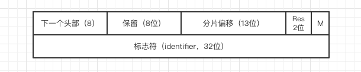

其中保留 8 位和 Res 2位都为全 0，目前都被接收方忽略。M，more，表示是否还有更多分片。分片偏移和 IPv4 一样，都为 13 位，并且都是以 8 字节位单位。

对于分片过程来说，一个数据包有两个部分，一个是“不可分片部分”，包括路由头部之前的所有头部，剩下的部分是“可分片部分”。不可分片部分在每个分片中都有一个副本。分片完成后要修改 IPv6 基本头部中的负载长度字段。

## IP 转发

大多数主机即可以配置位路由器，也可以配置为主机，前者会转发不是由它自己生成的数据包，后者不会。IP 层包括一些位于内存的信息，通常称为路由表。路由表包含的信息类似于如下示例：

|  目的地  | 掩码            | 网关（下一跳） | 接口       |
| :------: | :-------------- | -------------- | ---------- |
| 0.0.0.0  | 0.0.0.0         | 10.0.0.1       | 10.0.0.100 |
| 10.0.0.0 | 255.255.255.128 | 10.0.0.100     | 10.0.0.100 |

### 转发行为

主机或路由器转发一条数据报时，使用报文中的目的 IP 地址 D 来执行*最长前缀匹配算法*：

* di = D^Mi，Mi 表示第 i 条路由表的掩码，把 di 和 ai (第 i 条路由表的目的地址)相比较，若 di 满足 ai，那么 ai 和 D 相“匹配”
* 找到所有“匹配”的条目，选择其中掩码 1 的个数最多的一条，将其下一跳字段的值作为转发的 IP 地址
* 如果没有找到匹配的条目，那么 ICMP 返回一个“主机不可达”错误

#### 直接交付

每个主机里也有自己缓存的路由表，当发送主机和目的主机在同一子网内，主机的路由表包含目的主机，那么不需要经过路由器，直接经过交换机就能到达目的地，并不关心 IP 地址。不过要提前知道对方的 Mac 地址，可以用 ARP 请求或者 IPv6 的邻居请求来获取。

#### 间接交付

当源主机自己的路由表没有目的主机的信息，那么使用自己的默认路由条目，局域网内通常是 10.0.0.1，这通常是网关的地址，然后由路由器为我们转发到目的地。在每一跳的过程中，IP 地址可能不变，但底层的 Mac 地址一直在变，它是更新为下一跳的 IP 地址所对应的 Mac 地址。

#### traceroute 原理

traceroute 命令会输出 IP 包经过的每一个路由节点的 IP 地址信息，那么它是如何做到的呢？

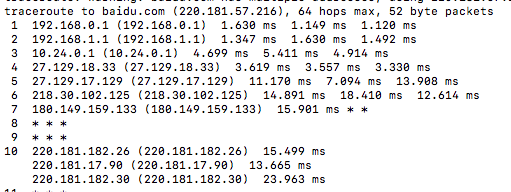

还记得前面提到的 TTL 字段吗，当它减为 0 时，该包会被丢弃，并且由 ICMP 向源主机发送 “TTL 过期”错误。traceroute 利用这个特性，分别发送 TTL 为 1，2，3…的 IP 包，也就是说，在经过链路上的第一、二、三… 个节点时，都会由 ICMP 发送回来一个错误信息，这样就得知每个节点信息了。

那么如何判断已经到达目的地呢？事实上，traceroute 默认发送 UDP 报文，并且目标端口通常是选择对方没有开启的端口，这样在报文到达目的地后，对方返回一个 “端口不可达”错误。

## 移动 IP

许多 Internet 协议都要求节点的 IP 地址保持不变。如果其中的任一协议在移动设备上处于活动状态，并且其 IP 地址改变了，则应用该协议将失败。

如果移动计算机（即**移动节点**）移到新网络后其 IP 地址保持不变，则移动节点的地址不会反映新连接点。因此，所存在的路由协议无法将数据报正确路由到该移动节点。

移动 IP 通过允许移动节点使用两个 IP 地址，可以解决上述问题。第一个地址是**家乡地址**，它是固定的。第二个地址是**转交地址**，它在每个新连接点都会发生变化。移动 IP 允许计算机在 Internet 上自由漫游。另外，它还允许计算机在组织的网络上自由漫游，同时仍保持其家乡地址不变。因此，当用户更改计算机的连接点时，通信活动不会中断。

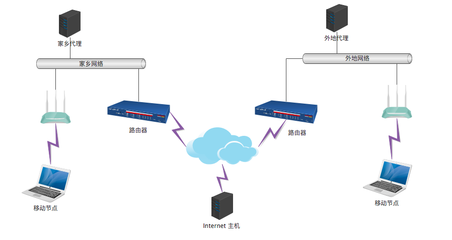

通过使用该图中的移动 IP 拓扑，以下情形说明了数据报是如何在移动 IP 框架的不同点之间移动的。

* Internet 主机使用移动节点的家乡地址向移动节点发送数据报（此为标准的 IP 路由过程）。
* 如果移动节点位于家乡网络，则数据报会通过常规 IP 进程传送到移动节点。否则，数据报将传送到家乡代理。
* 如果移动节点位于外地网络，则家乡代理将数据报转发到外地代理。家乡代理必须将数据报封装到外部数据报中，以便外地代理的 IP 地址出现在外部 IP 数据包头。
* 外地代理将数据报传送到移动节点。
* 数据报通过使用标准的 IP 路由过程从移动节点发送到 Internet 主机。如果移动节点位于外地网络上，则包会传送到外地代理。外地代理随后会将数据报转发到 Internet 主机。
* 如果存在入口过滤 (ingress filtering)，则发送数据报的子网的源地址在拓扑结构上必须正确，否则路由器无法转发数据报。如果移动节点和通信节点之间的链路上存在这种情况，则外地代理需要提供反向隧道连接支持。然后，外地代理即可将移动节点所发送的每个数据报传送到其家乡代理。家乡代理随后将转发数据报，所使用的路径即是移动节点驻留在家乡网络的情况下数据报应采用的路径。此过程保证数据报必须遍历的所有链路的源地址均正确。

步骤中的数据报封装指的是隧道，IP-over-IP

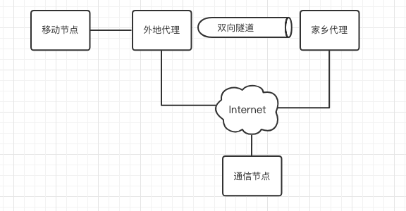

更多原理参考[这里](https://docs.oracle.com/cd/E19253-01/819-7058/6n91g7eb8/index.html)

## IP 数据报的主机处理

 ### 主机模式

当主机有两个 IP 地址时，在主机接收到数据包时，可能会出现一些问题。有两种处理策略，分别是*强主机模式*和*弱主机模式*

强主机模式中，只有当收到的包的目的 IP 地址与该报文到达的接口所配置的 IP 地址相同时，才把数据交付给本地协议栈。

而弱主机模式则不然，只要接收到的包的目的 IP 地址与主机的任何本地地址相匹配，那么不论到达哪个接口，都交付给本地协议栈处理。

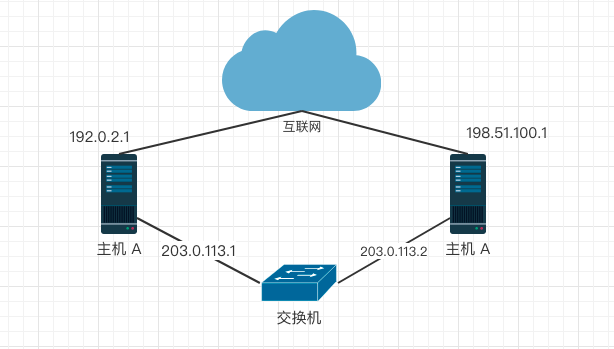

如，在强主机模式下，主机 A 从交换机收到 目的地址为 192.0.2.1 的数据包，那么丢弃它。而弱主机模式下，会接收它。

### 地址选择

当主机有多个 IP 地址，发送数据时，需要填写自己的 IP 地址，那么如何从多个 IP 地址中选择呢？特别是当一个主机有 IPv4 和 IPv6 地址时，地址选择失败可能导致非对称路由、不必要的分组。

默认规则是

* 优先在相同范围内选择成对的源/目的地址
* 优先选择更小的范围以避免其他地址可用时使用临时地址
* 优先选择具有更长公共前缀的成对地址

