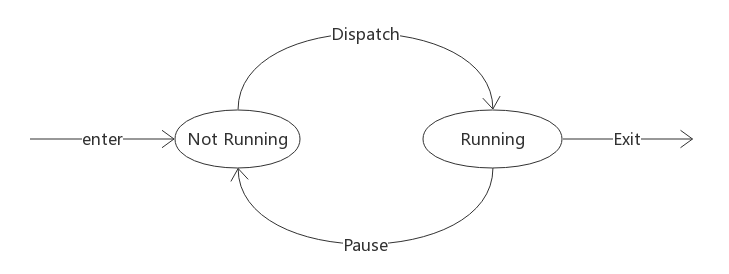
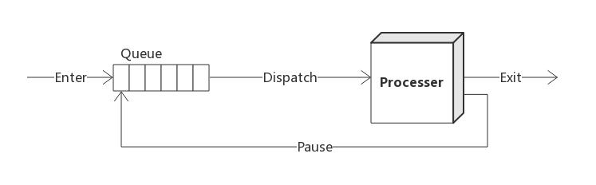
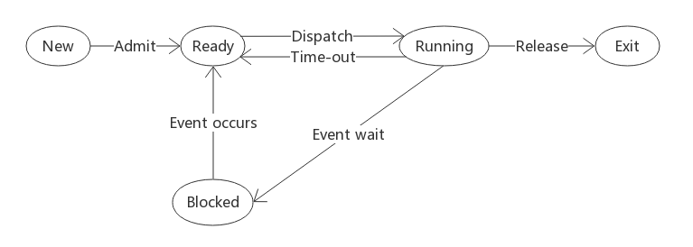
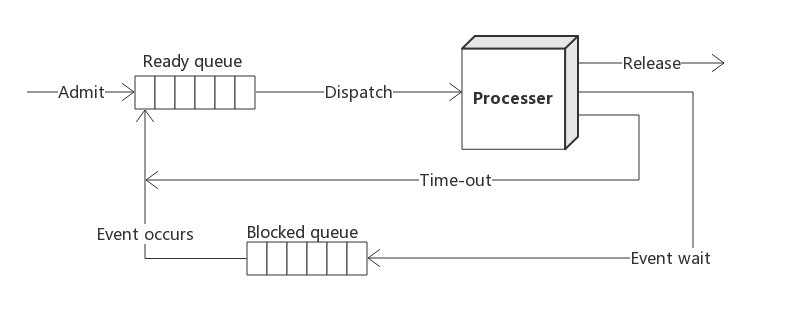
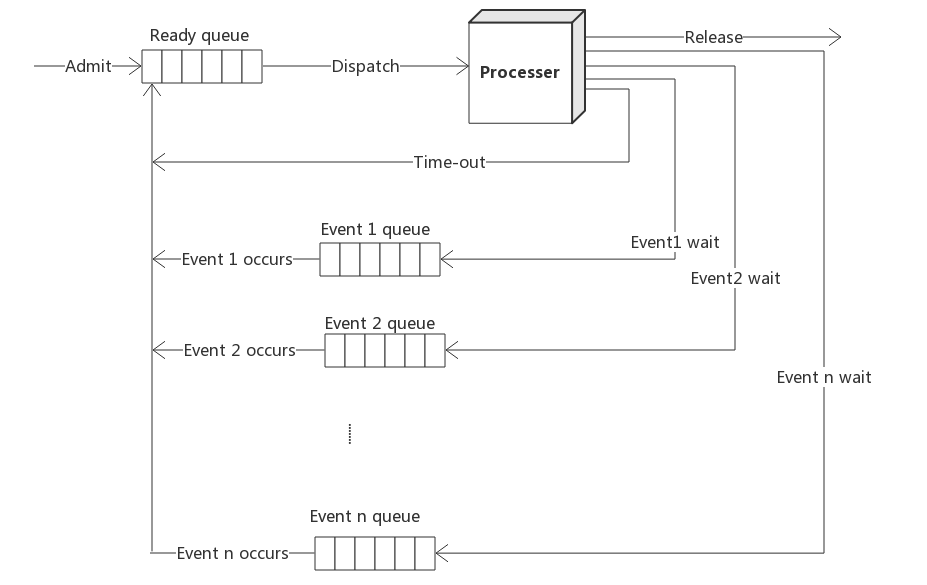
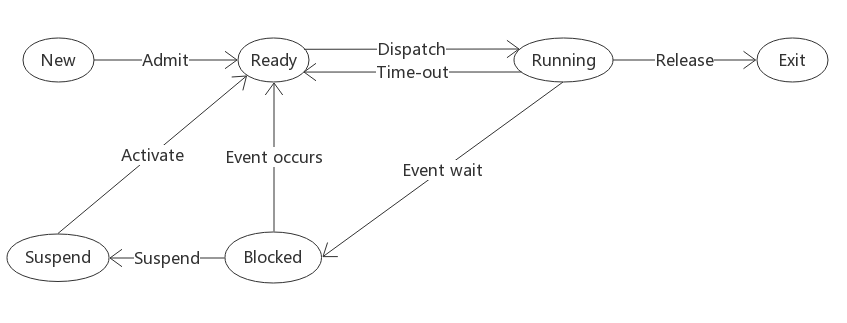
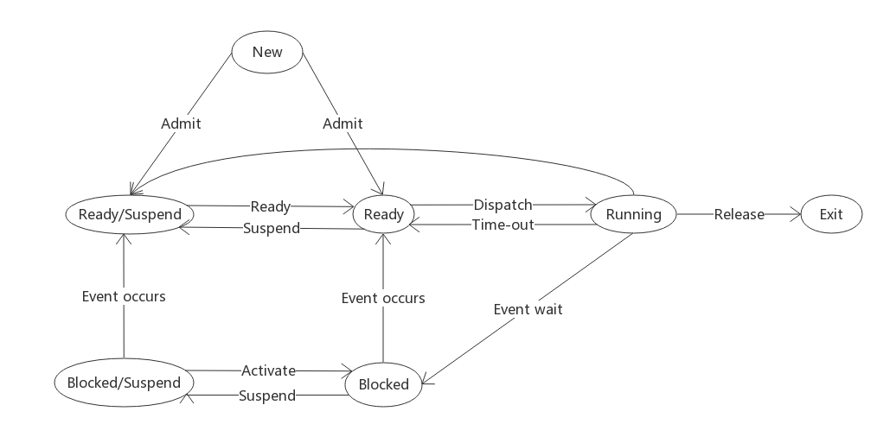

#进程

###操作系统与进程

操作系统是计算机硬件和应用程序之间的一层软件，对应用程序和工具提供了支持。操作系统是硬件资源的统一抽象表示，为了使应用程序可以请求和访问，操作系统需要管理他们的使用，以达到以下目的：

* 资源对多个应用程序是可用的，即可以共享；
* 物理处理器在多个应用程序间切换以保证所有程序都在执行中；
* 处理器和I/O设备能得到充分的利用。

现代操作系统所采用的是进程模型来实现这些功能。

---

###进程是什么

一般来说，一个应用程序对应于一个或多个进程，操作系统为了有序的去管理应用程序的执行，需要控制其对应的进程的执行。为了控制进程的执行，我们首先需要区分不同的进程，然后跟踪并记录其执行时的状态，只有这样，当我们将某个挂起的进程重新获得处理机时，其继续执行才可以不受挂起的影响。

进程是由一组元素组成的实体，它的两个基本元素是程序代码和与代码相关联的数据集。在进程执行时，任意给定一个时间，进程都可以唯一的被表征为以下元素：

* 标识符：跟这个进程相关的唯一标识符，用来区别其他进程；
* 状态：根据进程是否在执行而划分的状态；
* 优先级：相对于其他进程的优先级；
* 程序计数器：程序中即将被执行的下一条指令的地址；
* 内存指针：包括进程代码和进程相关数据的指针，还有和其他进程共享内存块的指针；
* 上下文数据：进程执行时处理器的寄存器中的数据；
* I/O 状态信息：包括显示的 I/O 请求，分配给进程的 I/O 设备和被进程使用的文件列表等；
* 记账信息：可能包括处理器时间总和，使用的时间数总和，时间限制等。

这些信息存放在一个叫做进程控制块的数据结构中，该控制块由操作系统创建和管理，它是操作系统支持多进程和提供多处理的关键工具。

---

###两状态进程模型

操作系统的基本职责是控制程序的执行，这包括确定交替执行的方式和给进程分配资源。在设计控制进程的程序时，第一步就是描述进程所表现出的行为。通过观察可以发现，在任何时刻，一个进程要么正在执行，要么没有执行，暂时我们先建立一个简单的模型：一个进程可以处于运行态或未运行态。

当操作系统创建一个新进程时，它将该进程以未运行态加入到系统中，操作系统知道这个进程是存在的，并正在等待执行机会。当前正在执行的进程不时的被中断，操作系统中的分派器将选择一个新进程运行，前一个进程从运行态转移到未运行态，另外一个进程转换到运行态。未运行的进程应保存在某种类型的队列中，以等待他们的执行时机。

进程的生存周期都围绕着进程的创建和终止。我们接下来就来看下进程的这两个过程。

---

###进程的创建

当一个新进程添加到那些正在被管理的进程集合中去时，操作系统需要建立用于管理该进程的数据结构，并在内存中给它分配地址空间。通常会有4个事件会导致创建一个进程：

* 新的批处理作业
* 交互登录
* 操作系统因为提供一项服务而创建
* 由现有的进程派生

一般的，操作系统创建进程的方式对用户和应用程序都是透明的，大多数的操作系统允许一个进程引发另一个进程的创建。当操作系统为另一个进程的显式请求创建一个进程时，这个动作称为进程派生。当一个进程派生另一个进程时，前一个称作父进程，被派生的进程叫做子进程。在典型的情况下，相关进程需要相互之间的通信与合作。

---

###进程的终止

任何一个计算机系统都必须为进程提供表示其完成的方法，批处理作业中应该包含一个Halt 指令或用于终止的操作系统显示服务调用来终止其执行。在前一种情况下，Halt 指令将产生一个中断，警告操作系统一个进程已经完成。对交互式应用程序，用户的行为将指出何时进程完成。所有这些行为最终会导致进程发送给操作系统一个服务请求，以终止自己的执行。下面列出了进程终止的典型原因：

* 正常完成：进程自己执行一个系统调用，表示它已经结束运行
* 超过时限：进程运行时间超过规定的时限
* 无可用内存：系统无法满足进程需要的内存空间
* 越界：进程试图访问不允许访问的内存单元
* 保护错误：进程试图使用不允许使用的资源或文件，或者试图以一种不正确的方式使用，如往只读文件中写
* 算术错误：进程试图进行被禁止的计算，如除以零
* 无效指令：进程试图执行一个不存在的指令（通常是由于转移到了数据区并企图执行数据）
* 操作员或操作系统干涉：字面意思
* 父进程请求：父进程通常具有终止其任意后代进程的权力

---

###五状态模型

再来看下上面提到的排队队列，进程处理器一般以轮转方式操作这个队列。但是，这样存在一些问题：存在着一些处于非运行状态但已经就绪等待执行的进程，而同时存在另外的一些处于阻塞状态等待I/O操作结束然后继续执行的进程，这两种进程虽然都是非运行态，其对应的处理是不一样的。所以我们的模型需要进行一些更改，需要将非运行状态分成两个状态：就绪和阻塞。再加上原来提到的新建和退出两个状态，新的模型中就有了5个状态：

* 运行态：该进程正在执行，目前讨论只有一个处理器的情况，所以一次最多只有一个进程处于这个状态
* 就绪态：进程做好了准备，只要有机会就开始执行
* 阻塞态：进程在某些事情发生前不能执行，比如I/O操作完成
* 新建态：刚刚创建的进程，操作系统还没有把它加入到可执行进程组中，通常是进程控制块已经创建但还没有加载到内存中的新进程。
* 退出态：操作系统从可执行进程组中释放出的进程

进程处于新建态时，操作系统所需要的关于该进程的信息保存在内存中的进程表中，但进程自身还未进入内存，就是将要执行的程序代码不在内存中，也没有为与这个程序相关的数据分配空间。当程序处于新建态时，程序保存在外村中。进程处于退出态时，与作业相关的的表和其他信息临时被操作系统保留起来，这给辅助程序或支持程序提供了提取所需信息的时间。

显然，现在我们的排队队列只有一个是不够的了，我们先使用两个队列：就绪队列和阻塞队列。进入系统的每个进程被放置在就绪队列中，对于没有优先级的方案，这只是一个先进先出的队列，。当一个正在运行的进程被移出处理器时，他根据情况或者被终止，或者被放置在就绪或阻塞队列中，当某个事件发生后，所有位于阻塞队列中等待这个事件的进程都被转换到就绪队列中。

####优化

在这种情况下，当某个事件发生时，操作系统必须扫描整个阻塞队列，搜索那些等待该事件的进程，在大型操作系统中，队列中可能会有成百上千的进程，所以改为多个队列将会很有效，我们可以根据其等待的事件类型进行划分，这样是比较方便的。同样的，我们也可以根据优先级去修改就绪队列，这样操作系统很容易确定哪个就绪进程具有较高的优先级且等待时间最长。

---

###被挂起的进程

前面描述的三个基本状态提供了一种为进程行为建立模型的系统方法，并指导操作系统的实现。但是，这样的设计仍然是存在问题的。上面我们所说的每个被执行的进程都是被完全载入内存的，所有队列中的所有进程必须驻留在内存中，但因为I/O处理比计算速度慢得多，即使是多道程序设计，大多时候处理器仍然可能处于空闲状态。

一种解决方法是扩充内存，但是内存的价格比较贵。。。另一种解决办法是交换，也就是把内存中某个部分的一部分或全部移到磁盘中。当内存中没有处于就绪状态的进程时，操作系统就把被阻塞的进程换出到磁盘中的挂起队列，这是暂时保存从内存中被驱逐出的进程队列，或者说被挂起的进程队列。操作系统在此之后取出挂起队列中的另一个进程，或者接受一个新进程的请求，将其纳入内存运行。

为了使用前面描述的交换，在我们的进程行为模型中需要增加另一个状态：挂起态。当内存中的所有进程都处于阻塞态时，操作系统可以把其中的一个进程置于挂起态，并将它转移到磁盘，内存中释放的空间可被调入的另一个进程使用。

当操作系统已经执行了一个换出操作，它可以有两种将一个进程取到内存中的选择：可以接纳一个新进创建的进程，或调入一个以前被挂起的进程。显然，通常比较倾向于调入一个以前被挂起的进程，给它提供服务，而不是增加系统中的负载总数。但是这样做也还是有问题的，所有已经挂起的进程在挂起时都处于阻塞态。显然，这时候把被阻塞的进程取回内存没有什么意义，因为它仍然没有准备好执行。但是，因为挂起状态中的每个进程最初是阻塞在一个特定的时间上，当这个事件发生时，进程就不再阻塞，可以继续执行。

因此，我们需要重新考虑设计方式。这里有两个独立的概念：进程是否在等待一个事件（阻塞与否）以及进程是否已经被换出内存（挂起与否）。由这两个独立的概念可以引出四个状态：

* 就绪态：进程在内存中并可以执行
* 阻塞态：进程在内存中并等待一个事件
* 阻塞/挂起态：进程在外存中并等待一个事件
* 就绪/挂起态：进程在外存中，但是只要被载入内存就可以执行

