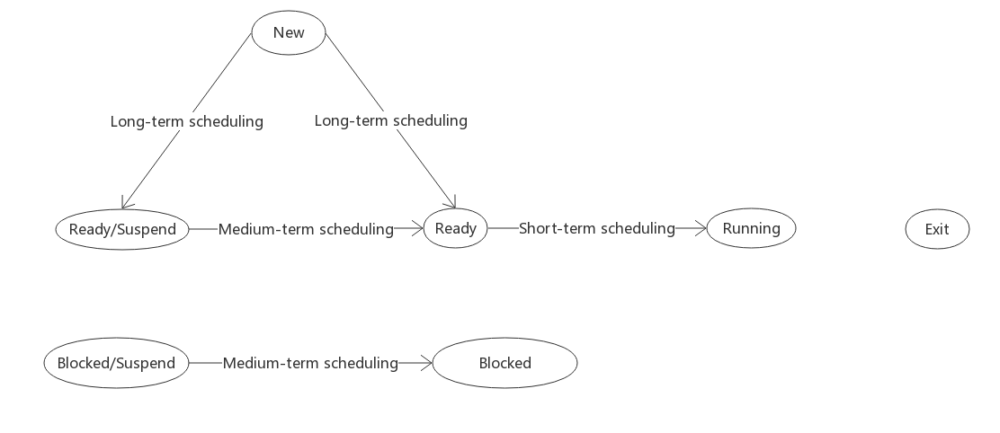
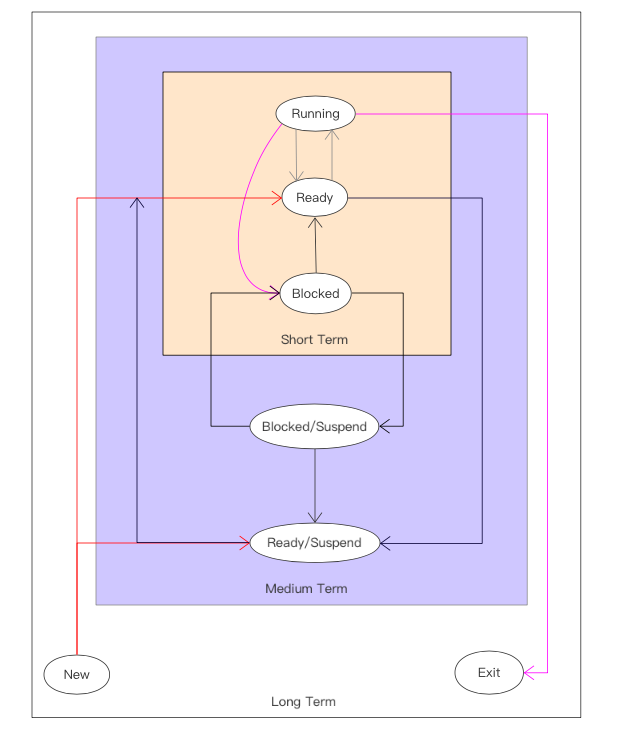
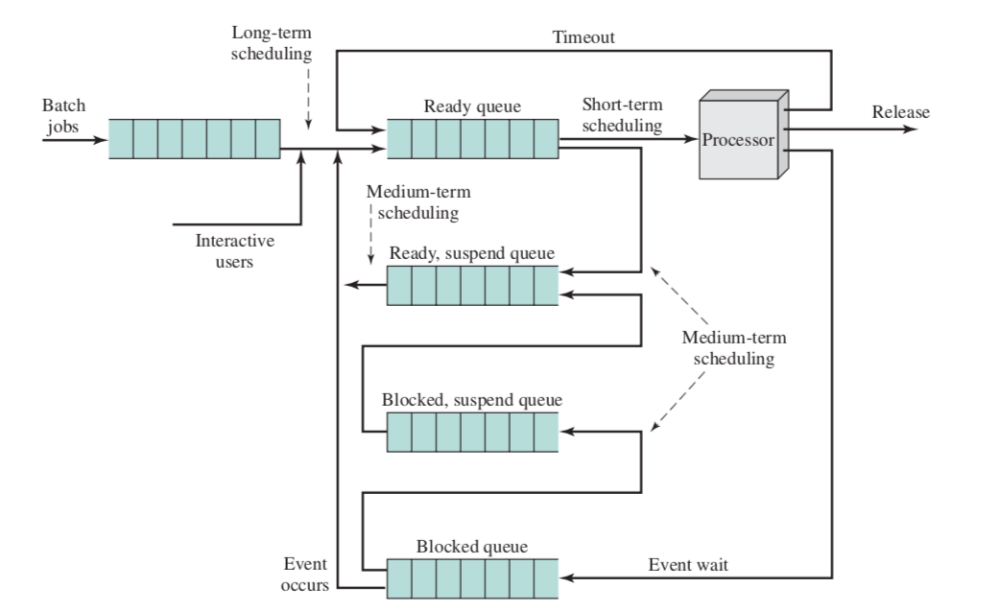
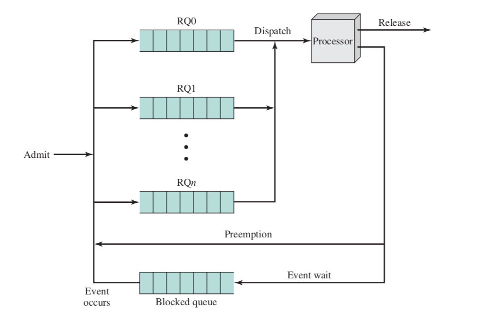

# 单处理器调度

在多道程序环境下，主存中有着多个进程，其数目往往多于处理机数目。这就要求系统能按某种算法，动态地把处理机分配给就绪队列中的一个进程，使之执行。分配处理机的任务是由处理机调度程序完成的。由于处理机是最重要的计算机资源，提高处理机的利用率及改善系统性能(吞吐量、响应时间)，在很大程度上取决于处理机调度性能的好坏，因而，处理机调度便成为操作系统设计的中心问题之一。 

在多道程序系统中，一个作业被提交后必须经过处理机调度后，方能获得处理机执行。 对于批量型作业而言，通常需要经历作业调度(又称高级调度或长程调度)和进程调度(又称低级调度或短程调度)两个过程后方能获得处理机；对于终端型作业，则通常只需经过进程调度即可获得处理机。在较完善的操作系统中，为提高内存的利用率，往往还设置了中级调度(又称中程调度)。对于上述的每一级调度，又都可采用不同的调度方式和调度算法。对于一个批处理型作业，从进入系统并驻留在外存的后备队列开始，直至作业运行完毕，可能要经历上述的三级调度。今天主要是对处理机调度层次做较详细的介绍。 

典型的有4种类型的调度如下表：

| 项目     | 说明                                             |
| -------- | ------------------------------------------------ |
| 长程调度 | 决定加入到待执行的进程池中                       |
| 中程调度 | 决定加入到部分或全部在内存中的进程集合中         |
| 短程调度 | 决定哪一个可运行的进程将被处理器执行             |
| I/O调度  | 决定哪一个进程挂起的I/O请求将被可用的I/O设备处理 |

其中I/O调度以后再讲，剩下的三种调度类型属于处理器调度，这是我们接下来要讲的重点。我们今天具体讲短程调度，并且只考虑单处理器中的调度情况。

## 处理器调度的类型

处理器调度的目标是以满足系统目标（如响应时间，吞吐率，处理器效率）的方式，把进程分配到一个或多个处理器中执行。在许多系统中，这个调度活动分成三个独立的功能：长程，中程和短程调度。他们的名字表明了在执行这些功能时的相对时间比例。

如下图，将调度功能结合到了进程状态转换图中。创建新进程时，执行长程调度，它决定是否把进程添加到当前活跃的进程集合中。中程调度是交换功能的一部分，它决定是否把进程添加到那些至少部分在内存中并且可以被执行的进程集合中。进程调度真正决定下一次决定执行哪一个就绪进程。

下图重新组织了上图的进程转换图，用于表示调度功能的嵌套。

由于调度决定了那个进程必须等待，哪个进程可以继续运行，因此它影响着系统的性能。从下图中体现的更明显，该图给出了在一个进程状态转换过程中所涉及的队列。从根本上说，调度是属于队列管理方面的问题，用来在排队环境中减少延迟和优化性能。

###长程调度

长程调度(LongTerm Scheduling)又称为作业调度或高级调度(High Level  Scheduling) 长程调度程序决定哪一个程序可以进入到系统中处理，因此，它控制系统并发度。在批处理系统中，是以作业为基本单位从外存调入内存的。 一旦允许进入，一个作业或用户程序就成为一个进程，并被添加到供短程调度程序使用的队列中等待调度。

在批处理系统或通用的操作系统中的批处理部分中，新提交的作业被发送到磁盘，并保存在一个批处理队列中，在长程调度程序运行的时候，从队列中创建相应的作业。这里有两个决策。首先调度程序必须决定什么时候操作系统能够接纳一个作业或多个作业；第二，调度程序必须决定接受哪个作业或哪些作业，并将其转变成进程。简单考虑下这两个决策。

关于何时创建一个新进程的决策通常由要求的系统并发度来驱动。创建的进程越多，每个进程可以执行的时间所占百分比就越小。为了给当前的进程集提供满意的服务，长程调度程序可能限制系统并发度，每当一个作业终止时，调度程序可决定增加一个或多个新作业。当处理器的空闲时间片超过了一定的阙值，也可能会启动长程调度程序。

关于应将哪些作业从外存调入内存，这将取决于所采用的调度算法。最简单的是先来先服务调度算法，这是指将最早进入外存的作业最先调入内存；较常用的一种算法是短作业优先调度算法，是将外存上最短的作业最先调入内存;另一种较常用的是基于作业优先级的调度算法，该算法是将外存上优先级最高的作业优先调入内存；比较好的一种算法是“响应比高者优先”的调度算法。

在批处理系统中，作业进入系统后，总是先驻留在外存的后备队列上，因此需要有作业调度的过程，以便将它们分批地装入内存。然而在分时系统中，为了做到及时响应，用户通过键盘输入的命令或数据等都是被直接送入内存的，因而无需再配置上述的作业调度机制，但也需要有某些限制性措施来限制进入系统的用户数。即，如果系统尚未饱和，将接纳所有授权用户，否则，将拒绝接纳。类似地，在实时系统中通常也不需要作业调度。  

### 中程调度

中程调度(Medium-Term Scheduling)又称中级调度(Intermediate Level Scheduling)。引入中级调度的主要目的是为了提高内存利用率和系统吞吐量。为此，应使那些暂时不能运行的进程不再占用宝贵的内存资源，而将它们调至外存上去等待，把此时的进程状态称为就绪驻外存状态或挂起状态。当这些进程重又具备运行条件且内存又稍有空闲时，由中级调度来决定把外存上的那些又具备运行条件的就绪进程重新调入内存，并修改其状态为就绪状态，挂在就绪队列上等待进程调度。中级调度实际上就是存储器管理中的对换功能， 关于存储管理，我们之后再讲。

### 短程调度

从执行的频繁程度考虑这些调度类型，长程调度程序执行的频率相对较低，并且仅仅是粗略的决定是否接受新进程以及接受哪一个。为进行交换决定，中程调度程序执行的略微频繁一些。短程调度程序，也称作分派程序，执行的最频繁，并且精确地决定下一次执行哪一个进程。当可能导致当前进程阻塞或可能抢占当前运行进程的事件发生时，调用短程调度程序。这类事件包括：时钟中断，I/O中断，操作系统调用，信号。

## 调度算法

### 短程调度准则

短程调度的主要目标是按照优化系统一个或多个方面行为的方式来分配处理器时间。通常需要对可能被评估的各种调度策略建立一系列规则。

通常使用的规则可以按两维来分类。首先可以区分为面向用户的准则和面向系统的准则。面向用户的准则与单个用户或进程感知到的系统行为有关。例如交互式系统中的响应时间。响应时间是指从提交一条请求到输出响应所经历的时间间隔，这个时间数量对用户是可见的。我们希望调度策略能给各种用户提供好的服务，则对于响应时间，可以定义一个阙值，如2秒。调度机制的目标是使平均响应时间为2秒或小于2秒的用户数目达到最大。

另一个准则则是面向系统的，其重点是处理器使用的效果和效率。关于这类准则的一个例子是吞吐量，也就是进程完成的速度。该准则的重点是系统的性能，而不是提供给用户的服务。因此吞吐量是系统管理员所关注的，而不是普通用户所关注的。

面向用户的准则在所有系统中都是非常重要的，而面向系统的原则在单用户系统中的重要性就低一些。在单用户系统中，只要系统对用户应用程序的响应时间是可以接受的，则实现处理器高利用率或高吞吐量可能不是很重要。

另一维的划分是根据这些准则是否与性能直接相关。与性能直接相关的准则是定量的，通常可以很容易的度量，比如响应时间和吞吐量。与性能无关的准则或者本质上是定性的，或者不容易测量和分析，比如可预测性。我们希望提供给用户的服务能够随时间的进行展现给用户一贯相同的特性，而与系统执行的其他工作无关。

下表是几种重要的调度准则：

---

​                                               **面向用户，与性能相关**

* 周转时间：是指从作业被提交给系统开始，到作业完成为止的这段时间间隔 。它包括四部分时间:作业在外存后备队列上等待 (作业)调度的时间，进程在就绪队列上等待进程调度的时间，进程在 CPU 上执行的时间， 以及进程等待 I/O 操作完成的时间。 总的来说就是实际执行时间加上等待资源时间

* 响应时间：是从用户通过键盘提交一个请求开始，直至系统首次产生响应为止的时间。从用户的角度看，相对于周转时间，这是一种更好的度量。该调度原则应该试图达到较低的响应时间，并且在响应时间可接受的范围内，使得可以交互的用户数目达到最大
* 最后期限：当可以指定进程完成的最后期限时，调度原则将降低其他目标，使得满足最后期限的作业数目的百分比达到最大

---

​                                               **面向用户，其他**

* 可预测性：无论系统的负载如何，一个给定的工作运行的总时间量和总代价是相同的。用户不希望响应时间或周转时间的变化太大。

---

​                                               **面向系统，与性能相关**

* 吞吐量：是指在单位时间内系统所完成的作业数 。调度策略应该试图使得每个单位时间完成的进程数目达到最大。
* 处理器利用率：这是处理器忙的时间百分比。对于大、中型多用户系统，由于 CPU 价格十分昂贵，致使处理机的利用率成为衡量系统性能的十分重要的指标 ，但对于单用户微机或某些实时系统，此准则就不那么重要了。 

---

​                                               **面向系统，其他**

* 公平性：在没有来自用户的指导或其他系统提供的指导时，进程应该被平等的对待
* 强制优先级：调度策略应该优先选择高优先级的进程
* 平衡资源：调度策略将保持系统中所有资源处于繁忙状态，较少使用紧缺资源的进程应该受到照顾

---

### 优先级的使用

在许多系统中，每个进程都只被指定一个优先级，调度程序总是选择具有较高优先级的进程。如下图：

纯粹的优先级调度方案的一个问题是优先级的进程可能会长时间处于饥饿状态，如果不希望这样，一个进程的优先级应该随着它的时间或执行历史而改变。

### 选择调度策略

如下表列出了关于本节所分析的各种调度策略的一些简要信息。

**选择函数**确定在就绪进程中选择哪一个进程在下一次执行。这个函数可以基于优先级，资源需求或者该进程的执行特性。对于最后一种情况，下面的三个量是非常重要的：

* w：到现在为止，在系统中停留的时间
* e：到现在为止，花费的执行时间
* s：进程所需要的总服务时间，包括e

例如，选择函数max[w]，表示先来先服务（First-Come-First-Served，FCFS）的原则

**决策模型**说明选择函数在被执行的瞬间的处理方式，通常可以分为以下两类：

* 非抢占：在这种情况下，一旦进程处于运行状态，它就不断执行直到终止，或者因为等待I/O或请求某些操作系统服务而阻塞自己
* 抢占：当前正在运行的进程可能被操作系统中断，并转移到就绪态。

 与非抢占策略相比，抢占策略可能会导致较大的开销，但是可能对所有的进程会提供较好的服务，因为他们避免了任何一个进程独占处理器太长的时间。

| 类别                   | 选择函数     | 决策模式               | 吞吐量                     | 响应时间                                   | 开销       | 对进程的影响                        | 饥饿 |
| ---------------------- | ------------ | ---------------------- | -------------------------- | ------------------------------------------ | ---------- | ----------------------------------- | ---- |
| 先来先服务（FCFS）     | max[w]       | 非抢占                 | 不强调                     | 可能很高，特别是当进程的执行时间差别很大时 | 最小       | 对短进程不利，对I/O密集型的进程不利 | 无   |
| 轮转                   | 常数         | 抢占（在时间片用完时） | 如果时间片小，吞吐量会很低 | 为短进程提供很好的响应时间                 | 最小       | 公平对待                            | 无   |
| 最短进程优先（SPN）    | min[s]       | 非抢占                 | 高                         | 为短进程提供很好的响应时间                 | 可能比较高 | 对长进程不利                        | 可能 |
| 最短剩余时间（SRT）    | min[s-e]     | 抢占（在时间片用完时） | 高                         | 提供很好的响应时间                         | 可能比较高 | 对长进程不利                        | 可能 |
| 最短响应比优先（HRRN） | max[(w+s)/s] | 非抢占                 | 高                         | 为短进程提供很好的响应时间                 | 可能比较高 | 很好的平衡                          | 无   |
| 反馈                   | 见下文       | 抢占（在时间片用完时） | 不强调                     | 不强调                                     | 可能比较高 | 可能对I/O密集型的进程有利           | 可能 |

在描述各种调度策略时，使用下表中的进程集合作为实例。可以把他们想象成批处理作业，服务时间是所需要的整个执行时间。

| 进程 | 到达时间 | 服务时间 |
| ---- | -------- | -------- |
| A    | 0        | 3        |
| B    | 2        | 6        |
| C    | 4        | 4        |
| D    | 6        | 5        |
| E    | 8        | 2        |

对于上表中的例子，下图显示了一个周期内，每种策略的执行模式以及执行结果。每个进程的结束时间是确定的，根据这一点，可以确定周转时间，即其在队列中的驻留时间Tr，我们用一个更有用的数字，归一化周转时间它是周转时间与服务时间的比率，它表示一个进程的相对延迟。一般情况，进程的执行时间越长，可以容忍的延迟时间就越长，其最小值为1.0

#### 先来先服务

这是最简单的策略，也叫做先进先出。当每个进程就绪后，它就加入就绪队列。当前正在运行的进程停止执行时，选择在就绪队列中存在时间最长的进程运行。

它执行长进程比执行短进程更好。考虑下面的例子

| 进程   | 到达时间 | 服务时间（Ts） | 开始时间 | 结束时间 | 周转时间（Tr） | Tr/Ts |
| ------ | -------- | -------------- | -------- | -------- | -------------- | ----- |
| W      | 0        | 1              | 0        | 1        | 1              | 1     |
| X      | 1        | 100            | 1        | 100      | 100            | 1     |
| Y      | 2        | 1              | 101      | 102      | 100            | 100   |
| Z      | 3        | 100            | 102      | 202      | 199            | 1.99  |
| 平均值 |          |                |          |          | 100            | 26    |

进程Y的归一化周转时间与其他进程相比显得不协调：它在系统中的总时间是所需要的处理时间的100倍。当一个短进程紧随着一个长进程之后到达时就会发生这种情况。再和进程Z比较，在这个极端的例子中，长进程Z的周转时间几乎是Y的两倍，但是它的归一化等待时间低于2.0

FCFS的另一个难点是相对于I/O密集型的进程，它更有利于处理器密集型的进程。考虑一组进程，其中有一个进程大多时候都使用处理器（处理器密集型），还有许多进程大多数时候进行I/O操作（I/O密集型）。如果一个处理器密集型的进程正在运行，则所有I/O密集型的进程因为没有被分配I/O资源都必须等待。有一些进程可能在I/O队列中，进行I/O操作（阻塞态），但是当处理器密集型的进程正在执行时，他们可能I/O操作完成，已经回到就绪队列。这时，大多数或所有I/O设备都可能是空闲的，即使他们可能还有工作要做。在当前进程离开运行态时，就绪的I/O密集型的进程迅速通过运行态，又阻塞在I/O事件上，如果处理器密集型的进程也被阻塞了，则处理器空闲。因此这可能会导致处理器和I/O设备都没有得到充分利用。