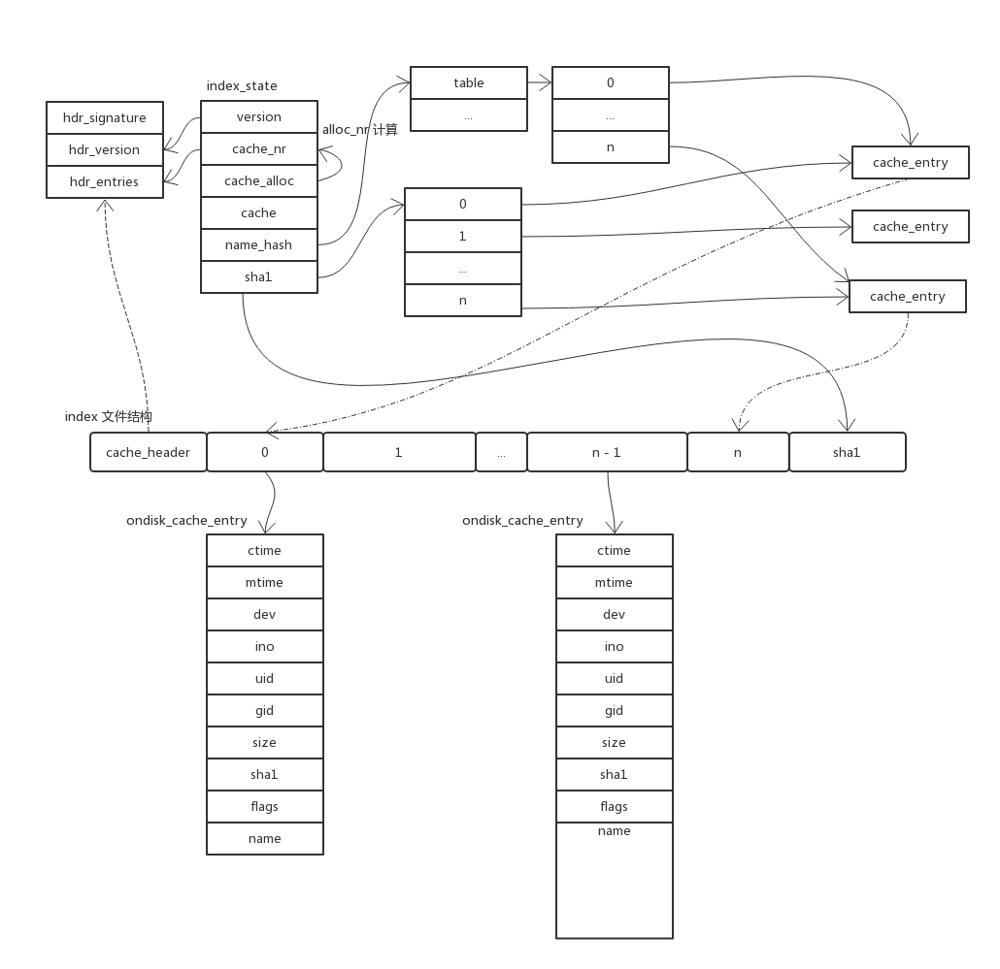

# Add

## git add

添加文件、目录，执行后，才可进行提交操作。和 git init 一样，先找到执行代码入口：

```C
{ "add", cmd_add, RUN_SETUP | NEED_WORK_TREE },
```

进入 cmd_add 函数，跳过配置、参数解析等代码，首先执行了

```C
hold_locked_index(&lock_file, LOCK_DIE_ON_ERROR);
```

看起来应该是为 index 文件加锁，防止其他进程在当前命令执行过程中对 index 文件进行修改。

```C
if (read_cache() < 0)
```

由于 git 无常驻后台进程，因此，所有状态都存储在文件系统中。每次执行命令时，需要从文件系统中读取当前状态。从名称看，这个函数应该是将文件系统中的 index 文件加载至系统中。执行完成后：



问了加速 git 运行，在读取 index 文件过程中，使用了 [mmap](https://en.wikipedia.org/wiki/Mmap)。

## References

- [mmap](https://en.wikipedia.org/wiki/Mmap)
