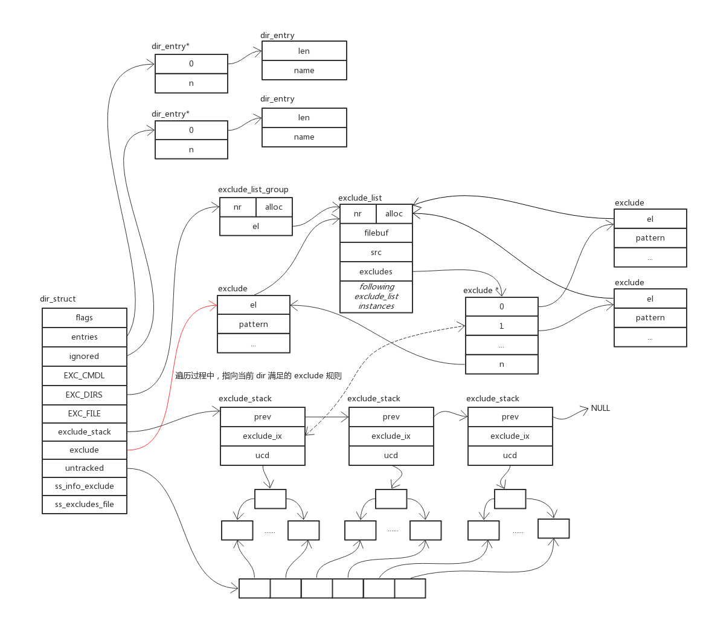
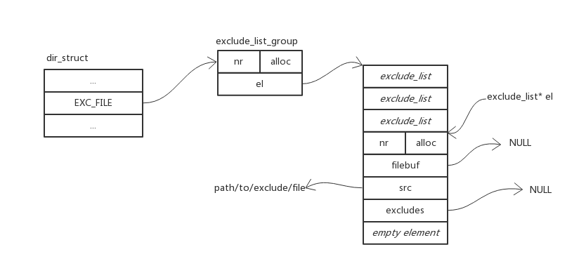
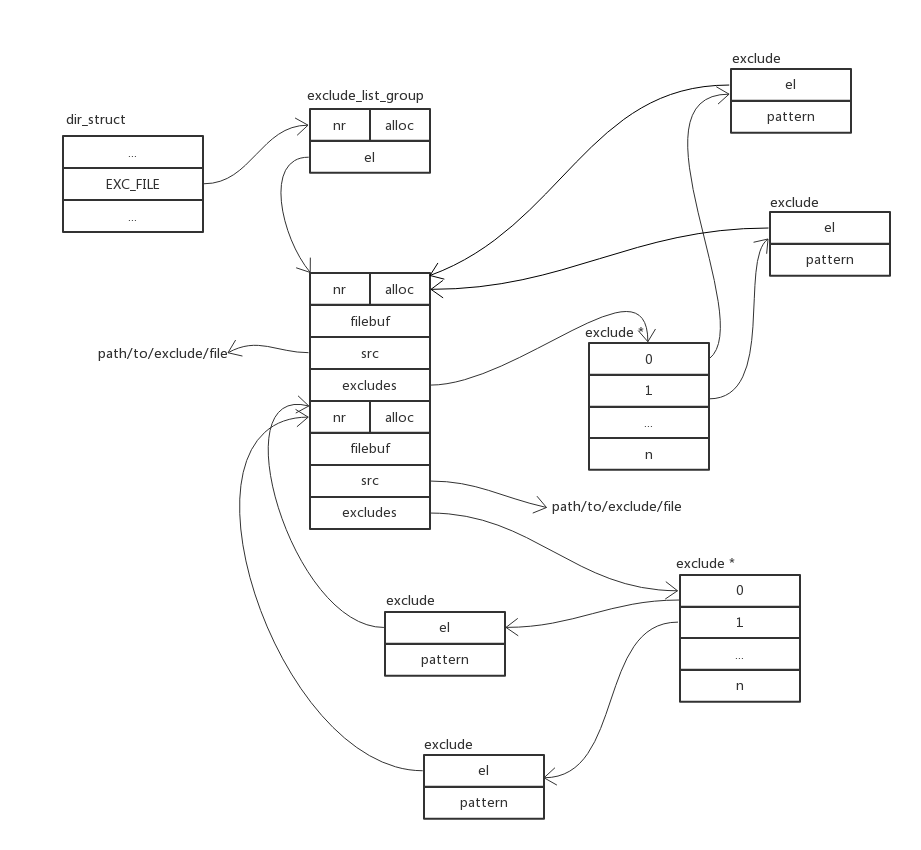

# Dir

## 概览



关于数据结构的说明：

- EXC_CMDL: 从命令行输入的 exclude 模式链表
- EXC_DIRS: 每个目录的 .gitignore 文件中的模式链表
- EXC_FILE: 从 .git/info/exclude core.excludesfile 获取的 exclude 模式链表

## 关键方法

### setup_standard_excludes

```C
void setup_standard_excludes(struct dir_struct *dir)
{
	dir->exclude_per_dir = ".gitignore";

	if (!excludes_file)
		// 按顺序查看文件 ${XDG_CONFIG_HOME}/git/ignore、${HOME}/.config/git/ignore 是否存在；
		// 如果存在，返回文件路径
		excludes_file = xdg_config_home("ignore");

	// 全局 exclude 文件存在，且可读，则加载
	if (excludes_file && !access_or_warn(excludes_file, R_OK, 0))
		add_excludes_from_file_1(dir, excludes_file,
					 dir->untracked ? &dir->ss_excludes_file : NULL);

	if (startup_info->have_repository) {
		// 获取当前代码仓库的配置
		const char *path = git_path_info_exclude();
		if (!access_or_warn(path, R_OK, 0))
			add_excludes_from_file_1(dir, path,
						 dir->untracked ? &dir->ss_info_exclude : NULL);
	}
}
```

### add_excludes_from_file_1

```C
el = add_exclude_list(dir, EXC_FILE, fname);
```

执行完毕后，dir 如下图所示：



```C
if (add_excludes(fname, "", 0, el, NULL, oid_stat) < 0)
```

执行完毕后，dir 如下图所示：


