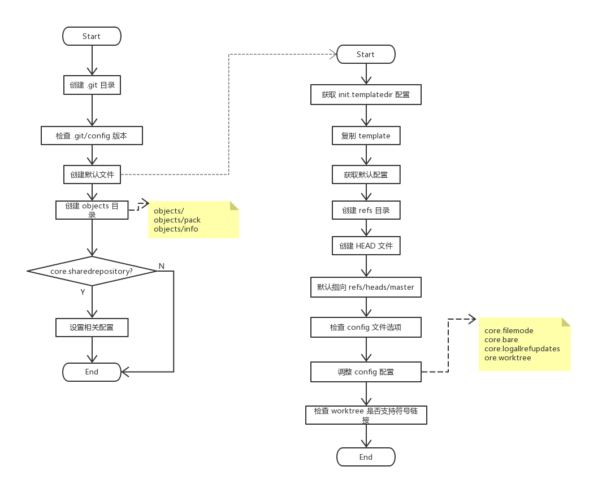

# Init

## git init

```git init``` 用于创建一个新库。由于大多数 git 命令，需要操作 .git 目录下内容，因此，我们需要了解 git 下内容如何存储。

根据 git 命令执行，我们知道，需要找到 cmd_init_db。

```C
{ "init", cmd_init_db },
```

通过简单的 grep 操作，可定位 cmd_init_db 位置：

```sh
$ grep -r -n "cmd_init_db" .
./builtin.h:175:extern int cmd_init_db(int argc, const char **argv, const char *prefix);
./builtin/init-db.c:468:int cmd_init_db(int argc, const char **argv, const char *prefix)
./git.c:415:	{ "init", cmd_init_db },
./git.c:416:	{ "init-db", cmd_init_db },
```

cmd_init_db 基本流程如下图：


## reposity

先看关系图:


下面的内容，我们将分析关键的代码及方法。

### 配置

- git-config

通过遍历 configset_list 中每一个元素，使用 fn 判定配置选项是否满足条件，并进行设置。data 为 fn 额外参数。

```C
void git_config(config_fn_t fn, void *data)
```

核心方法为

```C
static void configset_iter(struct config_set *cs, config_fn_t fn, void *data)
{
	int i, value_index;
	struct string_list *values;
	struct config_set_element *entry;
	struct configset_list *list = &cs->list;

	// 遍历 configset_list
	for (i = 0; i < list->nr; i++) {
		// 获取 entry
		entry = list->items[i].e;

		// 获取 values
		value_index = list->items[i].value_index;
		values = &entry->value_list;

		current_config_kvi = values->items[value_index].util;

		// 使用 fn 对比 key，和需要的 value；
		// value 通过 value_index 获取
		if (fn(entry->key, values->items[value_index].string, data) < 0)
			git_die_config_linenr(entry->key,
					      current_config_kvi->filename,
					      current_config_kvi->linenr);

		current_config_kvi = NULL;
	}
}
```

- repo_read_config

在 git_config_check_init 中调用，初始化当前 reposity 配置。

```C
static void repo_read_config(struct repository *repo)
{
	struct config_options opts;

	opts.respect_includes = 1;
	opts.commondir = repo->commondir;
	opts.git_dir = repo->gitdir;

	// 库的 config 暂无分配内存
	if (!repo->config)
		repo->config = xcalloc(1, sizeof(struct config_set));
	else
		// 清除配置
		git_configset_clear(repo->config);

	// 初始化 configset
	git_configset_init(repo->config);

	// 从预定义的配置文件中获取 reposity 配置
	if (config_with_options(config_set_callback, repo->config, NULL, &opts) < 0)
		die(_("unknown error occurred while reading the configuration files"));
}
```

## 创建库

流程图如下



## References

- [Git Config](https://git-scm.com/docs/git-config)
