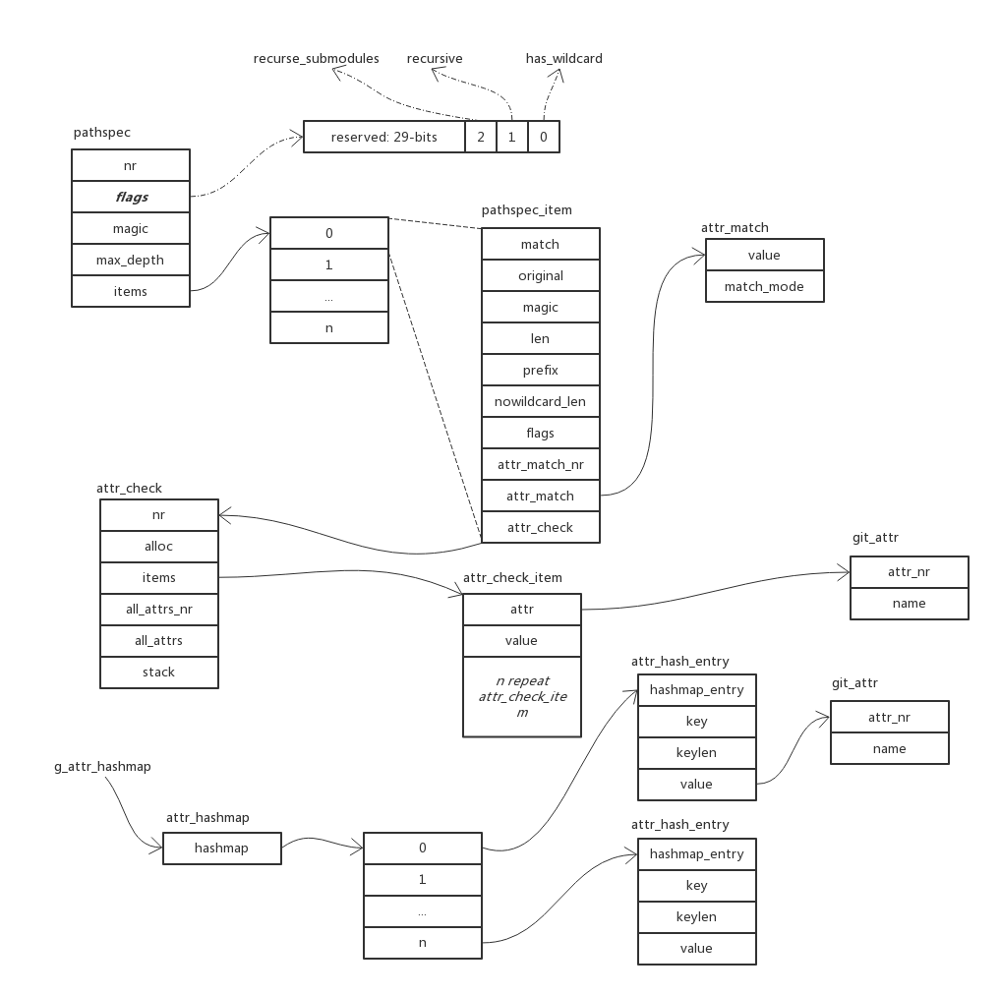

# Path Spec

## 概览

首先看 git 的官方说明：

```sh
$ git help add

<pathspec>...
   Files to add content from. Fileglobs (e.g.  *.c) can be given to add all matching files. Also a leading directory name (e.g.  dir to
   add dir/file1 and dir/file2) can be given to update the index to match the current state of the directory as a whole (e.g. specifying
   dir will record not just a file dir/file1 modified in the working tree, a file dir/file2 added to the working tree, but also a file
   dir/file3 removed from the working tree. Note that older versions of Git used to ignore removed files; use --no-all option if you
   want to add modified or new files but ignore removed ones.
```

再看一下数据结构图：



从数据结构，可以看出 pathspec 是用于文件名模式匹配的，支持通配符操作。

## 核心方法

### parse_element_magic

```C
static const char *parse_element_magic(unsigned *magic, int *prefix_len,
				       struct pathspec_item *item,
				       const char *elem)
{
	// 没有 magic，或全局设置了只使用 literal
	if (elem[0] != ':' || get_literal_global())
		return elem;
	else if (elem[1] == '(')
		// longhand --> :()
		return parse_long_magic(magic, prefix_len, item, elem);
	else
		// shorthand --> ::
		return parse_short_magic(magic, elem);
}
```

### parse_long_magic

首先，来看一下，path spec 中 magic 支持的内容

```C
static struct pathspec_magic {
	unsigned bit;
	char mnemonic; /* this cannot be ':'! */
	const char *name;
} pathspec_magic[] = {
	{ PATHSPEC_FROMTOP,  '/', "top" },
	{ PATHSPEC_LITERAL, '\0', "literal" },
	{ PATHSPEC_GLOB,    '\0', "glob" },
	{ PATHSPEC_ICASE,   '\0', "icase" },
	{ PATHSPEC_EXCLUDE,  '!', "exclude" },
	{ PATHSPEC_ATTR,    '\0', "attr" },
};
```

再看代码

```C
static const char *parse_long_magic(unsigned *magic, int *prefix_len,
				    struct pathspec_item *item,
				    const char *elem)
{
	const char *pos;
	const char *nextat;

	// +2 ，跳过 :()
	for (pos = elem + 2; *pos && *pos != ')'; pos = nextat) {
		// 找到下一个 , ) 出现位置，这两个表示一个属性的终结
		size_t len = strcspn_escaped(pos, ",)");
		int i;

		if (pos[len] == ',') // 没有属性
			nextat = pos + len + 1;
		else
			nextat = pos + len; /* handle ')' and '\0' */

		if (!len)
			continue;

		// prefix: 属性
		if (starts_with(pos, "prefix:")) {
			char *endptr;
			*prefix_len = strtol(pos + 7, &endptr, 10);
			if (endptr - pos != len)
				die(_("invalid parameter for pathspec magic 'prefix'"));
			continue;
		}

		// attr 属性
		if (starts_with(pos, "attr:")) {
			// 获取属性主体
			char *attr_body = xmemdupz(pos + 5, len - 5);
			parse_pathspec_attr_match(item, attr_body);
			*magic |= PATHSPEC_ATTR;
			free(attr_body);
			continue;
		}

		// 处理其他属性
		for (i = 0; i < ARRAY_SIZE(pathspec_magic); i++) {
			if (strlen(pathspec_magic[i].name) == len &&
			    !strncmp(pathspec_magic[i].name, pos, len)) {
				*magic |= pathspec_magic[i].bit;
				break;
			}
		}

		if (ARRAY_SIZE(pathspec_magic) <= i)
			die(_("Invalid pathspec magic '%.*s' in '%s'"),
			    (int) len, pos, elem);
	}

	if (*pos != ')')
		die(_("Missing ')' at the end of pathspec magic in '%s'"),
		    elem);
	pos++;

	return pos;
}
```

### init_pathspec_item

从输入字符串 elt 中，构建 pathspec_item

```C
static void init_pathspec_item(struct pathspec_item *item, unsigned flags,
			       const char *prefix, int prefixlen,
			       const char *elt)
{
	unsigned magic = 0, element_magic = 0;
	const char *copyfrom = elt;
	char *match;
	int pathspec_prefix = -1;

	item->attr_check = NULL;
	item->attr_match = NULL;
	item->attr_match_nr = 0;

	if (flags & PATHSPEC_LITERAL_PATH) {
		// 如果是普通路径，跳过 magic 处理
		magic = PATHSPEC_LITERAL;
	} else {
		// 处理 magic
		// :(prefix:,attr:) long-form-magic 
		// ::  short-form-magic
		copyfrom = parse_element_magic(&element_magic,
					       &pathspec_prefix,
					       item,
					       elt);
		magic |= element_magic;
		magic |= get_global_magic(element_magic);
	}

	item->magic = magic;

	// 错误检测
	if (pathspec_prefix >= 0 &&
	    (prefixlen || (prefix && *prefix)))
		die("BUG: 'prefix' magic is supposed to be used at worktree's root");

	if ((magic & PATHSPEC_LITERAL) && (magic & PATHSPEC_GLOB))
		die(_("%s: 'literal' and 'glob' are incompatible"), elt);

	/* Create match string which will be used for pathspec matching */
	if (pathspec_prefix >= 0) {
		match = xstrdup(copyfrom);
		prefixlen = pathspec_prefix;
	} else if (magic & PATHSPEC_FROMTOP) {
		match = xstrdup(copyfrom);
		prefixlen = 0;
	} else {
		match = prefix_path_gently(prefix, prefixlen,
					   &prefixlen, copyfrom);
		if (!match)
			die(_("%s: '%s' is outside repository"), elt, copyfrom);
	}

	item->match = match;
	item->len = strlen(item->match);
	item->prefix = prefixlen;

	/*
	 * Prefix the pathspec (keep all magic) and assign to
	 * original. Useful for passing to another command.
	 */
	if ((flags & PATHSPEC_PREFIX_ORIGIN) &&
	    !get_literal_global()) {
		struct strbuf sb = STRBUF_INIT;

		/* Preserve the actual prefix length of each pattern */
		prefix_magic(&sb, prefixlen, element_magic);

		strbuf_addstr(&sb, match);
		item->original = strbuf_detach(&sb, NULL);
	} else {
		item->original = xstrdup(elt);
	}

	if (magic & PATHSPEC_LITERAL) {
		item->nowildcard_len = item->len;
	} else {
		item->nowildcard_len = simple_length(item->match);
		if (item->nowildcard_len < prefixlen)
			item->nowildcard_len = prefixlen;
	}

	item->flags = 0;
	if (magic & PATHSPEC_GLOB) {
		/*
		 * FIXME: should we enable ONESTAR in _GLOB for
		 * pattern "* * / * . c"?
		 */
	} else {
		if (item->nowildcard_len < item->len &&
		    item->match[item->nowildcard_len] == '*' &&
		    no_wildcard(item->match + item->nowildcard_len + 1))
			item->flags |= PATHSPEC_ONESTAR;
	}

	/* sanity checks, pathspec matchers assume these are sane */
	if (item->nowildcard_len > item->len ||
	    item->prefix         > item->len) {
		die ("BUG: error initializing pathspec_item");
	}
}
```

## References

- [Path Spec](https://git-scm.com/docs/gitglossary#gitglossary-aiddefpathspecapathspec)
- [Git Attributes](https://git-scm.com/docs/gitattributes)
