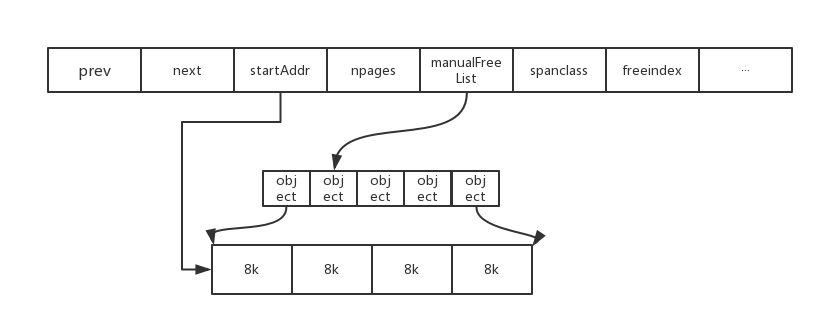
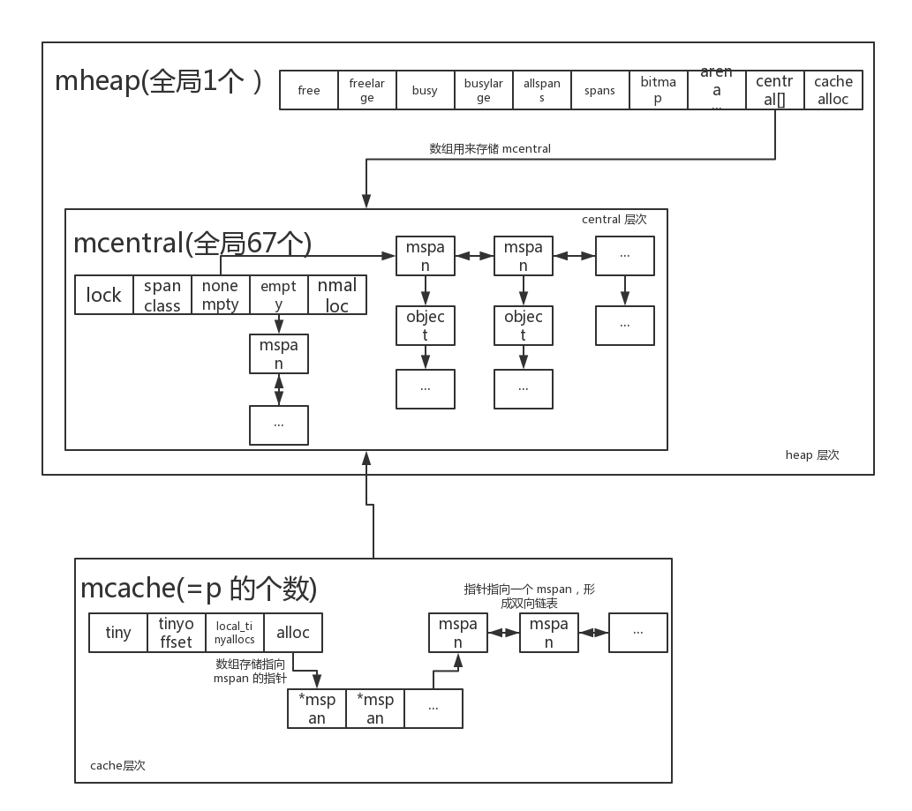
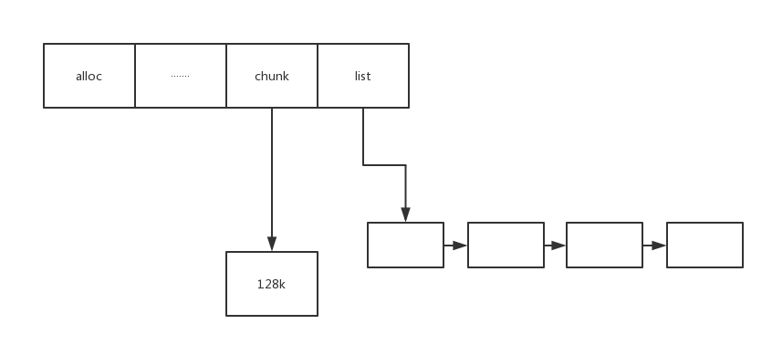

#Golang Allocation

##tcmalloc

tcmalloc 是 Google 开发的内存分配器，Golang 中内存分配器是基于 tcmalloc 的设计重新实现了一遍。

## 两种粒度的内存 object，span

### Object

由```span``` 切割成的内存块，```object ```被预设了一些规格，也就是 ```class```（class <= 256k）。相同```class```的空闲的内存块形成链表。但是`object`在代码中并没有具体的数据结构表示。

 

### Span

```span```由连续的```page```组成。golang 中一个 ```page```大小为 8 k。



（上图为 golang 中 span 的结构图，省略部分字段 ）

- ```prev```,```next``` 形成双向链表。
- ```startAddr```指向第一页的地址，```napages```表示组成页数。因为 span 是管理一组连续的 page，所以可以根据这两个字段通过移位算出一个地址属于哪一页。
- ```manualFreeList``` 表示 free object 的链表。
- ```spanclass``` 根据这个字段的方法可以得出 span 切割成的固定 object 属于哪一类（class）。
- ```freeindex```: 0 ~ nelemes-1，表示分配到第几个块。

golang 中 一个实现的 span 称为`mspan`。

##三个层次 cache，central，heap 


分配内存和释放内存的时候都是按从前到后的顺序，在各个层次中去进行尝试。基本思想是：前面的层次分配内存失败，则从下一层分配一批补充上来；前面的层次释放了过多的内存，则回收一批到下一层。

功能逻辑上三个层次独立，之间不能跨层次交流。但是在源码的具体实现中，central 层次的实现形式 `mcentral`包含在 heap 层次的实现形式 `mheap`中。



（这张图描述了三个层次中主要的数据结构，省略了一些字段，便于理解下面的文字部分。）

### cache

属于线程私有。存储小对象是一般可以直接获取到 object ，在多线程情况下，不用与其他线程竞争。

```go
type mcache struct {
   next_sample int32  
   local_scan  uintptr 

   //小对象分配器，小于 16 byte 的小对象都会通过 tiny 来分配。
   tiny             uintptr
   tinyoffset       uintptr
   local_tinyallocs uintptr

   alloc [numSpanClasses]*mspan
}
```

这里需要重点关注一下 ```alloc[numSpanClasses]```，这是一个大小为67 * 2的指针数组，数组元素 ```*mspan```指向被分成特定大小的```span```。当 ```object``` 传进来的时候，根据大小选择合适的元素来分配内存。

```Go
var class_to_size = [_NumSizeClasses]uint16{0, 8, 16, 32, 48, 64, 80, 96, 112, 128, 144, 160, 176, 192, 208, 224, 240, 256, 288, 320, 352, 384, 416, 448, 480, 512, 576, 640, 704, 768, 896, 1024, 1152, 1280, 1408, 1536, 1792, 2048, 2304, 2688, 3072, 3200, 3456, 4096, 4864, 5376, 6144, 6528, 6784, 6912, 8192, 9472, 9728, 10240, 10880, 12288, 13568, 14336, 16384, 18432, 19072, 20480, 21760, 24576, 27264, 28672, 32768}
```

###central

全局 cache，```mcache ```不够用的时候向 ```mcentral ```申请，第二个层次。central 层次中有多个```mcentral```。虽然 central 作为第二个层次，实际上 ```mcentral``` 包含在 ```mheap``` 里。

这是一个 mcentral 的结构：

```go
type mcentral struct {
	lock      mutex      //因为 mcentral 这个层次是多线程共用，所以需要上锁
	spanclass spanClass  //表示这个 list 中 span 切割的规格。
	nonempty  mSpanList 
	empty     mSpanList  //用于存放含有空 object 和没有空 object 的 span 链表。
	nmalloc   uint64     
}
```
### heap

当 ```mcentral``` 也不够用的时候，通过 ```mheap``` 向操作系统申请。```mheap``` 负责管理 ```arena```，也就是 golang 中的分配内存的连续虚拟地址区域。

```go
type mheap struct {
    lock      mutex
    
    // spanlist 数组，索引表示组成的页数（0<index<128），比如 free[3] 指向的元素是由3个 page 组成的span 组成的链表。
    // free 代表未分配，busy 代表已分配。
    // large 代表 页数>127 。
    free      [_MaxMHeapList]mSpanList  
    freelarge mSpanList               
    busy      [_MaxMHeapList]mSpanList 
    busylarge mSpanList               
   
    //所有的 spans 都是通过 mheap_ 申请，所有申请过的 mspan 都会记录在allspans。结构体中的 lock 就是用来保证并发安全。
    allspans []*mspan

    //记录了 span 和 page 的映射关系。
    spans []*mspan 
    
    // 跟 arena 有关的一些字段，后期的对 page 的一些申请都从 arena 中获取。
    arena_start    uintptr
    arena_used     uintptr 
    arena_end      uintptr
    arena_reserved bool
    
    // 这是一个关于central 的数组，索引是 mcentral 中的 spanclass。可以看做是 mcentral 的集合，所以有67个元素。
    //pad 可以认为是一个字节填充，为了避免伪共享（false sharing）问题的。
    central [_NumSizeClasses]struct {
        mcentral mcentral
        pad      [sys.CacheLineSize]byte
    }

    // 分配和释放 mspan 和 mcache 通过 fixalloc，具体 mfixalloc.go。
    spanalloc             fixalloc  
    cachealloc            fixalloc  
}
```

（忽略了一些关于统计和垃圾回收的字段）

## 辅助组件—FixAlloc

引入FixAlloc的目的只是用来分配`mcache`和`mspan`两个特定的对象，所以内存分配器中有`spanalloc`和`cachealloc`两个组件。

FixAlloc内存结构图：



`list`指针上挂的一个链表，这个链表的每个节点是一个固定大小的内存块，cachealloc中的list存储的内存块大小为`sizeof(MCache)`，而spanalloc中的list存储的内存块大小为`sizeof(MSpan)`。`chunk`指针始终挂载的是一个128k大的内存块。

使用FixAlloc分配`mcache`和`mspan`对象的时候，首先是查找FixAlloc的list链表，如果list不为空，就直接拿一个内存块返回使用; 如果list为空，就把焦点转移到chunk上去，如果128k的chunk内存中有足够的空间，就切割一块内存出来返回使用，如果chunk内存没有剩余内存的话，就从操作系统再申请128k内存替代老的chunk。FixAlloc的固定对象分配逻辑就这么简单，相反释放逻辑更简单了，释放的对象就是直接放到list中，并不会返回给操作系统。

## 初始化（malloc.mallocinit）

**向操作系统申请一段连续虚拟地址区域**

- arena 就是我们通常说的 heap，后面申请内存都是从 heap 中申请。
- bitmap 主要用来标记 arena 中的地址是否包含指针和是否需要扫描。bitmap 中两个 bit 表示一个字的可用状态。
-  spans 主要是由 *mspan 组成。spans 记录的 arena 区的块页号和对应的 mspan 指针的对应关系。比如 arena 区内存地址 x，对应的页号就是 `page_num = (x - arena_start) / page_size`，那么 spans 就会记录`spans[page_num] = x`。如果 arena 为 512 G的话，spans 区的大小为 512 G / 8K * 8 = 512 M

​     |----------------|-----------------|--------------|

​     |     spans    |     bitmap    |   arena    |

​     |----------------|-----------------|--------------|

- 根据与 arena 的对应关系求出 spansSize,bitmapSize，不同平台申请的起始地址不一样。

​       *只是申请了地址，还没有初始化arena，bitmap，spans。 

**mheap 初始化**

- 调用 round 函数进行对齐。


- 初始化arena，bitmap，spans。
- 调用 init 函数对 mcentral,fixalloc(spanalloc,cachealloc) 进行初始化。
- 获取 g，获取 g 绑定的 m 上的 mcache。

## 分配(malloc.mallocgc)

- object size < 16k

  小于16k的对象由 mcache 中 tiny alloctor 分配。tiny 是指针，指向 tiny 区域的起始地址。tinyoffset 表示          tiny 当前分配到的位置。先根据 object size 进行对齐，然后查询剩下空间是否足够，足够的话直接分配；不够重   新申请一块 16 byte  的内存块，然后分配。新内存块分配后剩余的部分给 tiny alloctor，tinyoffset 会记录分配了多少。


- 16k < objeck size < 32k

  先计算需要分配的内存块的 class ，然后去 mcache 里面 alloc[numSpanClasses] 数组里申请。

  （比如如果要分配 17 byte 的内存 （16 byte 以下的使用 mcache.tiny 分配），sizeclass = size_to_calss8[(17+7)/8] = size_to_class8[3] = 3。）

  如果申请相应规格的空闲列表为空，向对应的 mcentral 申请， 从  mcentral 中获取一堆规格相同的object，放到  mcache 对应的 span 的链表中，返回其中一个 object。

  如果相应的 mcentral 的 nonempty 也为空，向 mheap 申请，但是一次只能申请一个 span。

  如果 mheap 中的内存不够，向 OS 申请。

- objeck size > 32k 

  大于 32k 的对象称为大对象，跳过 mcache，mcentral，直接用 mheap 进行分配。

  调用 largealloc 函数，size 右移低位与确定页数，通过 mheap_.alloc 函数分配。

## 简单回收

- mcache 回收

  mcache 回收分为两部分。第一部分是把 alloc 中未用完的内存归还给 mcentral 。第二部分将剩下的 mcache（基本是个空壳）归还给 cachealloc(就是放回 cachealloc 中的 free list)。

- mcentral回收

  当 mspan 没有 free object 的时候，将 mspan 归还给 mheap。

- mheap 回收

  mheap 并不会定时向操作系统归还，但是会对 span 做一些合并。（减小内存碎片化的问题）

## 源码分析

###初始化

```Go
func mallocinit(){
    var p, pSize uintptr
	var reserved bool

    // 根据spans,bitmap,arena 对应关系求出 spansSize，bitmapSize。
	var spansSize uintptr = (_MaxMem + 1) / _PageSize * sys.PtrSize
	spansSize = round(spansSize, _PageSize)
    
	var bitmapSize uintptr = (_MaxMem + 1) / (sys.PtrSize * 8 / 2)
	bitmapSize = round(bitmapSize, _PageSize)

	if sys.PtrSize == 8 {
        //确定申请虚拟地址空间的大小
        arenaSize := round(_MaxMem, _PageSize) 
		pSize = bitmapSize + spansSize + arenaSize + _PageSize
		for i := 0; i <= 0x7f; i++ {
			switch {
			case GOARCH == "arm64" && GOOS == "darwin":
				p = uintptr(i)<<40 | uintptrMask&(0x0013<<28)
			case GOARCH == "arm64":
				p = uintptr(i)<<40 | uintptrMask&(0x0040<<32)
			default:
				p = uintptr(i)<<40 | uintptrMask&(0x00c0<<32)
			}
            //向 OS 申请大小为 pSize 的一段连续的虚拟地址空间。
			p = uintptr(sysReserve(unsafe.Pointer(p), pSize, &reserved))
			if p != 0 {
				break
            }
        }
    }
    //这里主要是初始化 mheap 结构。
    //p 是从连续虚拟地址的起始地址，先进行对齐，初始化arena，bitmap，spans。
    p1 := round(p, _PageSize)
	pSize -= p1 - p

	spansStart := p1
	p1 += spansSize
	mheap_.bitmap = p1 + bitmapSize
	p1 += bitmapSize
	if sys.PtrSize == 4 {
		mheap_.arena_start = 0
	} else {
		mheap_.arena_start = p1
	}
	mheap_.arena_end = p + pSize
	mheap_.arena_used = p1
	mheap_.arena_alloc = p1
	mheap_.arena_reserved = reserved

	if mheap_.arena_start&(_PageSize-1) != 0 {
		println("bad pagesize", hex(p), hex(p1), hex(spansSize), hex(bitmapSize), hex(_PageSize), "start", hex(mheap_.arena_start))
		throw("misrounded allocation in mallocinit")
	}

    // 调用 init 函数对 mcentral,fixalloc(spanalloc,cachealloc) 进行初始化
	mheap_.init(spansStart, spansSize)
	_g_ := getg()
	_g_.m.mcache = allocmcache()
}
```

init 函数在 mallocinit 函数中由初始化中的 mheap 调用，初始化 mheap 中的一些辅助组件。 

```go
func (h *mheap) init(spansStart, spansBytes uintptr) {
   h.treapalloc.init(unsafe.Sizeof(treapNode{}), nil, nil, &memstats.other_sys)
   h.spanalloc.init(unsafe.Sizeof(mspan{}), recordspan, unsafe.Pointer(h), &memstats.mspan_sys)
   h.cachealloc.init(unsafe.Sizeof(mcache{}), nil, nil, &memstats.mcache_sys)
   h.specialfinalizeralloc.init(unsafe.Sizeof(specialfinalizer{}), nil, nil, &memstats.other_sys)
   h.specialprofilealloc.init(unsafe.Sizeof(specialprofile{}), nil, nil, &memstats.other_sys)

   h.spanalloc.zero = false

   // h->mapcache needs no init
   for i := range h.free {
      h.free[i].init()
      h.busy[i].init()
   }

   h.busylarge.init()
   for i := range h.central {
      h.central[i].mcentral.init(spanClass(i))
   }

   sp := (*slice)(unsafe.Pointer(&h.spans))
   sp.array = unsafe.Pointer(spansStart)
   sp.len = 0
   sp.cap = int(spansBytes / sys.PtrSize)
}
```

###内存分配

内存分配根据对象大小分为三个部分，不同部分有不同的分配方法。

####object size < 16k

```Go
func mallocgc(size uintptr, typ *_type, needzero bool) unsafe.Pointer {
   ···
			//小于16K的小对象分配，通过 mcache 中的 tiny alloctor 部分分配，主要涉及 tiny,tinyoffset,	local_tinyallocs 三个字段。
            // tinyoffset 指向当前分配到的位置。
			off := c.tinyoffset
			
			if size&7 == 0 {
				off = round(off, 8)
			} else if size&3 == 0 {
				off = round(off, 4)
			} else if size&1 == 0 {
				off = round(off, 2)
			}
			if off+size <= maxTinySize && c.tiny != 0 {
                
		    // 如果 tiny 区域有足够的空间分配这个小对象，直接分配
				x = unsafe.Pointer(c.tiny + off)
				c.tinyoffset = off + size
				c.local_tinyallocs++
				mp.mallocing = 0
				releasem(mp)
				return x
			}
            
			// 如果 tiny 区域不够，申请一块新的 16byte 的内存块分配。
			span := c.alloc[tinySpanClass]
			v := nextFreeFast(span)
			if v == 0 {
				v, _, shouldhelpgc = c.nextFree(tinySpanClass)
			}
			x = unsafe.Pointer(v)
			(*[2]uint64)(x)[0] = 0
			(*[2]uint64)(x)[1] = 0
		
            // 如果申请的内存块用不完，则将剩下的给 tiny，用 tinyoffset 记录分配了多少。
			if size < c.tinyoffset || c.tiny == 0 {
				c.tiny = uintptr(x)
				c.tinyoffset = size
			}
			size = maxTinySize
        }
```

####16k < objeck size < 32k

```go
mallocgc(){
    ···
     }else {
            
            // 计算 sizeclass，然后去mcache 里面 alloc[numSpanClasses] 数组里申请。
			var sizeclass uint8
			if size <= smallSizeMax-8 {
				sizeclass = size_to_class8[(size+smallSizeDiv-1)/smallSizeDiv]
			} else {
				sizeclass = size_to_class128[(size-smallSizeMax+largeSizeDiv-1)/largeSizeDiv]
			}
			size = uintptr(class_to_size[sizeclass])
			spc := makeSpanClass(sizeclass, noscan)
			span := c.alloc[spc]
    
            // alloc 数组里的是一个 mspan 指针，真正的分配函数式 nextFreeFast()。
			v := nextFreeFast(span)
    
            // 如果为空，则判断是否需要 gc，向对应的 mcentral 申请，从  mcentral 中获取一堆规格相同的object，放到  mcache 对应的 span 的链表中，返回其中一个 object。
			if v == 0 {
				v, span, shouldhelpgc = c.nextFree(spc)
			}
			x = unsafe.Pointer(v)
			if needzero && span.needzero != 0 {
				memclrNoHeapPointers(unsafe.Pointer(v), size)
			}
		}
	} 
```

nextFreeFast 函数

如果快速可用，nextFreeFast将返回下一个 free object 。否则返回0

```go
func nextFreeFast(s *mspan) gclinkptr {
   // 判断是否 allocache 还有 free object。
   theBit := sys.Ctz64(s.allocCache) 
   if theBit < 64 {
      result := s.freeindex + uintptr(theBit)
      if result < s.nelems {
         freeidx := result + 1
         if freeidx%64 == 0 && freeidx != s.nelems {
            return 0
         }
         s.allocCache >>= uint(theBit + 1)
         s.freeindex = freeidx
         v := gclinkptr(result*s.elemsize + s.base())
         s.allocCount++
         return v
      }
   }
   return 0
}
```

nextFree 函数

如果 mcache 中没有足够的可用内存空间，则向 mcentral 申请。申请用到的是 nextFree 函数。nextFree 返回 mcache 中的下一个 free object（如果有），否则它会用一个空闲 mspan 重新填充 mcache，并返回其中一个 object。

```go
func (c *mcache) nextFree(sizeclass uint8) (v gclinkptr, s *mspan, shouldhelpgc bool) {
    s = c.alloc[sizeclass]
    shouldhelpgc = false
    freeIndex := s.nextFreeIndex()
    if freeIndex == s.nelems {
        
        if uintptr(s.allocCount) != s.nelems {
            println("runtime: s.allocCount=", s.allocCount, "s.nelems=", s.nelems)
            throw("s.allocCount != s.nelems && freeIndex == s.nelems")
        }
        systemstack(func() {
            
            // 这个地方 mcache 向 mcentral 申请
            c.refill(int32(sizeclass))
        })
        shouldhelpgc = true
        s = c.alloc[sizeclass]
        
        // mcache 向 mcentral 申请完之后，再次从 mcache 申请
        freeIndex = s.nextFreeIndex()
    }

    ...
}
```

####objeck size > 32k

```Go
func mallocgc() {
        } else {
        
        // 大于 32K 的对象由 mheap 直接分配。mheap 通过调用 largeAlloc 函数分配。
		var s *mspan
		shouldhelpgc = true
		systemstack(func() {
			s = largeAlloc(size, needzero, noscan)
		})
		s.freeindex = 1
		s.allocCount = 1
		x = unsafe.Pointer(s.base())
		size = s.elemsize
	}
    
	return x
}
```

largeAlloca函数

```Go
func largeAlloc(size uintptr, needzero bool) *mspan {
    ···
    
    // size 右移，低位与，计算所需页数
    npages := size >> _PageShift
    if size&_PageMask != 0 {
        npages++
    }
    ···
    
    // mheap_.alloc 函数分配
    s := mheap_.alloc(npages, 0, true, needzero)
    if s == nil {
        throw("out of memory")
    }
    s.limit = s.base() + size
    heapBitsForSpan(s.base()).initSpan(s)
    return s
}
```

##参考文章

[tcmalloc](http://goog-perftools.sourceforge.net/doc/tcmalloc.html)

[Go语言内存分配器-FixAlloc](http://skoo.me/go/2013/10/09/go-memory-manage-system-fixalloc)

[Golang 内存管理](http://legendtkl.com/2017/04/02/golang-alloc/)