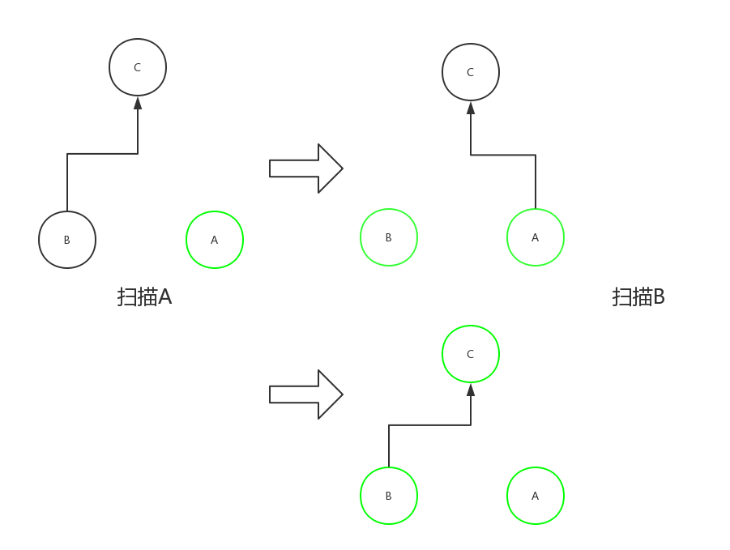
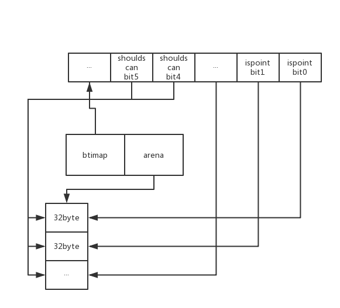

# GC

## 经典的GC算法— 标记-清扫（mark & sweep）

###基本概念

- **collector**：垃圾收集器。collector 回收不再使用的内存来供 mutator 进行NEW操作的使用。


- **mutator**：除了垃圾收集器的其他部分，比如应用程序本身。mutator的职责一般是NEW(分配内存),READ(从内存中读取内容),WRITE(将内容写入内存)。
- **mutator root(根对象)**：mutator根对象一般指的是分配在堆内存之外，可以直接被mutator直接访问到的对象。
- **可达对象**：mutator根对象开始进行遍历，可以被访问到的对象都称为是可达对象。这些对象也是mutator(你的应用程序)正在使用的对象。

### 算法原理

mark & sweep 分为两个阶段，mark 和 sweep。

 mark 阶段：collector从 mutator root 开始进行遍历，将所有访问到的对象都标记为可达对象。

sweep 阶段：collector 对堆内存的所有对象进行线性的遍历，回收没有被标记的对象。

collector 在进行上面两个阶段的时候，会停止整个应用程序（**stop the world**）。等结束后，才会恢复应用程序（**start the world**）。

### 优缺点

- 优点：mark & sweep 是第一种自动内存管理，基于追踪的垃圾收集算法。解决了计数算法的不足，可以解决循坏引用。
- 缺点：在进行标记和清扫两个阶段时会系统会挂起用户程序，也就是 STW，转而执行垃圾回收程序，会浪费大量时间。并且因为回收过程中不会移动对象，垃圾回收后有可能会造成大量的内存碎片。


##三色标记清除算法

三色标记算法是对标记-清扫算法的改进。明显的好处是，三色标记 mark 阶段可以和用户程序并发进行。

### 基本概念

白色集合：一组可以回收内存的对象。（也就是最后要清扫的垃圾）

灰色集合：包括所有可以从根对象访问到的，但是还没有扫描引用的”白色“对象的对象。由于这些对象可以从根对象访问到，所以它们不能 collector 收集，并且被扫描后它们移入到黑色集合中。

黑色集合：可以显示为没有对白色集合中对象的传出引用并可从根目录访问的对象集合。黑色集合中的对象不被收集。

###实现过程

最初开始的时候，黑色集合中是空的，灰色集合是根对象引用的对象集合，白色集合包含其他所有对象。

1. 从灰色集合中选取一个物体并将其移至黑色集合。
2. 将其引用的每个白色对象移至灰色集。
3. 重复最后两个步骤，直到灰色集合为空。

灰色设置为空时，扫描完成; 黑色的物体可以从根部到达，而白色的物体不是，可以被 collector 收集。

由于从根不能立即到达的所有对象都添加到白色集合中，并且对象只能从白色移动到灰色，并且从灰色移动到黑色，因此该算法保留了一个重要的不变性 —— **没有黑色对象引用白色对象**。这确保了一旦灰色集合为空时，可以释放白色物体。这被称为**三色不变量**。该算法的一些变体不保留这个不变量，而是使用所有重要属性都适用的修改后的形式。

三色方法有一个重要的优点 - 可以在“即时”执行，而不会在很长一段时间内停止系统。mark 阶段与程序并发执行，同时维护并监视集合，当灰色集合为空时，才进行 sweep 阶段。而且，避免了在每个循环中触摸整个工作集的需要。


##Golang GC

###**writer barrier**

垃圾回收中的 write barrier 可以理解为编译器在写操作时特意插入的一段代码。对于和用户程序并发运行的垃圾回收算法，用户程序会一直修改内存，所以需要记录下来。

```Go
var writeBarrier struct {
   enabled bool    // 调用前的检查
   pad     [3]byte // 用于”enabled“字段的加载
   needed  bool    // 当前阶段是否需要使用 writer barrier
   cgo     bool    
   alignme uint64  // 保证对齐
}
```

例如开始扫描时发现根对象A和B, B拥有C的指针, GC 先扫描A, 然后B把C的指针交给A, GC 再扫描B, 这时C就不会被扫描到。启用了 Write Barrier 后, 当B把C的指针交给A时, GC会认为在这一轮的扫描中C的指针是存活的,即使A可能会在稍后丢掉C, 那么C就在下一轮回收。




Writer barrier 只针对指针启用, 而且只在 GC 的 mark 阶段启用, 平时会直接把值写入到目标地址。

从 Go1.7开始，为了提高 gc collector 的性能，避免 rescan 阶段 stw 消耗的时间，采用了一种混合的 writer barrier 方式。

### 触发 GC

触发 GC 的方式有三种。

- 自动检测

  内存分配过程中，当分配的对象大小 >32kb，或是分配小对象时发现 span 已经满了时，会触发 GC。


- 用户调用

  通过调用 runtime.GC() 函数，这是阻塞式的。启用的时候会堵塞调用者直到垃圾回收完成。

  ```go
  func GC() {
      gcStart(gcForceBlockMode, false)
  }
  ```

- forcegc

  Golang 本身会对运行状态进行监控，如果超过两分钟没有触发 GC 任务，则强制触发。

  ```Go
  // The main goroutine
  func main() {
      ...
      systemstack(func() {
        	newm(sysmon, nil)
      })
  }
  // Always runs without a P, so write barriers are not allowed.
  func sysmon() {
      ...
      for {
          now := nanotime()
          unixnow := unixnanotime()
        	
          lastgc := int64(atomic.Load64(&memstats.last_gc))
          if gcphase == _GCoff && lastgc != 0 && unixnow-lastgc > forcegcperiod && atomic.Load(&forcegc.idle) != 0 {
              lock(&forcegc.lock)
              forcegc.idle = 0
              forcegc.g.schedlink = 0
              injectglist(forcegc.g)	// 将 forcegc goroutine 加入 runnable queue
              unlock(&forcegc.lock)
          }
      }
  }

  var forcegcperiod int64 = 2 * 60 *1e9	//两分钟
  ```

并不是触发 GC 后就马上运行，会判断是否满足垃圾回收条件`memstats.heap_live >= memstats.gc_trigger `（当前堆上的活跃对象大于我们初始化时候设置的 GC 触发阈值），满足的话就运行 GC。

```go
func gcShouldStart(forceTrigger bool) bool {
    return gcphase == _GCoff && (forceTrigger || memstats.heap_live >= memstats.gc_trigger) && memstats.enablegc && panicking == 0 && gcpercent >= 0
}
```

###基本概念

- **Gcphase**

  这是一个变量，代表 Garbage collector 状态，表示 writer barrier 和同步任务的执行。Gcphase有三个状态。

  mark 阶段时，Gcphase = _GCmark；mark 阶段结束时，Gcphase = _GCmarktermination；sweep 阶段开始时，Gcphase = _GCoff。

- **辅助 GC**

  为了防止heap增速太快, 在GC执行的过程中如果同时运行的G分配了内存, 那么这个G会被要求辅助GC做一部分的工作.
  在GC的过程中同时运行的G称为"mutator", "mutator assist"机制就是G辅助GC做一部分工作的机制.

  辅助GC做的工作有两种类型, 一种是标记(Mark), 另一种是清扫(Sweep)。

  ```go
  func mallocgc(){ 
      // 判断是否要辅助GC工作
      // gcBlackenEnabled在GC的标记阶段会开启
      var assistG *g
      if gcBlackenEnabled != 0 {
          // Charge the current user G for this allocation.
          assistG = getg()
          if assistG.m.curg != nil {
              assistG = assistG.m.curg
          }
          // Charge the allocation against the G. We'll account
          // for internal fragmentation at the end of mallocgc.
          assistG.gcAssistBytes -= int64(size)

          // 会按分配的大小判断需要协助GC完成多少工作
          if assistG.gcAssistBytes < 0 {
              // This G is in debt. Assist the GC to correct
              // this before allocating. This must happen
              // before disabling preemption.
              gcAssistAlloc(assistG)
          }
      }
      ···
  }
  ```

  和辅助标记不一样的是, 辅助清扫申请新span时才会检查, 而辅助标记是每次分配对象时都会检查。

  辅助标记计算工作量通过`revise`函数，辅助清扫计算工作量通过`getSetTriggerRadio`函数。

- **后台任务**

  在GC过程中会有两种后台任务(G), 一种是标记用的后台任务, 一种是清扫用的后台任务.
  标记用的后台任务会在需要时启动。
  清扫用的后台任务在程序启动时会启动一个, 进入清扫阶段时唤醒。

- **work buffer (标记队列)**

  这里介绍一下 work buffer，或者说灰色对象管理。每个 P 上都有一个 gcw 用来管理灰色对象，gcw 的结构就是 gcWork。gcWork 中的核心是 wbuf1 和 wbuf2，里面存储就是灰色对象，或者说是 work。

  每个 P 上有 work buffer，还有一个全局的 work list 。通过在每个 P 上绑定 work buffer 的好处和 cache 一样，不需要加锁。

  同时标记队列可以用来区分对象的颜色，标记并且在队列中的是灰色对象，标记了但是不在队列中的是黑色对象，没有标记的是白色对象。

  ```go
  root node queue
  while(queue is not nil) {
    dequeue // 节点出队
    process // 处理当前节点 
    child node queue // 子节点入队
  }
  ```

- **bitmap**

  bitmap区域用于表示arena区域中哪些地址保存了对象, 并且对象中哪些地址包含了**指针**.
  bitmap区域中一个byte(8 bit)对应了arena区域中的四个指针大小的内存, 也就是2 bit对应一个指针大小的内存。
  所以bitmap区域的大小是 512GB / 指针大小(8 byte) / 4 = 16GB。

  bitmap区域中的一个byte对应arena区域的四个指针大小的内存的结构如下。
  每一个指针大小的内存都会有两个bit分别表示是否应该继续扫描和是否包含指针：

  

###基本过程

####初始化 GC

介绍一些表示与 GC 有关的变量，同时初始化变量达到初始化 GC 的效果。 

```go
//heapminimum 是触发 GC 的最小的 heap size
//对于较小的 small heaps 来说，这个变量优先于一般的规则 GOGC*live
//在初始化过程中它被设置为4MB * GOGC / 100
var heapminimum uint64 = defaultHeapMinimum

// defaultHeapMinimum 是当 GOGC 为100时 heapminimum 的值
const defaultHeapMinimum = 4 << 20

//从 $GOGC 初始化.  GOGC=off 表示没有 gc
var gcpercent int32

// 初始化 GC ，设置合适的状态量
func gcinit() {
   if unsafe.Sizeof(workbuf{}) != _WorkbufSize {
      throw("size of Workbuf is suboptimal")
   }

   // 第一次循环没有清扫
   mheap_.sweepdone = 1

   // 设置一个合理的 GC 触发器，triggerRatio 是触发 mark 阶段的堆增长率
   memstats.triggerRatio = 7 / 8.0
   
    // 设置 GC 的触发阈值
   memstats.heap_marked = uint64(float64(heapminimum) / (1 + memstats.triggerRatio))

    // 启动的时候通过 GOGC 传递百分比 x，通过 readgogc 函数获得 GOGC 的值
   _ = setGCPercent(readgogc())

   work.startSema = 1
   work.markDoneSema = 1
}
```

```go
// GOGC = off 时，可以彻底关掉 GC
func readgogc() int32 {
   p := gogetenv("GOGC")
   if p == "off" {
      return -1
   }
   if n, ok := atoi32(p); ok {
      return n
   }
   return 100
}
```

在 runtime 中大部分初始化完成后，准备运行用户代码前调用激活 GC 的函数，启动后台清扫任务的 goroutine 并且激活 GC。

```go
func gcenable() {
   c := make(chan int, 1)
   go bgsweep(c)
   <-c
   memstats.enablegc = true // now that runtime is initialized, GC is okay
}
```

gcstart中只是为所有的P都准备好对应的goroutine来做标记。激活后，GC collector 在后台等待触发。

####GC过程

- Sweep Termination: 对未清扫的span进行清扫, 只有上一轮的GC的清扫工作完成才可以开始新一轮的GC

  ```Go
  for trigger.test() && gosweepone() != ^uintptr(0) {
      sweep.nbgsweep++
  }
  ```

  清扫的主要逻辑在 gosweepone 函数中。清扫在 mheap 中没有标记的 span 。

  ```go
  // gosweepone函数
  func gosweepone() uintptr {
      var ret uintptr
      systemstack(func() {
          ret = sweepone()
      })
      return ret
  }

  func sweepone() uintptr {
      npages := ^uintptr(0)
      sg := mheap_.sweepgen
      for {
      s := mheap_.sweepSpans[1-sg/2%2].pop()
      }
  // ...
  }
  ```

- Mark: 扫描所有根对象, 和根对象可以到达的所有对象, 标记它们不被回收。

  准备阶段，将 gcphase 状态改为 _GCmark，启用相关功能，排列根标记作业。直到所有的 p 都启用了writer barrier ，才能扫描任何对象。这步是通过 stw 完成的。

  ```go
  if mode == gcBackgroundMode {
      gcBgMarkStartWorkers()
  }

  // gcBgMarkStartWorkers函数为：
  func gcBgMarkStartWorkers() {
      for _, p := range &allp {
          if p == nil || p.status == _Pdead {
              break
          }
          if p.gcBgMarkWorker == 0 {
              go gcBgMarkWorker(p)  //准备markworker
              notetsleepg(&work.bgMarkReady, -1)
              noteclear(&work.bgMarkReady)
          }
      }
  } 

  ```

  mark 阶段主要函数是`gcDrain`。

  这个阶段代码准备了 n 个 markworker，每个 woker 重复下面步骤：

  1. 如果是第一次mark则首先`markroot`将所有root区的指针入队。
  2. 从gcw中取节点出对开始扫描处理`scanobject`，节点出队列就是黑色了。
  3. 扫描时获取该节点所有子节点的类型信息判断是不是指针，若是指针且并没有被标记则`greyobject`入队。
  4. 每个worker都去gcw中拿任务直到为空break。

  ```Go
  // 每个markWorker都执行gcDrain这个标记过程
  func gcDrain(gcw *gcWork, flags gcDrainFlags) {
      // 如果还没有root区域入队则markroot
      markroot(gcw, job)
      if idle && pollWork() {
          goto done
      }
      // 节点出队 
      for !(preemptible && gp.preempt) {
          //从本地灰色标记队列中获取对象, 获取不到则从全局标记队列获取
          var b uintptr
          if blocking {
              b = gcw.get()
          } else {
              b = gcw.tryGetFast()
              if b == 0 {
                  b = gcw.tryGet()
              }
          }
          if b == 0 {
              break
          }
          //扫描灰色对象的引用对象，标记为灰色，入灰色队列
          scanobject(b, gcw)
  done:
  }
  func scanobject(b uintptr, gcw *gcWork) {
      hbits := heapBitsForAddr(b)
      s := spanOfUnchecked(b)
      n := s.elemsize
      for i = 0; i < n; i += sys.PtrSize {
          // 找到 bitmap 中的信息.
          if bits&bitPointer == 0 {
              continue // not a pointer
          }
  .... 
          // 标记.
          if obj, hbits, span, objIndex := heapBitsForObject(obj, b, i); obj != 0 {
              greyobject(obj, b, i, hbits, span, gcw, objIndex)
          }
      }
      gcw.bytesMarked += uint64(n)
      gcw.scanWork += int64(i)
  }
  func greyobject(obj, base, off uintptr, hbits heapBits, 
       span *mspan, gcw *gcWork, objIndex uintptr) {
      mbits := span.markBitsForIndex(objIndex)
      // If marked we have nothing to do.
      if mbits.isMarked() {
          return
      }
      if !hbits.hasPointers(span.elemsize) {
          return
      }
      gcw.put(obj)
  }
  ```


- Mark Termination: 完成标记工作, 重新扫描部分根对象(要求STW)

  改变 gcphase 状态为_GCmarktermination。

  mark termination 阶段会 stop the world。函数实现在 `gcMarkTermination()`。

  ```Go
  func gcMarkTermination() {
      // World is stopped.
      // Run gc on the g0 stack. We do this so that the g stack
      // we're currently running on will no longer change. Cuts
      // the root set down a bit (g0 stacks are not scanned, and
      // we don't need to scan gc's internal state).  We also
      // need to switch to g0 so we can shrink the stack.
      systemstack(func() {
          gcMark(startTime)
          // Must return immediately.
          // The outer function's stack may have moved
          // during gcMark (it shrinks stacks, including the
          // outer function's stack), so we must not refer
          // to any of its variables. Return back to the
          // non-system stack to pick up the new addresses
          // before continuing.
      })
      ...
  }
  ```

- Sweep: 改变 gcphase 状态为 _GCoff，设置 sweep state 并且停用 writer barrier。

  按标记结果清扫span。bitmap 中对于每一个 mspan 都有相应的信息，扫描到没有被标记的 mspan 时就可以回收了。

```Go
unc gcSweep(mode gcMode) {
    ...
    //阻塞式
    if !_ConcurrentSweep || mode == gcForceBlockMode {
        // Special case synchronous sweep.
        ...
        // Sweep all spans eagerly.
        for sweepone() != ^uintptr(0) {
            sweep.npausesweep++
        }
        // Do an additional mProf_GC, because all 'free' events are now real as well.
        mProf_GC()
        mProf_GC()
        return
    }
  	
    // 并行式
    // Background sweep.
    lock(&sweep.lock)
    if sweep.parked {
        sweep.parked = false
        ready(sweep.g, 0, true)
    }
    unlock(&sweep.lock)
}
```

根据之前提到过的变量，清扫有两种模式。对于并行式清扫，在 GC 初始化的时候就会启动 `bgsweep()`，然后在后台一直循环。

```Go
func bgsweep(c chan int) {
        // 清扫一个span, 然后进入调度
        for gosweepone() != ^uintptr(0) {
            sweep.nbgsweep++
            Gosched()
        }
        // 释放一些未使用的标记队列缓冲区到heap
        for freeSomeWbufs(true) {
            Gosched()
        }
        // 如果清扫未完成则继续循环
        lock(&sweep.lock)
        if !gosweepdone() {
            continue
        }
}
```

阻塞式也是主要调用 `sweepone()`函数。

```go
func sweepone() uintptr {
    ...
    for {
        s := mheap_.sweepSpans[1-sg/2%2].pop()
        ...
        if !s.sweep(false) {
            // Span is still in-use, so this returned no
            // pages to the heap and the span needs to
            // move to the swept in-use list.
            npages = 0
        }
    }
}
```

- 把黑白区域对换，重复上面步骤。

##参考文章

[Tracing garbage collection](https://en.wikipedia.org/wiki/Tracing_garbage_collection)

[On-the-Fly GarbageCollection: An Exercise inCooperation](http://www.cs.utexas.edu/users/mckinley/395Tmm/talks/Mar-30-Dijkstra.pdf)

[golang gc talk](https://talks.golang.org/2015/go-gc.pdf)

[GC垃圾回收剖析](http://legendtkl.com/2017/04/28/golang-gc/)

[深入 Golang 之垃圾回收](http://www.opscoder.info/golang_gc.html)