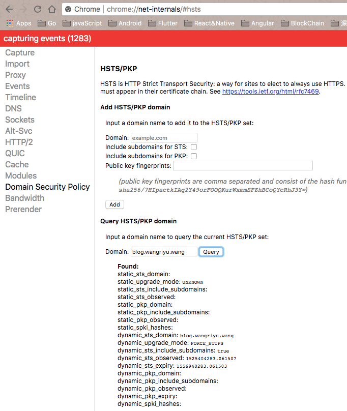
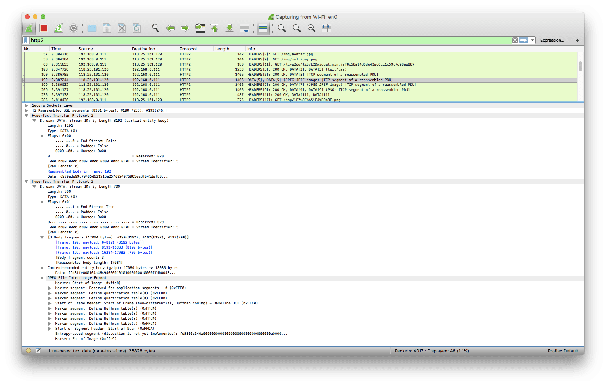
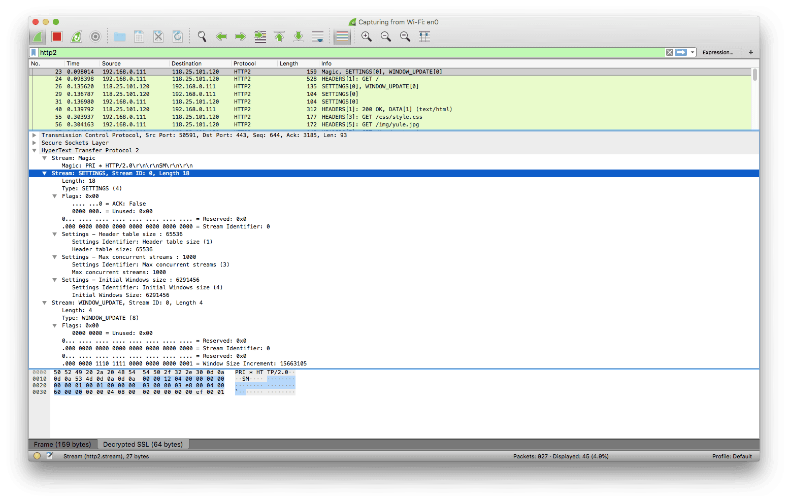

# HTTP/2

[Wiki](https://zh.wikipedia.org/wiki/HTTP/2)

[RFC7540](https://httpwg.org/specs/rfc7540.html)

## Why use it ?

### HTTP/1.1 存在的问题:

1、**TCP 连接数限制**

对于同一个域名，浏览器最多只能同时创建 6~8 个 TCP 连接(不同浏览器不一样)。为了解决数量限制，出现了`域名分片`技术，其实就是资源分域，将资源放在不同域名下(比如二级子域名下)，这样就可以针对不同域名创建连接并请求，以一种讨巧的方式突破限制，但是滥用此技术也会造成很多问题，比如每个 TCP 连接本身需要经过 DNS 查询、三步握手、慢启动等，还占用额外的 CPU 和内存，对于服务器来说过多连接也容易造成网络拥挤、交通阻塞等，对于移动端来说问题更明显，可以参考这篇文章: [Why Domain Sharding is Bad News for Mobile Performance and Users](http://dev.mobify.com/blog/domain-sharding-bad-news-mobile-performance/)

2、**[线头阻塞(Head Of Line Blocking)](https://zh.wikipedia.org/wiki/%E9%98%9F%E5%A4%B4%E9%98%BB%E5%A1%9E)问题**

每个 TCP 连接同时只能处理一个请求-响应，浏览器按 FIFO 原则处理请求，如果上一个响应没返回，后续请求-响应都会受阻。为了解决此问题，出现了[管线化 - pipelining](https://zh.wikipedia.org/wiki/HTTP%E7%AE%A1%E7%B7%9A%E5%8C%96)技术，但是管线化存在诸多问题，比如第一个响应慢还是会阻塞后续响应、服务器为了按序返回相应需要缓存多个响应占用更多资源、浏览器中途断连重试服务器可能得重新处理多个请求、还有必须客户端-代理-服务器都支持管线化

3、Header 内容多，而且每次请求 Header 不会变化太多，没有相应的压缩传输优化方案

4、为了尽可能减少请求数，需要做合并文件、雪碧图、资源内联等优化工作，但是这无疑造成了单个请求内容变大延迟变高的问题，且内嵌的资源不能有效地缓存

5、明文传输不安全

### HTTP2 的优势:

#### 1、二进制分帧层(Binary Framing Layer)

帧是数据传输的最小单位，以二进制传输代替原本的明文传输，原本的报文消息被划分为更小的数据帧:


h1 和 h2 的报文对比:


图中 h2 的报文是重组解析过后的，可以发现一些头字段发生了变化，而且所有头字段均小写

> `strict-transport-security: max-age=63072000; includeSubdomains` 字段是服务器开启 [HSTS 策略](https://zh.wikipedia.org/wiki/HTTP%E4%B8%A5%E6%A0%BC%E4%BC%A0%E8%BE%93%E5%AE%89%E5%85%A8)，让浏览器强制使用 HTTPS 进行通信，可以减少重定向造成的额外请求和会话劫持的风险

> 服务器开启 HSTS 的方法是: 以 nginx 为例，在相应站点的 server 模块中添加 `add_header Strict-Transport-Security "max-age=63072000; includeSubdomains" always;`即可

> 在 Chrome 中可以打开 `chrome://net-internals/#hsts` 进入浏览器的 HSTS 管理界面，可以增加/删除/查询 HSTS 记录，比如下图:

> 

> 在 HSTS 有效期内且 TLS 证书仍有效，浏览器访问 blog.wangriyu.wang 会自动加上 https:// ，而不需要做一次查询重定向到 https

关于帧详见: [How does it work ？- 帧](#帧---frame)

#### 2、多路复用(MultiPlexing)

在一个 TCP 连接上，我们可以向对方不断发送帧，每帧的 stream identifier 的标明这一帧属于哪个流，然后在对方接收时，根据 stream identifier 拼接每个流的所有帧组成一整块数据。
把 HTTP/1.1 每个请求都当作一个流，那么多个请求变成多个流，请求响应数据分成多个帧，不同流中的帧交错地发送给对方，这就是 HTTP/2 中的多路复用。

流的概念实现了单连接上多请求-响应并行，解决了线头阻塞的问题，减少了 TCP 连接数量和 TCP 连接慢启动造成的问题

关于流详见: [How does it work ？- 流](#流---stream)

#### 3、服务端推送(Server Push)

https://httpwg.org/specs/rfc7540.html#PushResources

浏览器发送一个请求，返回多个相关资源的响应；

#### 4、Header 压缩(HPACK)

使用 [HPACK](https://www.rfc-editor.org/rfc/rfc7541.txt) 算法来压缩首部内容；

#### 5、应用层的重置连接

对于 HTTP/1 来说，是通过设置 tcp segment 里的 reset flag 来通知对端关闭连接的。这种方式会直接断开连接，下次再发请求就必须重新建立连接。HTTP/2 引入 RST_STREAM 类型的 frame，可以在不断开连接的前提下取消某个 request 的 stream，表现更好。

#### 6、请求优先级和请求依赖设置

一个 request 对应一个 stream 并分配一个 id，这样一个连接上可以有多个 stream，每个 stream 的 frame 可以随机的混杂在一起，接收方可以根据 stream id 将 frame 再归属到各自不同的 request 里面，所以 HTTP/2 里的每个 stream 都可以设置优先级（Priority）和依赖（Dependency），真正解决了关键请求被阻塞的问题

7、HTTP/1 的几种优化可以弃用: 合并文件、内联资源、雪碧图、域名分片

#### 7、流量控制

每个 http2 流都拥有自己的公示的流量窗口，它可以限制另一端发送数据。如果你正好知道 SSH 的工作原理的话，这两者非常相似。对于每个流来说，两端都必须告诉对方自己还有足够的空间来处理新的数据，而在该窗口被扩大前，另一端只被允许发送这么多数据。只有 DATA 帧会受到流量控制影响

## How does it work ?

### 帧 - Frame

#### 帧的结构

所有帧都是一个固定的 9 字节头部(payload 之前)跟一个指定长度的负载(payload):

```
+-----------------------------------------------+
|                 Length (24)                   |
+---------------+---------------+---------------+
|   Type (8)    |   Flags (8)   |
+-+-------------+---------------+-------------------------------+
|R|                 Stream Identifier (31)                      |
+=+=============================================================+
|                   Frame Payload (0...)                      ...
+---------------------------------------------------------------+
```

- `Length` 代表整个 frame 的长度，用一个 24 位无符号整数表示。除非接收者在 SETTINGS_MAX_FRAME_SIZE 设置了更大的值(大小可以是 2^14(16384) 字节到 2^24-1(16777215) 字节之间的任意值)，否则数据长度不应超过 2^14(16384) 字节。头部的 9 字节不算在这个长度里
- `Type` 定义 frame 的类型，用 8 bits 表示。帧类型决定了帧主体的格式和语义，如果 type 为 unknown 应该忽略或抛弃。
- `Flags` 是为帧类型相关而预留的布尔标识。标识对于不同的帧类型赋予了不同的语义。如果该标识对于某种帧类型没有定义语义，则它必须被忽略且发送的时候应该赋值为(0x0)
- `R` 是一个保留的比特位。这个比特的语义没有定义，发送时它必须被设置为(0x0), 接收时需要忽略。
- [Stream Identifier](https://httpwg.org/specs/rfc7540.html#StreamIdentifiers) 用作流控制，用 31 位无符号整数表示。客户端建立的 sid 必须为奇数，服务端建立的 sid 必须为偶数，值(0x0)保留给与整个连接相关联的帧(连接控制消息)，而不是单个流
- `Frame Payload` 是主体内容，由帧类型决定

共分为十种类型的帧:

- `HEADERS`: 报头帧(type=0x1)，用来打开一个流或者携带一个首部块片段
- `DATA`: 数据帧(type=0x0)，装填主体信息，可以用一个或多个 DATA 帧来返回一个请求的响应主体
- `PRIORITY`: 优先级帧(type=0x2)，指定发送者建议的流优先级，可以在任何流状态下发送 PRIORITY 帧，包括空闲(idle)和关闭(closed)的流
- `RST_STREAM`: 流终止帧(type=0x3)，用来请求取消一个流，或者表示发生了一个错误，payload 带有一个 32 为无符号整数的错误码([Error Codes](https://httpwg.org/specs/rfc7540.html#ErrorCodes))，不能在处于空闲(idle)状态的流上发送 RST_STREAM 帧
- `SETTINGS`: 设置帧(type=0x4)，设置此`连接`的参数，作用于整个连接
- `PUSH_PROMISE`: 推送帧(type=0x5)，服务端推送，客户端可以返回一个 RST_STREAM 帧来选择拒绝推送的流
- `PING`: PING 帧(type=0x6)，判断一个空闲的连接是否仍然可用，也可以测量最小往返时间(RTT)
- `GOAWAY`: GOWAY 帧(type=0x7)，用于发起关闭连接的请求，或者警示严重错误。GOAWAY 会停止接收新流，并且关闭连接前会处理完先前建立的流
- `WINDOW_UPDATE`: 窗口更新帧(type=0x8)，用于执行流量控制功能，可以作用在单独某个流上(指定具体 Stream Identifier)也可以作用整个连接(Stream Identifier 为 0x0)，只有 DATA 帧受流量控制影响。初始化流量窗口后，发送多少负载，流量窗口就减少多少，如果流量窗口不足就无法发送，WINDOW_UPDATE 帧可以增加指定长度
- `CONTINUATION`: 延续帧(type=0x9)，用于继续传送首部块片段序列，见[首部的压缩与解压缩](#首部的压缩与解压缩)

#### DATA 帧格式

```
 +---------------+
 |Pad Length? (8)|
 +---------------+-----------------------------------------------+
 |                            Data (*)                         ...
 +---------------------------------------------------------------+
 |                           Padding (*)                       ...
 +---------------------------------------------------------------+
```

- `Pad Length`: ? 表示此字段的出现时有条件的，需要设置相应标识(set flag)，指定 Padding 长度，存在则代表 PADDING flag 被设置
- `Data`: 传递的数据，其长度上限等于帧的 payload 长度减去其他出现的字段长度
- `Padding`: 填充字节，没有具体语义，发送时必须设为 0，作用是混淆报文长度，与 TLS 中 CBC 块加密类似，详见 https://httpwg.org/specs/rfc7540.html#padding

DATA 帧有如下标识(flags):

- END_STREAM: bit 0 设为 1 代表当前流的最后一帧
- PADDED: bit 3 设为 1 代表存在 Padding

例子:




#### HEADERS 帧格式

```
 +---------------+
 |Pad Length? (8)|
 +-+-------------+-----------------------------------------------+
 |E|                 Stream Dependency? (31)                     |
 +-+-------------+-----------------------------------------------+
 |  Weight? (8)  |
 +-+-------------+-----------------------------------------------+
 |                   Header Block Fragment (*)                 ...
 +---------------------------------------------------------------+
 |                           Padding (*)                       ...
 +---------------------------------------------------------------+
```

- `Pad Length`: 指定 Padding 长度，存在则代表 PADDING flag 被设置
- `E`: 一个比特位声明流的依赖性是否是排他的，存在则代表 PRIORITY flag 被设置
- `Stream Dependency`: 指定一个 stream identifier，代表当前流所依赖的流的 id，存在则代表 PRIORITY flag 被设置
- `Weight`: 一个无符号 8 为整数，代表当前流的优先级权重值(1~256)，存在则代表 PRIORITY flag 被设置
- `Header Block Fragment`: header 块片段
- `Padding`: 填充字节，没有具体语义，作用与 DATA 的 Padding 一样，存在则代表 PADDING flag 被设置

HEADERS 帧有以下标识(flags):

- END_STREAM: bit 0 设为 1 代表当前 header 块是发送的最后一块，但是带有 END_STREAM 标识的 HEADERS 帧后面还可以跟 CONTINUATION 帧(这里可以把 CONTINUATION 看作 HEADERS 的一部分)
- END_HEADERS: bit 2 设为 1 代表 header 块结束
- PADDED: bit 3 设为 1 代表 Pad 被设置，存在 Pad Length 和 Padding
- PRIORITY: bit 5 设为 1 表示存在 Exclusive Flag (E), Stream Dependency, 和 Weight

例子:


#### 首部的压缩与解压缩

HTTP/2 里的首部字段也是一个键具有一个或多个值。这些首部字段用于 HTTP 请求和响应消息，也用于服务端推送操作。

首部列表是零个或多个首部字段的集合。当通过连接传送时，首部列表被`HTTP header compression`序列化成首部块。然后，序列化的首部块又被划分成一个或多个叫做首部块片段(Header Block Fragment)的字节序列，并通过 HEADERS、PUSH_PROMISE，或者 CONTINUATION 帧进行有效负载传送。

> Cookie 首部字段需要 HTTP 映射特殊对待，见[8.1.2.5. Compressing the Cookie Header Field](https://httpwg.org/specs/rfc7540.html#CompressCookie)

一个完整的 header 块有两种可能，(1)一个 HEADERS 帧或 PUSH_PROMISE 帧加上设置 END_HEADERS flag，(2)一个未设置 END_HEADERS flag 的 HEADERS 帧或 PUSH_PROMISE 帧加上多个 CONTINUATION 帧，其中最后一个 CONTINUATION 帧设置 END_HEADERS flag

必须将首部块作为连续的帧序列传送，不能插入任何其他类型或其他流的帧。尾帧设置 END_HEADERS 标识代表首部块结束，这让首部块在逻辑上等价于一个单独的帧。接收端连接片段重组首部块，然后解压首部块重建首部列表。


#### SETTINGS 帧格式

https://httpwg.org/specs/rfc7540.html#SETTINGS

一个 SETTINGS 帧的 payload 由零个或多个参数组成，每个参数的形式如下:

```
 +-------------------------------+
 |       Identifier (16)         |
 +-------------------------------+-------------------------------+
 |                        Value (32)                             |
 +---------------------------------------------------------------+
```

- `Identifier`: 代表参数类型，比如 SETTINGS_HEADER_TABLE_SIZE 是 0x1
- `Value`: 相应参数的值

在建立连接开始时双方都要发送 SETTINGS 帧以表明自己期许对方应做的配置，对方接收后同意配置参数便返回带有 ACK 标识的空 SETTINGS 帧表示确认，而且连接后任意时刻任意一方也都可能再发送 SETTINGS 帧调整，SETTINGS 帧中的参数会被最新接收到的参数覆盖

SETTINGS 帧作用于整个连接，而不是某个流，而且 SETTINGS 帧的 stream identifier 必须是 0x0，否则接收方会认为错误(PROTOCOL_ERROR)。

SETTINGS 帧包含以下参数:

- SETTINGS_HEADER_TABLE_SIZE (0x1): 用于解析 Header block 的 Header 压缩表的大小，初始值是 4096 字节
- SETTINGS_ENABLE_PUSH (0x2): 可以关闭 Server Push，该值初始为 1，表示允许服务端推送功能
- SETTINGS_MAX_CONCURRENT_STREAMS (0x3): 代表发送端允许接收端创建的最大流数目
- SETTINGS_INITIAL_WINDOW_SIZE (0x4): 指明发送端流的流量控制窗口的初始大小，会影响所有流，该初始值是 2^16 - 1(65535) 字节，如果该值大于流量控制窗口的最大值 2^31 - 1，则会返回 FLOW_CONTROL_ERROR
- SETTINGS_MAX_FRAME_SIZE (0x5): 指明发送端允许接收的最大帧负载的字节数，初始值是 2^14(16384) 字节，如果该值不在初始值(2^14)和最大值(2^24 - 1)之间，返回 PROTOCOL_ERROR
- SETTINGS_MAX_HEADER_LIST_SIZE (0x6): 通知对端，发送端准备接收的首部列表大小的最大字节数。该值是基于未压缩的首部域大小，包括名称和值的字节长度，外加每个首部域的32字节的开销

SETTINGS 帧有以下标识(flags):

- ACK: bit 0 设为 1 代表已接收到对方的 SETTINGS 请求并同意设置，设置此标志的 SETTINGS 帧 payload 必须为空

例子:



实际抓包会发现 HTTP2 请求创建连接发送 SETTINGS 帧初始化前还有一个 Magic 帧(建立 HTTP/2 请求的前言)。

在 HTTP/2 中，要求两端都要发送一个连接前言，作为对所使用协议的最终确认，并确定 HTTP/2 连接的初始设置，客户端和服务端各自发送不同的连接前言。

客户端的前言内容(对应上图中编号 23 的帧)包含一个内容为 `PRI * HTTP/2.0\r\n\r\nSM\r\n\r\n` 的序列加上一个可以为空的 SETTINGS 帧，在收到 101(Switching Protocols) 响应(代表 upgrade 成功)后发送，或者作为 TLS 连接的第一个传输的应用数据。如果在预先知道服务端支持 HTTP/2 的情况下启用 HTTP/2 连接，客户端连接前言在连接建立时发送。

服务端的前言(对应上图中编号 26 的帧)包含一个可以为空的 SETTINGS 帧，在建立 HTTP/2 连接后作为第一帧发送。详见[HTTP/2 Connection Preface](https://httpwg.org/specs/rfc7540.html#ConnectionHeader)

发送完前言后双方都得向对方发送带有 ACK 标识的 SETTINGS 帧表示确认，对应上图中编号 29 和 31 的帧。

请求站点的全部帧序列，帧后面的数字代表所属流的 id，最后以 GOAWAY 帧关闭连接:


GOAWAY 帧带有最大的那个流标识符(比如图中第 29 帧是最大流)，对于发送方来说会继续处理完不大于此数字的流，然后再真正关闭连接

### 流 - Stream

流只是一个逻辑上的概念，代表 HTTP/2 连接中在客户端和服务器之间交换的独立双向帧序列，每个帧的 Stream Identifier 字段指明了它属于哪个流。

流有以下特性:

- 单个 h2 连接可以包含多个并发的流，两端之间可以交叉发送不同流的帧
- 流可以由客户端或服务器来单方面地建立和使用，或者共享
- 流可以由任一方关闭
- 帧在流上发送的顺序非常重要，最后接收方会把相同 Stream Identifier (同一个流)的帧重新组装成完整消息报文

#### 流的状态


##### idle

所有流以“空闲”状态开始。在这种状态下，没有任何帧的交换

* 发送或者接收一个 HEADERS 帧会使空闲流变成“打开”状态，其中 HEADERS 帧的 Stream Identifier 字段指明了流 id
* 服务端必须在一个打开 `open` 或者半关闭(远端) `half-closed(remote)` 状态的流(由客户端发起的)上发送 PUSH_PROMISE 帧，其中 PUSH_PROMISE 帧的 Promised Stream ID 字段指定了一个预保留的新流(由服务端发起)，
* 在服务端该新流会由空闲 `idle` 状态进入被保留的(本地) `reserved(local)` 状态
* 在客户端该新流会由空闲 `idle` 状态进入被保留的(远端) `reserved (remote)` 状态

PUSH_PROMISE 帧准备推送的响应总是和来自于客户端的请求相关联。服务端在该请求所在的流上发送 PUSH_PROMISE 帧。PUSH_PROMISE 帧包含一个 Promised Stream ID，该流标识符是从服务端可用的流标识符里选出来的

如果服务端收到了一个对文档的请求，该文档包含内嵌的指向多个图片文件的链接，且服务端选择向客户端推送那些额外的图片，那么在发送包含图片链接的 DATA 帧之前发送 PUSH_PROMISE 帧可以确保客户端在发现内嵌的链接之前，能够知道有一个资源将要被推送过来。同样地，如果服务端推送被首部块引用的响应(比如，在 [Link 首部字段](https://www.w3.org/wiki/LinkHeader)里的)，在发送首部块之前发送一个 PUSH_PROMISE 帧，可以确保客户端不再请求那些资源

在 [8.2](https://httpwg.org/specs/rfc7540.html#PushResources) 中详细介绍了 PUSH_PROMISE 帧的使用情形

PUSH_PROMISE 流的响应以 HEADERS 帧开始，这会立即将流在服务端置于半关闭(远端) `half-closed(remote)` 状态，在客户端置于半关闭(本地) `half-closed(local)` 状态，最后以携带 END_STREAM 的帧结束，这会将流置于关闭 `closed` 状态


### HTTP/2 的协议协商机制

客户端使用 HTTP 升级机制来向

```
 GET / HTTP/1.1
 Host: server.example.com
 Connection: Upgrade, HTTP2-Settings
 Upgrade: h2c
 HTTP2-Settings: <base64url encoding of HTTP/2 SETTINGS payload>
```

服务器如果支持 http/2，则升级协议，否则忽略 h2 字段

```
HTTP/1.1 101 Switching Protocols
Connection: Upgrade
Upgrade: h2c

```

## What then ?

### HTTP/2 演示

https://http2.akamai.com/demo

https://http2.golang.org/

### 使用 HTTP/2 建议

http://zcfy.baomitu.com/article/7-tips-for-faster-http-2-performance-nginx-24.html

https://aotu.io/notes/2016/06/14/http2/index.html

nginx 开启 HTTP2 只需在相应的 HTTPS 设置后加上 `http2` 即可

```
listen [::]:443 ssl http2 ipv6only=on;
listen 443 ssl http2;
```

### SPDY 与 HTTP2 的关系

[SPDY](https://zh.wikipedia.org/wiki/SPDY) 是 HTTP2 的前身，大部分特性与 HTTP2 保持一致，包括服务器端推送，多路复用和帧作为传输的最小单位。但 SPDY 与 HTTP2 也有一些实现上的不同，比如 SPDY 的头部压缩使用的是 DEFLATE 算法，而 HTTP2 使用的是 HPACK 算法，压缩率更高。

### QUIC 协议

Google 的 [QUIC(Quick UDP Internet Connections)](https://zh.wikipedia.org/wiki/%E5%BF%AB%E9%80%9FUDP%E7%BD%91%E7%BB%9C%E8%BF%9E%E6%8E%A5)协议，继承了 SPDY 的特点。QUIC 是一个 UDP 版的 TCP + TLS + HTTP/2 替代实现。

QUIC 可以创建更低延迟的连接，并且也像 HTTP/2 一样，通过仅仅阻塞部分流解决了包裹丢失这个问题，让连接在不同网络上建立变得更简单 － 这其实正是 [MPTCP](https://en.wikipedia.org/wiki/Multipath_TCP) 想去解决的问题。

QUIC 现在还只有 Google 的 Chrome 和它后台服务器上的实现，虽然有第三方库 libquic，但这些代码仍然很难在其他地方被复用。该协议也被 IETF 通信工作组引入了草案。

[Caddy](https://github.com/mholt/caddy): 基于 Go 语言开发的 Web Server， 对 HTTP/2 和 HTTPS 有着良好的支持，也开始支持 QUIC 协议(试验性)

### 推荐工具

- Chrome 插件: [HTTP/2 and SPDY indicator](https://chrome.google.com/webstore/detail/http2-and-spdy-indicator/mpbpobfflnpcgagjijhmgnchggcjblin)

如果你访问的站点开启了 HTTP/2，图标会亮起，而且点击会进入 chrome 内置的 HTTP/2 监视工具

- 命令行工具: [nghttp2](https://github.com/nghttp2/nghttp2)

C 语言实现的 HTTP/2，可以用它调试 HTTP/2 请求

直接 `brew install nghttp2` 就可以安装，安装好后输入 `nghttp -nv https://nghttp2.org` 就可以查看 h2 请求


- 还可以用 wireshark 解 h2 的包，不过得设置浏览器提供的对称协商密钥或者服务器提供的私钥，具体方法看此文: [使用 Wireshark 调试 HTTP/2 流量](https://imququ.com/post/http2-traffic-in-wireshark.html)

但是我试过之后发现偶尔能读到 h2 的包，大部分时候都读不到，不知道哪里出错 _(:з」∠)_

## References

- [HTTP2 is here, let's optimize!](https://docs.google.com/presentation/d/1r7QXGYOLCh4fcUq0jDdDwKJWNqWK1o4xMtYpKZCJYjM/present?slide=id.p19)
- [HTTP/2 与 WEB 性能优化 - JerryQu](https://imququ.com/post/http2-and-wpo-2.html)
