# HTTP/2

维基百科关于 HTTP/2 的介绍，可以看下定义和发展历史:

[Wiki](https://zh.wikipedia.org/wiki/HTTP/2)

RFC 7540 定义了 HTTP/2 的协议规范和细节，本文的细节主要来自此文档，建议先看一遍本文，再回过头来照着协议大致过一遍 RFC，如果想深入某些细节再仔细翻看 RFC

[RFC7540](https://httpwg.org/specs/rfc7540.html)

## Why use it ?

### HTTP/1.1 存在的问题:

1、**TCP 连接数限制**

对于同一个域名，浏览器最多只能同时创建 6~8 个 TCP 连接 (不同浏览器不一样)。为了解决数量限制，出现了 ` 域名分片 ` 技术，其实就是资源分域，将资源放在不同域名下 (比如二级子域名下)，这样就可以针对不同域名创建连接并请求，以一种讨巧的方式突破限制，但是滥用此技术也会造成很多问题，比如每个 TCP 连接本身需要经过 DNS 查询、三步握手、慢启动等，还占用额外的 CPU 和内存，对于服务器来说过多连接也容易造成网络拥挤、交通阻塞等，对于移动端来说问题更明显，可以参考这篇文章: [Why Domain Sharding is Bad News for Mobile Performance and Users](http://dev.mobify.com/blog/domain-sharding-bad-news-mobile-performance/)

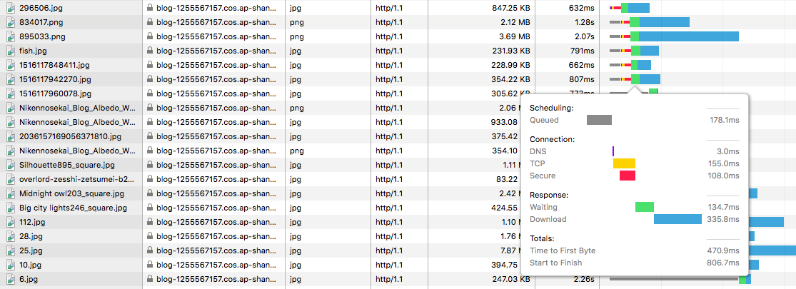


在图中可以看到新建了六个 TCP 连接，每次新建连接 DNS 解析需要时间(几 ms 到几百 ms 不等)、TCP 慢启动也需要时间、TLS 握手又要时间，而且后续请求都要等待队列调度

2、**[线头阻塞 (Head Of Line Blocking)](https://zh.wikipedia.org/wiki/%E9%98%9F%E5%A4%B4%E9%98%BB%E5%A1%9E) 问题**

每个 TCP 连接同时只能处理一个请求 - 响应，浏览器按 FIFO 原则处理请求，如果上一个响应没返回，后续请求 - 响应都会受阻。为了解决此问题，出现了 [管线化 - pipelining](https://zh.wikipedia.org/wiki/HTTP%E7%AE%A1%E7%B7%9A%E5%8C%96) 技术，但是管线化存在诸多问题，比如第一个响应慢还是会阻塞后续响应、服务器为了按序返回相应需要缓存多个响应占用更多资源、浏览器中途断连重试服务器可能得重新处理多个请求、还有必须客户端 - 代理 - 服务器都支持管线化

3、Header 内容多，而且每次请求 Header 不会变化太多，没有相应的压缩传输优化方案

4、为了尽可能减少请求数，需要做合并文件、雪碧图、资源内联等优化工作，但是这无疑造成了单个请求内容变大延迟变高的问题，且内嵌的资源不能有效地使用缓存机制

5、明文传输不安全

### HTTP2 的优势:

#### 1、二进制分帧层 (Binary Framing Layer)

帧是数据传输的最小单位，以二进制传输代替原本的明文传输，原本的报文消息被划分为更小的数据帧:


h1 和 h2 的报文对比:


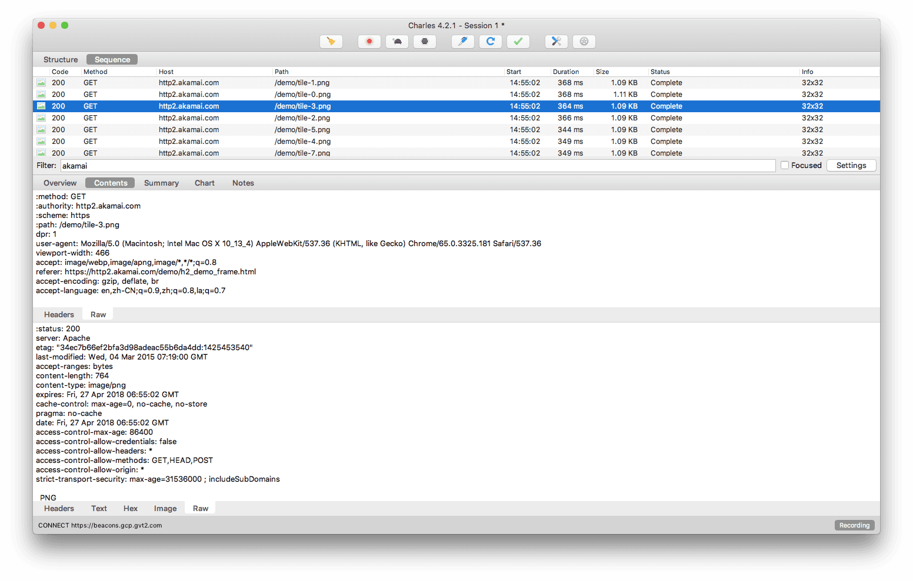

图中 h2 的报文是重组解析过后的，可以发现一些头字段发生了变化，而且所有头字段均小写

> `strict-transport-security: max-age=63072000; includeSubdomains` 字段是服务器开启 [HSTS 策略](https://zh.wikipedia.org/wiki/HTTP%E4%B8%A5%E6%A0%BC%E4%BC%A0%E8%BE%93%E5%AE%89%E5%85%A8)，让浏览器强制使用 HTTPS 进行通信，可以减少重定向造成的额外请求和会话劫持的风险

> 服务器开启 HSTS 的方法是: 以 nginx 为例，在相应站点的 server 模块中添加 `add_header Strict-Transport-Security "max-age=63072000; includeSubdomains" always;` 即可

> 在 Chrome 中可以打开 `chrome://net-internals/#hsts` 进入浏览器的 HSTS 管理界面，可以增加 / 删除 / 查询 HSTS 记录，比如下图:

> 

> 在 HSTS 有效期内且 TLS 证书仍有效，浏览器访问 blog.wangriyu.wang 会自动加上 https:// ，而不需要做一次查询重定向到 https

关于帧详见: [How does it work ？- 帧](#帧---frame)

#### 2、多路复用 (MultiPlexing)

在一个 TCP 连接上，我们可以向对方不断发送帧，每帧的 stream identifier 的标明这一帧属于哪个流，然后在对方接收时，根据 stream identifier 拼接每个流的所有帧组成一整块数据。
把 HTTP/1.1 每个请求都当作一个流，那么多个请求变成多个流，请求响应数据分成多个帧，不同流中的帧交错地发送给对方，这就是 HTTP/2 中的多路复用。

流的概念实现了单连接上多请求 - 响应并行，解决了线头阻塞的问题，减少了 TCP 连接数量和 TCP 连接慢启动造成的问题

关于流详见: [How does it work ？- 流](#流---stream)

#### 3、服务端推送 (Server Push)

浏览器发送一个请求，服务器主动向浏览器推送与这个请求相关的资源，这样浏览器就不用发起后续请求。

Server-Push 主要是针对资源内联做出的优化，相较于 http/1.1 资源内联的优势:

- 客户端可以缓存推送的资源
- 客户端可以拒收推送过来的资源
- 推送资源可以由不同页面共享
- 服务器可以按照优先级推送资源

关于服务端推送详见: [How does it work ？- Server-Push](#server-push)

#### 4、Header 压缩 (HPACK)

使用 [HPACK](https://httpwg.org/specs/rfc7541.html) 算法来压缩首部内容

关于 HPACK 详见: [How does it work ？- HPACK](#hpack)

#### 5、应用层的重置连接

对于 HTTP/1 来说，是通过设置 tcp segment 里的 reset flag 来通知对端关闭连接的。这种方式会直接断开连接，下次再发请求就必须重新建立连接。HTTP/2 引入 RST_STREAM 类型的 frame，可以在不断开连接的前提下取消某个 request 的 stream，表现更好。

#### 6、请求优先级和请求依赖设置

一个 request 对应一个 stream 并分配一个 id，这样一个连接上可以有多个 stream，每个 stream 的 frame 可以随机的混杂在一起，接收方可以根据 stream id 将 frame 归属到各自不同的 request 里面，所以 HTTP/2 里的每个 stream 都可以设置优先级（Priority）和依赖（Dependency），解决了关键请求被阻塞的问题

#### 7、流量控制

每个 http2 流都拥有自己的公示的流量窗口，它可以限制另一端发送数据。对于每个流来说，两端都必须告诉对方自己还有足够的空间来处理新的数据，而在该窗口被扩大前，另一端只被允许发送这么多数据。

关于流量控制详见: [How does it work ？- 流量控制](#流量控制)

#### 8、HTTP/1 的几种优化可以弃用

合并文件、内联资源、雪碧图、域名分片对于 HTTP/2 来说是不必要的，使用 h2 尽可能将资源细粒化，文件分解地尽可能散，不用担心请求数多

## How does it work ?

### 帧 - Frame

#### 帧的结构

所有帧都是一个固定的 9 字节头部 (payload 之前) 跟一个指定长度的负载 (payload):

```
+-----------------------------------------------+
|                 Length (24)                   |
+---------------+---------------+---------------+
|   Type (8)    |   Flags (8)   |
+-+-------------+---------------+-------------------------------+
|R|                 Stream Identifier (31)                      |
+=+=============================================================+
|                   Frame Payload (0...)                      ...
+---------------------------------------------------------------+
```

- `Length` 代表整个 frame 的长度，用一个 24 位无符号整数表示。除非接收者在 SETTINGS_MAX_FRAME_SIZE 设置了更大的值 (大小可以是 2^14(16384) 字节到 2^24-1(16777215) 字节之间的任意值)，否则数据长度不应超过 2^14(16384) 字节。头部的 9 字节不算在这个长度里
- `Type` 定义 frame 的类型，用 8 bits 表示。帧类型决定了帧主体的格式和语义，如果 type 为 unknown 应该忽略或抛弃。
- `Flags` 是为帧类型相关而预留的布尔标识。标识对于不同的帧类型赋予了不同的语义。如果该标识对于某种帧类型没有定义语义，则它必须被忽略且发送的时候应该赋值为 (0x0)
- `R` 是一个保留的比特位。这个比特的语义没有定义，发送时它必须被设置为 (0x0), 接收时需要忽略。
- [Stream Identifier](https://httpwg.org/specs/rfc7540.html#StreamIdentifiers) 用作流控制，用 31 位无符号整数表示。客户端建立的 sid 必须为奇数，服务端建立的 sid 必须为偶数，值 (0x0) 保留给与整个连接相关联的帧 (连接控制消息)，而不是单个流
- `Frame Payload` 是主体内容，由帧类型决定

共分为十种类型的帧:

- `HEADERS`: 报头帧 (type=0x1)，用来打开一个流或者携带一个首部块片段
- `DATA`: 数据帧 (type=0x0)，装填主体信息，可以用一个或多个 DATA 帧来返回一个请求的响应主体
- `PRIORITY`: 优先级帧 (type=0x2)，指定发送者建议的流优先级，可以在任何流状态下发送 PRIORITY 帧，包括空闲 (idle) 和关闭 (closed) 的流
- `RST_STREAM`: 流终止帧 (type=0x3)，用来请求取消一个流，或者表示发生了一个错误，payload 带有一个 32 位无符号整数的错误码 ([Error Codes](https://httpwg.org/specs/rfc7540.html#ErrorCodes))，不能在处于空闲 (idle) 状态的流上发送 RST_STREAM 帧
- `SETTINGS`: 设置帧 (type=0x4)，设置此 ` 连接 ` 的参数，作用于整个连接
- `PUSH_PROMISE`: 推送帧 (type=0x5)，服务端推送，客户端可以返回一个 RST_STREAM 帧来选择拒绝推送的流
- `PING`: PING 帧 (type=0x6)，判断一个空闲的连接是否仍然可用，也可以测量最小往返时间 (RTT)
- `GOAWAY`: GOWAY 帧 (type=0x7)，用于发起关闭连接的请求，或者警示严重错误。GOAWAY 会停止接收新流，并且关闭连接前会处理完先前建立的流
- `WINDOW_UPDATE`: 窗口更新帧 (type=0x8)，用于执行流量控制功能，可以作用在单独某个流上 (指定具体 Stream Identifier) 也可以作用整个连接 (Stream Identifier 为 0x0)，只有 DATA 帧受流量控制影响。初始化流量窗口后，发送多少负载，流量窗口就减少多少，如果流量窗口不足就无法发送，WINDOW_UPDATE 帧可以增加流量窗口大小
- `CONTINUATION`: 延续帧 (type=0x9)，用于继续传送首部块片段序列，见 [首部的压缩与解压缩](#首部的压缩与解压缩)

#### DATA 帧格式

```
 +---------------+
 |Pad Length? (8)|
 +---------------+-----------------------------------------------+
 |                            Data (*)                         ...
 +---------------------------------------------------------------+
 |                           Padding (*)                       ...
 +---------------------------------------------------------------+
```

- `Pad Length`: ? 表示此字段的出现时有条件的，需要设置相应标识 (set flag)，指定 Padding 长度，存在则代表 PADDING flag 被设置
- `Data`: 传递的数据，其长度上限等于帧的 payload 长度减去其他出现的字段长度
- `Padding`: 填充字节，没有具体语义，发送时必须设为 0，作用是混淆报文长度，与 TLS 中 CBC 块加密类似，详见 https://httpwg.org/specs/rfc7540.html#padding

DATA 帧有如下标识 (flags):

- END_STREAM: bit 0 设为 1 代表当前流的最后一帧
- PADDED: bit 3 设为 1 代表存在 Padding

例子:


#### HEADERS 帧格式

```
 +---------------+
 |Pad Length? (8)|
 +-+-------------+-----------------------------------------------+
 |E|                 Stream Dependency? (31)                     |
 +-+-------------+-----------------------------------------------+
 |  Weight? (8)  |
 +-+-------------+-----------------------------------------------+
 |                   Header Block Fragment (*)                 ...
 +---------------------------------------------------------------+
 |                           Padding (*)                       ...
 +---------------------------------------------------------------+
```

- `Pad Length`: 指定 Padding 长度，存在则代表 PADDING flag 被设置
- `E`: 一个比特位声明流的依赖性是否是排他的，存在则代表 PRIORITY flag 被设置
- `Stream Dependency`: 指定一个 stream identifier，代表当前流所依赖的流的 id，存在则代表 PRIORITY flag 被设置
- `Weight`: 一个无符号 8 为整数，代表当前流的优先级权重值 (1~256)，存在则代表 PRIORITY flag 被设置
- `Header Block Fragment`: header 块片段
- `Padding`: 填充字节，没有具体语义，作用与 DATA 的 Padding 一样，存在则代表 PADDING flag 被设置

HEADERS 帧有以下标识 (flags):

- END_STREAM: bit 0 设为 1 代表当前 header 块是发送的最后一块，但是带有 END_STREAM 标识的 HEADERS 帧后面还可以跟 CONTINUATION 帧 (这里可以把 CONTINUATION 看作 HEADERS 的一部分)
- END_HEADERS: bit 2 设为 1 代表 header 块结束
- PADDED: bit 3 设为 1 代表 Pad 被设置，存在 Pad Length 和 Padding
- PRIORITY: bit 5 设为 1 表示存在 Exclusive Flag (E), Stream Dependency, 和 Weight

例子:


#### 首部的压缩与解压缩

HTTP/2 里的首部字段也是一个键具有一个或多个值。这些首部字段用于 HTTP 请求和响应消息，也用于服务端推送操作。

首部列表是零个或多个首部字段的集合。当通过连接传送时，首部列表被 `HTTP header compression` 序列化成首部块。然后，序列化的首部块又被划分成一个或多个叫做首部块片段 (Header Block Fragment) 的字节序列，并通过 HEADERS、PUSH_PROMISE，或者 CONTINUATION 帧进行有效负载传送。

> Cookie 首部字段需要 HTTP 映射特殊对待，见 [8.1.2.5. Compressing the Cookie Header Field](https://httpwg.org/specs/rfc7540.html#CompressCookie)

一个完整的 header 块有两种可能，(1) 一个 HEADERS 帧或 PUSH_PROMISE 帧加上设置 END_HEADERS flag，(2) 一个未设置 END_HEADERS flag 的 HEADERS 帧或 PUSH_PROMISE 帧加上多个 CONTINUATION 帧，其中最后一个 CONTINUATION 帧设置 END_HEADERS flag

必须将首部块作为连续的帧序列传送，不能插入任何其他类型或其他流的帧。尾帧设置 END_HEADERS 标识代表首部块结束，这让首部块在逻辑上等价于一个单独的帧。接收端连接片段重组首部块，然后解压首部块重建首部列表。


#### SETTINGS 帧格式

https://httpwg.org/specs/rfc7540.html#SETTINGS

一个 SETTINGS 帧的 payload 由零个或多个参数组成，每个参数的形式如下:

```
 +-------------------------------+
 |       Identifier (16)         |
 +-------------------------------+-------------------------------+
 |                        Value (32)                             |
 +---------------------------------------------------------------+
```

- `Identifier`: 代表参数类型，比如 SETTINGS_HEADER_TABLE_SIZE 是 0x1
- `Value`: 相应参数的值

在建立连接开始时双方都要发送 SETTINGS 帧以表明自己期许对方应做的配置，对方接收后同意配置参数便返回带有 ACK 标识的空 SETTINGS 帧表示确认，而且连接后任意时刻任意一方也都可能再发送 SETTINGS 帧调整，SETTINGS 帧中的参数会被最新接收到的参数覆盖

SETTINGS 帧作用于整个连接，而不是某个流，而且 SETTINGS 帧的 stream identifier 必须是 0x0，否则接收方会认为错误 (PROTOCOL_ERROR)。

SETTINGS 帧包含以下参数:

- SETTINGS_HEADER_TABLE_SIZE (0x1): 用于解析 Header block 的 Header 压缩表的大小，初始值是 4096 字节
- SETTINGS_ENABLE_PUSH (0x2): 可以关闭 Server Push，该值初始为 1，表示允许服务端推送功能
- SETTINGS_MAX_CONCURRENT_STREAMS (0x3): 代表发送端允许接收端创建的最大流数目
- SETTINGS_INITIAL_WINDOW_SIZE (0x4): 指明发送端所有流的流量控制窗口的初始大小，会影响所有流，该初始值是 2^16 - 1(65535) 字节，最大值是 2^31 - 1，如果超出最大值则会返回 FLOW_CONTROL_ERROR
- SETTINGS_MAX_FRAME_SIZE (0x5): 指明发送端允许接收的最大帧负载的字节数，初始值是 2^14(16384) 字节，如果该值不在初始值 (2^14) 和最大值 (2^24 - 1) 之间，返回 PROTOCOL_ERROR
- SETTINGS_MAX_HEADER_LIST_SIZE (0x6): 通知对端，发送端准备接收的首部列表大小的最大字节数。该值是基于未压缩的首部域大小，包括名称和值的字节长度，外加每个首部域的 32 字节的开销

SETTINGS 帧有以下标识 (flags):

- ACK: bit 0 设为 1 代表已接收到对方的 SETTINGS 请求并同意设置，设置此标志的 SETTINGS 帧 payload 必须为空

例子:


实际抓包会发现 HTTP2 请求创建连接发送 SETTINGS 帧初始化前还有一个 Magic 帧 (建立 HTTP/2 请求的前言)。

在 HTTP/2 中，要求两端都要发送一个连接前言，作为对所使用协议的最终确认，并确定 HTTP/2 连接的初始设置，客户端和服务端各自发送不同的连接前言。

客户端的前言内容 (对应上图中编号 23 的帧) 包含一个内容为 `PRI * HTTP/2.0\r\n\r\nSM\r\n\r\n` 的序列加上一个可以为空的 SETTINGS 帧，在收到 101(Switching Protocols) 响应 (代表 upgrade 成功) 后发送，或者作为 TLS 连接的第一个传输的应用数据。如果在预先知道服务端支持 HTTP/2 的情况下启用 HTTP/2 连接，客户端连接前言在连接建立时发送。

服务端的前言 (对应上图中编号 26 的帧) 包含一个可以为空的 SETTINGS 帧，在建立 HTTP/2 连接后作为第一帧发送。详见 [HTTP/2 Connection Preface](https://httpwg.org/specs/rfc7540.html#ConnectionHeader)

发送完前言后双方都得向对方发送带有 ACK 标识的 SETTINGS 帧表示确认，对应上图中编号 29 和 31 的帧。

请求站点的全部帧序列，帧后面的数字代表所属流的 id，最后以 GOAWAY 帧关闭连接:


GOAWAY 帧带有最大的那个流标识符 (比如图中第 29 帧是最大流)，对于发送方来说会继续处理完不大于此数字的流，然后再真正关闭连接

### 流 - Stream

流只是一个逻辑上的概念，代表 HTTP/2 连接中在客户端和服务器之间交换的独立双向帧序列，每个帧的 Stream Identifier 字段指明了它属于哪个流。

流有以下特性:

- 单个 h2 连接可以包含多个并发的流，两端之间可以交叉发送不同流的帧
- 流可以由客户端或服务器来单方面地建立和使用，或者共享
- 流可以由任一方关闭
- 帧在流上发送的顺序非常重要，最后接收方会把相同 Stream Identifier (同一个流) 的帧重新组装成完整消息报文

#### 流的状态


> 注意图中的 send 和 recv 对象是指端点，不是指当前的流

##### idle

所有流以“空闲”状态开始。在这种状态下，没有任何帧的交换

其状态转换:

- 发送或者接收一个 HEADERS 帧会使空闲 `idle` 流变成打开 `open` 状态，其中 HEADERS 帧的 Stream Identifier 字段指明了流 id。同样的 HEADERS 帧也可以使一个流立即进入 half-closed 状态。
- 服务端必须在一个打开 `open` 或者半关闭 (远端) `half-closed(remote)` 状态的流 (由客户端发起的) 上发送 PUSH_PROMISE 帧，其中 PUSH_PROMISE 帧的 Promised Stream ID 字段指定了一个预示的新流 (由服务端发起)，
  * 在服务端该新流会由空闲 `idle` 状态进入被保留的 (本地) `reserved(local)` 状态
  * 在客户端该新流会由空闲 `idle` 状态进入被保留的 (远端) `reserved(remote)` 状态

> 在 [3.2 - Starting HTTP/2 for "http" URIs](https://httpwg.org/specs/rfc7540.html#discover-http) 中介绍了一种特殊情况:
>> 客户端发起一个 HTTP/1.1 请求，请求带有 Upgrade 机制，想创建 h2c 连接，服务端同意升级返回 101 响应。
>> 升级之前发送的 HTTP/1.1 请求被分配一个流标识符 0x1，并被赋予默认优先级值。从客户端到服务端这个流 1 隐式地转为 "half-closed" 状态，因为作为 HTTP/1.1 请求它已经完成了。HTTP/2 连接开始后，流 1 用于响应。详细过程可以看下文的 [HTTP/2 的协议协商机制](#http/2-的协议协商机制)

此状态下接收到 HEADERS 和 PRIORITY 以外的帧被视为 PROTOCOL_ERROR

状态图中 `send PP` 和 `recv PP` 是指连接的双方端点发送或接收了 PUSH_PROMISE，不是指某个空闲流发送或接收了 PUSH_PROMISE，是 PUSH_PROMISE 的出现促使一个预示的流从 `idle` 状态转为 `reserved`

> 在下文 [Server-Push](#server-push) 中会详细介绍服务端推送的内容和 PUSH_PROMISE 的使用情形

##### reserved (local) / reserved (remote)

PUSH_PROMISE 预示的流由 `idle` 状态进入此状态，代表准备进行 Server push

其状态转换:

- PUSH_PROMISE 帧预示的流的响应以 HEADERS 帧开始，这会立即将该流在服务端置于半关闭 (远端) `half-closed(remote)` 状态，在客户端置于半关闭 (本地) `half-closed(local)` 状态，最后以携带 END_STREAM 的帧结束，这会将流置于关闭 `closed` 状态
- 任一端点都可以发送 RST_STREAM 帧来终止这个流，其状态由 `reserved` 转为 `closed`

`reserved(local)` 状态下的流不能发送 HEADERS、RST_STREAM、PRIORITY 以外的帧，接收到 RST_STREAM、PRIORITY、WINDOW_UPDATE 以外的帧被视为 PROTOCOL_ERROR

`reserved(remote)` 状态下的流不能发送 RST_STREAM、WINDOW_UPDATE、PRIORITY 以外的帧，接收到 HEADERS、RST_STREAM、PRIORITY 以外的帧被视为 PROTOCOL_ERROR

##### open

处于 `open` 状态的流可以被两个对端用来发送任何类型的帧

其状态转换:

- 任一端都可以发送带有 END_STREAM 标识的帧，发送方会转入 `half-closed(local)` 状态；接收方会转入 `half-closed(remote)` 状态
- 任一端都可以发送 RST_STREAM 帧，这会使流立即进入 `closed` 状态

##### half-closed (local)

流是双向的，半关闭表示这个流单向关闭了，local 代表本端到对端的方向关闭了，remote 代表对端到本端的方向关闭了

此状态下的流不能发送 WINDOW_UPDATE、PRIORITY、RST_STREAM 以外的帧

当此状态下的流收到带有 END_STREAM 标识的帧或者任一方发送 RST_STREAM 帧，会转为 `closed` 状态

此状态下的流收到的 PRIORITY 帧用以调整流的依赖关系顺序，可以看下文的流优先级

##### half-closed (remote)

此状态下的流不会被对端用于发送帧，执行流量控制的端点不再有义务维护接收方的流控制窗口。

一个端点在此状态的流上接收到 WINDOW_UPDATE、PRIORITY、RST_STREAM 以外的帧，应该响应一个 STREAM_CLOSED 流错误

此状态下的流可以被端点用于发送任意类型的帧，且此状态下该端点仍会观察流级别的流控制的限制

当此状态下的流发送带有 END_STREAM 标识的帧或者任一方发送 RST_STREAM 帧，会转为 `closed` 状态

##### closed

代表流已关闭

此状态下的流不能发送 PRIORITY 以外的帧，发送 PRIORITY 帧是调整那些依赖这个已关闭的流的流优先级，端点都应该处理 PRIORITY 帧，尽管如果该流从依赖关系树中移除了也可以忽略优先级帧

此状态下在收到带有 END_STREAM 标识的 DATA 或 HEADERS 帧后的一小段时间内 (period) 仍可能接收到 WINDOW_UPDATE 或 RST_STREAM 帧，因为在远程对端接收并处理 RST_STREAM 或带有 END_STREAM 标志的帧之前，它可能会发送这些类型的帧。但是端点必须忽略接收到的 WINDOW_UPDATE 或 RST_STREAM

如果一个流发送了 RST_STREAM 帧后转入此状态，而对端接收到 RST_STREAM 帧时可能已经发送了或者处在发送队列中，这些帧是不可撤销的，发送 RST_STREAM 帧的端点必须忽略这些帧。

一个端点可以限制 period 的长短，在 period 内接受的帧会忽略，超出 period 的帧被视为错误。

一个端点发送了 RST_STREAM 帧后接收到流控制帧(比如 DATA)，仍会计入流量窗口，即使这些帧会被忽略，因为对端肯定是在接收到 RST_STREAM 帧前发送的流控制帧，对端会认为流控制已生效

一个端点可能会在发送了 RST_STREAM 帧后收到 PUSH_PROMISE 帧，即便预示的流已经被重置 (reset)，PUSH_PROMISE 帧也能使预示流变成 `reserved` 状态。因此，需要 RST_STREAM 来关闭一个不想要的预示流。

> PRIORITY 帧可以被任意状态的流发送和接收，未知类型的帧会被忽略

##### 流状态的转换

下面看两个例子来理解流状态:

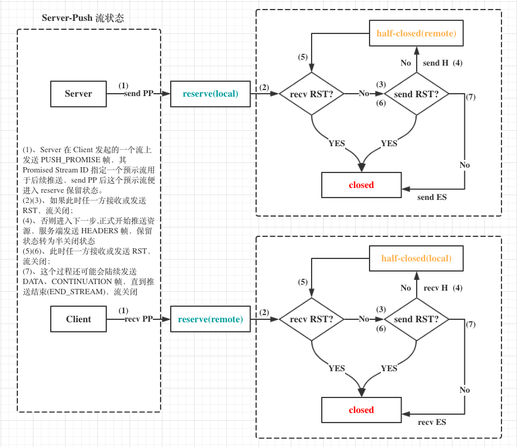

(1)、Server 在 Client 发起的一个流上发送 PUSH_PROMISE 帧，其 Promised Stream ID 指定一个预示流用于后续推送，send PP 后这个预示流在服务端从 idle 状态转为 reserve(local) 状态，客户端 recv PP 后这个流从 idle 状态转为 reserve(remote) 状态

(2)(3)、此时预示流处于保留状态，客户端如果选择拒绝接受推送，可以发送 RST 帧关闭这个流；服务端如果此时出问题了也可以发送 RST 帧取消推送。不管哪一方发送或接收到 RST，此状态都转为 closed

(4)、没有出现重置说明推送仍有效，则服务端开始推送，首先发送的肯定是响应的 HEADERS 首部块，此时流状态转为半关闭 half-closed(remote)；客户端接收到 HEADERS 后流状态转为半关闭 half-closed(local)

(5)(6)、半关闭状态下的流应该还会继续推送诸如 DATA 帧、CONTINUATION 帧这样的数据帧，如果这个过程碰到任一方发起重置，则流会关闭进入 closed 状态

(7)、如果一切顺利，资源随着数据帧响应完毕，最后一帧会带上 END_STREAM 标识代表这个流结束了，此时流转为 closed 状态

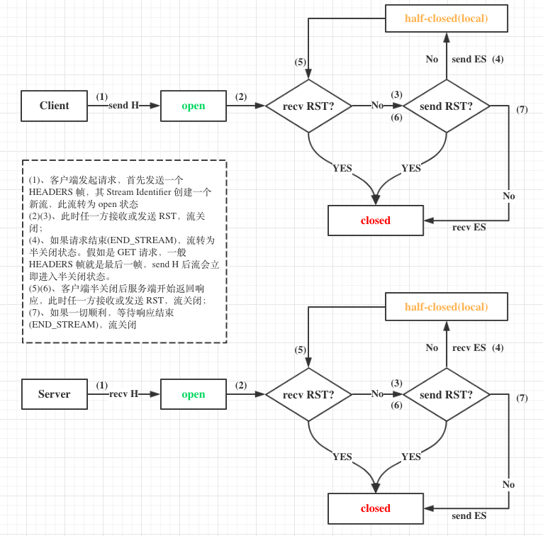

(1)、客户端发起请求，首先发送一个 HEADERS 帧，其 Stream Identifier 创建一个新流，此流从 idle 状态转为 open 状态

(2)(3)、如果客户端取消请求可以发送 RST 帧，服务端出错也可以发送 RST 帧，不管哪一方接收或发送 RST，流关闭进入 closed 状态；

(4)、如果请求结束(END_STREAM)，流转为半关闭状态。假如是 GET 请求，一般 HEADERS 帧就是最后一帧，send H 后流会立即进入半关闭状态。假如是 POST 请求，待数据传完，最后一帧带上 END_STREAM 标识，流转为半关闭

(5)(6)、客户端半关闭后服务端开始返回响应，此时任一方接收或发送 RST，流关闭；

(7)、如果一切顺利，等待响应结束(END_STREAM)，流关闭

#### 流的标识符

流 ID 是 31 位无符号整数，客户端发起的流必须是奇数，服务端发起的流必须是偶数，0x0 保留为连接控制消息不能用于建立新流。

HTTP/1.1 Upgrade to HTTP/2 时响应的流 ID 是 0x1，在升级完成之后，流 0x1 在客户端会转为 `half-closed (local)` 状态，因此这种情况下客户端不能用 0x1 初始化一个流

新建立的流的 ID 必须大于所有已使用过的数字，接收到一个错误大小的 ID 应该返回 PROTOCOL_ERROR 响应

使用一个新流时隐式地关闭了对端发起的 ID 小于当前流的且处于 `idle` 状态的流，比如一个流发送一个 HEADERS 帧打开了 ID 为 7 的流，但还从未向 ID 为 5 的流发送过帧，则流 0x5 会在 0x7 发送完或接收完第一帧后转为 `closed` 状态

一个连接内的流 ID 不能重用

#### 流的优先级

客户端可以通过 HEADERS 帧的 PRIORITY 信息指定一个新建立流的优先级，其他期间也可以发送 PRIORITY 帧调整流优先级

设置优先级的目的是为了让端点表达它所期望对端在并发的多个流之间如何分配资源的行为。更重要的是，当发送容量有限时，可以使用优先级来选择用于发送帧的流。

流可以被标记为依赖其他流，所依赖的流完成后再处理当前流。每个依赖 (dependency) 后都跟着一个权重 (weight)，这一数字是用来确定依赖于相同的流的可分配可用资源的相对比例

##### 流依赖(Stream Dependencies)

每个流都可以显示地依赖另一个流，包含依赖关系表示优先将资源分配给指定的流(上层节点)而不是依赖流

一个不依赖于其他流的流会指定 stream dependency 为 0x0 值，因为不存在的 0x0 流代表依赖树的根

一个依赖于其他流的流叫做**依赖流**，被依赖的流是当前流的父级。如果被依赖的流不在当前依赖树中(比如状态为 `idle` 的流)，被依赖的流会使用一个默认优先级

当依赖一个流时，该流会添加进父级的依赖关系中，共享相同父级的依赖流不会相对于彼此进行排序，比如 B 和 C 依赖 A，新添加一个依赖流 D，BCD 的顺序是不固定的:

```
    A                 A
   / \      ==>      /|\
  B   C             B D C
```

独占标识 (exclusive) 允许插入一个新层级(新的依赖关系)，独占标识导致该流成为父级的唯一依赖流，而其他依赖流变为其子级，比如同样插入一个新依赖流 E (带有 exclusive):

```
                      A
    A                 |
   /|\      ==>       E
  B D C              /|\
                    B D C
```

在依赖关系树中，只有当一个依赖流所依赖的所有流(父级最高为 0x0 的链)被关闭或者无法继续在上面执行，这个依赖流才应该被分配资源

##### 依赖权重

所有依赖流都会分配一个 1~256 权重值

相同父级的依赖流按权重比例分配资源，比如流 B 依赖于 A 且权重值为 4，流 C 依赖于 A 且权重值为 12，当 A 不再执行时，B 理论上能分配的资源只有 C 的三分之一

##### 优先级调整 (Reprioritization)

使用 PRIORITY 帧可以调整流优先级

PRIORITY 帧内容与 HEADERS 帧的优先级模块相同:

```
 +-+-------------------------------------------------------------+
 |E|                  Stream Dependency (31)                     |
 +-+-------------+-----------------------------------------------+
 |   Weight (8)  |
 +-+-------------+
```

- 如果父级重新设置了优先级，则依赖流会随其父级流一起移动。若调整优先级的流带有独占标识，会导致新的父流的所有子级依赖于这个流

- 如果一个流调整为依赖自己的一个子级，则这个将被依赖的子级首先移至调整流的父级之下(即同一层)，再移动那个调整流的整棵子树，移动的依赖关系保持其权重

看下面这个例子: 第一个图是初始关系树，现在 A 要调整为依赖 D，根据第二点，现将 D 移至 x 之下，再把 A 调整为 D 的子树(图 3)，如果 A 调整时带有独占标识根据第一点 F 也归为 A 子级(图 4)

```
    x                x                x                 x
    |               / \               |                 |
    A              D   A              D                 D
   / \            /   / \            / \                |
  B   C     ==>  F   B   C   ==>    F   A       OR      A
     / \                 |             / \             /|\
    D   E                E            B   C           B C F
    |                                     |             |
    F                                     E             E
               (intermediate)   (non-exclusive)    (exclusive)
```

##### 流优先级的状态管理

当一个流从依赖树中移除，它的子级可以调整为依赖被关闭流的父级(应该就是连接上一层节点)，新的依赖权重将根据关闭流的权重以及流自身的权重重新计算。

从依赖树中移除流会导致某些优先级信息丢失。资源在具有相同父级的流之间共享，这意味着如果这个集合中的某个流关闭或者阻塞，任何空闲容量将分配给最近的相邻流。然而，如果此集合的共有依赖(即父级节点)从树中移除，这些子流将与更上一层的流共享资源

一个例子: 流 A 和流 B 依赖相同父级节点，而流 C 和流 D 都依赖 A，在移除流 A 之前的一段时间内，A 和 D 都无法执行(可能任务阻塞了)，则 C 会分配到 A 的所有资源；
如果 A 被移除出树了，A 的权重按比重新计算分配给 C 和 D，此时 D 仍旧阻塞，C 分配的资源相较之前变少了。对于同等的初始权重，C 获取到的可用资源是三分之一而不是二分之一(为什么是三分之一?文档中没有说明细节，权重如何重新分配也不太清楚，下面是按我的理解解释的)

X 的资源为 1，ABCD 初始权重均为 16，*号代表节点当前不可用，图一中 C 和 B 各占一半资源，而 A 移除后 CD 的权重重新分配变为 8，所以图二中 C 和 B 占比变为 1:2，R(C) 变为 1/3
```
          X(v:1.0)               X(v:1.0)
         / \                    /|\
        /   \                  / | \
      *A     B       ==>      /  |  \
    (w:16) (w:16)            /   |   \
      / \                   C   *D    B
     /   \                (w:8)(w:8)(w:16)
    C    *D
 (w:16) (w:16)


 R(C)=16/(16+16)=1/2 ==>  R(C)=8/(8+16)=1/3
```

可能向一个流创建依赖关系的优先级信息还在传输中，那个流就已经关闭了。如果一个依赖流的依赖指向没有相关优先级信息(即父节点无效)，则这个依赖流会分配默认优先级，这可能会造成不理想的优先级，因为给流分配了不在预期的优先级。

为了避免上述问题，一个端点应该在流关闭后的一段时间内保留流的优先级调整状态信息，此状态保留时间越长，流被分配错误的或者默认的优先级可能性越低。

类似地，处于“空闲”状态的流可以被分配优先级或成为其他流的父节点。这允许在依赖关系树中创建分组节点，从而实现更灵活的优先级表达式。空闲流以默认优先级开始

流优先级状态信息的保留可能增加终端的负担，因此这种状态可以被限制。终端可能根据负荷来决定保留的额外的状态的数目；在高负荷下，可以丢弃额外的优先级状态来限制资源的任务。在极端情况下，终端甚至可以丢弃激活或者保留状态流的优先级信息。如果使用了固定的限制，终端应当至少保留跟 SETTINGS_MAX_CONCURRENT_STREAMS 设置一样大小的流状态

##### 默认优先级

所有流都是初始为非独占地依赖于流 0x0。

Pushed 流初始依赖于相关的流(见 Server-Push)。

以上两种情况，流的权重都指定为 16。

### Server-Push

#### PUSH_PROMISE 帧格式

```
 +---------------+
 |Pad Length? (8)|
 +-+-------------+-----------------------------------------------+
 |R|                  Promised Stream ID (31)                    |
 +-+-----------------------------+-------------------------------+
 |                   Header Block Fragment (*)                 ...
 +---------------------------------------------------------------+
 |                           Padding (*)                       ...
 +---------------------------------------------------------------+
```

- `Pad Length`: 指定 Padding 长度，存在则代表 PADDING flag 被设置
- `R`: 保留的1bit位
- `Promised Stream ID`: 31 位的无符号整数，代表 PUSH_PROMISE 帧保留的流，对于发送者来说该流标识符必须是可用于下一个流的有效值
- `Header Block Fragment`: 包含请求首部域的首部块片段
- `Padding`: 填充字节，没有具体语义，作用与 DATA 的 Padding 一样，存在则代表 PADDING flag 被设置

PUSH_PROMISE 帧有以下标识 (flags):

- END_HEADERS: bit 2 置 1 代表 header 块结束
- PADDED: bit 3 置 1 代表 Pad 被设置，存在 Pad Length 和 Padding

#### Push 的过程

结合上文关于 Server-Push 的流状态转换

PUSH_PROMISE 帧只能在对端(客户端)发起的且流状态为 open 或者 half-closed (remote) 的流上发送

PUSH_PROMISE 帧准备推送的响应总是和来自于客户端的请求相关联。服务端在该请求所在的流上发送 PUSH_PROMISE 帧。PUSH_PROMISE 帧包含一个 Promised Stream ID，该流标识符是从服务端可用的流标识符里选出来的。

如果服务端收到了一个对文档的请求，该文档包含内嵌的指向多个图片文件的链接，且服务端选择向客户端推送那些额外的图片，那么在发送包含图片链接的 DATA 帧之前发送 PUSH_PROMISE 帧可以确保客户端在发现内嵌的链接之前，能够知道有一个资源将要被推送过来。同样地，如果服务端准备推送被首部块引用的响应 (比如，在 [Link 首部字段](https://www.w3.org/wiki/LinkHeader) 里的)，在发送首部块之前发送一个 PUSH_PROMISE 帧，可以确保客户端不再请求那些资源

一旦客户端收到了 PUSH_PROMISE 帧，并选择接收被推送的响应，客户端就不应该为准备推送的响应发起任何请求，直到预示的流被关闭以后。

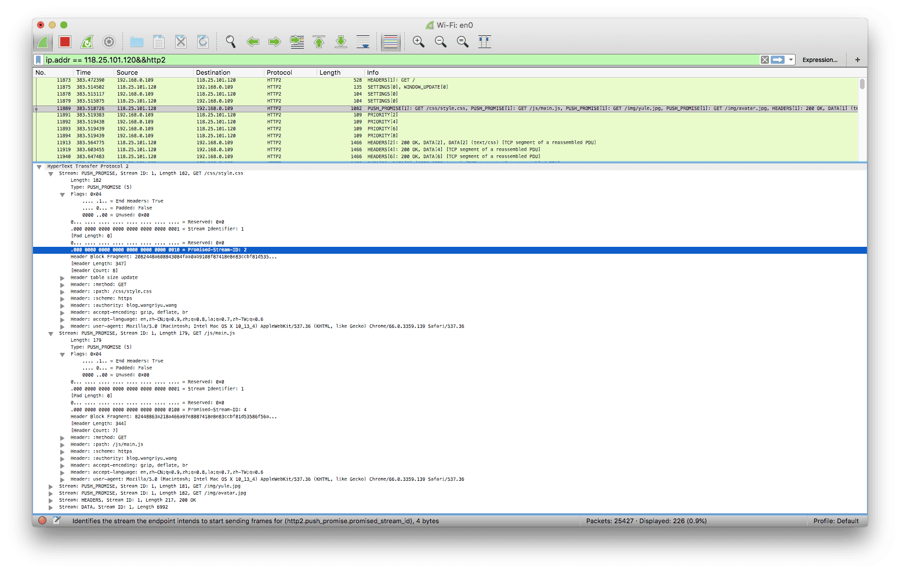

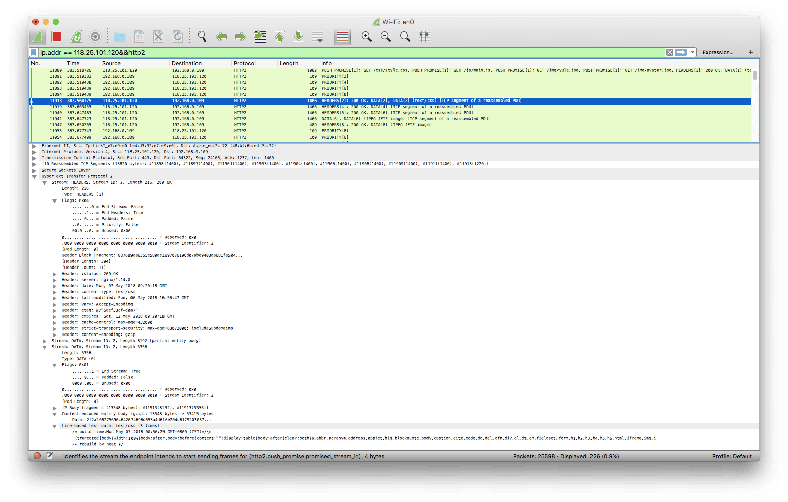

> 注意图中推送的四个资源各预示了一个流 (Promised Stream ID)，而发送 PUSH_PROMISE 帧的还是在客户端发起的请求流 (Stream Identifier = 1) 上，客户端收到 PUSH_PROMISE 帧并选择接收便不会对这四个资源发起请求，之后服务端会发起预示的流然后推送资源相关的响应

不管出于什么原因，如果客户端决定不再从服务端接收准备推送的响应，或者如果服务端花费了太长时间准备发送被预示的响应，客户端可以发送一个 RST_STREAM 帧，该帧可以使用 CANCEL 或者 REFUSED_STEAM 码，并引用被推送的流标识符。

#### nginx 配置 Server-Push

> server-push 需要服务端设置，并不是说浏览器发起请求，与此请求相关的资源服务端就会自动推送

以 nginx 为例，从版本 1.13.9 开始正式支持 hppt2 serverpush 功能，

在相应 server 或 location 模块中加入 `http2_push` 字段加上相对路径的文件即可在请求该资源时推送相关资源，比如我的博客设置如下，访问首页时有四个文件会由服务器主动推送过去而不需要客户端请求:

```
  server_name  blog.wangriyu.wang;
  root /blog;
  index index.html index.htm;

  location = /index.html {
    http2_push /css/style.css;
    http2_push /js/main.js;
    http2_push /img/yule.jpg;
    http2_push /img/avatar.jpg;
  }
```
通过浏览器控制台可以查看 `Push` 响应:

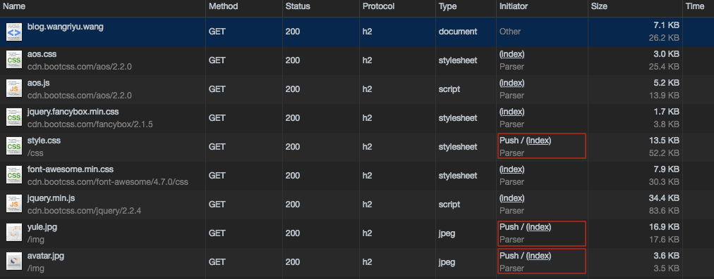

也可以用 `nghttp` 测试 push 响应 (* 号代表是服务端推送的):

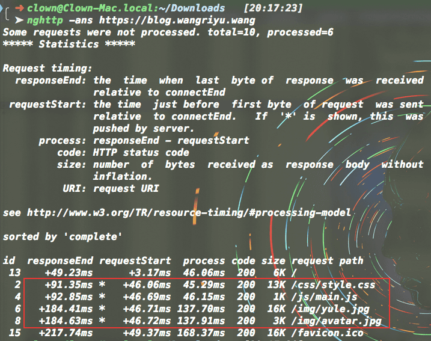

上面 `http2_push` 的设置适合静态资源，服务端事先知道哪些文件是客户端需要的，然后选择性推送

假如是后台应用动态生成的文件(比如 json 文件)，服务器事先不知道要推送什么，可以用 `Link` 响应头来做自动推送

在 server 模块中添加 `http2_push_preload on;`

```
  server_name  blog.wangriyu.wang;
  root /blog;
  index index.html index.htm;

  http2_push_preload on;
```

然后设置响应头 (add_header) 或者后台程序生成数据文件返回时带上响应头 Link 标签，比如

```
Link: </style.css>; as=style; rel=preload, </main.js>; as=script; rel=preload, </image.jpg>; as=image; rel=preload
```

nginx 会根据 Link 响应头主动推送这些资源

更多nginx 官方介绍见 [Introducing HTTP/2 Server Push with NGINX 1.13.9](https://www.nginx.com/blog/nginx-1-13-9-http2-server-push/)

#### Server-Push 潜在的问题

看了这篇文章 [HTTP/2 中的 Server Push 讨论](https://imququ.com/post/server-push-in-http2.html)，发现 Server-Push 有个潜在的问题

Server-Push 满足条件时便会发起推送，可是客户端已经有缓存了想发送 RST 拒收，而服务器在收到 RST 之前已经推送资源了，虽然这部分推送无效但是肯定会占用带宽

比如我上面博客关于 http2_push 的配置，我每次打开首页服务器都会推送那四个文件，而实际上浏览器知道自己有缓存使用的也是本地缓存，也就是说本地缓存未失效的期间内，服务器的 Server-Push 只是起到了占用带宽的作用

当然实际上对我的小站点来说影响并不大，但是如果网站需要大量推送的话，需要考虑并测试 Server-Push 是否会影响用户的后续访问

另外服务端可以设置 Cookie 或者 Session 记录访问时间，然后之后的访问判断是否需要 Push；还有就是客户端可以限制 PUSH 流的数目，也可以设置一个很低的流量窗口来限制 PUSH 发送的数据大小

至于哪些资源需要推送，在《web 性能权威指南》中就提到几种策略，比如 Apache 的 mod_spdy 能够识别 X-Associated-Content 首部，当中列出了希望服务器推送的资源；另外网上有人已经做了基于 Referer 首部的中间件来处理 Server-Push；或者服务端能更智能的识别文档，根据当前流量决定是否推送或者推送那些资源。相信以后会有更多关于 Server-Push 的实现和应用

### 流量控制

多路复用的流会竞争 TCP 资源，进而导致流被阻塞。流控制机制确保同一连接上的流不会相互干扰。流量控制作用于单个流或整个连接。HTTP/2 通过使用 WINDOW_UPDATE 帧来提供流量控制。

流控制具有以下特征:

- 流量控制是特定于连接的。两种级别的流量控制都位于单跳的端点之间，而不是整个端到端的路径。比如 server 前面有一个 front-end proxy 如 Nginx，这时就会有两个 connection，browser-Nginx, Nginx—server，flow control 分别作用于两个 connection。详情见: [How is HTTP/2 hop-by-hop flow control accomplished? - stackoverflow](https://stackoverflow.com/questions/40747040/how-is-http-2-hop-by-hop-flow-control-accomplished)
- 流量控制是基于 WINDOW_UPDATE 帧的。接收方公布自己打算在每个流以及整个连接上分别接收多少字节。这是一个以信用为基础的方案。
- 流量控制是有方向的，由接收者全面控制。接收方可以为每个流和整个连接设置任意的窗口大小。发送方必须尊重接收方设置的流量控制限制。客户方、服务端和中间代理作为接收方时都独立地公布各自的流量控制窗口，作为发送方时都遵守对端的流量控制设置。
- 无论是新流还是整个连接，流量控制窗口的初始值是 65535 字节。
- 帧的类型决定了流量控制是否适用于帧。目前，只有 DATA 帧会受流量控制影响，所有其它类型的帧并不消耗流量控制窗口的空间。这保证了重要的控制帧不会被流量控制阻塞。
- 流量控制不能被禁用。
- HTTP/2 只定义了 WINDOW_UPDATE 帧的格式和语义，并没有规定接收方如何决定何时发送帧、发送什么样的值，也没有规定发送方如何选择发送包。具体实现可以选择任何满足需求的算法。

#### WINDOW_UPDATE 帧格式

```
+-+-------------------------------------------------------------+
|R|                Window Size Increment (31)                   |
+-+-------------------------------------------------------------+
```

Window Size Increment 表示除了现有的流量控制窗口之外，发送端还可以传送的字节数。取值范围是 1 到 2^31 - 1 字节。

WINDOW_UPDATE 帧可以是针对一个流或者是针对整个连接的。如果是前者，WINDOW_UPDATE 帧的流标识符指明了受影响的流；如果是后者，流标识符为 0 表示作用于整个连接。

流量控制功能只适用于被标识的、受流量控制影响的帧。文档定义的帧类型中，只有 DATA 帧受流量控制影响。除非接收端不能再分配资源去处理这些帧，否则不受流量控制影响的帧必须被接收并处理。如果接收端不能再接收帧了，可以响应一个 FLOW_CONTROL_ERROR 类型的流错误或者连接错误。

WINDOW_UPDATE 可以由发送过带有 END_STREAM 标志的帧的对端发送。这意味着接收端可能会在 half-closed (remote) 或者 closed 状态的流上收到 WINDOW_UPDATE 帧，接收端不能将其当做错误。

#### 流量控制窗口

流量控制窗口是一个简单的整数值，指出了准许发送端传送的数据的字节数。窗口值衡量了接收端的缓存能力。

除非将其当做连接错误，否则当接收端收到 DATA 帧时，必须总是从流量控制窗口中减掉其长度(不包括帧头的长度，而且两个级别的控制窗口都要减)。即使帧有错误，这也是有必要的，因为发送端已经将该帧计入流量控制窗口，如果接收端没有这样做，发送端和接收端的流量控制窗口就会不一致。

发送端不能发送受流量控制影响的、其长度超出接收端告知的两种级别的流量控制窗口可用空间的帧。即使这两种级别的流量控制窗口都没有可用空间了，也可以发送长度为 0、设置了 END_STREAM 标志的帧(即空的 DATA 帧)。

当帧的接收端消耗了数据并释放了流量控制窗口的空间时，可以发送一个 WINDOW_UPDATE 帧。对于流级别和连接级别的流量控制窗口，需要分别发送 WINDOW_UPDATE 帧。

新建连接时，流和连接的初始窗口大小都是 2^16 - 1(65535) 字节。可以通过设置连接前言中 SETTINGS 帧的 SETTINGS_INITIAL_WINDOW_SIZE 参数改变流的初始窗口大小，这会作用于所有流。而`连接的初始窗口大小不能改，但可以用 WINDOW_UPDATE 帧来改变流量控制窗口`，这是为什么连接前言往往带有一个 WINDOW_UPDATE 帧的原因。

除了改变还未激活的流的流量控制窗口外，SETTIGNS 帧还可以改变已活跃的流 (处于 open 或 half-closed (remote) 状态的流)的初始流量控制窗口的大小。也就是说，当 SETTINGS_INITIAL_WINDOW_SIZE 的值变化时，接收端必须调整它所维护的所有流的流量控制窗口的值，不管是之前就打开的流还是尚未打开的流。

改变 SETTINGS_INITIAL_WINDOW_SIZE 可能引发流量控制窗口的可用空间变成负值。发送端必须追踪负的流量控制窗口，并且直到它收到了使流量控制窗口变成正值的 WINDOW_UPDATE 帧，才能发送新的 DATA 帧。

例如，如果连接一建立客户端就立即发送 60KB 的数据，而服务端却将初始窗口大小设置为 16KB，那么客户端一收到 SETTINGS 帧，就会将可用的流量控制窗口重新计算为 -44KB。客户端保持负的流量控制窗口，直到 WINDOW_UPDATE 帧将窗口值恢复为正值，客户端才可以继续发送数据。

如果改变 SETTINGS_INITIAL_WINDOW_SIZE 导致流量控制窗口超出了最大值，一端必须 将其当做类型为 FLOW_CONTROL_ERROR 的连接错误

如果接收端希望使用比当前值小的流量控制窗口，可以发送一个新的 SETTINGS 帧。但是，接收端必须准备好接收超出该窗口值的数据，因为可能在收到 SETTIGNS 帧之前，发送端已经发送了超出该较小窗口值的数据。

#### 合理使用流控制

流量控制的定义是用来保护端点在资源约束条件下的操作。例如，一个代理需要在很多连接之间共享内存，也有可能有缓慢的上游连接和快速的下游连接。流量控制解决了接收方无法在一个流上处理数据，但仍希望继续处理同一连接中的其他流的情况。

不需要此功能的部署可以通告最大大小 (2^31 - 1) 的流量控制窗口，并且可以通过在收到任何数据时发送 WINDOW_UPDATE 帧来维护此窗口大小保持不变。这可以有效禁用接受方的流控制。相反地，发送方总是受控于接收方通告的流控制窗口的限制。

资源约束下(例如内存)的调度可以使用流量来限制一个对端可以消耗的内存量。需要注意的是如果在不知道带宽延迟积的时候启用流量控制可能导致无法最优的利用可用的网络资源 (RFC1323)。

即便是对当前的网络延迟乘积有充分的认识，流量控制的实现也可能很复杂。当使用流量控制时，接收端必须及时地从 TCP 接收缓冲区读取数据。这样做可能导致在一些例如 WINDOW_UPDATE 的关键帧在 HTTP/2 不可用时导致死锁。但是流量控制可以保证约束资源能在不需要减少连接利用的情况下得到保护。

### HTTP/2 的协议协商机制

#### 非加密下的协商 - h2c

客户端使用 HTTP Upgrade 机制请求升级，HTTP2-Settings 首部字段是一个专用于连接的首部字段，它包含管理 HTTP/2 连接的参数(使用 Base64 编码)，其前提是假设服务端会接受升级请求

```
 GET / HTTP/1.1
 Host: server.example.com
 Connection: Upgrade, HTTP2-Settings
 Upgrade: h2c
 HTTP2-Settings: <base64url encoding of HTTP/2 SETTINGS payload>
```

服务器如果支持 http/2 并同意升级，则转换协议，否则忽略

```
HTTP/1.1 101 Switching Protocols
Connection: Upgrade
Upgrade: h2c
```

此时潜在的存在一个流 0x1，客户端上这个流在完成 h1 请求后便转为 `half-closed` 状态，服务端会用这个流返回响应


注意图中第一个响应所在的流是 0x1，与上文所说的一致

目前浏览器只支持 TLS 加密下的 HTTP/2 通信，所以上述情况在浏览器中目前是不可能碰到的，图中显示的是 nghttp 客户端发起的请求

#### 加密的协商机制 - h2

TLS 加密中在 Client-Hello 和 Server-Hello 的过程中通过 [ALPN](https://zh.wikipedia.org/wiki/%E5%BA%94%E7%94%A8%E5%B1%82%E5%8D%8F%E8%AE%AE%E5%8D%8F%E5%95%86) 进行协议协商

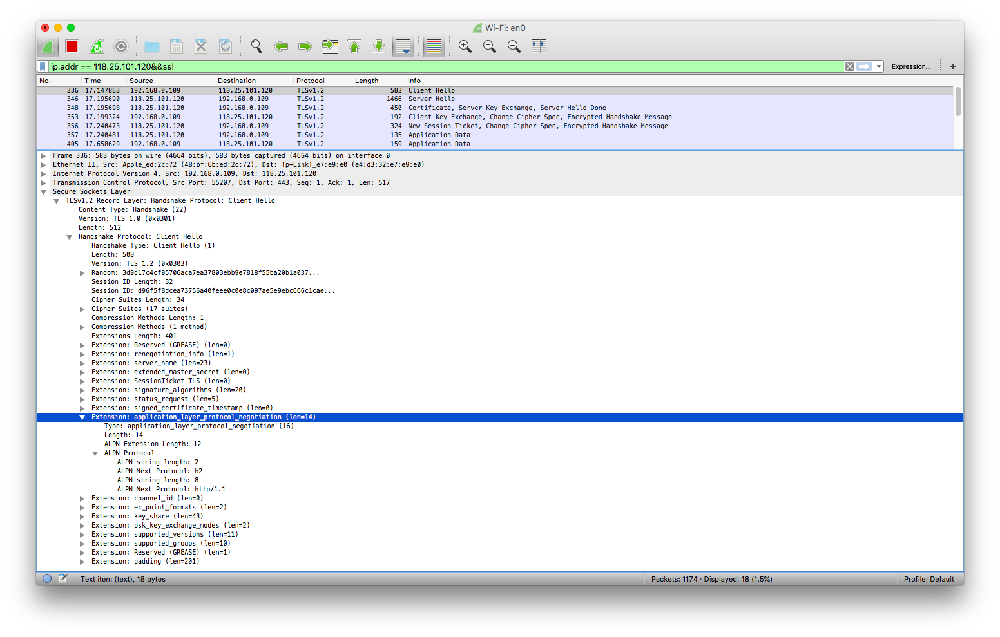

应用层协议协商在 TLS 握手第一步的扩展中，Client Hello 中客户端指定 ALPN Next Protocol 为 h2 或者 http/1.1 说明客户端支持的协议

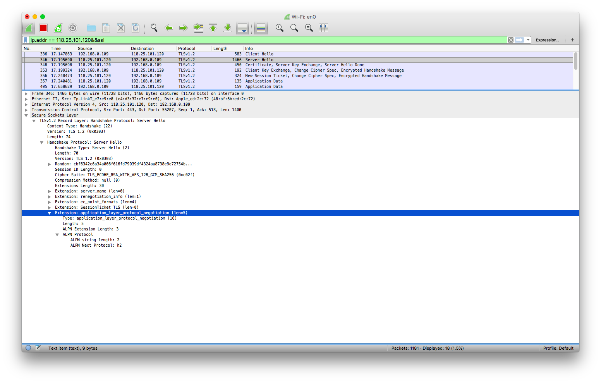

服务端如果在 Server Hello 中选择 h2 扩展，说明协商协议为 h2，后续请求响应跟着变化；如果服务端未设置 http/2 或者不支持 h2，则继续用 http/1.1 通信

### 分析实例

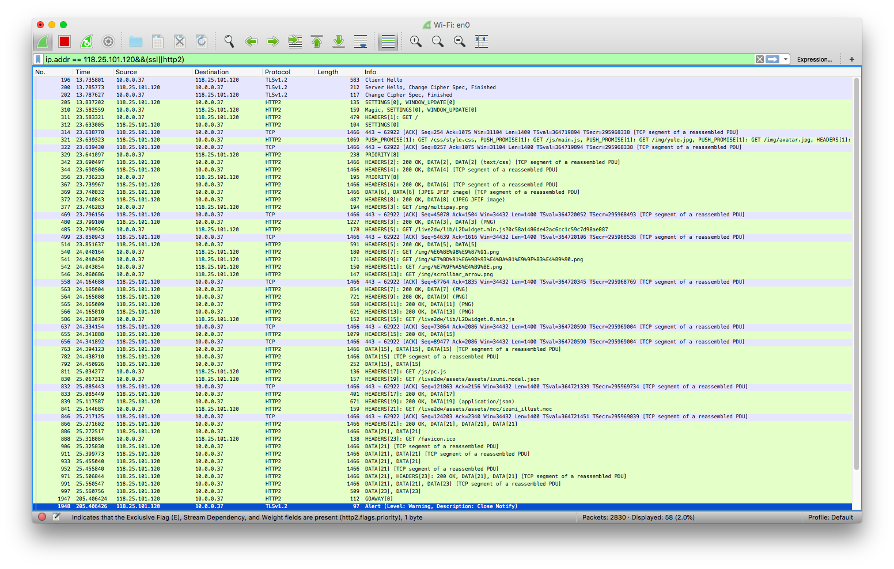

196: TLS 握手第一步 Client Hello，开始协议协商，且此处带上了 Session Ticket

200: Server Hello 同意使用 h2，而且客户端的会话票证有效，恢复会话，握手成功

202: 客户端也恢复会话，开始加密后续消息

205: 服务端发起一个连接前言 (SETTINGS)，SETTINGS 帧中设置了最大并行流数量、初始窗口大小、最大帧长度，然后 (WINDOW_UPDATE) 扩大窗口大小

310: 客户端也发送一个连接前言 Magic，并初始化设置 (SETTINGS)，SETTINGS 帧中设置了 HEADER TABLE 大小、初始窗口大小、最大并行流数量，然后 (WINDOW_UPDATE) 扩大窗口大小

311: 客户端发送完连接前言后可以立即跟上一个请求，GET / (HEADERS\[1\])，而且这个 HEADERS 帧还带有 END_STREAM，这会使流 1 从 idle 状态立即转为 half-closed(local) 状态 (open 是中间态)

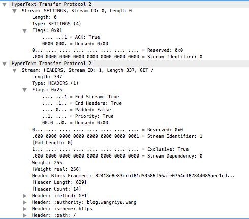

311: 此消息中还包含一个客户端发送给服务端的带 ACK 的 SETTINGS 帧

312: 服务端也响应带 ACK 的 SETTINGS 帧

321: 服务端在流 1 (此时状态为 half-closed(remote)) 上发送了四个 PUSH_PROMISE 帧，它们分别保留了流 2、4、6、8 用于后续推送，

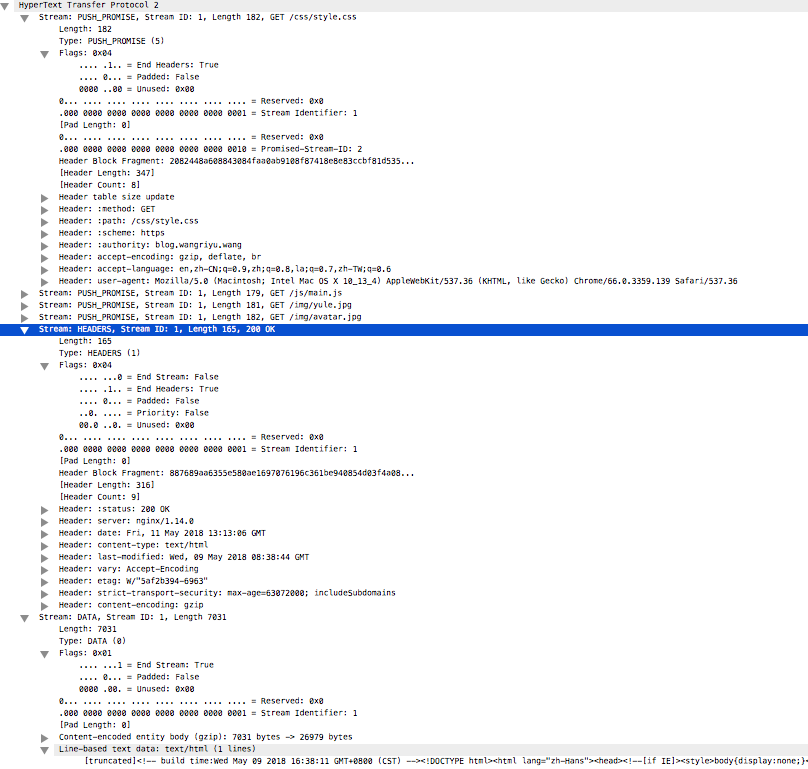

321: 此消息中还返回了上面请求的响应 (HEADERS - DATA)，最后 DATA 带上 END_STREAM，流 1 从 half-closed 转为 closed

329: 调整流优先级，依赖关系: 8 -> 6 -> 4 -> 2 -> 1 (都带有独占标志，而且权重均为 110)

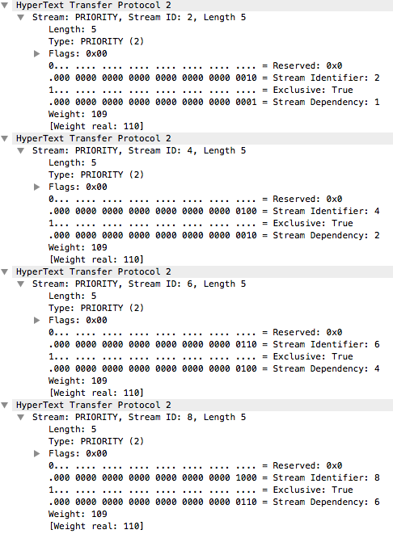

342: 流 1 关闭后，流 2 得到分配资源，服务器开始推送，数据由两个 DATA 帧返回

344: 流 2 结束，开始推送流 4

356: 调整依赖关系

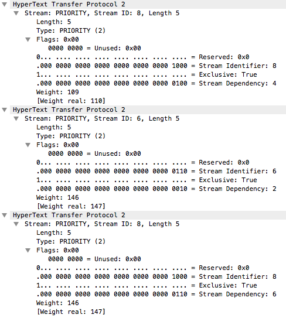

```
  1         1         1         1(w: 110)
  |         |         |         |
  2         2         2         2(w: 110)
  |         |         |         |
  4   ==>   4   ==>   6   ==>   6(w: 147)
  |         |         |         |
  6         8         4         8(w: 147)
  |         |         |         |
  8         6         8         4(w: 110)
```

367、369、372: 推送 6 和 8 的流数据

377: 发起一个请求，打开流 3，其中客户端发起的请求都是依赖流 0x0

之后都是同样的套路完成请求 - 响应，最后以 GOAWAY 帧关闭连接结束

### HPACK 算法

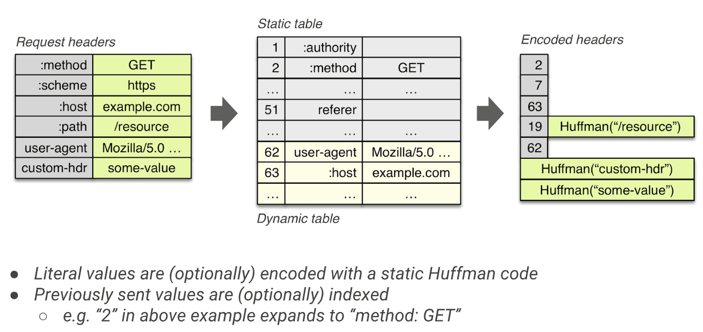

## What then ?

### HTTP/2 演示

https://http2.akamai.com/demo

https://http2.golang.org/

### 使用 HTTP/2 建议

nginx 开启 HTTP2 只需在相应的 HTTPS 设置后加上 `http2` 即可

```
listen [::]:443 ssl http2 ipv6only=on;
listen 443 ssl http2;
```

#### 以下几点是 HTTP/1 和 HTTP/2 都同样适用的

1、开启压缩

配置 gzip 等可以使传输内容更小，传输速度更快

例如 nginx 可以再 http 模块中加入以下字段，其他字段和详细解释可以谷歌

```
    gzip  on; // 开启
    gzip_min_length 1k;
    gzip_comp_level 1; // 压缩级别
    gzip_types text/plain application/javascript application/x-javascript application/octet-stream application/json text/css application/xml text/javascript application/x-httpd-php image/jpeg image/gif image/png font/ttf font/otf image/svg+xml; // 需要压缩的文件类型
    gzip_vary on;
    gzip_disable "MSIE [1-6]\.";
```

2、使用缓存

给静态资源设置一个缓存期是非常有必要的，关于缓存见 [HTTP Message](request&response.md)

例如 nginx 在 server 模块中添加以下字段可以设置缓存时间

```
 location ~* ^.+\.(ico|gif|jpg|jpeg|png|moc|mtn|mp3|mp4|mov)$ {
   access_log   off;
   expires      30d;
 }

 location ~* ^.+\.(css|js|txt|xml|swf|wav|json)$ {
   access_log   off;
   expires      5d;
 }

 location ~* ^.+\.(html|htm)$ {
   expires      24h;
 }

 location ~* ^.+\.(eot|ttf|otf|woff|svg)$ {
   access_log   off;
   expires 30d;
 }
```

3、CDN 加速

CDN 的好处是就近访问，延迟低，访问快

4、减少 DNS 查询

每个域名都需要 DNS 查询，一般需要几毫秒到几百毫秒，移动环境下会更慢。DNS 解析完成之前，请求会被阻塞。减少 DNS 查询也是优化项之一

浏览器的 [DNS Prefetching](https://en.wikipedia.org/wiki/Link_prefetching) 技术也是一种优化手段

5、减少重定向

重定向可能引入新的 DNS 查询、新的 TCP 连接以及新的 HTTP 请求，所以减少重定向也很重要。

浏览器基本都会缓存通过 301 Moved Permanently 指定的跳转，所以对于永久性跳转，可以考虑使用状态码 301。对于启用了 HTTPS 的网站，配置 HSTS 策略，也可以减少从 HTTP 到 HTTPS 的重定向

#### 但以下几点就不推荐在 HTTP/2 中用了

1、域名分片

HTTP/2 对于同一域名使用一个 TCP 连接足矣，过多 TCP 连接浪费资源而且效果不见得一定好

而且资源分域会破坏 HTTP/2 的优先级特性，还会降低头部压缩效果

2、资源合并

资源合并会不利于缓存机制，而且单文件过大对于 HTTP/2 的传输不好，尽量做到细粒化更有利于 HTTP/2 传输

3、资源内联

HTTP/2 支持 Server-Push，相比较内联优势更大效果更好

而且内联的资源不能有效缓存

如果有共用，多页面内联也会造成浪费

#### HTTP/2 最佳实践

使用 HTTP/2 尽可能用最少的连接，因为同一个连接上产生的请求和响应越多，动态字典积累得越全，头部压缩效果也就越好，而且多路复用效率高，不会像多连接那样造成资源浪费

为此需要注意以下两点:

- 同一域名下的资源使用同一个连接，这是 HTTP/2 的特性
- 不同域名下的资源，如果满足能解析到同一 IP 或者使用的是同一个证书(比如泛域名证书)，HTTP/2 可以合并多个连接

所以使用相同的 IP 和证书部署 Web 服务是目前最好的选择，因为这让支持 HTTP/2 的终端可以复用同一个连接，实现 HTTP/2 协议带来的好处；而只支持 HTTP/1.1 的终端则会不同域名建立不同连接，达到同时更多并发请求的目的

比如 Google 一系列网站都是用的同一个证书:

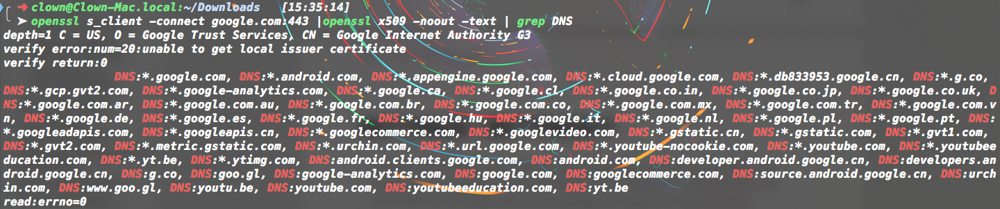

### 大图片传输碰到的问题

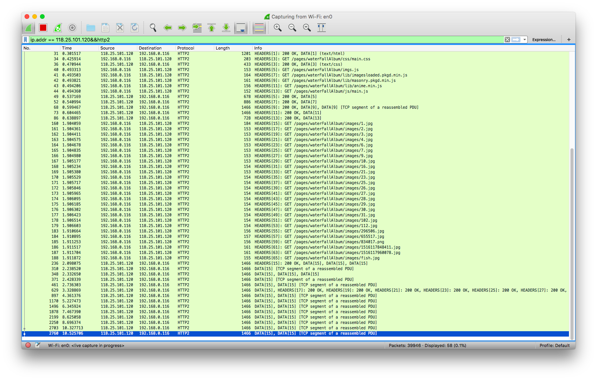

http/1.1 是在 6 个 TCP 连接上发起的请求，有明显先后顺序，与本文最开始的两张图片情况一致

h2 则是在一个 TCP 连接上发起的请求，而且是同时发起，图中绿色代表发起请求等待响应的时间，蓝色代表收到响应开始接受负载的时间

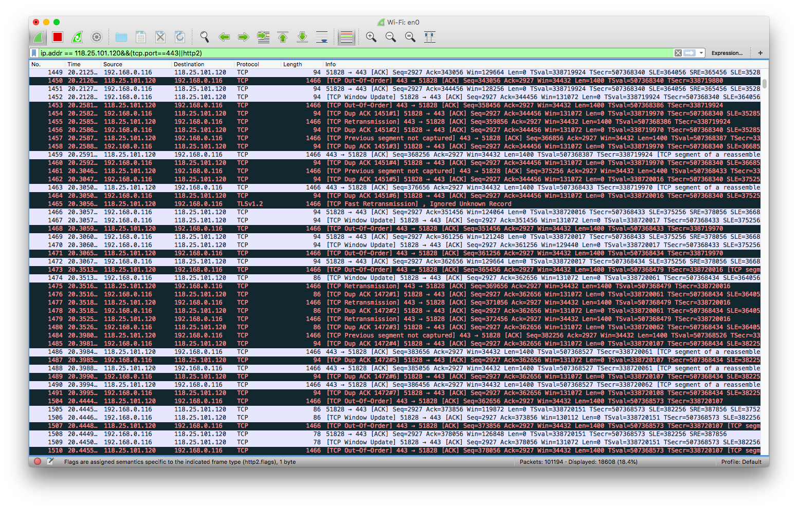

可以明显地发现 h2 的请求速度远慢于 http/1.1，当然这里跟服务器也有点关系，h2 的图片是放我自己的服务器上网络带宽有限，而 http/1.1 的图片使用的是腾讯云的对象存储网络带宽会比我服务器好

而且这是在 Safari 上的测试结果，虽然慢但好歹 Safari 全下下来了，而我在 Chrome 上测试时后面的部分图片直接挂了，都报 `ERR_SPDY_PROTOCOL_ERROR` 错误


去看了下 `ERR_SPDY_PROTOCOL_ERROR` 出在哪，发现是 Server reset stream

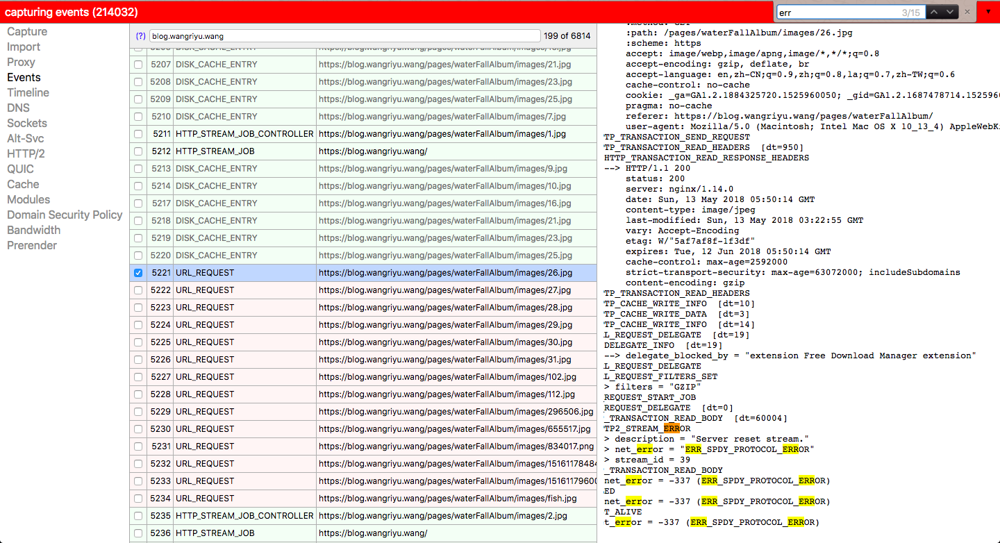


然后再看一下 HTTP/2 的帧序列，发出的请求都在 629 号消息中响应成功了，但是返回的数据帧只有流 15 上的，实际收到的图片又不止流 15 对应的图片，这是为什么?


后面我继续测试发现连续请求几张大图片，虽然 HEADERS 帧都打开的是不同的流，返回的响应的 HEADERS 帧也还是对应前面的流 ID，但是响应的 DATA 帧都是从第一个打开的流上返回的。

如果是小图片的话，一个请求响应过后这个流就关闭了，下一张小图是在其自己对应的流上返回的。

这个机制很奇怪，我暂时还没有找到解释的文档

至于为什么 h2 返回大图更慢呢，看一下 TCP 报文就会发现所有数据在一个连接上发送，到后面 TCP 包会出现各种问题，丢包、重传、快速重传、失序、重包等等


但是为何 Chrome 会出错，而 Safari 不会，我还不清楚，因为 wireshark 解不了 Safari 的 HTTP/2 包

在这片文章中也提及了这种情况: [Real–world HTTP/2: 400gb of images per day](https://99designs.com/tech-blog/blog/2016/07/14/real-world-http-2-400gb-of-images-per-day/)

>《web 性能权威指南》中提及 HTTP/2 下一个 TCP 可能会造成的问题:
> 虽然消除了 HTTP 队首阻塞现象，但 TCP 层次上仍存在队首阻塞问题；如果 TCP 窗口缩放被禁用，那带宽延迟积效应可能会限制连接的吞吐量；丢包时 TCP 拥塞窗口会缩小；

### SPDY 与 HTTP2 的关系

[SPDY](https://zh.wikipedia.org/wiki/SPDY) 是 HTTP2 的前身，大部分特性与 HTTP2 保持一致，包括服务器端推送，多路复用和帧作为传输的最小单位。但 SPDY 与 HTTP2 也有一些实现上的不同，比如 SPDY 的头部压缩使用的是 DEFLATE 算法，而 HTTP2 使用的是 HPACK 算法，压缩率更高。

### QUIC 协议

Google 的 [QUIC(Quick UDP Internet Connections)](https://zh.wikipedia.org/wiki/%E5%BF%AB%E9%80%9FUDP%E7%BD%91%E7%BB%9C%E8%BF%9E%E6%8E%A5) 协议，继承了 SPDY 的特点。QUIC 是一个 UDP 版的 TCP + TLS + HTTP/2 替代实现。

QUIC 可以创建更低延迟的连接，并且也像 HTTP/2 一样，通过仅仅阻塞部分流解决了包裹丢失这个问题，让连接在不同网络上建立变得更简单 － 这其实正是 [MPTCP](https://en.wikipedia.org/wiki/Multipath_TCP) 想去解决的问题。

QUIC 现在还只有 Google 的 Chrome 和它后台服务器上的实现，虽然有第三方库 libquic，但这些代码仍然很难在其他地方被复用。该协议也被 IETF 通信工作组引入了草案。

[Caddy](https://github.com/mholt/caddy): 基于 Go 语言开发的 Web Server， 对 HTTP/2 和 HTTPS 有着良好的支持，也开始支持 QUIC 协议 (试验性)

### 推荐工具

- Chrome 插件: [HTTP/2 and SPDY indicator](https://chrome.google.com/webstore/detail/http2-and-spdy-indicator/mpbpobfflnpcgagjijhmgnchggcjblin)

如果你访问的站点开启了 HTTP/2，图标会亮起，而且点击会进入 chrome 内置的 HTTP/2 监视工具

- 命令行工具: [nghttp2](https://github.com/nghttp2/nghttp2)

C 语言实现的 HTTP/2，可以用它调试 HTTP/2 请求

直接 `brew install nghttp2` 就可以安装，安装好后输入 `nghttp -nv https://nghttp2.org` 就可以查看 h2 请求


- 还可以用 wireshark 解 h2 的包，不过得设置浏览器提供的对称协商密钥或者服务器提供的私钥，具体方法看此文: [使用 Wireshark 调试 HTTP/2 流量](https://imququ.com/post/http2-traffic-in-wireshark.html)

如果无法解包看一下 sslkeylog.log 文件有没有写入数据，如果没有数据说明浏览器打开方式不对，得用命令行打开浏览器，这样才能让浏览器读取环境变量然后向 sslkeylog 写入密钥，另外此方法好像支持谷歌浏览器和火狐，对 Safari 无效

如果 sslkeylog.log 有数据，wireshark 还是无法解包，打开设置的 SSL 选项重新选择一下文件试试，如果还是不行也用命令行打开 Wireshark

一次不行多试几次

- [h2o](https://github.com/h2o/h2o): 优化的 HTTP Server，对 HTTP/2 的支持性做的比较好

## References

- [HTTP/2: 新的机遇与挑战](https://www.slideshare.net/qgy18/http2-55366951)
- [HTTP2 is here, let's optimize!](https://docs.google.com/presentation/d/1r7QXGYOLCh4fcUq0jDdDwKJWNqWK1o4xMtYpKZCJYjM/present?slide=id.p19)
- [JerryQu's Blog](https://imququ.com/post/series.html)
- [http2 explained](https://daniel.haxx.se/http2/)
- [NGINX HTTP2 White Paper](https://cdn-1.wp.nginx.com/wp-content/uploads/2015/09/NGINX_HTTP2_White_Paper_v4.pdf)
- [HTTP/2 Push: The details](https://calendar.perfplanet.com/2016/http2-push-the-details/)
- 《web 性能权威指南》
