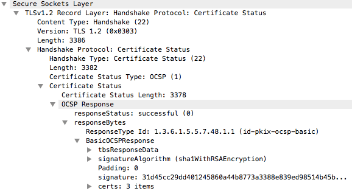
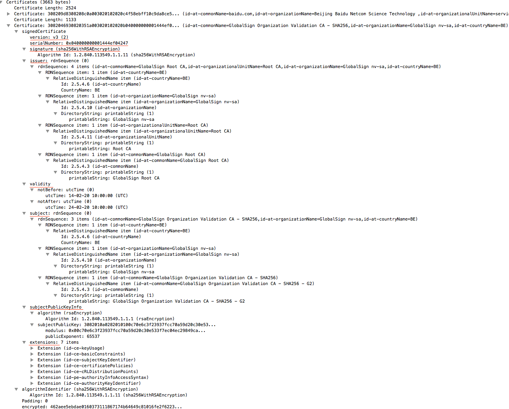
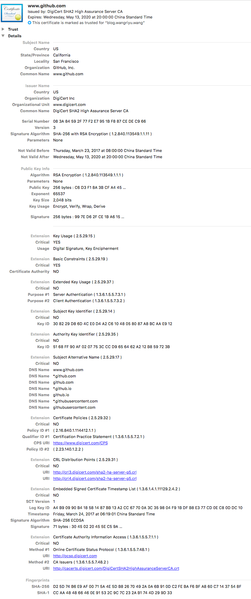
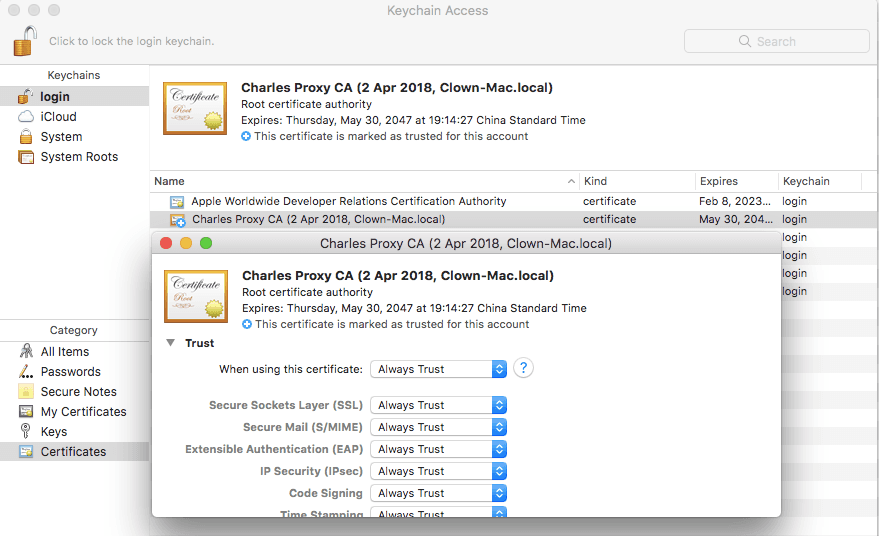

## 中间人攻击和信息抵赖

没有身份验证的情况下，在非对称加密中实现身份验证和密钥协商时，比如常用的 RSA 算法无法确保服务器身份的合法性，因为公钥并不包含服务器的信息。可能出现如下两种情况:

- 中间人攻击(MITM): 攻击者介入通信双方，C - M 通信时使用的是中间人自己的一对公私钥 Key_M，中间人可以解密客户端用 Key_M 加密的信看;
M - S 通信时使用的是服务器提供的公钥，加密从客户端得到的消息给服务器完成双方通信
- 信息抵赖: 发送消息者可以否认之前发过的消息，因为接收端使用公钥不能确定之前接收的消息来源身份


此时需要一种认证体系以确保通信者是安全可靠的。

## PKI - 互联网公钥基础设施

**PKI** 的目标就是实现不同成员在不见面的情况下进行安全通信，当前采用的模型是基于可信的第三方机构，也就是**证书颁发机构（certification authority，CA）**签发的证书。
PKI 通过数字证书认证机构(CA)将用户的个人身份跟公开密钥链接在一起。对每个证书中心用户的身份必须是唯一的。链接关系由注册和发布过程确定，取决于担保级别，链接关系可能由 CA 的各种软件或在人为监督下完成。


- 订阅人: 或者叫最终实体，是指那些需要证书来提供安全服务的团体，维护服务端的人
- 登记机构(registration authority - RA): 主要是完成一些证书签发的相关管理工作。例如， RA会首先对用户进行必要的身份验证，然后才会去找 CA 签发证书。在某些情况下，
当 CA 希望在用户附近建立一个分支机构时（例如在不同的国家建立当地登记中心），我们也称RA为本地登记机构（local registration authority，LRA）。实际上，很多 CA 也执行 RA 的职责。RA 确保公开密钥和个人身份链接，可以防抵赖。
- 凭证签发请求文件(Certificate Signing Request - CSR): 一种包含凭证签发时所需的公钥、组织信息、个人信息(域名)等信息的(.csr)文件，不含私钥信息。
- 证书颁发机构(certification authority - CA): 是指我们都信任的证书颁发机构，CA 通过线上、线下等多种手段验证申请者提供信息的真实性，如组织是否存在、企业是否合法，是否拥有域名的所有权等，确认申请用户的身份之后再签发证书。
同时 CA 会在线提供其所签发证书的最新吊销信息，这样信赖方就可以验证证书是否仍然有效。
- 证书(certificate)包含以下信息：申请者公钥、申请者的组织信息和个人信息、签发机构 CA 的信息、有效时间、证书序列号等信息的明文，同时包含一个签名（使用散列函数计算公开的明文信息的信息摘要，
然后采用 CA 的私钥对信息摘要进行加密，此密文即签名）。**证书 = 公钥 + 申请者与颁发者信息 + 签名**
- 信赖方(relying party): 是指那些证书使用者。一般是指那些需要证书验证的网页浏览器、其他程序以及操作系统。他们通过维护根可信证书库来执行验证，
这些证书库包含某些 CA 的最终可信证书（信任密钥，trust anchor）。更广泛地说，信赖方是指那些需要通过证书在互联网上进行安全通信的最终用户。用户接收到证书后，读取证书中的相关的明文信息，采用相同的散列函数计算得到信息摘要，
然后利用对应 CA 的公钥解密签名数据，对比证书的信息摘要，如果一致，则可以确认证书的合法性；然后去查询证书的吊销情况



- 证书吊销列表(Certificate Revocation List - CRL): 一个单独的文件。该文件包含了 CA 已经吊销的证书序列号(唯一)与吊销日期，同时该文件包含生效日期并通知下次更新该文件的时间，当然该文件必然包含 CA 私钥的签名以验证文件的合法性。
证书中一般会包含一个 URL 地址 CRL Distribution Point，通知使用者去哪里下载对应的 CRL 以校验证书是否吊销。该吊销方式的优点是不需要频繁更新，但是不能及时吊销证书，因为 CRL 更新时间一般是几天，这期间可能已经造成了极大损失。
- 证书状态在线查询协议(Online Certificate Status Protocol - OCSP): 一个实时查询证书是否吊销的方式。请求者发送证书的信息并请求查询，服务器返回正常、吊销或未知中的任何一个状态。证书中一般也会包含一个 OCSP 的 URL 地址，要求查询服务器具有良好的性能。
部分 CA 或大部分的[**自签 CA (根证书)**](https://zh.wikipedia.org/wiki/%E5%85%AC%E9%96%8B%E9%87%91%E9%91%B0%E8%AA%8D%E8%AD%89#%E8%87%AA%E7%B0%BD%E8%AD%89%E6%9B%B8)都是未提供 CRL 或 OCSP 地址的，对于吊销证书会是一件非常麻烦的事情。

一个具体实例: https://zh.wikipedia.org/wiki/%E5%85%AC%E9%96%8B%E9%87%91%E9%91%B0%E8%AA%8D%E8%AD%89#%E7%94%B3%E9%A0%98%E5%8F%8A%E4%BD%BF%E7%94%A8

## 证书

#### 证书大致分为三类:

- 自签名 CA: 在自签名 CA 中，证书中的公钥和用于验证证书的密钥是相同的。一些自签名 CA 是根 CA。这种自签名证书通常不会被广泛信任，使用时可能会遇到电脑软件的安全警告。自签名证书本身就是根证书。
- 从属 CA: 在从属 CA 中，证书中的公钥和用于核实证书的密钥是不同的。一个 CA 向另一个 CA 颁发证书的过程叫做交叉认证 。
- 根 CA: 根 CA 是一种特殊的 CA，它受到客户无条件地信任，位于证书层次结构的最高层。所有证书链均终止于根 CA。根颁发机构必须对它自己的证书签名，因为在证书层次结构中再也没有更高的认证机构了。根证书也是自签名证书。

其他的还可以细分为中介证书、终端实体证书、授权证书、TLS服务器证书、通配符证书、TLS客户端证书

#### 审核级别(担保级别):

- 域名验证 (DV): 最基本的审核级别，如果申领代表可以证明他拥有管理某域名的权力，认证机构就可以发放域名验证（DV）证书，一般认证机构通常使用自动机制或通过电邮确认审核域名拥有权，成本较低
- 组织验证 (OV): 代表可以证明他拥有管理某域名的权力，而且相关组织是实际存在的法人，认证机构可以发放组织验证（OV）证书。审核程序通常需要经过人手处理。
- 扩展验证 (EV): 最严格的审核级别，审核过程可能牵涉专业法律人员的调查及独立审计人员的确认，成本也更高；成功获得扩展验证证书的网站，浏览器通常会在地址栏以绿色表示相关机构的法人名称及所属国家代码。扩展验证证书的主体名称或主体别名上不可以有通配符

#### 证书结构:



- 版本号(version): 证书一共有 3 个版本号，分别用 0、1、2 编码表示版本 1、版本 2 和版本 3。版本 1 只支持简单的字段，版本 2 增加了两个标识符，而版本 3 则增加了扩展功能。现在大部分的证书都采用版本 3 的格式。
- 序列号(serialNumber): 在一开始，序列号只要是正整数即可，是每个 CA 用来唯一标识其所签发的证书。但是在出现了针对证书签名的预选[前缀攻击](http://www.freebuf.com/articles/database/133391.html)之后，序列号增加了更多的要求来防止此类攻击；现在序列号需要是无序的（无法被预测）而且至少包括20位的熵
- 签名算法(signture Algorithm): 这个字段指明证书签名所用的算法，需要放到证书里面，这样才能被证书签名保护
- 颁发者(issuer): 证书颁发者的可分辨名称（distinguished name，DN），这个字段比较复杂，根据不同的实体会包含许多部分。举例来说，Verisign 根证书的可分辨名称是/C=US/O=VeriSign, Inc./OU=Class 3 Public Primary Certification Authority；它包括了国家、组织和组织单位三个部分。
- 有效期(validity): 证书的有效期包括开始日期和结束日期，在这段时间内证书是有效的。
- 使用者(subject): 证书使用实体的可分辨名称，和公钥一起用于证书的签发。在自签名证书里，使用者 （subject）和颁发者（issuer）字段的可分辨名称是一样的。在最开始，可分辨名称里面的公用名（common name， CN）主要用于服务器主机名（例如 /CN=www.example.com 用于 www.example.com 域名的证书）
- 公钥(subject public-key info): 这个字段包含了公钥、算法ID、可选参数
- 扩展(extensions): 比如密钥用法、证书策略、CRL分发点、使用者密钥标识符等等



#### 证书链

CA 根证书和服务器实体证书中间增加一层证书机构，即中介证书，证书的产生和验证原理不变，只是增加一层验证，只要最后能够被任何信任的 CA 根证书验证合法即可

1. 服务器证书 server.pem 的签发者为中间证书机构 inter，inter 根据证书 inter.pem 验证 server.pem 确实为自己签发的有效证书;
2. 中间证书 inter.pem 的签发 CA 为 root，root 根据证书 root.pem 验证 inter.pem 为自己签发的合法证书;
3. 客户端内置信任 CA 的 root.pem 证书，因此服务器证书 server.pem 被信任。


具体例子可以看维基百科的例子: https://zh.wikipedia.org/wiki/%E4%BF%A1%E4%BB%BB%E9%8F%88#%E8%88%89%E4%BE%8B

二级证书结构存在的优势：

- 减少根证书结构的管理工作量，可以更高效的进行证书的审核与签发;
- 根证书一般内置在客户端中，私钥一般离线存储，一旦私钥泄露，则吊销过程非常困难，无法及时补救;
- 中介证书结构的私钥泄露，则可以快速在线吊销，并重新为用户签发新的证书;
- 证书链四级以内一般不会对 HTTPS 的性能造成明显影响

服务器一般提供一条证书链，但也有多条路径的可能。以[交叉证书](https://blog.csdn.net/fangwm2011/article/details/6623887)为例，一条可信路径可以一直到 CA 的主要根证书，另外一条则是到可选根证书上。
CA 有时候会为同样的密钥签发多张证书，例如现在最常使用的签名算法是 SHA1，因为安全原因正在逐步迁移到 SHA256， CA 可以使用同样的密钥签发出不同签名的新证书。如果信赖方恰好有两张这样的证书，那么就可以构建出两条不同的可信路径。

## 身份验证

再回过头来看中间人攻击，需要身份验证后中间人与 Server 通信时接收服务器的证书实现身份验证，但与客户端通信时无法向用户提供可信任的证书。


除非伪造一份证书(很困难)，或者骗取客户端信任，比如在客户机操作系统上添加中间人证书的完全信任，以此实现用户的信任和身份验证。

举个栗子:

使用抓包工具 Charles 时，如果想抓取 HTTPS 的内容，就需要安装其提供的证书并添加信任



没有信任时，抓取的 HTTPS 内容无法解析


取得信任后，抓取的 HTTPS 请求可以和 HTTP 请求一样直接读取


在这个过程中 Charles 就是一个中间人，而且可以完全获取 HTTPS 信息，因为用户安装并信任它的证书，也就可以做到身份验证。

> 可以看到加密协议下所有连接都是 Connect 形式，这涉及到[隧道协议 - Tunneling Protocol](https://zh.wikipedia.org/wiki/%E9%9A%A7%E9%81%93%E5%8D%8F%E8%AE%AE)的概念

使用隧道的原因是在不兼容的网络上传输数据，或在不安全网络上提供一个安全路径。

隧道通信的机制如下:

```
The client asks an HTTP Proxy server to tunnel the TCP connection to the desired destination.
The server then proceeds to make the connection on behalf of the client. Once the connection has been established by the server,
the Proxy server continues to proxy the TCP stream to and from the client.The client is now being proxied to the remote host.
Any data sent to the proxy server is now forwarded, unmodified, to the remote host and the client can communicate using any protocol accepted by the remote host

Proxy servers may also limit connections by only allowing connections to the default HTTPS port 443, whitelisting hosts, or blocking traffic which doesn't appear to be SSL.

客户端先请求一个代理服务器去建立和目标服务器之间的 tcp tunnel，目标服务器尝试连接客户端(实际是代理服务器)，如果连接成功建立，代理服务器会给客户端返回 200 ok 并继续代理客户端和目标服务器之间的 tcp 流。
任何发送给代理服务器的数据都会不加修改地被转发，远程主机和客户端可以通过任何协议(TLS、SSH、SOCKS、PPTP...)进行后续交互。

代理服务器也可以通过端口限制(443)、host 白名单、阻止非 SSL 的数据流来限制连接
```

一些代理服务器需要认证信息来建立 tunnel. 常见的是 Proxy-Authorization 头域:

```
CONNECT server.example.com:80 HTTP/1.1
Host: server.example.com:80
Proxy-Authorization: basic aGVsbG86d29ybGQ=
```

关于这个中间代理的详细信息见 https://en.wikipedia.org/wiki/DMZ_(computing)

## 题外话

讲到 Charles，不得不提另一个抓包工具 Wireshark。这两个工具的抓包原理不同，Charles 是通过代理过滤抓取本机的网络请求，主要抓 HTTP、HTTPS 的请求；
Wireshark 则是使用了[网卡混杂模式 - promiscuous mode](https://zh.wikipedia.org/wiki/%E6%B7%B7%E6%9D%82%E6%A8%A1%E5%BC%8F)，可以抓取指定网卡上所有流过的包，可以抓取应用层、传输层、网络层的各种封包，但是正常情况下不能解析 HTTPS 的内容(可以通过配置浏览器提供的对称协商密钥或者服务器的私钥来解密 TLS 内容)。

开启混杂模式时除了可以看到自己电脑上的网络封包，还可以看到目标地址不是本机的网络包(如果路由器没有做网络分发的工作的话，完全有可能接收到其他电脑的网络包)，还可以看到局域网内的广播等等。我看了一篇于此相关的网络攻击手段 - [ARP 攻击](https://zhuanlan.zhihu.com/p/28818627)。

ARP（Address Resolution Protocol）即地址解析协议， 用于实现从 IP 地址到 MAC 地址的映射，即询问目标IP 对应的 MAC 地址，如图


而 ARP 攻击者可以通过两种方式实现抓取监听局域网内全部或者想要的目标的网络数据:

- 通过大密集的 ARP 回应抢占或覆盖路由的映射表，使路由以为攻击者就是目标，然后把 ip 映射到错误对象的 mac 上，之后攻击者便能接收目标 ip 的网络数据
- 在局域网内向所有 ip 客户机广播，假装自己是网关，然后所有目标机器向自己发送外网或者转发请求数据

## References

- [PKI - wiki](https://zh.wikipedia.org/wiki/%E5%85%AC%E9%96%8B%E9%87%91%E9%91%B0%E5%9F%BA%E7%A4%8E%E5%BB%BA%E8%A8%AD)
- [PKI 体系](https://www.wosign.com/faq/faq2016-0309-03.htm)
- [信任链 - wiki](https://zh.wikipedia.org/wiki/%E4%BF%A1%E4%BB%BB%E9%8F%88)
- [MITM](https://zh.wikipedia.org/wiki/%E4%B8%AD%E9%97%B4%E4%BA%BA%E6%94%BB%E5%87%BB)
- [数字证书 - wiki](https://zh.wikipedia.org/wiki/%E5%85%AC%E9%96%8B%E9%87%91%E9%91%B0%E8%AA%8D%E8%AD%89)
- [数字签名 - wiki](https://zh.wikipedia.org/wiki/%E6%95%B8%E4%BD%8D%E7%B0%BD%E7%AB%A0)
- [http tunnel](https://en.wikipedia.org/wiki/HTTP_tunnel)
- [Tunneling protocol](https://en.wikipedia.org/wiki/Tunneling_protocol)
- [代理服务器 - wiki](https://zh.wikipedia.org/wiki/%E4%BB%A3%E7%90%86%E6%9C%8D%E5%8A%A1%E5%99%A8)
- [反向代理 - wiki](https://zh.wikipedia.org/wiki/%E5%8F%8D%E5%90%91%E4%BB%A3%E7%90%86)
