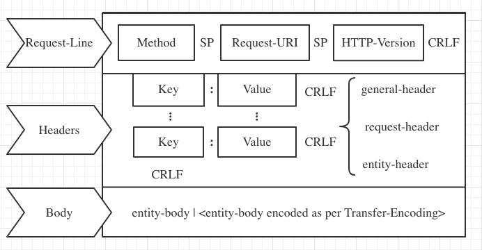
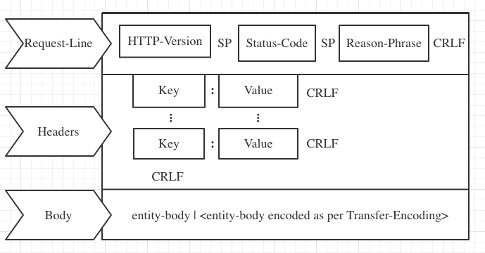

## Request

[RFC2616](https://www.w3.org/Protocols/rfc2616/rfc2616-sec5.html) 中定义的 HTTP Request 消息体结构：
```
Request = Request-Line             // 请求行
          *(( general-header       // 通用首部
            | request-header       // 请求首部
            | entity-header )CRLF) // 实体首部
          CRLF
          [ message-body ]
```



一个 HTTP 的 request 消息以一个请求行开始，从第二行开始是 headers (**️每个键值对都以 CRLF 结尾**)，接下来是一个 CRLF 开头的空行，表示 header 结束，最后是消息主体。

### 请求行的定义如下:

```
Request-Line = Method SP Request-URI SP HTTP-Version CRLF

Method = "OPTIONS" | "GET" | "HEAD" | "POST" | "PUT" | "DELETE" | "TRACE" | "CONNECT" | extension-method

Request-URI = "*" | absoluteURI | abs_path | authotity（CONNECT）
```

### 请求方法（也叫请求动作）
- GET 请求会显示请求指定的资源。一般来说 GET 方法应该只用于数据的读取，而不应当用于会产生副作用的非幂等的操作中。GET 会方法请求指定的页面信息，并返回响应主体，GET 被认为是不安全的方法，因为 GET 方法会被网络蜘蛛等任意的访问。
- HEAD 方法与 GET 方法一样，都是向服务器发出指定资源的请求。但是，服务器在响应 HEAD 请求时不会回传资源的内容部分，即：响应主体。这样，我们可以不传输全部内容的情况下，就可以获取服务器的响应头信息。HEAD 方法常被用于客户端查看服务器的性能。
- POST 请求会向指定资源提交数据，请求服务器进行处理，如：表单数据提交、文件上传等，请求数据会被包含在请求体中。POST 方法是非幂等的方法，因为这个请求可能会创建新的资源或/和修改现有资源。
- PUT 请求会身向指定资源位置上传其最新内容，PUT 方法是幂等的方法。通过该方法客户端可以将指定资源的最新数据传送给服务器取代指定的资源的内容。
- DELETE 请求用于请求服务器删除所请求 URI 所标识的资源。DELETE 请求后指定资源会被删除，DELETE方法也是幂等的。 
- CONNECT 方法是 HTTP/1.1 协议预留的，能够将连接改为管道方式的代理服务器。通常用于SSL加密服务器的链接与非加密的HTTP代理服务器的通信。
- OPTIONS 请求与 HEAD 类似，一般也是用于客户端查看服务器的性能。 这个方法会请求服务器返回该资源所支持的所有 HTTP 请求方法，该方法会用'*'来代替资源名称，向服务器发送 OPTIONS 请求，可以测试服务器功能是否正常。JavaScript 的 XMLHttpRequest 对象进行 CORS 跨域资源共享时，就是使用 OPTIONS 方法发送嗅探请求，以判断是否有对指定资源的访问权限。
- TRACE 请求服务器回显其收到的请求信息，该方法主要用于 HTTP 请求的测试或诊断。

### 请求地址

Host 会与 Request-URI 一起来作为 Request 消息的接收者判断请求资源的条件，方法如下：

- 如果 Request-URI 是绝对地址（absoluteURI），这时请求里的主机存在于 Request-URI 里。忽略任何出现在请求里 Host 头域值

- 假如 Request-URI 不是绝对地址（absoluteURI），并且请求包括一个 Host 头域，则主机由该 Host 头域值决定

- 假如由规则１或规则２定义的主机是一个无效的主机，则应当以一个 400（错误请求）错误消息返回

```
Request-URI = "*" | absoluteURI | abs_path | authority（CONNECT）
```

- "\*" 代表请求不指向特定的资源，而是服务器本身，且只在所使用的方法没必要应用到资源时允许。一个例子可能是 `OPTIONS * HTTP/1.1`
- absoluteURI 绝对地址，比如 `GET http://www.w3.org/pub/WWW/TheProject.html HTTP/1.1`
- abs_path 绝对路径，“/”代表服务器根
- 只有 CONNECT 方法使用 authority 形式，由域名和可选端口组成的 URL，比如 `CONNECT developer.mozilla.org:80 HTTP/1.1`

### URI(统一资源标识符，Uniform Resource Identifier)

URI 就是由某个协议方案表示的资源的定位标识符，这个协议可以使 htpp、https、ftp等，比如：
```
ftp://ftp.is.co.za/rfc/rfc1808.txt
http://www.ietf.org/rfc/rfc2396.txt
ldap://[2001:db8::7]/c=GB?objectClass?one
mailto:John.Doe@example.com
news:comp.infosystems.www.servers.unix
tel:+1-816-555-1212 telnet://192.0.2.16:80/
urn:oasis:names:specification:docbook:dtd:xml:4.1.2
```
绝对 URI 的格式应该是这样的:

<u>http</u>://<u>user:pass</u>@<u>www.example.com</u>:<u>80</u>/<u>dir/index.html</u>?<u>uid=1</u>#<u>ch1</u>

协议://登录信息@服务器地址:端口号/文件路径?查询字符串#片段标识符


> 与 URL(统一资源定位符，Universal Resource Locator) 和 URN(统一资源名，Uniform Resource Name)的关系：

>> URL 和 URN 是 URI 的两个子集，URI 唯一标识了文件资源对象(类似身份证)，URN 标识资源名称，URL 标识资源地址

## Response

```
Response = Status-Line             // 状态行
           *(( general-header      // 通用首部
            | response-header      // 响应首部
            | entity-header )CRLF) // 实体首部
           CRLF
           [ message-body ]
```



response 第一行是状态行，包含状态码 Status-Code，Reason-Phrase 是状态码的简单文本描述(比如 200 - OK、404 - Not Found)

```
Status-Line = HTTP-Version SP Status-Code SP Reason-Phrase CRLF
```

Status-Code:
- 1xx: 信息性——收到请求，继续处理
- 2xx: 成功性——成功收到、理解并接受行动
- 3xx: 重定向——必须采取进一步行动来完成请求
- 4xx: 客户端错误——请求包含错误语法或不能完成
- 5xx: 服务器错误——服务器没有成功完成显然有效的请求

## 消息体

HTTP 消息的 message-body（如果存在）用于挟带与请求或响应相关联的 entity-body.
message-body 只有在应用了 transfer-coding 时，通过 Transfer-Encoding 头部域指出，与 entity-body 不同。

```
message-body = entity-body | <entity-body encoded as per Transfer-Encoding>
```

## headers

```
general-header = Cache-Control      // 控制缓存的行为，比如 `private, max-age=0, no-cache`
                | Connection        // 控制不再转发给代理的首部字段或者管理持久连接(Keep-Alive 或者 close)
                | Date              // 表明创建 HTTP 报文的日期和时间
                | Pragma            // 唯一字段 `no-cache`，用于兼容 HTTP/1.1 之前的版本，客户端会要求所有的中间服务器不返回缓存的资源
                | Trailer           // 事先说明在报文主体后记录了哪些首部字段。该首部字段可应用在 HTTP/1.1 版本分块传输编码时
                | Transfer-Encoding // 规定了传输报文主体时采用的编码方式，比如 `chunked`
                | Upgrade           // 检测 HTTP 协议及其他协议是否可使用更高的 版本进行通信，其参数值可以用来指定一个完全不同的通信协议，使用首部字段 Upgrade 时，还需要额外指定 Connection:Upgrade
                | Via               // 追踪客户端与服务器之间的请求和响应报文 的传输路径
                | Warning           // 从 HTTP/1.0 的响应首部（Retry-After）演变过来的。该首部通常会告知用户一些与缓存相关的问题的警告，字段格式:`[警告码][警告的主机:端口号]“[警告内容]”([日期时间])`
```

```
request-header = Accept               // 通知服务器，用户代理能够处理的媒体类型及媒体类型的相对优先级（可用权重 q=0~1 来表示相对优先级）。可使用 type/subtype 这种形式，一次指定多种媒体类型，支持通配符。例如 `text/html, text/plain, text/css, image/jpeg, video/mpeg, application/zip`等
                | Accept-Charset      // 通知服务器用户代理支持的字符集及字符集的相对优先顺序，可一次性指定多种字符集
                | Accept-Encoding     // 告知服务器用户代理支持的内容编码及内容编码的优先级顺序。可一次性指定多种内容编码，例如: `gzip, compress, deflate, identity`
                | Accept-Language     // 告知服务器用户代理能够处理的自然语言集及优先级顺序，例如: `zh-cn,zh;q=0.7,en-us,en;q=0.3` 优先返回中文版响应
                | Authorization       // 告知服务器，用户代理的认证信息（证书值），例如: `Basic dWVub3NlbjpwYXNzd29yZA==`
                | Expect              // 告知服务器，客户端期望出现的某种特定行为。因服务器无法理解客户端的期望作出回应而发生错误时，会返回状态码 417 Expectation Failed。
                | From                // 告知服务器使用用户代理的用户的电子邮件地址
                | Host                // Host 会告知服务器，请求的资源所处的互联网主机名和端口号
                | If-Match            // 只有当 If-Match 的字段值跟资源的 ETag 值匹配一致时，服务器才会接受请求，否则返回状态码 412 Precondition Failed
                | If-Modified-Since   // If-Modified-Since 字段指定的日期时间后，资源发生了更新，服务器才会接受请求，否则返回状态码 304 Not Modified
                | If-None-Match       // If-None-Match 的字段值与 ETag 值不一致时，可处理该请求。与 If-Match 首部字段的作用相反
                | If-Range            // 告知服务器若指定的 If-Range 字段值（ETag 值或者时间）和请求资源的 ETag 值或时间相一致时，则作为范围请求处理。反之，则返回全体资源。
                | If-Unmodified-Since // 与 If-Modified-Since 的作用相反
                | Max-Forwards        // 通过 TRACE 方法或 OPTIONS 方法，发送包含首部字段 Max-Forwards 的请求时，该字段以十进制整数形式指定可经过的服务器最大数目，服务器转发请求之前，Max-Forwards 的值减 1 后重新赋值。当服务器接收到 Max-Forwards 值为 0 的请求时，则不再进行转发，直接返回响应。
                | Proxy-Authorization // 接收到从代理服务器发来的认证质询时，客户端会发送包含首部字段 Proxy-Authorization 的请求，以告知服务器认证所需要的信息。
                | Range               // 对于只需获取部分资源的范围请求，包含首部字段 Range 即可告知服 务器资源的指定范围。例如: `bytes=5001-10000` 表示请求获取从第 5001 字节至第 10000 字节的资源。服务器会在处理请求之后返回 206 Partial Content 的响应。无法处理该范围请求时，则返回 200 OK 的响应及全部资源。
                | Referer             // 告知服务器请求的原始资源的 URI。
                | TE                  // 告知服务器客户端能够处理响应的传输编码方式及相对优先级。它和首部字段 Accept-Encoding 的功能很相像，但是用于传输编码。
                | User-Agent          // 将创建请求的浏览器和用户代理名称等信息传达给服务器
```

```
response-header = Accept-Ranges      // 告知客户端服务器是否能处理范围请求，以指定获取服务器端某个部分的资源。可处理范围请求时指定其为 bytes，反之则指定其为 none。
                | Age                // 告知客户端，源服务器在多久前创建了响应。字段值的单位为秒。若创建该响应的服务器是缓存服务器，Age 值是指缓存后的响应再次发起认证到认证完成的时间值。代理创建响应时必须加上首部字段 Age。
                | ETag               // 告知客户端实体标签(Entity Tag)。它是一种可将资源以字符串形式做唯一性标识的方式。服务器会为每份资源分配对应的 ETag 值。有强弱之分，弱Etag以'w/'开头，强校验的ETag匹配要求两个资源内容逐字节相同，包括所有其他实体字段（如Content-Language）不发生变化；弱校验只需要确认资源内容相同即可，忽略细微差别比如修改时间等
                | Location           // 将响应接收方引导至某个与请求 URI 位置不同的资源。该字段会配合 3xx ：Redirection 的响应，提供重定向的 URI。
                | Proxy-Authenticate // 由代理服务器所要求的认证信息发送给客户端。
                | Retry-After        // 告知客户端应该在多久之后再次发送请求。主要配合状态码 503 Service Unavailable 响应，或 3xx Redirect 响应一起使用。字段值可以指定为具体的日期时间（Wed, 04 Jul 2012 06：34：24 GMT 等格式），也可以是创建响应后的秒数
                | Server             // 告知客户端当前服务器上安装的 HTTP 服务器应用程序的信息。例如: `Apache/2.2.6 (Unix) PHP/5.2.5`
                | Vary               // 可对缓存进行控制。源服务器会向代理服务器传达关于本地缓存使用方法的命令。
                | WWW-Authenticate   // WWW-Authenticate 用于 HTTP 访问认证。它会告知客户端适用于访问请求 URI 所指定资源的认证方案（Basic 或是 Digest）和带参数提示的质询（challenge）
```

```
entity-header = Allow              // 服务端通知客户端能够支持 Request-URI 指定资源的所有 HTTP 方法。当服务器接收到不支持的 HTTP 方法时，会以状态码 405 Method Not Allowed 作为响应返回。与此同时，还会把所有能支持的 HTTP 方法写入首部字段 Allow 后返回
                | Content-Encoding // 告知客户端服务器对实体的主体部分选用的内容编码方式，字段值参见 Accept-Encoding
                | Content-Language // 会告知客户端，实体主体使用的自然语言，例如: `zh-CN`
                | Content-Length   // 表明了实体主体部分的大小（单位是字节）。对实体主体进行内容编码传输时，不能再使用 Content-Length 首部字段
                | Content-Location // 给出与报文主体部分相对应的 URI。和首部字段 Location 不同，Content-Location 表示的是报文主体返回资源对应的 URI。
                | Content-MD5      // 客户端会对接收的报文主体执行相同的 MD5 算法，然后与首部字段 Content-MD5 的字段值比较，其目的在于检查报文主体在传输过程中是否保持完整，以及确认传输到达。无法检测出恶意篡改
                | Content-Range    // 能告知客户端作为响应返回的实体的哪个部分符合范围请求。字段值以字节为单位，表示当前发送部分及整个实体大小。例如: `bytes 5001-10000/10000`
                | Content-Type     // 说明了实体主体内对象的媒体类型。和首部字段 Accept 一样，字段值用 type/subtype 形式赋值。例如: `text/html; charset=UTF-8`
                | Expires          // 将资源失效的日期告知客户端。当首部字段 Cache-Control 有指定 max-age 指令时，比起首部字段 Expires，会优先处理 max-age 指令
                | Last-Modified    // 指明资源最终修改的时间
                | extension-header // 允许定义额外的 entity-header 域而不改变协议，但不能假设接收方认识这些域。接收方应该忽略未识别的头域，但透明代理必须转发它
```

## References

- [RFC2616](https://www.w3.org/Protocols/rfc2616/rfc2616-sec5.html)
- [wikipedia uri](https://zh.wikipedia.org/wiki/%E7%BB%9F%E4%B8%80%E8%B5%84%E6%BA%90%E6%A0%87%E5%BF%97%E7%AC%A6)
