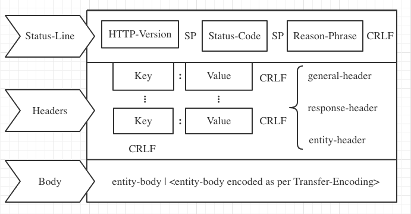
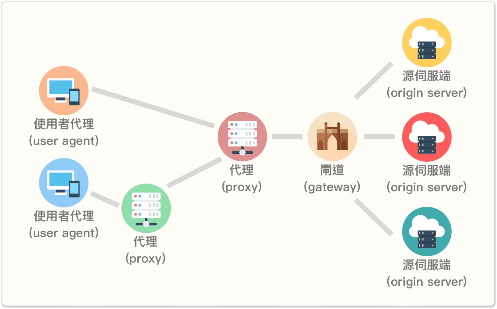
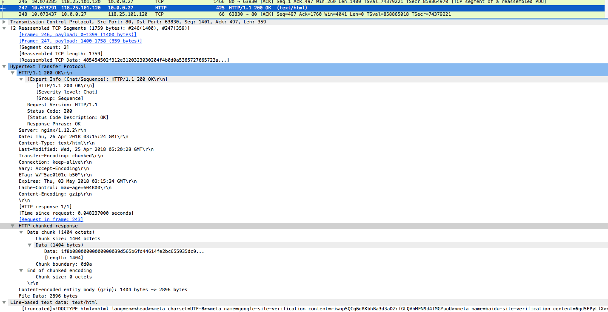

## Request

[RFC2616](https://www.w3.org/Protocols/rfc2616/rfc2616-sec5.html) 中定义的 HTTP Request 消息体结构：
```
Request = Request-Line             // 请求行
          *(( general-header       // 通用首部
            | request-header       // 请求首部
            | entity-header )CRLF) // 实体首部
          CRLF
          [ message-body ]
```


一个 HTTP 的 request 消息以一个请求行开始，从第二行开始是 headers (**️每个键值对都以 CRLF 结尾**)，接下来是一个 CRLF 开头的空行，表示 header 结束，最后是消息主体。

### 请求行的定义如下:

```
Request-Line = Method SP Request-URI SP HTTP-Version CRLF

Method = "OPTIONS" | "GET" | "HEAD" | "POST" | "PUT" | "DELETE" | "TRACE" | "CONNECT" | extension-method

Request-URI = "*" | absoluteURI | abs_path | authotity（CONNECT）
```

### 请求方法（也叫请求动作）

- GET 请求会显示请求指定的资源。一般来说 GET 方法应该只用于数据的读取，而不应当用于会产生副作用的非幂等的操作中。GET 会方法请求指定的页面信息，并返回响应主体，GET 被认为是不安全的方法，因为 GET 方法会被网络蜘蛛等任意的访问。
- HEAD 方法与 GET 方法一样，都是向服务器发出指定资源的请求。但是，服务器在响应 HEAD 请求时不会回传资源的内容部分，即：响应主体。这样，我们可以不传输全部内容的情况下，就可以获取服务器的响应头信息。HEAD 方法常被用于客户端查看服务器的性能。
- POST 请求会向指定资源提交数据，请求服务器进行处理，如：表单数据提交、文件上传等，请求数据会被包含在请求体中。POST 方法是非幂等的方法，因为这个请求可能会创建新的资源或/和修改现有资源。
- PUT 请求会身向指定资源位置上传其最新内容，PUT 方法是幂等的方法。通过该方法客户端可以将指定资源的最新数据传送给服务器取代指定的资源的内容。
- DELETE 请求用于请求服务器删除所请求 URI 所标识的资源。DELETE 请求后指定资源会被删除，DELETE方法也是幂等的。 
- CONNECT 方法是 HTTP/1.1 协议预留的，代表使用隧道协议(Tunneling Protocol)进行连接。通常用于 SSL/TLS 加密服务器的链接与非加密的 HTTP 代理服务器的通信。
- OPTIONS 请求与 HEAD 类似，一般也是用于客户端查看服务器的性能。 这个方法会请求服务器返回该资源所支持的所有 HTTP 请求方法，该方法会用 '*' 来代替资源名称，向服务器发送 OPTIONS 请求，可以测试服务器功能是否正常。JavaScript 的 XMLHttpRequest 对象进行 CORS 跨域资源共享时，就是使用 OPTIONS 方法发送嗅探请求，以判断是否有对指定资源的访问权限。
- TRACE 请求服务器回显其收到的请求信息，该方法主要用于 HTTP 请求的测试或诊断。

### 请求地址

```
Request-URI = "*" | absoluteURI | abs_path | authority（CONNECT）
```

- "\*" 代表请求不指向特定的资源，而是服务器本身，且只在所使用的方法没必要应用到资源时允许。一个典型的例子是 `OPTIONS * HTTP/1.1`
- absoluteURI 绝对地址，比如 `GET http://www.w3.org/pub/WWW/TheProject.html HTTP/1.1`。只用于向代理服务器(proxy)发送请求
- abs_path 相对路径，“/” 代表服务器根
- 只有 CONNECT 方法使用 authority 形式，由域名和可选端口组成的 URL，比如 `CONNECT developer.mozilla.org:80 HTTP/1.1`

> 向一个代理服务器发送HTTP请求时，请求行中应该使用绝对路径的 URL。如果向目标服务器直接发送请求，则请求行中只会包含相对路径的 URL(完整URL的path部分)。
为了能在后续 http 版本中过渡，所有 http/1.1 服务器都应该能够处理 absoluteURI 形式的请求，即使客户端只会向代理发送这种形式的请求，详见 https://www.w3.org/Protocols/rfc2616/rfc2616-sec5.html#sec5.1.2

HTTP/1.1 中 Host 和 Request-URI 一起作为 Request 消息接收者判断请求资源的条件, 确认主机资源的方法如下：

- 如果 Request-URI 是绝对地址（absoluteURI），这时请求里的主机存在于 Request-URI 里。忽略任何出现在请求里 Host 头域值

- 假如 Request-URI 不是绝对地址（absoluteURI），并且请求包括一个 Host 头域，则主机由该 Host 头域值决定

- 假如由规则１或规则２定义的主机是一个无效的主机，则应当以一个 400（错误请求）错误消息返回

> ⚠️ HTTP/1.1 请求必须带 Host 头域，否则会报 bad request;

> HTTP/1.0 不支持 Host 头域，因为 1.0 认为一个 ip 只绑定一个主机，通过 ip 就能确认主机，但后来一台服务器可以存在多个虚拟主机(virtual host)共用一个 ip 的情况，所以 1.1 添加 Host 头域显示指定主机。

### URI(统一资源标识符，Uniform Resource Identifier)

URI 就是由某个协议方案表示的资源的定位标识符，这个协议可以使 htpp、https、ftp等，比如：
```
ftp://ftp.is.co.za/rfc/rfc1808.txt
http://www.ietf.org/rfc/rfc2396.txt
ldap://[2001:db8::7]/c=GB?objectClass?one
mailto:John.Doe@example.com
news:comp.infosystems.www.servers.unix
tel:+1-816-555-1212 telnet://192.0.2.16:80/
urn:oasis:names:specification:docbook:dtd:xml:4.1.2
```
绝对 URI 的格式应该是这样的:

---

<u>http</u>://<u>user:pass</u>@<u>www.example.com</u>:<u>80</u>/<u>dir/index.html</u>?<u>uid=1</u>#<u>ch1</u>

协议://登录信息@服务器地址:端口号/文件路径?查询字符串#片段标识符

---

> 与 URL(统一资源定位符，Universal Resource Locator) 和 URN(统一资源名，Uniform Resource Name)的关系：

>> URL 和 URN 是 URI 的两个子集，URI 唯一标识了文件资源对象(类似身份证)，URN 标识资源名称，URL 标识资源地址

## Response

```
Response = Status-Line             // 状态行
           *(( general-header      // 通用首部
            | response-header      // 响应首部
            | entity-header )CRLF) // 实体首部
           CRLF
           [ message-body ]
```



response 第一行是状态行，包含状态码 Status-Code，Reason-Phrase 是状态码的简单文本描述(比如 200 - OK、404 - Not Found)

```
Status-Line = HTTP-Version SP Status-Code SP Reason-Phrase CRLF
```

Status-Code:
- 1xx: 信息性——收到请求，继续处理
- 2xx: 成功性——成功收到、理解并接受行动
- 3xx: 重定向——必须采取进一步行动来完成请求
- 4xx: 客户端错误——请求包含错误语法或不能完成
- 5xx: 服务器错误——服务器没有成功完成显然有效的请求

## 消息体

HTTP 消息的 message-body（如果存在）用于挟带与请求或响应相关联的 entity-body.
message-body 只有在应用了 transfer-coding 时，通过 Transfer-Encoding 头部域指出，与 entity-body 不同。

```
message-body = entity-body | <entity-body encoded as per Transfer-Encoding>
```

## headers

这里只列举了 2616 中提到的头部域，还有很多新添加的头部域，可以自行查找

```
general-header = Cache-Control      // 控制缓存的行为，比如 `private, max-age=0, no-cache`
                | Connection        // 控制不再转发给代理的首部字段或者管理持久连接(Keep-Alive 或者 close)
                | Date              // 表明创建 HTTP 报文的日期和时间
                | Pragma            // 唯一字段 `no-cache`，用于兼容 HTTP/1.1 之前的版本，客户端会要求所有的中间服务器不返回缓存的资源
                | Trailer           // 事先说明在报文主体后记录了哪些首部字段。该首部字段可应用在 HTTP/1.1 版本分块传输编码
                | Transfer-Encoding // 规定了传输报文主体时采用的编码方式，比如 `chunked`
                | Upgrade           // 检测 HTTP 协议及其他协议是否可使用更高的 版本进行通信，其参数值可以用来指定一个完全不同的通信协议，使用首部字段 Upgrade 时，还需要额外指定 Connection:Upgrade
                | Via               // 追踪客户端与服务器之间的请求和响应报文 的传输路径
                | Warning           // 从 HTTP/1.0 的响应首部（Retry-After）演变过来的。该首部通常会告知用户一些与缓存相关的问题的警告，字段格式:`[警告码][警告的主机:端口号]“[警告内容]”([日期时间])`
```

```
request-header = Accept               // 通知服务器，用户代理能够处理的媒体类型及媒体类型的相对优先级（可用权重 q=0~1 来表示相对优先级）。可使用 type/subtype 这种形式，一次指定多种媒体类型，支持通配符。例如 `text/html, text/plain, text/css, image/jpeg, video/mpeg, application/zip`等
                | Accept-Charset      // 通知服务器用户代理支持的字符集及字符集的相对优先顺序，可一次性指定多种字符集
                | Accept-Encoding     // 告知服务器用户代理支持的内容编码及内容编码的优先级顺序。可一次性指定多种内容编码，例如: `gzip, compress, deflate, identity`
                | Accept-Language     // 告知服务器用户代理能够处理的自然语言集及优先级顺序，例如: `zh-cn,zh;q=0.7,en-us,en;q=0.3` 优先返回中文版响应
                | Authorization       // 告知服务器，用户代理的认证信息（证书值），例如: `Basic dWVub3NlbjpwYXNzd29yZA==`
                | Expect              // 告知服务器，客户端期望出现的某种特定行为。因服务器无法理解客户端的期望作出回应而发生错误时，会返回状态码 417 Expectation Failed。
                | From                // 告知服务器使用用户代理的用户的电子邮件地址
                | Host                // Host 会告知服务器，请求的资源所处的互联网主机名和端口号
                | If-Match            // 只有当 If-Match 的字段值跟资源的 ETag 值匹配一致时，服务器才会接受请求，否则返回状态码 412 Precondition Failed
                | If-Modified-Since   // If-Modified-Since 字段指定的日期时间后，资源发生了更新，服务器才会接受请求，否则返回状态码 304 Not Modified
                | If-None-Match       // If-None-Match 的字段值与 ETag 值不一致时，可处理该请求。与 If-Match 首部字段的作用相反
                | If-Range            // 告知服务器若指定的 If-Range 字段值（ETag 值或者时间）和请求资源的 ETag 值或时间相一致时，则作为范围请求处理。反之，则返回全体资源。
                | If-Unmodified-Since // 与 If-Modified-Since 的作用相反
                | Max-Forwards        // 通过 TRACE 方法或 OPTIONS 方法，发送包含首部字段 Max-Forwards 的请求时，该字段以十进制整数形式指定可经过的服务器最大数目，服务器转发请求之前，Max-Forwards 的值减 1 后重新赋值。当服务器接收到 Max-Forwards 值为 0 的请求时，则不再进行转发，直接返回响应。
                | Proxy-Authorization // 接收到从代理服务器发来的认证质询时，客户端会发送包含首部字段 Proxy-Authorization 的请求，以告知服务器认证所需要的信息。
                | Range               // 对于只需获取部分资源的范围请求，包含首部字段 Range 即可告知服 务器资源的指定范围。例如: `bytes=5001-10000` 表示请求获取从第 5001 字节至第 10000 字节的资源。服务器会在处理请求之后返回 206 Partial Content 的响应。无法处理该范围请求时，则返回 200 OK 的响应及全部资源。
                | Referer             // 告知服务器请求的原始资源的 URI。
                | TE                  // 告知服务器客户端能够处理响应的传输编码方式及相对优先级。它和首部字段 Accept-Encoding 的功能很相像，但是用于传输编码。
                | User-Agent          // 将创建请求的浏览器和用户代理名称等信息传达给服务器
```

```
response-header = Accept-Ranges      // 告知客户端服务器是否能处理范围请求，以指定获取服务器端某个部分的资源。可处理范围请求时指定其为 bytes，反之则指定其为 none。
                | Age                // 告知客户端，源服务器在多久前创建了响应。字段值的单位为秒。若创建该响应的服务器是缓存服务器，Age 值是指缓存后的响应再次发起认证到认证完成的时间值。代理创建响应时必须加上首部字段 Age。
                | ETag               // 告知客户端实体标签(Entity Tag)。它是一种可将资源以字符串形式做唯一性标识的方式。服务器会为每份资源分配对应的 ETag 值。有强弱之分，弱Etag以'w/'开头。
                | Location           // 将响应接收方引导至某个与请求 URI 位置不同的资源。该字段会配合 3xx ：Redirection 的响应，提供重定向的 URI。
                | Proxy-Authenticate // 由代理服务器所要求的认证信息发送给客户端。
                | Retry-After        // 告知客户端应该在多久之后再次发送请求。主要配合状态码 503 Service Unavailable 响应，或 3xx Redirect 响应一起使用。字段值可以指定为具体的日期时间（Wed, 04 Jul 2012 06：34：24 GMT 等格式），也可以是创建响应后的秒数
                | Server             // 告知客户端当前服务器上安装的 HTTP 服务器应用程序的信息。例如: `Apache/2.2.6 (Unix) PHP/5.2.5`
                | Vary               // 可对缓存进行控制。源服务器会向代理服务器传达关于本地缓存使用方法的命令。
                | WWW-Authenticate   // WWW-Authenticate 用于 HTTP 访问认证。它会告知客户端适用于访问请求 URI 所指定资源的认证方案（Basic 或是 Digest）和带参数提示的质询（challenge）
```

```
entity-header = Allow              // 服务端通知客户端能够支持 Request-URI 指定资源的所有 HTTP 方法。当服务器接收到不支持的 HTTP 方法时，会以状态码 405 Method Not Allowed 作为响应返回。与此同时，还会把所有能支持的 HTTP 方法写入首部字段 Allow 后返回
                | Content-Encoding // 告知客户端服务器对实体的主体部分选用的内容编码方式，字段值参见 Accept-Encoding
                | Content-Language // 会告知客户端，实体主体使用的自然语言，例如: `zh-CN`
                | Content-Length   // 表明了实体主体部分的大小（单位是字节）。对实体主体进行内容编码传输时，不能再使用 Content-Length 首部字段
                | Content-Location // 给出与报文主体部分相对应的 URI。和首部字段 Location 不同，Content-Location 表示的是报文主体返回资源对应的 URI。
                | Content-MD5      // 客户端会对接收的报文主体执行相同的 MD5 算法，然后与首部字段 Content-MD5 的字段值比较，其目的在于检查报文主体在传输过程中是否保持完整，以及确认传输到达。无法检测出恶意篡改
                | Content-Range    // 能告知客户端作为响应返回的实体的哪个部分符合范围请求。字段值以字节为单位，表示当前发送部分及整个实体大小。例如: `bytes 5001-10000/10000`
                | Content-Type     // 说明了实体主体内对象的媒体类型。和首部字段 Accept 一样，字段值用 type/subtype 形式赋值。例如: `text/html; charset=UTF-8`
                | Expires          // 将资源失效的日期告知客户端。当首部字段 Cache-Control 有指定 max-age 指令时，Cache-Control 优先级大于 Expires
                | Last-Modified    // 指明资源最终修改的时间
                | extension-header // 允许定义额外的 entity-header 域而不改变协议，但不能假设接收方认识这些域。接收方应该忽略未识别的头域，但透明代理必须转发它
```

### 强缓存和协商缓存

#### 浏览器在加载资源的时，先根据 http header 判断它是否命中强缓存.

- 命中强缓存：浏览器直接从自己缓存中读取资源，不发送请求到服务器
- 不命中强缓存：浏览器发送一个请求到服务器，服务器根据资源携带的 http header 验证该资源是否命中协商缓存
    * 命中协商缓存：将请求返回，但不是返回该资源的数据，而是告诉浏览器可以直接从缓存中加载这个资源。
    * 不命中协商缓存：服务器返回该资源数据



#### 强缓存

-【Cache-Control、Expires】: Expires 指定一个过期的时间戳(绝对时间)，Cache-Control 指定缓存行为(比如 max-age=604800 代表有效期为七天，是相对时间)。一般用其中一个，如果两个同时出现，Cache-Control 优先级大于 Expires。

> Cache-Control 是 http/1.1 弥补 Expires 缺陷新加入的，增加了很多行为

Cache-Control | description
---|---
public | 资源将被客户端和代理服务器缓存
private | 资源仅被客户端缓存, 代理服务器不缓存
no-store | 请求和响应都不缓存(真正地不缓存)
no-cache | do-not-serve-from-cache-without-revalidation，响应实际上可以缓存在本地缓存区，只是在与原服务器进行新鲜度验证之前不能返回给客户端
max-age | 缓存资源, 但是在指定时间(单位为秒)后缓存过期
s-maxage | 同上, 依赖public设置, 覆盖max-age, 且只在代理服务器上有效
max-stale | 指定时间内, 即使缓存过时, 资源依然有效
min-fresh | 缓存的资源至少要保持指定时间的新鲜期
must-revalidation / proxy-revalidation | 如果缓存失效, 强制重新向服务器(或代理)发起验证(使用 must-revalidate 指令会忽略请求的 max-stale 指令)
only-if-cached | 仅仅返回已经缓存的资源, 不访问源服务器, 若无缓存则返回 504 Gateway Timeout
no-transform | 强制要求代理服务器不要对资源进行转换, 禁止代理服务器对 Content-Encoding, Content-Range, Content-Type字段的修改(因此代理的gzip压缩将不被允许)
cache-extension token | 通过 cache-extension 标记（token），可以扩展 Cache-Control 首部字段内的指令，如果缓存服务器不能理解这个新指令，就会直接忽略


在控制台中可以查看读取的是本地缓存还是向服务器拉取的资源:


#### 协商缓存

-【Last-Modified、If-Modified-Since】: If-Modified-Since 就是上次请求返回的 Last-Modified，服务器再次收到资源请求时，根据浏览器传过来 If-Modified-Since 和资源在服务器上的最后修改时间判断资源是否有变化，如果有变化就正常返回资源内容。如果没有变化，就返回 304 Not Modified，不返回资源内容，不更新 Last-Modified。

-【ETag、If-None-Match】: 浏览器第一次跟服务器请求一个资源，服务器在返回这个资源的同时，在 respone 的 header 加上 ETag（服务器根据当前请求的资源生成的一个唯一标识），这个唯一标识是一个字符串，只要资源有变化这个串就不同，服务器再次收到资源请求时，根据资源生成一个新的 ETag 和浏览器传过来 If-None-Match 比较，如果这两个值相同就说明资源没有变化，否则就是有变化；如果没有变化，返回 304 和 ETag 不返回资源；如果有变化，返回资源。ETag 优先级比 Last-Modified 高

> ⚠️
> - 在分布式部署的时候，多台机器的 Last-Modified 必须保持一致，否则协商缓存会出问题。
> - 分布式部署，不同的机器生成的 ETag 都会不一样， 然后协商缓存就会出问题。【如果没有搞定 ETag 一致，就先关闭掉】
> - 协商缓存需要配合强缓存使用 【不启动强缓存，协商缓存也就不起作用】


#### 强校验和弱校验

https://www.w3.org/Protocols/rfc2616/rfc2616-sec13.html#sec13.3.3

https://zh.wikipedia.org/wiki/HTTP_ETag

ETag强校验表明资源的两个版本每个字节都是相同，并且请求头（如Content-Language）也不能有改变。强校验允许缓存，以及字节请求部分响应合并。

ETag弱校验表明资源的两个版本只需要语义上保持一致，忽略细微差别比如修改时间等，这意味着，他们是可以互换的，并且缓存的副本也可以被使用。因为不需要资源版本保持字节程度的相同，所以这种 ETag 不适合字节请求。如果 web 服务器要动态的生成响应，这时弱校验 ETag 比较合适。

比如使用弱验证类型，一个页面与另外一个页面只是在页脚显示的时间上有所不同，或者是展示的广告不相同，那么就会被认为是相同的。但是在使用强验证的情况下，二者是不同的。

Last-Modified 存在的问题，也是使用 Etag 的原因:

- 一些文件也许会周期性的更改，但是他的内容并不改变(仅仅改变的修改时间)，这个时候我们并不希望客户端认为这个文件被修改了，而重新 GET
- 有些文档可能被修改了，但所做的修改并不重要，不需要让所有缓存都重装数据(比如对拼写和注释的修改)
- 某些文件修改非常频繁，比如在秒以下的时间内进行修改(比如实时监控器)，If-Modified-Since 能检查到的粒度是秒级的，对于小于秒级的修改无法判断(或者说UNIX记录MTIME只能精确到秒)
- 某些服务器不能精确的得到文件的最后修改时间；

例子:

- 强校验

```
HTTP/1.1 200 OK
Date: Sat, 05 May 2018 11:28:26 GMT
ETag: "aaa"
Server: nginx/1.12.2
Content-Length: 5
Content-Type: text/html

Hello
```
若添加了内容编码 `Content-Encoding: gzip` 后，ETag 便会改变

```
HTTP/1.1 200 OK
Date: Sat, 05 May 2018 11:28:26 GMT
ETag: "bbb"
Server: nginx/1.12.2
Content-Length: 5
Content-Type: text/html
Content-Encoding: gzip

Hello
```

- 弱检验

```
HTTP/1.1 200 OK
Date: Sat, 05 May 2018 11:28:26 GMT
ETag: W/"ccc"
Server: nginx/1.12.2
Content-Type: text/css

.absolute-center {
  position: absolute;
  left: 50%;
  top: 50%;
  transform: translate(-50%, -50%);
}
```
若 CSS 样式做了 minify，ETag 并不会改变，因为内容并没有发生实际变化

```
HTTP/1.1 200 OK
Date: Sat, 05 May 2018 11:28:26 GMT
ETag: W/"ccc"
Server: nginx/1.12.2
Content-Type: text/css

.absolute-center{position:absolute;left:50%;top:50%;transform:translate(-50%, -50%)}
```
此时客户端发起 `If-None-Match` 请求，服务端还是会响应 304 Not Modified，客户端继续读取之前未 minify 的缓存

#### 其他字段

- Age: 告知客户端，源服务器在多久前创建了响应。若创建该响应的服务器是缓存服务器，Age 值是指缓存后的响应已过时间
```
Age:2383321
Date:Wed, 08 Mar 2017 16:12:42 GMT
```
代理服务器在2017年3月8日16:12:42时向源服务器发起了对该资源的请求, 目前已缓存了该资源2383321秒

- Vary: 从代理服务器接收到源服务器返回包含 Vary 指定项的响应之后，若再要进行缓存，仅对请求中含有相同 Vary 指定首部字段的请求返回缓存。即使对相同资源发起请求，但由于 Vary 指定的首部字段不相同，必须要从源服务器重新获取资源。
```
Vary:Accept-Encoding,User-Agent
```
代理服务器将针对是否压缩和浏览器类型去缓存资源. 对于同一个 url, 就能针对 PC 和 Mobile 返回不同的缓存内容

- Pragma: `Pragma: no-cache`是 http/1.1 之前的遗留版本，作用与`Cache-Control: no-cache`一样

### CDN 缓存

CDN 的全称是 Content Delivery Network，即内容分发网络。将网站的内容发布到最接近用户的网络"边缘"的节点，使用户可以就近取得所需的内容，提高用户访问网站的响应速度

CDN 缓存，也叫网关缓存、反向代理缓存。浏览器先向 CDN 网关发起 WEB 请求，网关服务器后面对应着一台或多台负载均衡源服务器，会根据它们的负载请求，动态地请求转发到合适的源服务器上
当客户端向 CDN 节点请求数据时，CDN 节点会判断缓存数据是否过期，若缓存数据并没有过期，则直接将缓存数据返回给客户端；否则，CDN 节点就会向源站发出回源请求（back to the source request），从源站拉取最新数据，更新本地缓存，并将最新数据返回给客户端。

CDN 服务商一般会提供基于文件后缀、目录多个维度来指定 CDN 缓存时间，为用户提供更精细化的缓存管理。

CDN 缓存时间会对“回源率”产生直接的影响。若 CDN 缓存时间较短，CDN 边缘节点上的数据会经常失效，导致频繁回源，增加了源站的负载，同时也增大的访问延时；若 CDN 缓存时间太长，会带来数据更新时间慢的问题。开发者需要增对特定的业务，来做特定的数据缓存时间管理。

优点:

- CDN 节点解决了跨运营商和跨地域访问的问题，访问延时大大降低；
- 大部分请求在 CDN 边缘节点完成，CDN 起到了分流作用，减轻了源站的负载。

## chunked response

HTTP 1.1 默认使用的是持久连接(Persistent Connection)，当服务器返回一个响应时连接不会关闭，如果未申明 `Connection: close` 关闭长连接，客户端会一直处于 pending 状态。

要让客户端知道这个响应到哪里结束主要有两种方式:

1. 在响应头上加上 `Content-Length` 显示申明实体 body 的长度，此时客户端便知道读到哪里结束，但是如果 `Content-Length` 长度短于实体长度，则内容会被截取；如果超过实体长度，客户端还是会 pending 等待后续缺省的数据。

2. HTTP 1.1 协议在 header 中引入 `Transfer-Encoding`，当其值为 `chunked` 时, 表明采用分块编码方式来进行报文体的传输。基本方法是将大块数据分解成多块小数据，每块都可以自定长度。

**分块传输的优点:**

- HTTP 分块传输编码允许服务器为动态生成的内容以维持 HTTP 持久链接
- 分块传输编码允许服务器在最后发送消息头字段。对于那些头字段值在内容被生成之前无法知道的情形非常重要，例如消息的内容要使用散列进行签名，散列的结果通过HTTP消息头字段进行传输。没有分块传输编码时，服务器必须缓冲内容直到完成后计算头字段的值并在发送内容前发送这些头字段的值。
- HTTP服务器有时使用压缩 （gzip或deflate）以缩短传输花费的时间。分块传输编码可以用来分隔压缩对象的多个部分。在这种情况下，块不是分别压缩的，而是整个负载进行压缩，压缩的输出使用本文描述的方案进行分块传输。在压缩的情形中，分块编码有利于一边进行压缩一边发送数据，而不是先完成压缩过程以得知压缩后数据的大小。

**格式:**

每一个非空的块都以该块包含数据的字节数（字节数以十六进制表示）开始，跟随一个 CRLF，然后是数据本身，最后 CRLF 结束。

最后一块是单行，由块大小（0），一些可选的填充空格，以及 CRLF。最后一块不再包含任何数据，但是可以发送可选的尾部，包括消息头字段。

消息最后以 CRLF 结尾。

```
Chunked-Body   = *chunk
                 last-chunk
                 trailer
                 CRLF

chunk          = chunk-size [ chunk-extension ] CRLF
                 chunk-data CRLF

chunk-size     = 1*HEX

last-chunk     = 1*("0") [ chunk-extension ] CRLF

chunk-extension= *( ";" chunk-ext-name [ "=" chunk-ext-val ] )
chunk-ext-name = token
chunk-ext-val  = token | quoted-string
chunk-data     = chunk-size(OCTET)

trailer        = *(entity-header CRLF)
```

例子:

```
HTTP/1.1 200 OK
Content-Type: text/plain
Transfer-Encoding: chunked

25

This is the data in the first chunk

1C

and this is the second one

3

con

8

sequence

0


```

```
"This is the data in the first chunk\r\n"      (37 字符 => 十六进制: 0x25)
"and this is the second one\r\n"               (28 字符 => 十六进制: 0x1C)
"con"                                          (3  字符 => 十六进制: 0x03)
"sequence"                                     (8  字符 => 十六进制: 0x08)
```

最后以 "0\r\n\r\n" 结束

解码数据

```
This is the data in the first chunk
and this is the second one
consequence
```

实际抓包数据:



首部字段 `Trailer` 会事先说明在报文主体后记录了哪些首部字段，比如

```
HTTP/1.1 200 OK
Date: Tue, 03 Jul 2012 04:40:56 GMT
Content-Type: text/html
...
Transfer-Encoding: chunked
Trailer: Expires

...(报文主体)...

0

Expires: Tue, 28 Sep 2004 23:59:59 GMT

```

请求首部字段 `TE` 告知服务器 客户端能够处理响应的传输编码方式及相对优先级

## References

- [RFC2616](https://www.w3.org/Protocols/rfc2616/rfc2616-sec5.html)
- [wikipedia uri](https://zh.wikipedia.org/wiki/%E7%BB%9F%E4%B8%80%E8%B5%84%E6%BA%90%E6%A0%87%E5%BF%97%E7%AC%A6)
- 《图解HTTP》
- [Chunked transfer encoding - 分块传输编码 wiki](https://zh.wikipedia.org/wiki/%E5%88%86%E5%9D%97%E4%BC%A0%E8%BE%93%E7%BC%96%E7%A0%81)
- [RFC 2616 - Chunked Transfer Coding](https://tools.ietf.org/html/rfc2616#section-3.6.1)
- [缓存机制](https://github.com/amandakelake/blog/issues/41)
- [http cache](https://notfalse.net/56/http-stale-response)
- [缓存策略](http://imweb.io/topic/55c6f9bac222e3af6ce235b9)